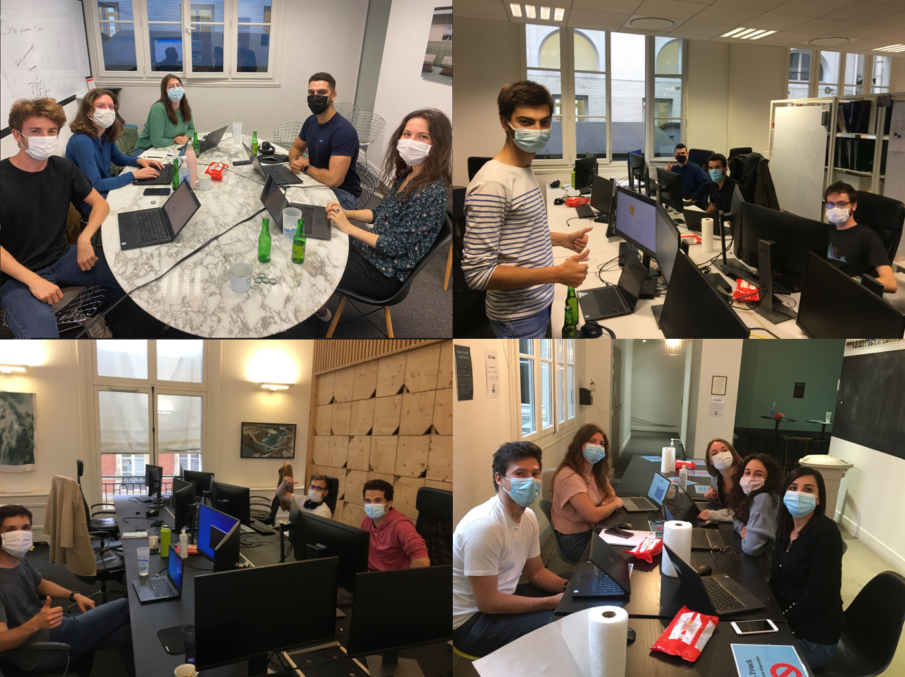

<!--truncate-->

## 
##  1) Get invest in a major issue of sustainable development

Access to energy is part of one of the 17 main sustainable development issues carried by the UN.💡    
Goal 7 "Ensure access to reliable, sustainable and modern energy services at affordable cost for all" is a particularly important issue for the African continent, where 596 million people do not have access to electricity.  
Most of these people live outside of urban centers, and therefore out of reach of the continent’s electricity grid. And as many of us have experienced, the existing systems in many African countries even struggle to supply enough energy to the homes and businesses that are on the grid.

There are many issues related to data that can provide answers to this type of challenge, including the management of the provision of individual and sustainable power generation equipment. 

There are solidary hackathons hosted on platforms like [Zindi](https://zindi.africa/competitions). 
We decided to participate in one of them related to the management of access to solar panel equipment for isolated populations in Africa.    
This hackathon is open to all, do not hesitate to participate [here](https://zindi.africa/competitions/sfc-paygo-solar-credit-repayment-competition)

## 2) Why is it so important for us to offer hackathons to Ekimetrics teams? 

After a long period of covid marked by an almost generalized home office, we wished to allow the teams to meet around an event appreciated by all which is at the same time:
- Fun, 
- Unifying, 
- Committed to a cause that is important for us.  

Hackathons are an excellent way to federate teams and to get involved in a new problem out of our common business topics.  
We were lucky enough to be able to carry out this event in our office while respecting sanitary recommendation.  

  

 

## 3) How to organize a hackathon?

We regularly organize hackathons, especially to develop in-house on a dedicated platform. Do not hesitate to have a look at the section dedicated to [Hackahtons](https://ekimetrics.github.io/hacks/)  🎮  
There are also platforms integrating many public hackathons like [Kaggle](https://www.kaggle.com/) or [Zindi](https://zindi.africa/) mentioned above.
For this time we have chosen to contribute to an existing hackathons:
- To get involved in a project that matters to us,
- To focus on the answer to the problem and spend time preparing notebooks and training tools to facilitate the handling of the subject by the teams and to allow them to increase their competence on new technologies.

  

### What are the stakes for Ekimetrics to organize a Hakahton?

Our goal is not to become "Kaggle masters" to reach the highest score.  
We are always keen to put forward the double hat (technical and business) of Ekimetrics consultants in order to give meaning to the data.  
That's why during this challenge we evaluate the teams around three dimensions:

- The performance of the models.  
- The quality of the data analysis, the insights, and the quality of the visualizations.
- The overall strategy to tackle the problem to bring a big picture related to broader issues of sustainable development. 

Offering different types of sub-challenges within the same hackathon led to give a chance for all Eki members (from marketing, HR or finance teams) to integrate a team, which creates a link between people who do not always have the opportunity to meet on a daily basis. 

### What are the key success factors of a Hackathon?

- 👨‍👨‍👦‍👦 First of all it is essential to balance the teams taking into account the different expertise and seniority level.
- ⏱ Then it is necessary to pace the flow of the event, to allow participants to take ownership of the topic and also to propose dedicated sessions allowing for exchanges and help throughout the event.
- 💻 Depending on the topic it can be very useful to propose one or more examples of models allowing to build a base line on which to iterate.
- 💬 It is necessary to provide a common discussion space for all participants as well as private channels by teams.
- 🍾 Of course pizzas, beers, and other refreshments to keep a good energy level and especially a nice atmosphere throughout the competition.
- 😎 Finally, to enhance the work of one night, we always plan a pitch session the next day to present the projects in front of Ekimetrics partners and founders

## If you want to do it yourself

This hackathon is open, do not hesitate to participate [here](https://zindi.africa/competitions/sfc-paygo-solar-credit-repayment-competition)  
Feel free to check our starting package [here](https://ekimetrics.github.io/blog)  

## Thanks to the participants !
