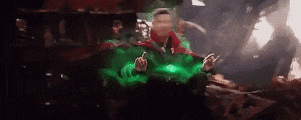

<!--truncate-->

## Summary
Reinforcement Learning (RL) is usually applied for state of the art AI research and often make the headlines. Yet it still fails to deliver on concrete business topics. At Ekimetrics we strive to transfer AI innovations into the business world and Reinforcement Learning is a unbelievable playground to find disruptive solutions to complex real-world problems. In particular, there are many optimization problems that could be solved using RL.

The Traveling Salesman Problem (TSP) has been solved for many years and used for tons of real-life situations including **optimizing deliveries** or **network routing**. This article will show a simple framework to **apply Q-Learning to solving the TSP**, and discuss the pros & cons with other optimization techniques. It's a perfect introduction for beginners in Reinforcement Learning and does not require heavy computational capabilities.

> You can find all the code open sourced [here on Github](https://github.com/TheoLvs/reinforcement-learning/tree/master/5.%20Delivery%20Optimization)

## The Traveling Salesman Problem

The Traveling Salesman Problem (or TSP) is a typical optimization problem, where one has to find the shortest route to visit different cities. There are many different ways to solve this problem using discrete optimization techniques. 

Like many optimization problems, it's a NP-hard problem, which in short means that it's easy (in terms of speed) to solve for 5 cities, already impossible to brute force for 50. And almost impossible for most algorithms for  5,000 cities. Even for 15 cities, it's already 1 trillion permutations to compute (15!), there are optimization techniques that are more adequate : dynamic programming, branch and bound algorithms, nearest neighbors approximations, or ant colonies optimizations.

Furthermore, the problem described here is too simple to describe a real-life delivery situation. It does not take into account multiple vehicle fleet, electric vehicle charging, time window constraints, capacity constraints, aleatory perturbations, etc... Hence, each variant of the TSP has its own optimization frameworks (in terms of variables and constriants), and the more you complexify the problem, the more difficult it is of course. That's why in practice delivery companies use combinations of those variants coupled with heuristics. The most advanced companies today add Machine Learning techniques on top of those algorithms, in particular to replace manual heuristics and better estimate in-context durations.    

In Python, the easiest way to get started with TSP and its variants is probably the great open source library [OR-Tools by Google](https://developers.google.com/optimization/routing). And if you want to learn more about discrete optimization, I can only recommend the great MOOC on *Discrete Optimization by the University of Melbourne* you can find on [Coursera](https://www.coursera.org/learn/discrete-optimization). 

## Applying Reinforcement Learning to the TSP
### Why bother using Reinforcement Learning?
If it's already solved by classical optimization techniques, why bother using Reinforcement Learning? Well several answers: 

- It's fun and I personally love practicing RL. Curiosity is a great driver for innovation, and here I was really wondering if it could be applied for such a problem.
- RL is rarely used in real-life problems. Playing games or manipulating robot hands is awesome, but when it comes to business problems, RL often fails compared to simple heuristics or algorithms. At Ekimetrics, we always look for applying state-of-the-art AI research to the business problems we encounter in the real-world. 

However, Reinforcement Learning (in theory) would hold many advantages compared to classical optimization techniques : 

- **Offering a general framework for all problems**, indeed instead of tweaking the constraints and defining extra variables, you can change the reward, and defining a multi agent problem if needed for fleet optimization. Adding extra information like delivery time estimation is also eased if you can integrate the prediction algorithm with a similar ML techniques (e.g. Neural Networks)
- **Having a "live" decision making algorithm**. Because you would train a RL alorithm by making the next delivery decision at each stop, compared to "offline" optimization algorithms that study the problem with no unknowns, you inherently would be able to take different decisions if something happened during the experience, whereas you would need to recalculate with classical techniques
- **Being robust to unknowns and aleatory perturbations**

### Transforming the TSP to a RL problem
Before jumping into the TSP variants, let's take the most simplest version: *a delivery man who has to deliver 50 packages*. Between each stop can be defined a distance or a duration (or a more complex metric). 

To transform it to a RL problem, we need to define: 

- **Agent**: the delivery man
- **Environment**: the different packages to deliver (and their destination) and the city where to navigate
- **States**: the location where the delivery guy currently stops 
- **Actions**: at each location, the decisions to make (modeled as a Markov process) are: "where to go next" (or "which location do I chose next")
- **Reward**: Between two locations (states), how long (or how far) it is

### Creating the routing environment
Creating a simple version of the environment is quite simple in pure Python. Indeed, you can store the position of the stops in a 2D virtual world as a numpy array or a Pandas DataFrame. Distances between stops can be calculated with an euclidean distance, but it could be complexified to account for durations or represent any distance/duration metric you would see in a routing network. 


```python
from scipy.spatial.distance import cdist

ENV_SIZE = 10
N_STOPS = 100

# Creating the stops using numpy random points generator
xy = np.random.rand(N_STOPS,2)*ENV_SIZE

# Computing the distances between each points
# Here use euclidean distances, but any metric would do
# This distance matrix can actually represent a time, a distance or something else
distance_matrix = cdist(xy,xy)
```

Then we want to define the starting position, the route, and the end position. Meaning that if we have to traverse A, B, C, D, E, possible routes would be for example ``A->C->B->E->D`` or ``B->D->E->C->A``. 

By the way with 5 stops you have 5! possible routes or 120 possible routes. For 10 stops you already have 3.6 million possible routes. For 100 stops it's 10 to the 158th power routes. It's called the combinatory explosion, and that explains why this simple problem is impossible to brute force for a high number of stops. 

We can visualize routes by drawing lines between each stop


We can also already imagine more complex and realistic situations. For example, one experiment I wanted to do was to stress test the RL algorithm to aleatory events. For example a known environment with unknown perturbations, like traffic. To model this interaction, we add a "traffic zone" inside our environment, where routes are much slower if taken. To account for the extra duration, we calculate the intersection points of the route within the "traffic zone" and measure the distance of the formed segment, we then use that distance weighed with a traffic intensity factor. 

```
i1,i2 = intersections
distance_traffic = np.sqrt((i2[1]-i1[1])**2 + (i2[0]-i1[0])**2)
additional_reward = distance_traffic * traffic_intensity * np.random.rand()
```


Now that we have the overal idea, we have to design an environment object in Python to be fed to a Reinforcement Learning agent. We use the typical design framework inspired from OpenAI Gym:

```python
class DeliveryEnvironment:

    def reset(self):
        """Restart the environment for experience replay
        Returns the first state
        """
        pass

    def step(self,a):
        """Takes an action in a given state
        Returns:
            s_next: the next state
            reward: the reward for such action
            done: if the simulation is done
        """
        pass

    def render(self):
        """Visualize the environment state
        """
        pass
```


### Designing the Q-Learning algorithm
Before jumping into complex Deep Learning, I wondered if a simple **Q-Learning framework would work**. Basically with Q-Learning you want to evaluate a matrix mapping states, actions and rewards. Indeed to make a decision in a given state about the best actions to do, you would love to have an estimate if the decision was the best in the long term. This is represented by the Q values. 

In our case, the rows are the different states (all the stops) and the columns the possible actions to take in this state, hence the next stop to go. The values are the estimated long-term reward you would get by taking this action. So, if you are found in a state A, you would like to take the action with the maximum Q value. 

For our TSP problem for example, we would have a Q-Matrix of 50 by 50 if we have 50 stops. 

Because we want to inform the routing algorithm with as much unbiased data we can find, we can actually initalize the Q matrix (also called Value function because it maps out states and actions to rewards - the values) with the distance matrix between all stops. Indeed, if you would not consider a long-term decision making strategy, you would apply a greedy one where you would chose the closest stop as a next destination. Yet it would definetely be better than random. 

```python
from scipy.spatial.distance import cdist
Q = cdist(xy,xy)
```

Ok, but how to update those values and incorporate long-term planning? This is exactly the goal of the Q-Learning algorithm. 
Imagine you are delivering pizzas every day all across the city, you have an old GPS to help you decide the shortest route between your stops. But your city is much more complicated than what you and your GPS know. What would happen? 

- The first day, you would chose the closest stop first and then jump to the next closest one. You will quickly realize that it's not optimized. You should maybe have gone first to another neighborhood and deliver everything in the area before jumping to another one. 
- So the next day, you commit to another strategy, armed with yesterday's experience. Definitely, looking ahead and avoiding single deliveries in remote areas even if they are closest is a better idea. But while you are exploring the best routes, you pass through the city center and get blocked into traffic that terribly slows you down. 
- The 3rd day, you will try to apply the same general strategy, but definitely if possible you will never go through the city center, and try circling around the city to save some precious time. 

This **trial-and-error behavior is basically how experience replay works in the Reinforcement Learning framework**. 

If we code an agent abstraction, it could look like this:
```python
class QAgent(Agent):
    def __init__(self,states_size,actions_size,epsilon = 1.0,
    epsilon_min = 0.01,epsilon_decay = 0.999,gamma = 0.95,lr = 0.8):
        self.states_size = states_size
        self.actions_size = actions_size
        self.epsilon = epsilon
        self.epsilon_min = epsilon_min
        self.epsilon_decay = epsilon_decay
        self.gamma = gamma
        self.lr = lr
        self.Q = self.build_model(states_size,actions_size)


    def build_model(self,states_size,actions_size):
        Q = np.zeros([states_size,actions_size])
        return Q


    def train(self,s,a,r,s_next):
        self.Q[s,a] = self.Q[s,a] + self.lr * (r + self.gamma*np.max(self.Q[s_next,a]) - self.Q[s,a])

        if self.epsilon > self.epsilon_min:
            self.epsilon *= self.epsilon_decay


    def act(self,s):

        q = self.Q[s,:]

        if np.random.rand() > self.epsilon:
            a = np.argmax(q)
        else:
            a = np.random.randint(self.actions_size)

        return a
```

The most important line is this one:

```python
self.Q[s,a] = self.Q[s,a] + self.lr * (r + self.gamma*np.max(self.Q[s_next,a]) - self.Q[s,a])
```

This is the update rule in basic Q-Learning, where you increment the Q-value for each action in each experience replay (simulating a day of delivery hundreds of time) by the current reward + the reward for the best possible action you would take in the future. This recursive equation is a variation of the famous Bellman equation for Q value functions. 

Notice two factors: 
- The learning rate ``lr`` control the learning speed (like in Deep Learning)
- The gamma factor ``gamma`` is the discount factor, and control long-term planning. Indeed if gamma = 0, you will only get the next action reward (your agent is "short sighted" only seeking current rewards), if gamma = 1 you will be more oriented towards the future rewards (above 1 it may diverge)

Those two factors are our most important hyperparameters to tune during training (there are others like the epsilon variables defined in the initialization, if you are curious take a look at epsilon-greedy methods, a super simple way of tackling the exploration-exploitation dilemma in Reinforcement Learning)


### Writing the training loop

Once we have define the environment, the Q-Agent and the update rules for the value function, we only need the final step: the training loop. We will apply **experience replay** to our poor delivery guy stucked in an infinite time loop. 

 

Every day, over and over, he will try to deliver our 50 packages, find the best routes and do it all over the next day. In Reinforcement Learning we call each day an **episode**, where we simply:
- Reset the environment
- Make a decision of the next state to go to
- Remember the reward gained by this decision (minimum duration or distance elapsed)
- Train our agent with this knowledge
- Make the next decision until all stops are traversed

```python
def run_episode(env,agent,verbose = 1):

    s = env.reset()
    agent.reset_memory()
    max_step = env.n_stops
    episode_reward = 0
    
    i = 0
    while i < max_step:

        # Remember the states
        agent.remember_state(s)

        # Choose an action
        a = agent.act(s)
        
        # Take the action, and get the reward from environment
        s_next,r,done = env.step(a)

        # Tweak the reward
        r = -1 * r
        
        if verbose: print(s_next,r,done)
        
        # Update our knowledge in the Q-table
        agent.train(s,a,r,s_next)
        
        # Update the caches
        episode_reward += r
        s = s_next
        
        # If the episode is terminated
        i += 1
        if done:
            break
            
    return env,agent,episode_reward
```


## Results

### Q-Learning for a simple TSP

When you start training and experiencing the same problem overtime, your agent learns about the environment, this is shown by the episode rewards values for each experience replay. 


- In the first phase, until the 400th episode, you are still exploring the different routes. Indeed with the epsilon decay method (with ``epsilon_decay=0.999``), you are taking random actions at each step. 
- In the second phase, epsilon is lowering, and you start exploiting what you have learnt, and take less and less random actions to be more driven by Q values. 

What's tricky with epsilon-greedy methods, is that it kind of forces of the convergence. So did it work? Let's see. 

##### 50 stops experiment


##### 100 stops experiment


##### 500 stops experiment


In each experiment, the algorithm converges quite fast to a seamingly acceptable route. After exploring a lot of options it not only gives one route but variations of the accepted strategy, which can already be interesting to find alternatives. 

### Q-Learning for a TSP with traffic zones

Now that we have our environment, agent and framework defined, what's great with RL is that we don't have to change anything but the reward to model a different situation. Indeed because we tweaked the reward when you drove through a traffic zone, the agent will learn the same way to optimize his holistic route. 

##### 100 stops experiment with traffic zones


Eureka, the agent will avoid as much as possible the traffic zones

##### 500 stops experiment with traffic zones


With more points, it's even more interesting, the agent will really circle around the traffic zone and prefer longer but faster routes. 


## Next steps

I hope this simple experiment has highlighted how to apply (non-Deep Learning) Reinforcement Learning techniques to real-life problems. I haven't had time to benchmark the resolution against other optimization techniques (which I should have done I confess), but let's try to draw some pros and cons for the approach. 

##### ⛔ Cons:
- Probably slower
- Definitely less accurate than a discrete optimization technique
  
##### ✅ Pros:
- General framework to be updated in real-life situations (eg: the traffic) and extended to more complex problems
- Alternative routes are proposed
- "Online" decision making (meaning that you have an algorithm armed with a next-best decision recommendation system)

Next steps is to extend the work to an even more global framework to account for multiple vehicle fleets, charging stations and more. The latter idea will require to use Deep Reinforcement Learning because states could not be represented as a matrix, and will probably be more difficult (impossible?) to train, but that's a topic for a next article!  

## References
- All the code is open sourced [here](https://github.com/TheoLvs/reinforcement-learning/tree/master/5.%20Delivery%20Optimization) on Github
- OR-Tools [open source library](https://developers.google.com/optimization/routing) by Google
- MOOC on [discrete optimization](https://www.coursera.org/learn/discrete-optimization) by the University of Melbourne on Coursera
- The timeless [MOOC on Reinforcement Learning](https://www.youtube.com/watch?v=2pWv7GOvuf0&ab_channel=DeepMind) by David Silver at Deepmind