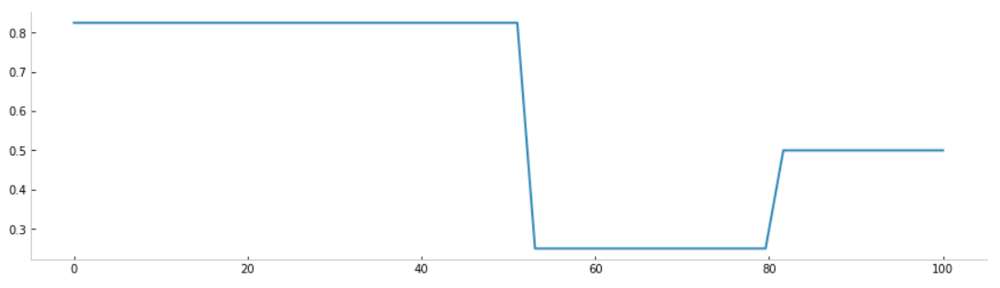

<!--truncate-->

## Pyepidemics

### Context

During the first wave of COVID19 in 2020, Ekimetrics joined the CoData movement, a coalition of data and artificial intelligence specialists whose goal was to pool their skills to provide answers and solutions on the evolution of the pandemics. We had the chance to work with many epidemiological experts, and as we went along we built a toolbox to facilitate our modeling of the current pandemics. We then put this toolbox in open source under the name **pyepidemics** to contribute to the community on this scientific discipline difficult to apprehend for Data Scientists but with obvious bridges facilitating innovation. 
Today, with the resurgence of the epidemic in Europe, it seemed important to present this library more widely to democratize these analyses on a larger scale. 

- The library is available on Github at [this link](https://github.com/ekimetrics/pyepidemics)
- The documentation is available at [this link](https://ekimetrics.github.io/pyepidemics)

This article will serve as a synthetic presentation of what can be done with the library, please refer to the documentation for more details. Do not hesitate to post issues on Github and to contribute with new proposals, the development is still in experimental version. 

### Introduction to Pyepidemics
Pyepidemics allows to simply create compartmental epidemiological models (also used in system dynamics) and to solve the differential equations that model the phenomenon. The different features implemented today are: 

- Creation of classical compartmental models (SIR, SEIR, SEIDR, etc...)
- Creation of COVID19 related model (with ICU and different levels of symptoms)
- Creation of custom compartmental model
- Implementation of policies (lockdown, tracing, testing, etc...)
- Calibration of epidemiological parameters on real-world data using Bayesian optimization

### Installation
You can simply install pyepidemics using the command 
```
pip install pyepidemics
```


## Introduction to epidemiological modeling in Python
The images, the reasoning and the construction of the first bricks of the library are largely inspired by the exceptional work of Henri Froese with his series of articles on epidemiology, in particular the first article [Infectious Disease Modelling: Beyond the Basic SIR Model](https://towardsdatascience.com/infectious-disease-modelling-beyond-the-basic-sir-model-216369c584c4). 

### Compartmental models
An epidemic is modeled with the different possible states for the population, for example: unaffected, immunized, vaccinated, symptomatic patient, asymptomatic patient, hospitalized, in intensive care ... Each state will be modeled with a compartment, and the population will transition between the different compartments according to parameters of probability and transition duration. In concrete terms, this means solving a system of differential equations as a function of time. 

For example the simplest compartmental model is the SIR model (for the 3 states Susceptible - Infected - Removed). 
It is possible to write the following compartments with their transition:


The transition parameters being given by : 


### Building a SIR model with pyepidemics
This section is detailed in this [tutorial](https://ekimetrics.github.io/pyepidemics/tutorials/quickstart/) which is also available directly on [Colab](https://colab.research.google.com/github/ekimetrics/pyepidemics/blob/master/docs/tutorials/quickstart.ipynb). 

#### Using the bank of models
As the SIR model is a standard model, you can find an already coded version in the model bank. We will learn in the next section how this abstraction is built to allow you to add details in the modeling. 

With pyepidemics:

```python
from pyepidemics.models import SIR

N = 1000 # Thousand persons
beta = 3/4 # One person contaminates 3/4 person per day
gamma = 1/4 # One person stay infected for 4 days

sir = SIR(N,beta,gamma)
```

It is then possible to solve the system of differential equations simply with the method ``.solve()`` (more parameters are available, see the tutorial quoted above : 

```python
states = sir.solve()
states.show(plotly = False)
```

What is commonly called an epidemic "wave" is observed. 


#### Reimplementing the SIR model
Let's now go into the internal workings of this abstraction to reimplement its operation in a few lines of code. Concretely we build a graph between the different states by detailing the transitions. Pyepidemics then translates this graph into a system of differential equations in order to solve it. 

```python
from pyepidemics.models import CompartmentalModel

class SIR(CompartmentalModel):
    def __init__(self,N,beta,gamma):

        # Define compartments name and number
        compartments = ["S","I","R"]
        super().__init__(compartments)

        # Parameters
        self.N = N # Total population
        self.beta = beta # How many person each person infects per day
        self.gamma = gamma # Rate of infection, duration = 1/gamma

        # Add transition
        self.add_transition("S","I",lambda y,t: self.beta * y["S"] * y["I"] / self.N)
        self.add_transition("I","R",lambda y,t: self.gamma * y["I"])
```

So it is possible to build any kind of compartmental model with this operation. You can see more complex examples in this [tutorial](https://ekimetrics.github.io/pyepidemics/tutorials/custom_model/).

## Create a realistic epidemiological model for COVID19
In the first section we saw how to build a SIR model, however we are far from being able to use this model to simulate an epidemic like COVID19 and for governments to be able to take actions using those analyses. For this we would need to:
- Have a more complete description taking into account the specifics of the disease states
- Take into account the mitigation strategies provided by governments
- Calibrate the model to describe the evolution of the epidemic as closely as possible

### Build the right compartmental model
Indeed, the COVID19 is more specific than simply the 3 SIR states described above. During the year 2020, we used the following compartmental model inspired by the work of the Pasteur Institute and the INSERM (taking into account the different levels of symptoms, the incubation phase, and the passages in hospital or in intensive care)


You can look in the library at the implementation of the ``COVID19`` model to see the implementation (very close to what has been described above for the SIR model, one of the strengths of pyepidemics). 

### Describe the mitigation solutions implemented (containment, testing)
Some parameters, such as the famous "R0", have varied enormously during the epidemic depending on behaviors (distancing, masks), policies (testing, lockdowns, vaccination), or variants of the epidemic. Thus, to create a realistic model, we need to take these variations into account. 
We will take the example of the first lockdowns to understand how to implement these variations with pyepidemics.   

Let's create an evolution of the parameter ``R(t)`` according to the different lockdowns (during the first wave for example)

```python
from pyepidemics.policies.utils import make_dynamic_fn

policies = [
    3.3/4,
    (1/4,53),
    (2/4,80),
]

fn = make_dynamic_fn(policies,sigmoid = False)

# Create our time-dependent parameter
beta = lambda y,t : fn(t)

# Visualize policies
x = np.linspace(0,100)
y = np.vectorize(fn)(x)
plt.figure(figsize = (15,4))
plt.plot(x,y)
plt.show()
```


And that's it! We can use this time-dependent parameter like we used a constant before. To see more complete examples and results, you can redirect to this [tutorial](https://ekimetrics.github.io/pyepidemics/tutorials/beyond-sir/).

### Find the most appropriate parameters for calibration
Finally, in the previous example, as in those before, we chose arbitrarily the values of the different probabilities and transition times. But these are precisely what epidemiologists want to estimate. How does this work? Simply by testing different parameters until the solution of the compartmental model matches as much as possible the real evolution of the epidemic. Of course, we are not going to test all the combinations but rather : 
- Start with an a priori on the different parameter values from the most recent epidemiological studies 
- Use a Bayesian optimization algorithm to go through the parameter space efficiently without having to calculate everything. 

These two methods are easy to implement with pyepidemics if we have a pyepimemics model with a ``.reset()`` method that recreates a compartmental model with the new set of parameters. First we create a parameter space to explore:

```python
space = {
    "beta_low":(0.01,0.4),
    "beta_high":(0.6,1.5),
    "I0":(0,100),
    "recovery_rate_asymptomatic":(1/8,1/2),
    "recovery_rate_mild":(1/8,1/2),
    "death_rate_hospital":(0.006,0.02),
    "death_rate_icu":(0.006,0.02),
    "recovery_rate_icu":(0.02,0.08),
    "recovery_rate_hospital":(0.02,0.08),
}
```

Then we will simply use the method ``.fit()`` by giving as input a *dataframe* with the real values of the epidemic for the compartments for which we would have succeeded in obtaining data (in general the deaths and the hospital stays which are the most reliable). 

```python
model.fit(
    cases[["D","H","ICU"]],
    space,
    n = 200,
    early_stopping = 100,
)
```

This step is not easy, takes time and often also requires iterations to change the definition of the compartmental model. But once solved it is what allows epidemiologists to follow the dynamics of the pandemic. 

More details on calibration are available in this [tutorial](https://ekimetrics.github.io/pyepidemics/tutorials/calibration/). 

## Conclusion

With this article we could introduce you to our epidemiological modeling library pyepidemics - simple modeling, flexible compartmental models, calibration, dynamic parameters, etc... The details of the different features are available in the library documentation. 

As previously mentioned, this library is still under experimental development, we are still using it to model the 5th wave of the epidemic, in particular by adding compartments for vaccination - we will write an article on the modeling in the coming months. Do not hesitate to contribute to democratize this discipline to the Data Science community. 

## References
These few references helped us greatly during the development of the library
- [Infectious Disease Modelling: Beyond the Basic SIR Model](https://towardsdatascience.com/infectious-disease-modelling-beyond-the-basic-sir-model-216369c584c4)
- [Expected impact of lockdown in Île-de-France and possible exit strategies](https://www.medrxiv.org/content/10.1101/2020.05.08.20095521v1) - by INSERM
- [Estimating the burden of SARS-CoV-2 in France](https://hal-pasteur.archives-ouvertes.fr/pasteur-02548181/document) - by Institut Pasteur
