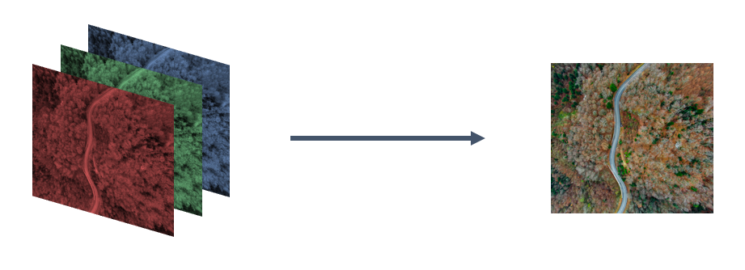

<!--truncate-->

## Enriching understanding of customer journeys through clustering

Analyzing customer website behaviour is an essential step towards understanding the ways in which customers perceive and interact with a brand’s products and services. Methods for analyzing these online interactions have improved in sophistication and depth of insight offered in recent years meaning many traditional methods, such as journey mapping now fall short. Exploring Customer Journeys, whilst more complex, offers brands the opportunity to dive deeper and obtain more granular insights that can then be used to optimise and improve the experience of future customers.

Employing advanced methodologies is not only beneficial, but it has also become a necessary action for any business that wants to explore the increasingly complex customer journeys possible on modern websites. To provide some context to this challenge - when investigating this possibility for one of our clients, a global leader in the telecom industry, we quickly realized that given the number of possible actions on their website (about 1,760), performing standard analysis would be overwhelming. It would, in fact, raise the number of potential journeys to something of the order of 104900. To put this number into perspective, the number of atoms in the universe is of the order of 10100. A simple method of analysing customer journeys is mapping. Essentially creating a visual representation of every touchpoint your customers have with you, creating a fluid timeline from how you initially engaged them to their first purchase and tracking the ongoing relationship.  

> … it would raise the number of possible journeys to something of the order of 104900. To put this number into perspective, the number of atoms in the universe is of the order of 10100.

## Advancing methodologies - Creating groups of similar journeys through image embedding, autoencoders and unsupervised learning

Many businesses are adapting strategic models to emphasise customer-centricity and build up their online presence. Websites, therefore, become a powerful asset in understanding customer behaviour through the data that they generate. And analyzing this data becomes a potential source of insight to improve future interactions with the customer base, driving loyalty and higher conversion. Journey mapping and other traditional methods can provide fast and high-level customer insight, which can be an important first step in making use of this asset. However, they often fall short as the numbers of potential journeys increase exponentially. 

Journey clustering is a more advanced approach that uses algorithms to analyse all journeys by identifying groups of customers who interact with the website in similar ways. In doing so, we identify patterns in customer behaviour and begin to understand the motivations behind their actions.  This type of analysis can be used by businesses to personalise their websites and improve customer experience. Ekimetrics' innovative approach specifically uses advanced encoding and machine learning methods, as well as clustering algorithms to make sense of the complex digital world.

To address this challenge our approach requires three key steps: 

1. Reducing the dimensions of our customer journey dataset

2. Creating image-like representations of customer journeys; one image represents one customer journey

3. Applying clustering algorithms on images to create groups of users with similar behaviours. For each cluster, we are then able to define a “standard journey”.

### Step 1: Reducing the dimensions of our dataset

Analyzing customer journeys is a difficult task that can lead to memory allocation errors, primarily due to high data diversity. Even for less sophisticated brands, the number of parameters feeding into a customer journey analysis model can quickly become unmanageable due to the sheer size of data needing to be analysed. 

For example, the following features can be tracked: the URL of the pages visited, time spent on one page, overall duration on the website, user clicks, and many more.  The temptation is to add as much detail as possible, but more variables create more noise and lengthening computation time. 

A solution to this problem is to identify the most relevant variables - with respect to the business question we want to answer - to take forward through feature selection, these metrics can then be aggregated into a single data structure. This process serves two purposes: firstly reducing the size and complexity of our inputs and ensuring the outputs are directed towards the business objectives and free of unnecessary noise.

### Step 2: Encoding and creating images to represent journeys

Customer Journeys are path-dependent processes that describe customers’ interactions with different touchpoints, for example, all actions on a website leading up to purchase. To analyse these relationships we need to manipulate datasets to represent online journeys but also translate them into something that can be easily interpreted and modelled.

To do this and ensure no information is lost we create a 3D embedding ‘image’ that merges all this data into a single structure through the following processes:

- Touchpoints that a customer has interacted with are represented in columns

- The order in which interactions happen is represented in rows

- A vector describing the quality of the customer interaction (e.g. time spent/number of clicks…)

 Building our 3D embedding through an iterative process
 

  

The 3 parts for building our 3D embedding highlighted in the figure above are:

- Given n, the number of possible interactions on the platform, it is possible to build a vector V=(1,n) representing all actions that a customer can perform. At a particular stage t, it is possible to fill V with “0“ or “1” depending on the customer’s action: if the ith action has been performed at stage t, set V(1,i)=1 , otherwise V(1,i)=0

- It is then possible to replicate this process at every stage of the customer’s journey in order to build a matrix M(l,n) where every line l represents the lth action performed by the customer

- Finally, adding an indicator of the journey’s quality consists of replacing the 0 & 1 in the previous matrix, with a vector of values describing the interactions.

 Example of an image decomposition through RGB channels

 

 

  

:::note    

Colourized pictures can be decomposed into Red, Green and Blue monochromatic sub-pictures.
In our case, we can draw a parallel between the different indicators describing the interactions and the colourized levels of an image.

:::

### Step 3: Clustering customer journey “images” to identify standard paths
In order to apply a clustering algorithm first, we had to clean and apply pre-processing to our data. We then had to control the dimensions in order to keep the number of variables below a defined threshold (we chose ~log #observations). To achieve such control we used autoencoder neural networks.

The goal of such algorithm is to learn a semantic representation by extracting the relevant signals from a given set of observations. This is a dimension reduction method that enables us to perform non-linear transformations. In other words autoencoders enable us to turn our inputs into meaningful and compressed data by getting rid of the non relevant information.

:::info

PCA is another such dimension reduction method that performs linear transformations.

:::

 

 Using a convolutional autoencoder to compress customer journeys 

 

 The above figure shows how an autoencoder performs on a dimension reduction problem. First, the input signal is compressed over the blue layers to reach a compressed representation (represented by the Dense layer). The signal is reconstructed using the green layers to then give the output. **The goal is to have similar inputs and outputs while controlling the size of the Dense layer.**

The above architecture is different from the classic convolutional autoencoders (classic autoencoders involve a succession of convolution and pooling layers for the encoding part, and upsampling layers for the decoding part). The architecture we used relies on convolution layers, and on deconvolution layers rather than upsampling ones. Since deconvolution layers are trainable (meaning that they depend on learnable parameters), and upsampling ones are not, this architecture can learn more complex transformations than a classic convolutional autoencoder of the same depth.

 *This architecture is inspired from the one described in this [article about Deep Clustering](https://xifengguo.github.io/papers/ICONIP17-DCEC.pdf)*.

Once we had completed the dimension reduction, we need to apply a clustering solution on the compressed customer journeys. We then assigned each group of similar customer journeys to a representative standard journey.

:::note **A word about clustering**

A clustering process consists of building groups of observations (e.g. customer journeys) based on their characteristics. The key components of the clustering process are:
-  Building groups containing similar observations: we talk about intra-class variance minimization.
-  Building groups that are different from each other: we talk about inter-class variance maximization.

Clustering tasks rely on unlabelled data (such learning tasks are known as ‘unsupervised learning’).

:::

## Making the customer journey analysis easier to perform - taking advantage of a reduced number of journeys

Performing a clustering algorithm on Customer Journeys aims to reduce the complexity of the analysis through the creation of groups with similar journeys. The analysis is easier to perform as it becomes possible to focus only on the representations of each group, instead of analyzing every single path. This method drastically reduces the number of journeys that require our attention. It also becomes possible to highlight complex similarities or patterns when creating these clusters.

:::info 
Once the clusters are created, each of them is assigned to a standard journey (e.g. when using k-means, these standard journey are called centroids).
:::

 Example of standard journeys 

 
 
  

The example above shows three of these standard journeys. We can already see some interesting information and differences between the clusters:

- Customers in the Standard journey #1 group complete more actions compared to #2 and #3.

- All three standard journeys have different starting and ending pages that correspond to the first and last rows in the pictures). By looking at these standard journeys, at a glance we can already spot some initial differences between the clusters. 

Note that deeper analyses can be performed on these journeys by looking at the non-embedded data.

## Leveraging the Customer Journey Clustering - three ways of improving customer-centric strategy

We believe that this solution has several uses to improving the way businesses operate by better understanding customer behaviour, forming a stronger view of the customer lifetime value, and improving the user experience and conversion rate.

### Improving websites
We can use customer journey clustering to build a representative journey (using the centroid of each cluster), establishing the usual actions a user performs between touchpoint A (e.g. website’s homepage) and touchpoint B (e.g. website’s purchasing page). These typical journeys help gain a better understanding of the customers’ experiences, allowing us to identify ways to improve the website. 

For example, it will help brands optimise the groups of products shown at the top of a landing page.

### Building audiences
By understanding the size and similarities between groups that interact with our website Customer Journey Clustering is also a way to create specific audiences. It then allows brands to tailor their activity to engage with these specific audiences, improving the overall experience. 

For example, if clusters 1 and 2 appear similar, but cluster 1 has a higher conversion rate than cluster 2, then analyzing the behaviours from cluster 1 may help us understand how to better retarget cluster 2. 

These insights also make it possible to redirect customers through an optimal action that will drive more conversions.

:::note
We could go a step further by creating customer conversion scores based on their journey. These scores could then be used to build an optimized communication strategy, leading to the next optimal action (i.e. increase or reduce media spend, depending on the score). 
:::

### Improve churn prediction
Another use case to Customer Journey clustering is evaluating churn and when customers are likely to shop with a competitor or stop ordering from us. When journeys are associated to a churn score, it becomes possible to create a predictive model that can be used to identify the groups that are more inclined to churn.

Following the training of the model, the learnings could be applied to the standard journeys associated with each cluster, outputting a global churn score per cluster. These scores can then be evaluated and compared to other groups to better manage expected orders and improve communications with at-risk customers. 

:::note
Since a churn predictive model such as this is trained on the 3D embedded customer journeys, one can expect it to be capable of spotting complex churn patterns involving huge sequences of actions, or time spent per action.
:::

## Conclusion
At Ekimetrics we believe that customer journey clustering can help enhance the customer experience and increase customer lifetime value. We also know that with customer behaviours changing rapidly, an approach such as this provides a flexible solution that can translate into actionable insights for any business. 

However, complexity is not always the answer. A good model should tell a compelling and comprehensive story, but increased complexity must be accompanied by an effort to improve interpretability and should showcase enhanced benefits for business application.

The customer journey is still a challenge for every business globally. We do believe that there is no « plug and play » answer and each solution needs to be built for the problem at hand. For us, intelligent data science means developing integrated approaches and leveraging different methods to help make brighter business decisions.

## Appendix

To give you more details, if we take an example where a user can perform up to 10 different actions on a website, the number of possible journeys is 9,864,100.

:::info
Given n the number of possible interactions, the number of possible journeys is given by the sum from 1 to n of the number of permutation of n.
:::

## References
- Xifeng Guo, Xinwang Liu, En Zhu, and Jianping Yin. [Deep Clustering with Convolutional
Autoencoders](https://xifengguo.github.io/papers/ICONIP17-DCEC.pdf)
