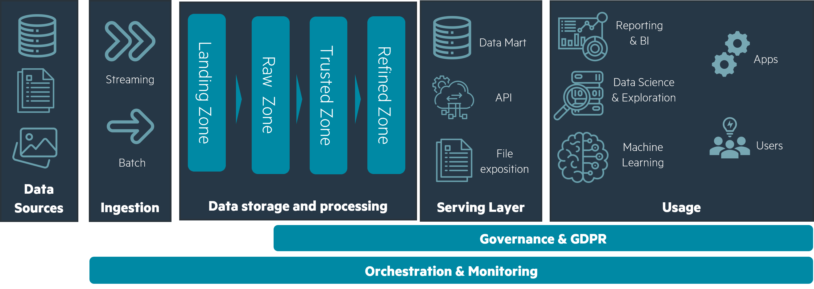
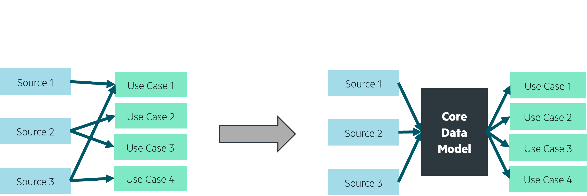

<!--truncate-->

## Article Scope

Scalable and distributed, datalakes have become the new go-to for centralizing storage and insights. The main challenge is not to create one, but rather to do it right and avoid falling into the so-called __data swamp and empty shell traps__. In this article, we’ll go through how you can create your first datalake following best practices in order to make it robust, evolutive and central to your company’s information architecture, as well as take advantage of the opportunities it presents.

In this post, we’ll be technology agnostic. The focus here is a smart architecture that will help solve functional and technical challenges, whether you’re using Azure, Amazon Web Services, Google Cloud Platform, any other provider or even building & managing the infrastructure yourself.

## Introduction

Before talking about how to design a datalake, let’s review what it is, why it’s useful and the main aspects that will ensure its quality.

### What is a datalake?

A datalake is a global storage space allowing to interact with all data type: unstructured (e.g. text documents, images, videos), semi-structured (e.g. XML / JSON files), structured (e.g. SQL tables, CSV files). Data is extracted from all relevant sources, loaded into the datalake, then transformed into their use case specific target.

A well-designed datalake is flexible and scalable, allowing it to handle the increase in data volume, velocity, and variety. Because a datalake stores raw data before transforming it, it is extremely useful for extracting potential value from the data for the future. By centralizing data sources into a global storage space, it helps data scientists and analysts explore data to generate new use cases and business insights.

### Is building a datalake the right solution?

The goal shouldn’t be to build a datalake for the sake of building one. A datalake is only the foundation, corner pieces in your larger data analytics and data architecture puzzle. Your goal should be to find a use case from which you can build a robust and evolutive foundation to your technical and functional architecture. Having a clear vision as to how your datalake can grow in a 2-year horizon, with new data sources and analytical use cases, is essential.

### The data swamp and empty shell traps

Chasing the dream of a datalake that meets all current and future analytics needs or that unites all of your organization’s stakeholders around a single vision is an excellent way to fall into the data swamp or empty shell traps.

By trying to collect all current – and future – data sources from the start, there is a risk that your datalake will become a swamp. When that’s the case, due to unorganized, unvalidated or simply hard to exploit data, it can be incredibly challenging to make your datalake useable.

Your first goal should be to analyze which high impact use cases will be used by your organization’s stakeholders and target data for these specific use cases. Starting with the business needs instead of chasing a technical achievement, you can be sure that your datalake will be used and useful, instead of an empty shell: a good foundation but unable to attract your organization’s stakeholders. Read more about how we can avoid missing out on business impact in this whitepaper.

## The foundation architecture

Let us first establish the building blocks of your datalake. This foundation is the basis for logical separation of your data and use cases in the platform you'll be building.

A datalake can ingest any type of data: from structured tables to unstructured files, whether ingested by batch or through streaming processes. Data will transit through four zones in sequence, from its raw form to fully processed for use cases, and from a technical to a business orientation.

- Landing LAN : temporary zone for all sources. Once data is extracted, it transits through this zone and is dispatched into the next zone by validation mechanisms.

- RAW (also known as bronze): data extraction pipelines will fetch data in the landing zone and validate it technically as well as functionally to make sure it is usable. This zone is the main storage component for all your data, and contains every extracted source, raw and untransformed, only with a concern for what is technically and functionally usable.

In landing and raw zone, data is organized logically by source: CRM, Point of Sales, WEB, etc.

- Trusted TRD (also known as silver): in this zone, you'll find the output of your data pipelines. Here, data is deduplicated, cleaned, transformed, and aggregated for your target use cases. Data is organized logically by data domain (Marketing, Finance, Sales, Operations…) and use case (Reporting, API exposition, AI training…).

- Refined RFD (also known as gold): this is the final zone for your data. It is the exposition layer for your use cases and is organized logically by use case.

These four zones are a representation of your data's journey through the datalake. From the refined zone, a serving layer can be added, taking shape in data marts, APIs, file exposition, etc. Your apps and users can then fetch or be sent data through this serving layer and make decisions that will give your data value.

 Data’s journey through a datalake, from source to usage
 

  

Your data’s journey from sources to serving layers is managed by pipelines, which are themselves managed by orchestrators. Pipelines describe how data is moved and transformed, be it with highly customized code or low code interfaces: in terms of concept, pipelines are close to ELTs (Extract, Load, Transform) mechanisms. Orchestrators are an ensemble of pipelines, defining parameters for each of them and specifying when and how they should be run: periodically, when an event triggers, using larger or smaller computing power, etc.

:::note  
A sandbox storage zone and computing environment can be made available with access to some of your storage zones. That sandbox allows for exploration of data by data scientists and data analysts, motivating new use cases.
:::

Based on this architecture, it all seems too simple: find a high value use case to start off the building process, then add new use cases and sources later. Following the design principles in the next section, it could in fact be that simple, all the while avoiding falling into the data swamp and empty shell traps.

## Usable and Useful through architecture and design

We’ve gathered some best practices and design principles that work well to counteract the possibility of your datalake becoming messy or unused. We like to think of each of these best practices as serving a goal that is threefold: building a datalake that is __usable, useful, and used__ - what we refer to as our three “U”s. The first “U” is targeted towards the data swamp trap, the latter two towards the empty shell trap.

## Usable through clear storage and pipelines architecture

The first step for building a usable datalake is to __make your storage and pipelines easy to comprehend__ for users as well as automated processes. Technical and functional separation for pipelines and storage is your first step in making your datalake understandable.

- __Make it clear who does what in the datalake__. A use case is built on top of data, which needs to be collected: we’ve found it best to separate data collection from its transformation from the start. Using at least different pipelines, and, better still, different scheduler resources will make understanding who (or which pipeline) is doing what much easier. One orchestrator for data collection pipelines, and other orchestrators for each data domain and use case theme – e.g. finance reporting, marketing CRM, sales exposition... This also sets up your datalake’s functional architecture in a “data mesh”-like manner, where __each data domain has its own identifiable perimeter__. 

 Separating pipelines among data domain orchestrators allows for a better understanding of who does what
 

  

- __Make it obvious where to find data in your storage__. We’ve talked a little about Landing, Raw, Trusted and Refined data storage layers. Separating your data by source in the Raw/Bronze layer will help your users and transformation pipelines identify each dataset. Separating transformed data by use case in the Trusted and Refined layers will give a better understanding of the functional architecture behind the storage.

- __Make it apparent which transformation or collection pipelines is responsible for which data__.

  - Use identifiers such as date and time “YYYYMMDD_HHMM” for your pipelines and processes. Date and time is a great identifier for __understanding when data was transformed__ or collected. Sticking to them for your logging as well, you can make sure that monitoring your pipelines and exploring their results is as easy as possible.

  - Inside your transformation pipelines, we’ve found that using break points is highly useful. Writing a dataset’s state after it’s been cleaned, pre-transformed, etc… up until its final refined state will make debugging and understanding your pipelines much easier. Using names like *0_deduplicated*, *1_cleaned*, *2_calculated* to show breakpoints in your transformations allow for a better understanding of the data lineage of each use case, also helping exploration in the sandbox.

## Usable through data validation

Now that your storage and pipelines architecture is understandable, your second goal is to __make your data usable__ so that the datalake doesn’t immediately become a swamp with faulty and unchecked data.

One mistake to avoid is to consider that since a datalake can store any type of data, all data is good to collect, and you can figure out if it’s usable and useful later. On the contrary: validating data from the get-go is essential. By having your data collection pipelines look at the structure and content of the data, you can make sure that your transformation pipelines will have a smooth time reading it down the line.

However, this does not mean that you instantly delete any data that is deemed unfit for your use cases. We’ve found that dispatching data into __rejected and validated subzones__ in the RAW/bronze zone is a good option:

- A rejected subzone for any __data that will not technically fit__ your use case pipelines: faulty files with bad lines, wrong column count for structured data, corrupt zip files, bad encoding, the list goes on. Deciding which data to move to the rejected subzone ultimately depends on how it will be read by later pipelines.

- We’ve also seen cases where data needs to be __rejected for functional reasons__: data from a source can be sent to you even though you’re not allowed to use it, or the data is technically readable but does not match with the sources you accept. In this instance, you can divide your rejected subzone into technical rejects and functional rejects.

- Finally, any data that is technically and functionally usable can transit to the validated subzone. When a use case pipeline reads data, it will usually only read that data’s validated zone. This not only ensures that your pipelines are robust and will not fail due to faulty or unexpected data, but it also allows for a stable data model to be built.

 Technical and functional data validation guarantee a first level of data quality
 

  

Why keep rejected data, you’ll ask?

Data that is technically rejected is useful for several reasons, the first one being that it is a good indicator of your sources' quality, and allows you to communicate efficiently with your data providers. Secondly, technically invalid data at one point in time may be usable in the future, be it by adjusting your later pipelines to be able to read them or simply correcting the data as a one-shot fix.

Data that is functionally rejected is also useful, particularly in cases where it’s from a source you’re not sure you’re allowed to collect. An additional subzone can then be a quarantine zone, where you would store data for which you need to check whether you can accept it in your use cases.

:::note  
By managing functional and technical rejections, your collection pipelines can be a powerful tool for your Data Steward and apply robust and monitorable governance at the datalake’s entry point.
:::

 From validated sources to a specific breakpoint in a run ID of a Use Case in a domain
 

  

## Useful through a business driven design
What we mean by “useful” - the second of our three “U”s, is that your datalake has to __serve a business use, while not limiting itself__ to the first identified use cases. This in turn means several things.

The first thing being the importance of starting from a business use case to then identify which data must be collected and transformed. Working from the business needs is always the winning strategy, especially for data science and datalake projects where it is easy to get lost in all the possibilities. Collecting data into your datalake is not an effortless task, especially following the aforementioned tips that help validate the data’s usability, functionally and technically. Which is why the first step is to make sure that the data you collect is indeed useful to your target use case. Our article [“Customer Data Platform: Thinking Backwards is the Way to Go”](https://ekimetrics.com/article-insights/customer-data-platform/) summarizes this business driven approach well.

Now, in order to make the most of that data and not limit a source to the one and only use case, your collection pipeline should only be considering it as that: a source. This means that it is not the role of your collection pipeline to determine which data will be useful and remove all other data: delta calculation, replacing referentials, etc. is not up to the collection, but to the use case pipelines. Making the most of a datalake’s scalability in storage and letting your use cases define what is useful to them in their own pipelines, you’ll allow for more opportunities to use the underlying source down the line.

One last element to make your datalake useful is to anticipate changing functional parameters. Historical depth for your transformations, functional validation for your sources, ways to trigger custom runs… If modifying these parameters has a business or data management use, they should be included in the first iteration of your pipeline developments. In our projects, they have allowed us to be extremely flexible if a pipeline needs functional change and focus on adding new use cases and sources rather than tweaking the same pipeline over and over.

## Used through scalability of business impact

Start small, allow it to grow : identify a single use case to automate and build your foundation architecture to host it. Using the best practices presented above you’ll then be able to build on top of this robust architecture.

The target for your datalake’s first use case should be for it to be __high impact, low time to value__. It must be the proof of value your businesses divisions need to invest more in the platform and should be an inspiration for other use cases. Once that use case is identified, along with the data it needs and a design for its transformation pipelines and exposition, you can start building it following the design principles presented above.

The steps below are a summary of how that first use case is built, but are also highly reproducible to build new use cases once your foundation architecture is in place.

- Ingest a new source

  - Technical validation: what are the rules that define whether this data is usable? Set up data structure validation and organize the source in an understandable manner.

  - If the data source is highly likely to evolve over time, make sure that the collection and technical validation pipeline for this source is evolutive as well to anticipate future changes.

- Build a new use case

  - Functional validation: for this use case, what are the rules that define whether this data is useful? Once again, it is best to leave functional validation to your use case pipelines, as different use cases will have different requirements for what data they want (useful) and what they can legally use (usable).

  - Same goes for how the data is used: delta calculation, targeting referentials, cleaning, etc… these steps should be part of your use case pipeline.

  - Build transformations with break points inside the trusted data storage zone, up to the exposition layer (refined zone / gold), where it is fully ready to serve use cases. Which of these transformations is likely to change, and can you anticipate these changes by using simple configurable parameters?

 This data storage architecture makes it easy to add new sources and use cases
 

  

These first two steps will show your datalake’s versatility. It is able to ingest any type of data, from unstructured to structured, streaming or batch. It is also able to transform it efficiently to feed use cases, due to the scalability of its computing power.

- Build a new serving layer

  - This final step will vary the most between use cases, as depending on your user endpoint, there might not be a unified way to serve refined data.

  - Here you may need additional resources on top of your foundation architecture: an API management service, a database to efficiently serve structured data, a web service or container to display interfaces…

That’s it, your use case is fully functional on your datalake. Using the best practices we’ve presented, the use case is robust, evolutive, scalable, understandable, and useful.

Once the foundation architecture is laid out and more use cases and sources are added, an argument can be made for a __core data model__. This model would be built by a single transformation pipeline that unifies deduplication / delta calculation, data cleaning, GDPR compliance transformations and preparation of highly used KPIs for your use cases. The core transformation should be considered as a use case pipeline: its job is to prepare data, saving on computing resources and providing a single source of truth for other use cases. It is also a great way to ease data exploration for data savvy users in the sandbox, allowing them to be inspired through use case agnostic and clean datasets. To maintain relevance, the core data model should be updated with new data sources as they are added, and new use cases using that new source should feed on the cleaned and prepared datasets.

 A Core data model centralizes all cleaning and pre-calculations, further simplifying the storage architecture
 

  

## Conclusion
Starting with the identification of a first high impact use case, you’ve been able to build a robust and evolutive datalake. Following the design principles we’ve reviewed, data and use case pipelines in your datalake are usable and useful. You are now able to show a proof of value for your datalake and grow it into a central data platform for your company.

The final U we could dive deeper into is “Used” : your goal is now to maintain, grow and manage the datalake as a unified data platform, centralizing data and solutions for your business. An efficient and relevant datalake project comes with technical design challenges, some of which we’ve talked about here, but also organizational challenges. By finding solutions for technical challenges, your datalake has shown its value and it is now essential to ensure its growth. As you coordinate with business divisions, you’ll be able to draw a roadmap for the datalake and improve processes at an organizational level, using “data mesh”-like functional architectures that allow for the best flexibility in use cases, growing your platform’s relevance and enhancing data capabilities for your business.