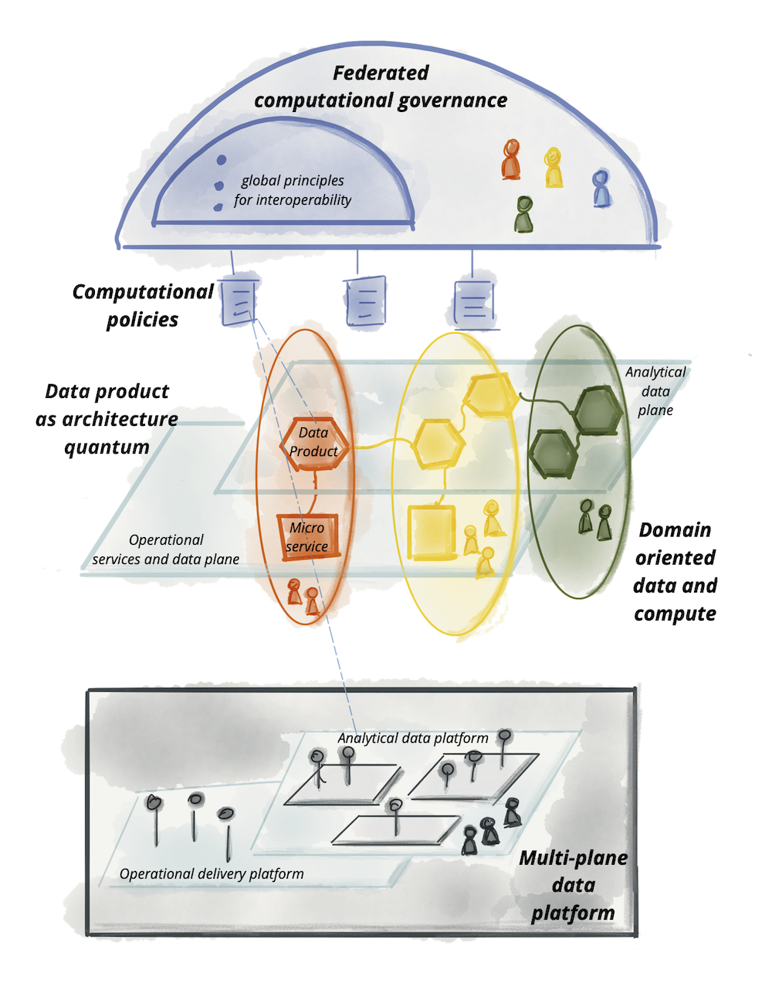

<!--truncate-->

## Introduction

Ekimetrics’ approach to data management starts from prioritized data use-cases, vision for architecture and vision for organization. Although the vision for architecture is tailored to the culture of every customer, it is inspired by the practices we see as inspiring. This article describes one of these inspirational patterns that drive our projects’ data architectures, the Data Mesh.

 

I must introduce Ekimetrics first, we are 320 data scientists, with people and projects in Europe, in the US and in Asia. The goal of Ekimetrics is to become the most trusted partner in data science for business. Every consultant has their preferred topics: Vertical business expertise is the most represented, which is nice because that’s where we derive use-cases from, then statistics / ml / advanced algorithms, then, equally represented, product development and data architecture and engineering. With a couple of colleagues, I lead that data architecture and engineering practice.

 

Data Mesh is a new framework that emerged recently, it is so deep and wide that we believe that it has the potential to influence data management for a whole decade.

 

The foundational papers, by Zhamak Dehghani ([zhamakd](https://twitter.com/zhamakd)) in 2019 are nothing short of fantastic (see articles [How to Move Beyond a Monolithic Data Lake to a Distributed Data Mesh](https://martinfowler.com/articles/data-monolith-to-mesh.html)  and [Data Mesh Principles and Logical Architecture](https://martinfowler.com/articles/data-mesh-principles.html)). They address real-life challenges, they indicate how architectural and organizational aspects can be worked together and they really bring a new energy in data management. So, while I will cherry-pick some of the data mesh ideas that we are implementing today, I strongly encourage you to read both articles thoroughly. Said differently, what I describe below is only what is closest to our mindset and to our maturity on the projects, but there are many more insights in the original papers.

 

 

## What is data mesh?

Data Mesh is a nice way to organize and grow data assets that serve business purposes. Data Mesh takes a limited number of simple ideas for data management, and all the terms used below are described in detail in the two foundational articles:

- Ownership of data should be within the hands of the business teams,

- Data boundaries should be created along business boundaries for data security, data sharing, cost management, etc., these are called Data Domains,

- Sharing datasets inside and possibly outside the company should be simple,

- Focusing on data products is a good approach to create value from data,

- Federated governance is an approach that will scale where other cannot,

- There is a harmonious way for IT, Data and Business teams to collaborate around data,

 

We see Data Mesh as a holistic way to organize data management. And since some cloud vendors have managed services that can help organize data like that, we have been working in that direction successfully with many organizations.

<!-- 

 Logical architecture of data mesh approach
 

   -->

 

## Who is data mesh for?

We did not identify customer profiles where data mesh would not apply, so we believe it is ubiquitous. Medium and large organizations in financial services, retail, utilities, luxury, etc., both the references we have and the references we learn about prove it applies to all kind of companies.

 

Limits are on the capability to challenge existing data assets and existing data culture, and it is not always the right moment to change these. That said, it should be possible to gradually transition from a monolithic data lake to a data mesh, by slowly introducing data domains.

 

And a consultancy firm like Ekimetrics is the right place to be to participate in these changes !

 

 

## What is the relationship with GCP, Synapse or Databricks?

We see the latest generation of platforms is indeed very aligned with what data mesh requires, and GCP BigQuery, Azure Synapse and Databricks are good candidates for Data Mesh deployments.

 

With GCP as an example, it is easy to separate the cost of the storage in one project and the cost of the processing in another project and it’s easy to leverage the data that one part of the company has prepared into a data product that is owned by another part of the company, without copying data, which is a data mesh idea. While this has been in BigQuery for a decade now, the framework now has a name!

 

Such solutions can now be built with GCP, Synapse and Databricks.

 

## Conclusion

If you are interested in building Data Mesh with us, please visit our [website (careers page)](https://ekimetrics.com/careers/) or our [page on Welcome to the Jungle](https://www.welcometothejungle.com/fr/companies/ekimetrics).