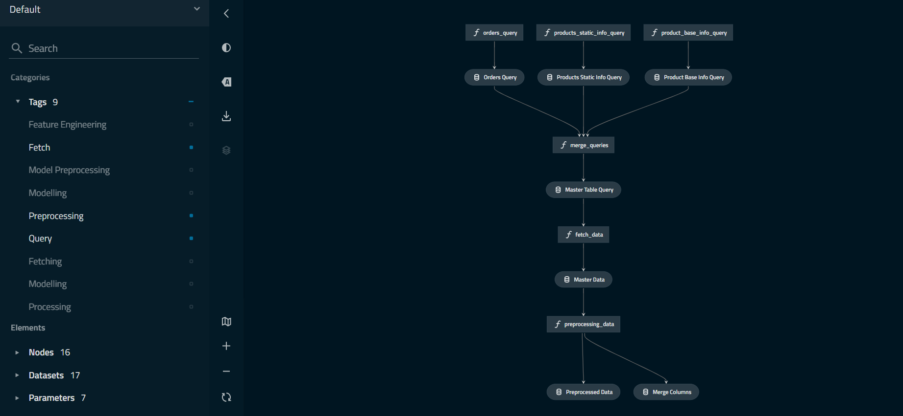
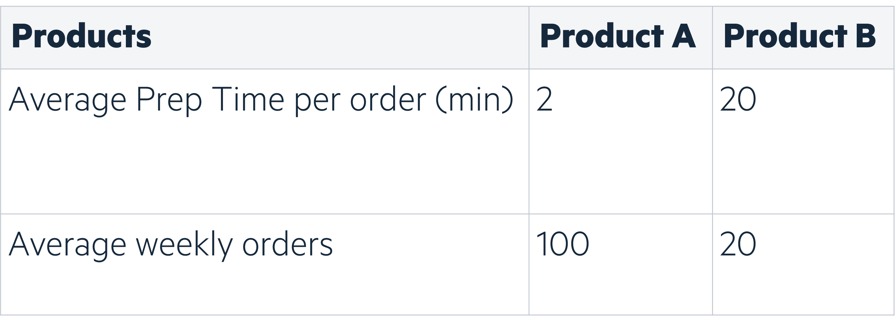
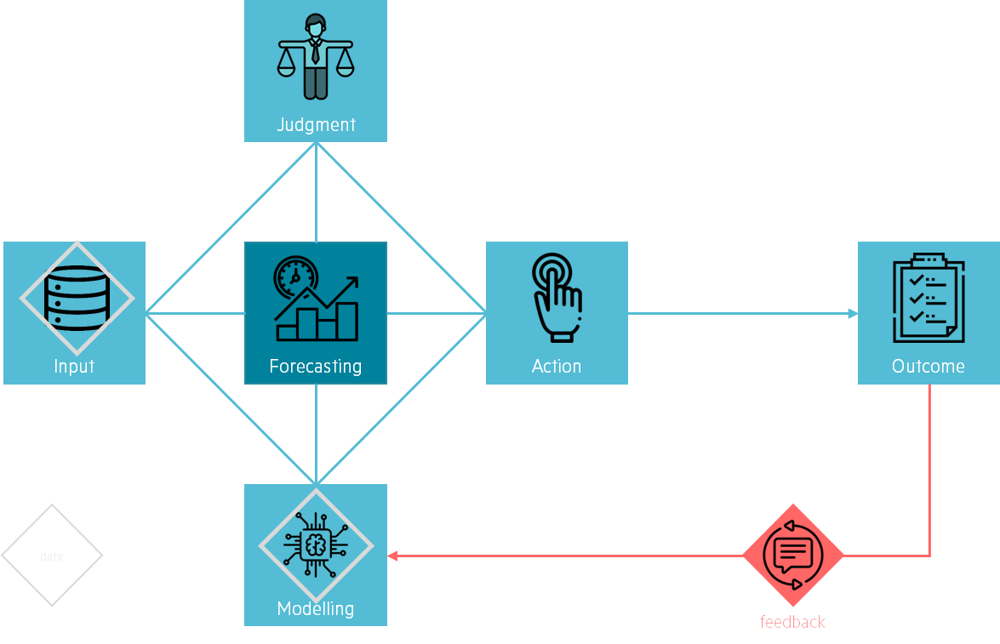

<!--truncate-->

Demand forecasting has become a trendy topic since the COVID pandemic. It has challenged companies' Supply Chain operations and highlighted that most companies could improve their supply chain management. Therefore, generating demand for enhanced forecasting capabilities.

In 2021, we had the opportunity to work with a French pioneer in manufacturing on this topic. We had to industrialize a solution for warehouse demand forecasting for more than 20,000 referenced products to improve overall Supply Chain performance. At the time, the existing solution was deprecated and not handling correctly erratic sales. 

Therefore, we had to create a new, more robust algorithm to help Operational Managers better allocate resources. This latter solution enabled a 60% accuracy improvement and was integrated into Operational Managers processes for decision making.

## An important asset for Supply Chain transformation

Demand forecasting has an impact on different levers:

- *Stock Management*: forecasting can drastically improve Inventory Management. Underproducing means losing revenue opportunities, whilst overproducing means selling your products cheaper or facing additional storage costs. Furthermore, with the return of activity after the first lockdown, suppliers are now bearing the brunt of building sites recovery, causing delays and creating supply instability.

- *Resource allocation*: defining the best number of weekly working hours is not an easy task for operational managers, and anticipation is key to achieving optimal throughput.

- *Product strategy*: demand forecasting also supports better handling of specific trends and product lifecycle. Hence, it helps warehouses anticipate and meet high demands, detect declined products and help marketing teams better understand customers’ needs.

Most importantly, Demand Forecasting has not become a hot topic because of the pandemic. Nevertheless, it brought to light the need of transforming Supply Chains and adapt to unexpected events. Indeed, global warming is increasing the frequency of natural disasters, which will test Supply Chains resilience (*have you heard of our AI4S offer?*).

## How to build Demand Forecasting tool

### What are we trying to solve?

Framing the problem is key to ensuring Data Scientists go in the right direction. When discussing with Supply Chain managers, we understood they wanted to reduce their costs. Thus, improving resource allocation was the best lever to achieve their need. Clearly stating the business need allowed us to understand the problem and impacted the solution implementation.

### Build and assess model

Because of the high number of products and their associated nomenclature, we used a decision tree algorithm (LightGBM). The business required a reliable mid-term forecasting tool within a short time lap and with limited team size, justifying the choice of a well-known and high-performance algorithm. Our solution is a 3-week forecasting tool with daily updates for all referenced products.

The ML pipeline we have built for this project is similar to many existing ones. Therefore, we will focus on how the business problem framed our solution. Still, this project was an opportunity for us to use [Kedro](https://kedro.readthedocs.io/en/stable/index.html), which enabled Data Science teams to set up their ML data pipelines. Kedro had the advantage of visualizing your pipeline and structuring our code to ensure maintainability and reproducibility.

#### Modelling target

We want to optimize warehouse working hours to ensure clients satisfaction by delivering stores on time.

What requires the most operational effort? Our client uses single order picking methods - meaning that pickers work on one order at a time. Thus, it is more time-consuming for a picker to prepare two orders of the same product rather than picking two times the product for the same order. Consequently, we focused on predicting the number of orders rather than the quantity ordered.

NB: depending on how your supply chain operates, the modelling output would differ.

#### Modelling granularity

Our client had a complex product hierarchy, meaning products can be aggregated at different levels. Demand forecasting at a product level gives higher flexibility when used on various business use cases, albeit not being the optimal solution for each one. Therefore, we aggregated ordered products at a higher granularity, to find the best balance between modelling accuracy and business need.

Working at a product level when having more than 20,000 products can be painful:

- it means working with sparse time series (which isn’t trivial when using decision trees)

- manufacturing companies often deal with products turnover (because products are frequently improved), meaning you may lose the thread of which product is getting improved.

Therefore, to optimize resource allocation, it was relevant to build a forecasting tool at a product category level, to combine similar products and avoid dealing with product’s turnover. Analyzing sparsity at different granularities also helped us define the best modelling level.

 Distribution of products' sparsity (e.g. percentage of zeroes in orders). It is clear that most products have more than 90% of zeroes. 
 

  

Important learnings here were:

1. Sparse time series are hard to predict
2. **It is best to go for a solution where the unit (time x product x localization) of forecasting matches the unit of decision making**

 We see how the coronavirus outbreak impacted the activity of our client during the first containment. Predicting this period is pretentious, but how can it help us reduce uncertainty in the future?
 

  

#### Modelling loss function

Modelling errors assess algorithms performance and help choose the model we will industrialize to better impact operations. However, when deploying a solution, we want to measure an error that reflects the current problem. Demand forecasting is not exclusively about being accurate on future demands but also about improving operations. Therefore, customizing errors metrics is a key part of machine learning development, allowing us to define the right balance between product demand (model accuracy) and product average preparation time. (focus on products with high preparation time).

We implemented the Weighted Root Mean Squared Scaled Error, using product average revenues in the last 6 months and product average preparation time.

 Product B weekly preparation time is 400 min vs 200 min for Product A. Thus, higher accuracy on Product B is needed to reflect the operational needs.
 

  

### Evaluate business outcome

Because predictions are not always (never) linked to business outcomes, it is important to differentiate outputs (what are the predictions?) from outcomes (how will it impact the business?). This part was not implemented during the project, but we will briefly explain the methodology to give you a flavour on how it could be done.

Model accuracy is a technical metric, so to quantify our ML model impact on operations we also need to estimate the predicted number of working hours. Comparing the number of predicted working hours with the realized working hours would allow measuring how much the algorithm is reducing costs.

## Create a sustainable solution

### Implement a web app

A core part of our solution was to implement an easy-to-use application for operations managers. It helped them access predictions in real-time, assess model past performance and define the optimal working hours needed. We used Streamlit for its ease of use and ability to create fast and intuitive applications whenever we are short on time. Consequently, we created a usable solution by communicating predictions, demand, and past errors at different granularities.

### Add a feedback loop

Finally, we created a feedback loop to enable the team to maintain, improve and sustain the solution. This concept is well explained in *Prediction Machines: The Simple Economics of Artificial Intelligence*, a book about what AI means from an economist perspective. They introduce a great concept they have named the Anatomy of a Task.

Predictions mainly impact people’s judgement and decisions taken for action. It implies that algorithms are rather helpful for decision-makers than make the actual choice. In our situation, the predictions enable operational managers to take action on the number of pickers needed in the coming weeks. Improving modelling should help these managers be more accurate in their decision process. Giving Data Science teams feedback on how modelling affected outcomes is the added value.

Consequently, we decided to create a clear feedback process with the operational managers. We made sure we could improve our forecasting model in a business manner rather than a statistical one. Our model not being perfect, the operational team’s feedback on how our predictions are impacting their daily work will help us improve our algorithms and create a sustainable solution.

## Concluding and food for thought

New challenges will arise, and data will help supply chains tackle them. Creating a data-driven culture is key to useful and sustainable solutions. Creating state-of-the-art models is great, but a successful data science transformation is about creating impactful projects and delivering value throughout.

Thanks to this project, we learnt that:

- Demand Forecasting is a great entry to improve Supply Chain operations, but the impact will be limited if not embedded in the full Supply Chain environment.

- Demand forecasting is not about predicting the future, but about how data helps improve communication between teams.

