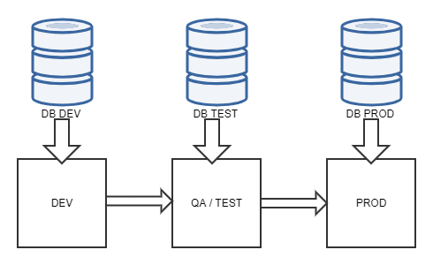
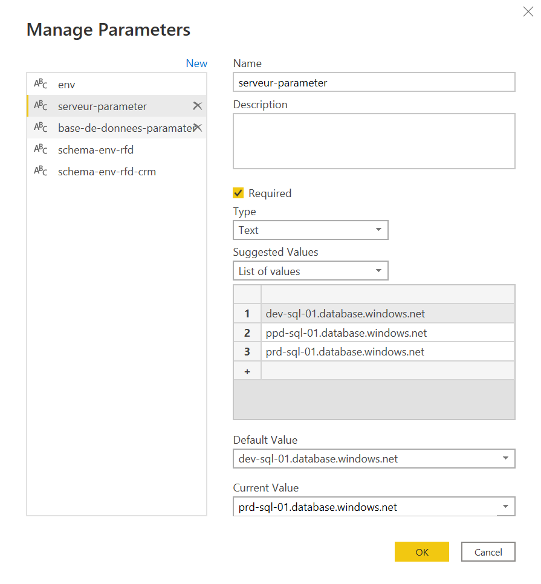
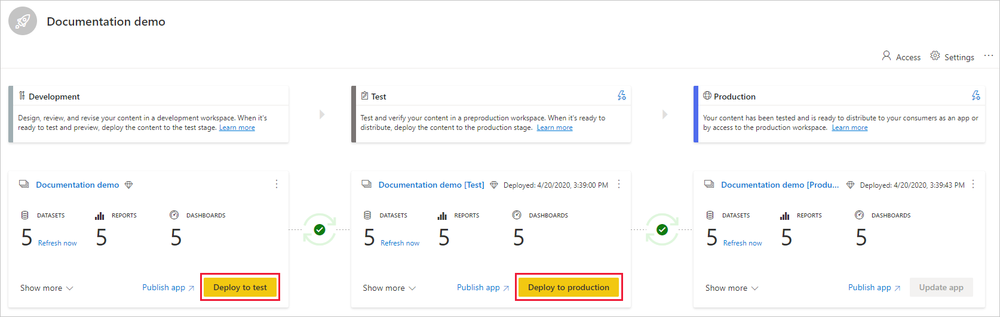
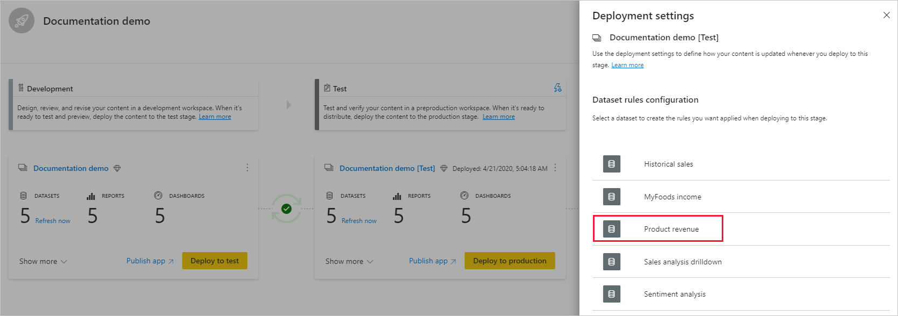

<!--truncate-->

When building a piece of software, you don’t want your users to see every messy part of your application creation process. In order to make sure you control what people see and when they have access to it, development teams use environments to create “stages” of the app which they consider good for releasing.

Each environment has its own unique purpose. There are different naming standards across the industry, although almost every process starts with a 'development' stage and ends with a 'production' stage. Here is a typical set of environments:

- __Development environment__ : where data scientist/data engineers/software engineers actually develop the product. The end user doesn’t have access to this environment which allows developers to try new features freely. 

- __QA environment / Testing environment__ : once a product is sufficiently mature to be tested, it is deployed to a new environment in order for testers to work on a stable version, while allowing developers to continue working in the development environment at the same time. The end user doesn’t have access to this environment

- __Production environment__ : where the product will be deployed after testing and made accessible to the end client. Every features should work when the product reaches this stage.


Furthermore, each environment should have its own database because in the same way that products evolve through development, databases also evolve: tables may be modified, added or deleted. Thus, the actual development process actually looks like this:




Now that you know __why__ you should use different environments when developing products, this article explains __how__ to do that in Power BI! 


:::info  
In Power BI, the product you are developing is a __Report__ and the environments are __Workspaces__
:::

:::note Disclaimer  
- This guide supposes you have already developed a Power BI report using [Power BI Desktop](https://powerbi.microsoft.com/en-us/desktop/) and published this report to a Power BI Workspace, accessible through the [Power BI Web Portal](https://powerbi.microsoft.com/fr-fr/). 
- These assumptions will be stated again at the beginning of each Part, in Step 0 - (Baseline).
:::


## In Power BI Desktop, make your data sources dynamic

### Step 0 - (Baseline) Have a Power BI report connected to hard-coded data sources


As explained in the disclaimer, you should already have a report connected to data sources. Check out this documentation for more information about [data sources](https://docs.microsoft.com/en-us/power-bi/connect-data/desktop-quickstart-connect-to-data) in [Power BI](https://docs.microsoft.com/en-us/power-bi/connect-data/desktop-data-sources). 

A typical report would have several tables in the pane Fields: 


As a little foreshadowing and making sure we are on the same page, open the Power Query editor (by clicking _Home_ (Top Ribbon) → _Transform Data_ → _Transform Data_; then _Advanced Editor_) for one of your tables, and notice that all your data sourcing informations are hard-coded.


In the last picture, we have the following information hard-coded:

- The server is: dev-sql-01.database.windows.net

- The database is: dev-db-01

- The schema is: dev-rfd-crm

This hard-coded information is problematic as when we publish the report from one workspace to the next, the datasource will not change: we will always get our information from “dev”. What we need are parameters that change automatically as we change workspaces.

### Step 1- Creating Parameters inside your reports


In the Power Query Editor, click the _Manage Parameters_ (top ribbon under the Home tab) → _New Parameter_. (Or you can click _Manage Parameters_ and select the _New_ button on the top to create a parameter). You can fill in this form and select OK to create a new parameter.


You should create parameters for every variable that needs to change as you change workspaces. In my case, I needed to create 5 parameters:

- One server parameter

- One database parameter

- Two schema parameters

- One parameter called “env” (with simply the options ‘dev’, ‘ppd’ and ‘prd')





### Step 2- Using the ‘Advanced Editor’ to use the parameters when connecting to your data source

Now that you have created your parameters, use the following syntax to refer to your parameters when connecting to your datasource. 

```
#"ParameterName"
```

Here is what the difference looks like for me. When the data sources variables are hard coded:


When the data sources variables use parameters:


:::note You made it through Part 1!
You now know how to make your data sources dynamic inside your reports, you implemented it and pushed your report to your workspace.  

And know you ask yourself: “_But now, how can I make multiple workspaces and how do I change my report parameters automatically as I publish my report between workspaces?_” 

Check out Part 2 for the answer ! 
:::

## Part 2: In the Power BI Web Portal, create a deployment pipeline and assign parameters to each workspace

In order to use parameters, we will leverage Power BI’s Deployment Pipeline feature. I encourage you to read Microsoft’s official documentation [here](https://docs.microsoft.com/en-us/power-bi/create-reports/deployment-pipelines-get-started) if you encounter any issues when working with Deployment pipelines as it is fairly comprehensive. 

### Step 0 - (Baseline) Have your Power BI report already published to a Workspace

Check out this [video](https://www.youtube.com/watch?v=E0L1uXfefms) if you haven’t already published your report to a Power BI Workspace (don’t hesitate to watch at speed x1.75 :wink: ) .

### Step 1- Creating a Deployment Pipeline from your Workspace


### Step 2- Deploy your report from the Power BI Development Workspace to the Power BI Test Workspace



### Step 3- Modify the Deployment Parameters to use the correct parameters

- In the pipeline stage you want to create a dataset rule for, select __Deployment settings__.

- From the Deployment settings pane, select the dataset you want to create a rule for.

- Select __Parameter rules__, expand the list, and then select __Add rule__.

- Select a parameter from the list of parameters; the current value is shown. Edit the value to the value you want to take effect after each deployment.





:::note  
Notice on the bottom of the last screenshot the following mention: “_Rules will be applied when you deploy to this stage_”.

Thus: once you have set the deployment settings for your report, you need to redeploy your report immediately to this workspace because the rules haven’t been applied yet :sweat_smile: .  
:::

## Conclusion

So this is how to use different environments in Power BI in a nutshell. We went from one workspace with a hard-coded data source, to three separate workspaces where when a report is pushed from one workspace to an other, its data source changes automatically! 

Definitely a lot of moving pieces here, but understanding theses concepts will make your workflow easier and less error-prone in the long-run ! 

I hope this information can help you on your Power BI journey!