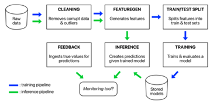

<!--truncate-->

## Data Science 

### AI for executives’ decisions: do we reach a limit? 

The Harvard Business Review published an article where it discusses the use of AI for strategic high-level decisions. While we witness a spread of AI in many operational business areas, it is still not considered as a usable tool for C-executives. The article pictures the current environment to eventually give some key elements to deploy such technologies at this level of management. Deploying ML or even simple data science solutions at this level of responsibility requires us to do a deep check of the possible consequences as a tiny mistake can turn into a major negative outcome. However, while presenting a difficult market to reach for data science, we can also interpret it as an opportunity for data science companies.

[Overcoming the C-Suite’s Distrust of AI (hbr.org)](https://hbr.org/2022/03/overcoming-the-c-suites-distrust-of-ai)

### Guide through time series modeling

Modeling time series variables is a core competence for any Data Scientist. This exhaustive though pedagogic guide helps you better understand some basic principles behind time-series models making it a must-read for juniors willing to strengthen their knowledge or experts who would like to update their knowledge of this field. The article is made by Neptune, a ML library, so it showcases codes with it. It sill gives a good overview and you can reimplement it in your notebook easily with other libraries if you feel uncomfortable with Neptune.

[How to Select a Model For Your Time Series Prediction Task [Guide] - neptune.ai](https://neptune.ai/blog/select-model-for-time-series-prediction-task?utm_source=mlndev&utm_medium=post&utm_campaign=blog-select-model-for-time-series-prediction-task&ref=mlnews)

## Machine Learning

### Shifting to real-time machine learning

While ML algorithms provide powerful insights, they need to become “alive”. This need for real-time is explained by two reasons: a need to deliver results quickly and to learn continuously from new data. In theory it looks easy, but deploying the right architecture is far more complicated and many companies fail at tackling this challenge. This post details the global framework to adopt, key challenges to keep in mind and the requirements to succeed at it. 

[Real-time machine learning: challenges and solutions (huyenchip.com)](https://huyenchip.com/2022/01/02/real-time-machine-learning-challenges-and-solutions.html?ref=mlnews#towards-online-prediction)

### Perceiver IO, the next gen of large and multi -task models has arrived

Transformers were introduced in 2017 and created many derivatives (Longformers, Reformers…) while taking the lead in many applications’ fields (NLP, CV…). The Perceiver is like an Optimus Prime for Transformers (or a Megatron based on which side you are). While being technical, the key takeaway of this paper is the level of generality that we get for every domain: Perceivers perform well on texts, sounds, images on a wide variety of tasks with the same underlying mechanism. In addition, it is able to scale well on high dimensional data as it bypasses the quadratic comuting time required by a Transformer. Even though the widespread of Transformers makes it dominant in the field of ML, Perceivers should be added to your competences portfolio as they might be the future for many tasks.

[Perceiver IO: A general architecture for structure inputs & outputs](https://arxiv.org/pdf/2107.14795.pdf)

## Data Engineering & Architecture

### ML Monitoring: The Promotheus fails, why? (what’s up Ridley?)

This article presents the task of ML monitoring while highlighting key liabilities from Prometheus, an open-source software monitoring tool. The author implements a simple example and details where Prometheus fails particularly (query latency, sliding windows…). This post is one among four dealing with ML monitoring and it is worth the reading if you want to deepen the problem!

[The Modern ML Monitoring Mess: Failure Modes in Extending Prometheus (3/4) | Shreya Shankar (shreya-shankar.com)](https://www.shreya-shankar.com/rethinking-ml-monitoring-3/?ref=mlnews)

## App and Web Development

### JavaScript 2021 recap! 

The 2021 report on the state of JavaScript is now published. From the latest trends, the rising popularity of libraries to most-have tools, this survey gives you a good overview on what is happening in the JavaScript users’ community. One of the many takeaway is the change of perception about the language in itself. “The percentage of people reporting that "JS is moving too fast" is down from 59% to 38%”, showing that JS is now reaching a mature stage. 

[The State of JS 2021: Features](https://2021.stateofjs.com/en-US/features/)

## Special Section: Quantitative Marketing

### TV elasticity: a huge US surveys highlights overinvesting tendencies

From now on, we will have a special section where some hot topics that we like, but cannot be categorized in previous sections, will be put. To start it, we will discuss one of the expertise areas of Ekimetrics: Quantitative Marketing. This article from July 2021 estimates the ROI of TV advertising for 288 consumer goods across a large section of products and sectors in the US. The key takeaway is that TV is an over-invested media with saturated returns. The results from this paper do not align with the existent literature promoting a higher return on investment for TV advertising. The writers precise that traditional media market suffers from agencies issues as many professionals prefer maintaining their statement on the TV effectiveness rather than experimenting new marketing combinations. 

[TV Advertising Effectiveness and Profitability: Generalizable Results From 288 Brands - Shapiro - 2021 - Econometrica - Wiley Online Library](https://onlinelibrary.wiley.com/doi/pdf/10.3982/ECTA17674?casa_token=qFjMlFmqYRgAAAAA:DdA-UGKAxUAm6t8bXRhFcEYO8_M7G7QFEDKh5KQvhx-OBAYJXg90xqgoLiPYaj_TitLTfw9FkjaPjg)

