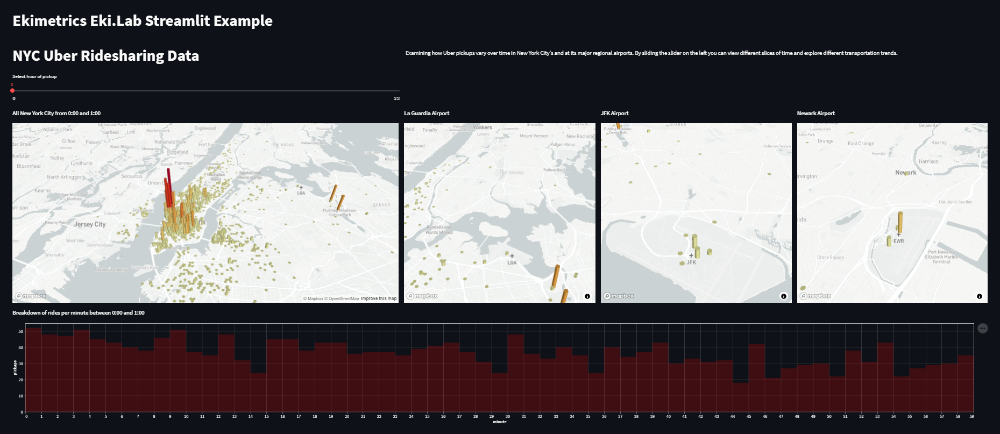

<!--truncate-->


#### TL;DR
Using optimized containers images in your favourite CI/CD pipeline will help you deploy your Data Science app quickly & easily. Check out the replay of our [workshop](https://www.youtube.com/watch?v=C7v5lY2G4Os) at Datacraft and our Mastercraft video about[ container best practices](https://www.youtube.com/watch?v=lkL3Ve7sDfc&t=97s&ab_channel=datacraft).  

## Data Science storytelling with Streamlit
Over the past year, [Streamlit](https://streamlit.io/) has become one of our favourite tools to share data insights through a web app. It's a low-code, data science oriented Python framework that makes your scripts shine in a web app. You can use it to quickly build beautiful visualizations but as data is even better when shared, we would like to help you make it easily accessible to your teammates and colleagues. We will deploy one of the apps in the Streamlit Gallery : [NYC Uber Ridesharing Data](https://github.com/streamlit/demo-uber-nyc-pickups/).


### Running the app
Let's keep it simple and follow these steps to get the code and use venv to create a virtual environment with the following steps:

``` zsh
> git clone git@github.com:streamlit/demo-uber-nyc-pickups.git
> cd demo-uber-nyc-pickups
> py -3.8 -m venv .venv
> .venv/scripts/activate
> pip install -r requirements.txt
```

:::info

We are showcasing [venv](https://docs.python.org/3/library/venv.html) here as it is included in Python itself. We invite you to explore other tools such as [Poetry](https://python-poetry.org/), [pipenv](https://pipenv.pypa.io/en/latest/) or [conda](https://docs.conda.io/en/latest/) depending on your needs and preferences and to always make use of them, especially when collaborating on multiple projects as it will save you from conflicts in your installations.

:::

Now, you should be able to run it locally:
``` 
streamlit run index.py 
```



## Docker, the cloudy whale
 
Docker is one of the most popular containerization tools and is widely used in the context of cloud-based solutions. In this article, we will review how to set up your environment so that you can leverage this tool and level up your development workflow! 

The advantage we will explore in this article is the ability to package your environment with all its dependencies and be 99.99% sure that it will be able to run on your target environment. 

> "If it runs on Docker, it will run everywhere." - one hopeful DataOps

You can safely share your app and be sure that it will run in the same conditions as you worked on and ensure reproducibility of your results. 
### Creating your container
#### Write Dockerfile
The Dockerfile is the recipe of your container. It contains all the instructions to produce & reproduce it identically everywhere it will be run: on another laptop, maybe with a different OS, in the cloud.

Some quick definitions:
* The Docker image is the result of the build of the Dockerfile.
* The Docker container is the result of running the image.
* You can pull and push images to a container registry.
  


#### Choosing the base image
It always starts with a **FROM** instruction that defines what is the base image which can be either:
* a linux-based OS: [ubuntu](https://hub.docker.com/layers/ubuntu/library/ubuntu/latest/images/sha256-31cd7bbfd36421dfd338bceb36d803b3663c1bfa87dfe6af7ba764b5bf34de05?context=explore), [debian](https://hub.docker.com/layers/debian/library/debian/stable/images/sha256-7ec7bef742f919f7cc88f41b598ceeb6b74bcb446e9ce1d2d7c31eb26ccba624?context=explore), [centos](https://hub.docker.com/layers/centos/library/centos/latest/images/sha256-a1801b843b1bfaf77c501e7a6d3f709401a1e0c83863037fa3aab063a7fdb9dc?context=explore)...
* an OS with preinstalled tools: [python-3.8](https://hub.docker.com/layers/python/library/python/3.8/images/sha256-71d10e809efb1733e2743fb7be3417db18070e10a2276e727216f245f7418592?context=explore), [mongo-5.0.7](https://hub.docker.com/layers/mongo/library/mongo/5.0.7/images/sha256-5b5263a7d25d06d5149904eaaacdb359edcd4f26a3d971265f85362dd2406655?context=explore), [node-17.9.0](https://hub.docker.com/layers/node/library/node/17.9.0/images/sha256-c1336669570df673e44d5a2152eb4eff99f4c23bb3d19361c69f861b1bd5ffd3?context=explore)
* a ready-to-use image of a project like the [Docker Tutorial](https://hub.docker.com/r/docker/getting-started).

Choosing your base image is important as it can help you reduce the amount of steps to get ready. If you chose Ubuntu as your base image for a Python project, you will need to write the instructions to install the Python version you want to install and your image will also come with many other packages that are preinstalled in the OS that you may not need for your projet. This is why Python images are available. It comes with Python already installed and some images (like slim images) also remove packages that aren't necessary for Python development. This strongly impacts the size of your image as shown here:


These are official Docker images and depending on which version you pull, you can see the size difference is quite noticeable.
* python 3.8 is almost 1GB.
* python 3.8-slim reduces it by 86%.
* python 3.8-alpine even goes down to <50MB.

Alpine is not recommended for Python development as standard PyPi wheels don't work on Alpine and you have to compile them for every package, which can lead to additional research to properly achieve it. In some instances, compiling can also be very lengthy, like matplotlib that takes more than 25min to build:


Nobody ain't got time for that. 

### Efficient Build Instructions

So let's build our image using a small, ready-to-Python image like ```python:3.8-slim-buster```. We first need to install all our app requirements. So we add our ```requirements.txt``` file and install just like we would do locally.

``` python
# Installing requirements
ADD ./requirements.txt /requirements.txt
RUN pip3 install -r requirements.txt --no-cache-dir
```

Adding the file alone and installing the requirements right after allows you to create a layer that will be cached and you will not have to reuse this step in a future build. It is generally a good practice to use the cache when in development mode as you don't want to spend 10 minutes at every build of your requirements (you know it can take a while). The way Docker cache works is that by default it will reuse the highest unmodified layers.


Here are the commands that generate a layer and which you want to be able to cache and/or gather in a single instruction.

* **FROM** creates a layer from the base image.
* **COPY** adds files from your Docker client’s current directory.
* **RUN** builds your application with make.
* **CMD** specifies what command to run within the container.
  
[Source](https://docs.docker.com/develop/develop-images/dockerfile_best-practices/)

Then, we add the different required files with the *ADD* or *COPY* instructions.

To access the app, we need to open port 8051 on the container. Otherwise, even if the app is running, it will not be accessible from outside the container by a browser. The instruction is:

``` Dockerfile
EXPOSE 8051
```

The last instruction is the *RUN*, which tells Docker which command needs to be run at the start of the container. For us, it means starting the Streamlit app with the command ```streamlit run /index.py```, which in Docker syntax is:

``` Dockerfile
CMD ["streamlit", "run" ,"/index.py"]
```

The final Dockerfile should look like this:
``` Dockerfile title="Dockerfile"
from python:3.8-slim-buster

# Setting Working directory different from root
WORKDIR / 

# Installing requirements
ADD ./requirements.txt /requirements.txt
RUN pip3 install -r requirements.txt --no-cache-dir 

# Opening a port to make the app 
# accessible from outside the container
EXPOSE 8501

# Add the config.toml file
ADD .streamlit/ /.streamlit
ADD /css/ /css/
ADD /utils/ /utils/
ADD /models/ /models/
ADD /images/ /images/ 

ADD /index.py  /index.py 

# Launching the app at the start of the container
CMD ["streamlit", "run" ,"/index.py"]
```
#### Run your Streamlit container
To build your image, just run the command:

``` bash
docker build --tag ekilab-demo-container .
```

Once built, you can run the container with the command:

``` bash  
docker run -dp 8501:8501 ekilab-demo-container
```

Your app should now be running and available at [http://localhost:8501](http://localhost:8501).

#### Live Reload

The issue with the current setup is that if you make a change to your app, you will need to rebuild and re-run the container to see the changes in your browser. We don't want to rebuild the whole environment, and to do that we will use the [volume](https://docs.docker.com/storage/volumes/) feature of Docker, and make it easy with [docker-compose](https://docs.docker.com/compose/).
Docker-compose is a powerful tool to orchestrate multiple containers. But in our case, we will only use it to make our life easier. 
 

```yml title="docker-compose.yml"
version: "3.9"
services:
  ekilab-demo-container:
    env_file:
    - variables.env
    build: .
    ports:
      - "8501:8501"
    volumes:
      - ./:/app
```
Now, you only need to remember one single command: ```docker compose up```. It will build your image, run it with the correct parameters and link it to the correct volume.
## Ship it to the Cloud !

### Log into Azure
Log into your account using the Azure CLI with the ```az login``` command.
Then, we will need a container registry. At Ekimetrics, we usually build our infrastructure using an Infrastructure-As-Code tool such as [Terraform](https://terraform.io). But for the sake of simplicity, let's use simple CLI commands to create our resources.

### Container registry 
The container registry will store the different versions of our container. It can also be used to store other images. You can consider it as your private DockerHub.

``` bash
az acr create --name ekilabhub --resource-group ekimetrics-demo --sku basic --admin-enabled true
```
### Linux App Service Plan
To run our app, we need a Linux-based resource. This is what the App Service Plan offers.
B1 is a free instance that you can use for your small apps and Proof Of Concept.

``` bash
az appservice plan create --resource-group ekimetrics-demo -n ekimetrics-lasp -l westeurope --is-linux --sku B1
```

Now, we have several options :
* Option 1 - build the image locally and push it to the container registry
* Option 2 - build the image directly from the registry
* Option 3 - build and push the image from a CI/CD pipeline

Let's try :
``` bash
# log into the container registry
docker login ekilabhub.azurecr.io --username ekilabhub --password its4secr€t!

# Option 1 - push the new Docker image to the registry
docker push ekilabhub.azurecr.io/ekilab/ekilab-demo-container:latest

# Option 2 - directly build on Azure Container Registry
az acr build --registry ekilabhub --resource-group ekimetrics-demo-rg --image ekilab-demo-container .
```

### The Web App
Finally we can create the web app, based on our previously created App Service Plan, and by retrieving the image from the Container Registry.

``` bash
az webapp create --resource-group ekimetrics-demo-rg -p ekimetrics-lasp -n ekilab-demo-app -i ekilabhub.azurecr.io/ekilab/ekilab-demo-container:latest
```

## Let's Automate!
It's all been fun but we don't want to do this every time we update the code. It would be easy to make a mistake and you may want to collaborate with other Data Scientists on your team and have their updates deployed without your help!


### Bitbucket Pipelines
In this example we are using [Bitbucket Pipelines](https://bitbucket.org/product/fr/features/pipelines) to automate these deployment steps but the logic is very similar in other tools such as [Azure DevOps](https://dev.azure.com/), [Cloud Build](https://cloud.google.com/build), [Gitlab CI/CD](https://docs.gitlab.com/ee/ci/introduction/), [GitHub Actions](https://github.com/features/actions), [Jenkins](https://www.jenkins.io/)...

The common concept behind these tools is to store all the instructions in a YAML file and execute them at every commit to a given branch. In our example, the master branch gathers the code that will be delivered to production.


```yml title="bitbucket-pipelines.yml"
image: python:3.8

pipelines:
  branches:
    master:

      - step:
          name: Build and Push the image         
          services:
          - docker
          script: 
          # build the image
          - docker build -t ekilabhub.azurecr.io/ekilab/ekilab-demo-container:$BITBUCKET_BUILD_NUMBER .

          # authenticate with the Azure Container Registry 
          - docker login ekilabhub.azurecr.io --username ekilabhub --password  $AZURE_CONTAINER_REGISTRY_PASSWORD

          # push the new Docker image to the registry
          - docker push ekilabhub.azurecr.io/ekilab/ekilab-demo-container:$BITBUCKET_BUILD_NUMBER
      

      - step:
          name: Deploying App to Azure
          script:
          # Install the Azure CLI
          - curl -sL https://aka.ms/InstallAzureCLIDeb | bash 
          
          # login with a Service Principal / store the credentials in a secured area
          - az login --service-principal --username $AZURE_APP_ID --password $AZURE_PASSWORD --tenant $AZURE_TENANT_ID 

          # Set the correct image version to the web app 
          - az webapp config container set  --resource-group $AZURE_RESOURCE_GROUP  --name ekilab-demo-app  --docker-custom-image-name ekilab-demo-container:$BITBUCKET_BUILD_NUMBER  --docker-registry-server-url ekilabhub.azurecr.io --docker-registry-server-user ekilabhub --docker-registry-server-password $AZURE_CONTAINER_REGISTRY_PASSWORD

```

## What's next ?
**Congratulations !** You should now be able to automate the deployment of your app to the cloud and focus only on updating its content without worrying about how to publish your updates. Now, you might need to have a scalable app to ensure it can handle high loads of visits. You could require tools like [Kubernetes](https://kubernetes.io), [Docker Swarm](https://docs.docker.com/engine/swarm/).

### Alternatives
We presented one of the workflows we are using at Ekimetrics, but it's not the only one! We also work with GCP, AWS, Alibaba, sometimes on-premise infrastructure that will prevent us from using Docker or Azure for example.
##### Containers
Docker is not the only containerization tool. Here are some alternatives we invite you to check out if Docker doesn't suit you.
* [podman](https://podman.io/)
* [containerd](https://containerd.io/)
* [CoreOS rkt](https://coreos.com/rkt/docs/latest/)
* [Mesos Containerizer](http://mesos.apache.org/documentation/latest/mesos-containerizer/)
* [LXC Linux Containers](https://linuxcontainers.org/)
* [OpenVZ](https://openvz.org/)
  
#### Web App Hosting
There are many others ways to deploy your apps, even free tiers on some providers that can help you get your hands-on with smaller, non-sensitive apps.
* [Streamlit Cloud](https://streamlit.io/cloud) offers a free tier to host one private app and **unlimited** public apps! Deployment is [very simple with GitHub](https://s3-us-west-2.amazonaws.com/assets.streamlit.io/videos/streamlit_sharing_silent.mp4)
* [Azure Container App](https://azure.microsoft.com/en-us/services/container-apps/) a new offer from Microsoft that helps you simply deploy scalable apps.
* [GCP Cloud Run](https://cloud.google.com/run), similar to Azure Apps, is a serverless service that helps easily deploy pre-built containerized apps.
* [Heroku](https://www.heroku.com/) offers a free tier to deploy small apps, Proof Of Concept and also a very simple deployment process.


## Credits
- Cover Photo by <a href="https://unsplash.com/@anniespratt?utm_source=unsplash&utm_medium=referral&utm_content=creditCopyText">Annie Spratt</a> on <a href="https://unsplash.com/s/photos/rainbow-cake?utm_source=unsplash&utm_medium=referral&utm_content=creditCopyText">Unsplash</a>
- [Google's Best Practices for building Containers](https://cloud.google.com/architecture/best-practices-for-building-containers#package_a_single_application_per_container)
- [The best Docker base image for your Python application (August 2021)](https://pythonspeed.com/articles/base-image-python-docker-images/)