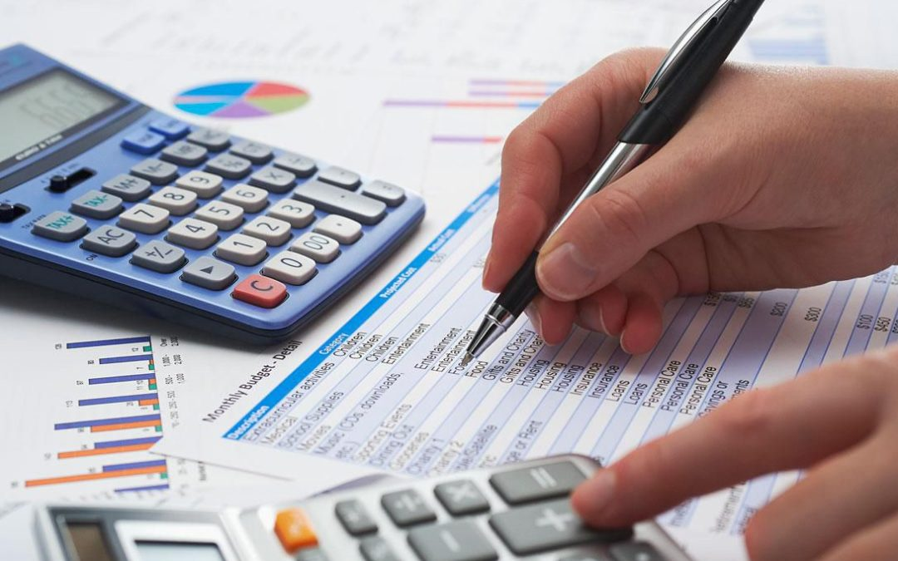
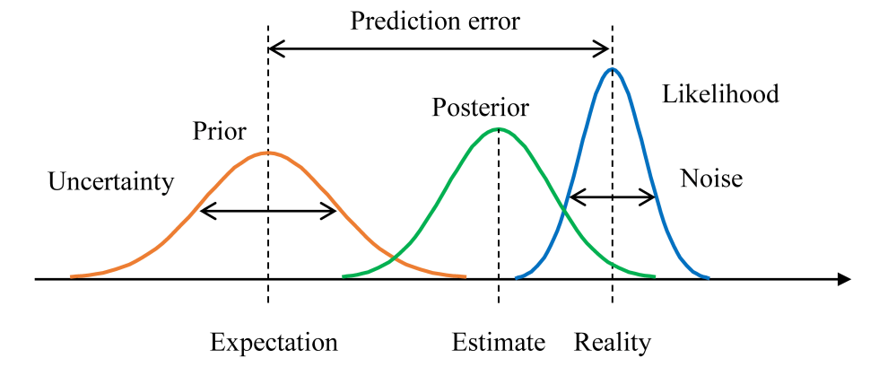

<!-- import useBaseUrl from "@docusaurus/useBaseUrl";

<link rel="stylesheet" href="{useBaseUrl('katex/katex.min.css')}" />
 -->
<!--truncate-->

Whether it’s a tabloid that we quickly grabbed on the way to work, or a magazine with a free toy that we carefully selected for our kids on the way home, print newspapers have always been an integral ingredient in many people’s lives. That feeling of getting to read something fresh off the press. That powdery smell of paper. That daily reading routine to get you awake every morning. All this, however, seems to bring a sense of nostalgia to most people now. 

The newspaper sector is facing a tough time. The rapid and inevitable shift to digital content across domains has significantly reduced the audience size of the traditional press. At the same time, production costs have become more and more expensive. Covid-19 and lockdowns are changing customer behaviour. Altogether, these factors are rendering the industry’s current distribution strategies obsolete. 

More than ever, the industry needs to adapt itself to stay in the game. Many publishers are using data and data science techniques such as demand forecasting, sales prediction, supply optimization, and management dashboard to assist their business decisions.

In this article, we will shed a light on one of those tools: __sales prediction.__

## Mobilis in Mobile (Jules Verne)

When a publisher sells a magazine issue, they need to estimate the total sales for accounting, financial and management purposes. For example, in accounting, the total sales are needed to calculate the estimated revenue and profit, which may later inform decision-makers to adjust the production and distribution of the next issues. Traditionally, the predictions are based on the domain expertise of the people in charge. However, with data becoming more and more available, we can leverage recent advances in machine learning to improve our predictions.

Fig. 1 shows the cumulative sales of a magazine (the data have been anonymized for confidential purposes). The objective is to use the observed data, including the sales curves of all historical issues and the beginning part of the current issue’s curve, to predict the final sales.  

 Fig. 1: Example of magazine sales curves

 

 

As we can see from the figure, there is a high variability in the sales curves. Averaging the sales of historical issues does not provide a good prediction of the current issue. Naively applying a curve fitting model does not seem like a feasible option either. Furthermore, we do not have that much data to train a data-hungry model such as deep neural network. 

## Context and domain expertise are crucial!

In the real world, the sales of a magazine issue depends on several factors, such as the content and the cover of the issue (e.g. the better the content and the covers are, the more sales), the season (e.g. some magazine may sell better in summer), the holidays during the sale period (e.g. people may buy a magazine at the train station when they go on vacations). A good prediction model needs to consider those factors to be able to make precise forecasts.

There are two big questions: *which factors to take into account and how to encode them?*

To answer the first question, we need the insights of domain experts. They have been working in the industry for many years. More than anyone else, they understand their magazines, the market and customer behaviour. That knowledge is invaluable!

For the second question, there is a mathematical framework that allows us to incorporate the prior knowledge (provided by the domain experts and extracted from the data of historical issues) and the observations (the daily reported sales of the current issue) to make a better prediction: __Bayesian inference__. 

## Bayesian inference as a mathematical tool to combine the prior expectation and the new observed evidence
 

 Fig. 2: Bayesian inference

 

 

With the insights provided by domain experts and extracted from the historical data, we can estimate an expectation of the sales of the current issue, prior to its sale period. However, even though the experts have a deep understanding of the product as well as the market, and the historical data may show some characteristics of the sales curves, there is always a grey zone of uncertainty and error. The market evolves; customers change their buying habits; some internal factors were poorly estimated; some external factors were not considered; some unexpected events happen during the sale period, etc. All those factors make the prediction which is purely based on historical experiences less reliable. 

After the sale of the current issue has taken place, we can cumulate the recorded sales to get the beginning part of its sales curve. The more time passes, the more observations are built up. Those observations provide the latest information of the reality and indicate how the real sales actually evolve. However, the observations themselves contain noise. For example, a point of sale may forget to record a sale or record it a few days late, preventing us from using purely the observations to make a precise prediction.

Since we do not have enough subjective data, we can leverage Bayesian inference to fold in the prior knowledge that we have already had (thanks to the inputs of the experts and the historical sales) to draw stronger and sharper predictions. Mathematically, we model the sales by a random variable X that follows a distribution p(X|θ) parameterised by a set of parameters θ: X ~ p(X|θ). The prediction problem is reduced to finding the “correct” θ. Given the observations Xobs (the sales records at the beginning of the sale period of the current issue in our case), frequentist approaches such as the Maximum Likelihood Estimation (MLE) method find an optimal θ that best fits Xobs: θMLE = argmaxθ(p(Xobs|θ)), then plug it in to make the sales prediction: XpredMLE = argmaxX(p(X|θMLE)). However, Xobs usually contain noise,  results in a bad estimation of θ. With Bayesian inference, we can integrate our prior knowledge to get better predictions. Specifically, from the sales of historical issues and the inputs of the experts, we have an idea of how θ should be, modelled as the prior distribution p(θ). Incorporating it with the information provided by the observations Xobs, we get the posterior distribution p(θ|Xobs), which is proportional to the prior p(θ) and the likelihood p(Xobs|θ) (see Fig. 2): 

 p(θ|Xobs) ∝ p(Xobs|θ)*p(θ)

 

 

In Bayesian inference, rather than predicting a single value of the sales, we predict its distribution, called the posterior predictive distribution:

p(XpredBayesian|Xobs) = ∫p(XpredBayesian|θ)*p(θ|Xobs)dθ

 

 

By doing so, we take into account the uncertainty in the prior, as well as the fact that the observations are noisy. 

 A pipeline—implemented in Spark and PyMC3—of the whole process, is depicted in Fig. 3. At the beginning, based on an analysis of the the characteristics of the issues and the market, the historical sales and the inputs of the experts, we estimate the prior p(θ). During the sale period, this estimation will be regularly revised, updated and adjusted in light of the observations Xobs to get the posterior  p(θ|Xobs), which is used to calculate the posterior predictive p(XθpredBayesian|Xobs).   The posterior predictive is then formatted and sent to the decision-makers. 

 Fig. 3: Bayesian sales prediction pipeline

 

 

## Results

Fig. 4 shows an example of the prediction at day 30 of the sale period. We compare the performance of the Bayesian model with that of a frequentist baseline (in this example, is a logarithmic curve fitting model). Both the models are fed with the sales curves of historical issues and the sales records of the first 30 days of the current issue’s sale. Additionally, the Bayesian model has the characteristics of the issues (cover, number of holidays during the sale period, etc.) as well as the opinions of the experts on the similarity between the current issue and some issues in the past. The objective is to predict  the sales of the rest 30 days. 

We can observe that the prediction of the frequentist model is too optimistic because of the (false) positive signals during the first half of the sale period. By contrast, the 95% HDI (highest density interval) of the Bayesian prediction well covers the true sales. This is thanks to the prior insights that the Bayesian model has been given.  

 Fig. 4: Example of the sales predictions of a magazine at day 30

 

 

## Conclusion

We have walked through an example of how to make better predictions of magazine sales. Data and data science have revolutionized many domains. However, to make the most out of digital assets, a hand-in-hand collaboration between data scientists and business experts is much needed. 

Since 2018, Ekimetrics has been accompanying press publishers in their digital transformation journey. Our fully-industrialized AI-powered solution [AthenIA](https://www.uniqueheritage.fr/fr/emmanuel-mounier-president-unique-heritage-media-et-soline-aubry-senior-manager-ekimetrics-au-salon-big-data-ai/) has been providing supply optimization, sales prediction and reporting services that are precise and customized for each client. With the experience of managing more than 90 magazines and 20k active points of sale in France, we are proud to be a reliable partner of press publishers toward sustainable and profitable press. 

