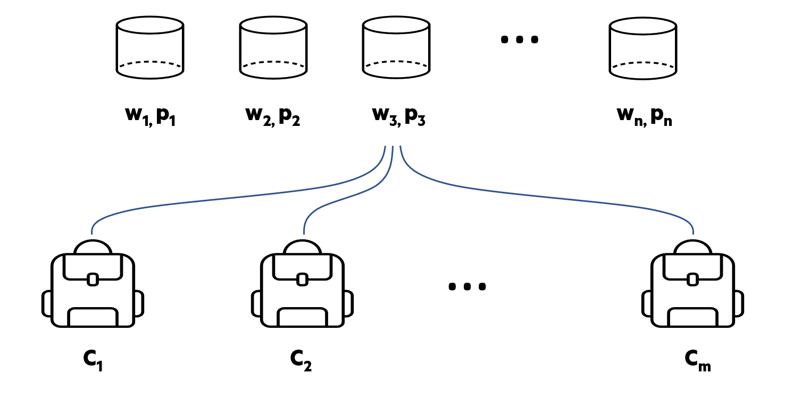

<!-- import useBaseUrl from "@docusaurus/useBaseUrl";

<link rel="stylesheet" href="{useBaseUrl('katex/katex.min.css')}" />
 -->
<!--truncate-->


This article is part of a serie of articles which will introduce several optimization techniques, from traditional (yet very advanced) Mathematical Optimization solvers and associated packages to Deep Reinforcement Learning algorithms, while tackling a very famous Operations Research problem: the multi-knapsack problem.


In this first article is introduced a systematic way to approach and solve optimization problems. Then, the multi-knapsack problem itself is introduced. Then we apply the rules defined before on how to solve optimization problems and obtain the optimal solution to the multi-knapsack problem, formulated as a Mixed Integer problem and using Python-MIP package. Let's now introduce simple steps one can follow to approach optimization problems with optimization solvers.


## Main steps while creating an optimization model to solve a business problem

Once a business problem that could benefit from optimization has been identified, we can define a systematic approach based on 3 steps for solving all kind of optimization problems with optimization solvers. These 3 steps are highlighted in the figure below.


<div align="center"> Fig. 1: Example of magazine sales curves


 </div>
<br/>


In more details, these 3 steps are: 

1. __Create the conceptual mathematical model__ that defines the different variables, constraints, etc. in the business problem. This step consists in writing down on paper the equations that define our problem. 

2. __Translate the conceptual mathematical model into a computer program__. For most programming languages used for optimization, the computer program will largely resembles the mathematical equations one would write on paper.

3. __Solve the mathematical model using a math programming solver__. The solver available for Mathematical Programming (solvers such as GLPK, Gurobi, CPLEX...) relies on very sophisticated algorithms. Important algorithms and ideas used in these solvers are, among many others: simplex method, branch & bound, use of heuristics...


Let's see those 3 steps for the case of the multi-knapsack problem.


## The multi-knapsack problem


The objective here is, given a set of $n$ items and a set of $m$ knapsacks, to __maximize__ the total value of the items put in the knapsacks without exceeding their capacity.



<div align="center"> Fig. 1: Example of magazine sales curves


 </div>
<br/>


The multi-knapsack is an extension of the classical knapsack problem where instead of considering only one knapsack, we consider as many as we want. This allows to easily extend the complexity of this problem.

While the problem is relatively easy to define mathematically and define (#?), it belongs to the class of NP-hard problems. Without going into the details of what defines NP-hard problems, we can easily see the complexity of the knapsack problems when the number of knapsacks and items be increased. Indeed, we have $m^n$ available combinations we would need to test should we want to apply a brute-force for solving this problem. Just with 10 knapsacks and 80 items, there are $10^{80}$ combinations, which is the estimation of the number of atoms in the universe! And 10 knapsacks and 80 items is still quite limited... Let's now try to create the conceptual mathematical model by defining the problem with equations.


### Creating the conceptual mathematical model

A quick translation of the multi-knapsack problem with equation can be written as the following: 


Now that we managed to translate the problem into a set of equations, let's translate this mathematical model so that it is understood by a computer program. Below, we will make use of the Python package Python-MIP which is open-source and provides tools for modeling and solving Mixed-Integer Linear Programming Problems (MIP), relying on fast open source solvers.

### Translating the mathematical model into a computer program with Python-MIP

Let's first import the package used to have access to the MIP solver, here using the python package Python-MIP:

```
from mip import Model, xsum, maximize, BINARY
```

Now, we can translate the mathematical model so that it is understood by Python-MIP. 

```
def mip_solve_knapsack(data):

  model = Model("knapsack")

  x = [[model.add_var(var_type=BINARY) for i in data['items']] for j in data['bins']]

  model.objective = maximize(xsum((xsum(data['values'][i] * x[j][i] for i in data['items']) for j in data['bins'])))

  for j in data['bins']:
      model += xsum(data['weights'][i] * x[j][i] for i in data['items']) <= data['bin_capacities'][j]

  # Each item can be in at most one bin
  for i in data['items']:
      model += xsum(x[j][i] for j in data['bins']) <= 1

  model.optimize()
  
  return(model)
```

Remark how close it is from the original equations! These powerful solvers are very powerful and yet easy to use directly in Python. The code is indeed very close to the original equations. 


### Solving the mathematical model with Python-MIP

Using the function defined in the previous section, we can access to important information regarding the problem, such as the final objective value and the values of $x_{ij}$ telling us what were the best combinations of items inside knapsacks.


### Some Mathematical Optimization packages

In the notebook associated to this article, the package Python-MIP was used. __Python-MIP__ is free, but many other packages exist for solving optimization problems on Python (and other languages of course like Julia). For instance __OR-Tools__ from Google is a well-recognized free solver, with [detailed documentation](https://developers.google.com/optimization/introduction/overview). 

On the other side, __Gurobi__ is a very popular commercial solution for mathematical optimization and its documentation is extremely rich, with quick introductions about [Mathematical Programming](https://www.gurobi.com/resource/modeling-basics/), [Linear Programming](https://www.gurobi.com/resource/mip-basics/) and [Mixed-Integer Programming](https://www.gurobi.com/resource/mip-basics/). Importantly, it has a [large number of modeling examples from all industry fields](https://www.gurobi.com/resource/modeling-examples-using-the-gurobi-python-api-in-jupyter-notebook/) directly available on Google Colab allowing to better grasp notions of Mathematical Modelling and to improve modeling skills to tackle all kind of optimization problems with Python. This resource can be of use even if one doesn't plan to use this commercial software but rather a free package such as OR-Tools.

### Conclusion

In this article was introduced the multi-knapsack problem, an NP-complete problem, very difficult to solve when taking many items and bags. 

The approach to solve the multi-knapsack problem relied on Python-MIP, a free optimization package using powerful MILP solvers to solve very efficiently all kinds of optimization problems.

In the next part of this serie on the multi-knapsack problem, well studied in the field of Operations Research and at the heart of many real optimization problems, we'll highlight how Deep Reinforcement Learning can be used in order to solve combinatorial optimization problems such as this one. Stay tuned!


