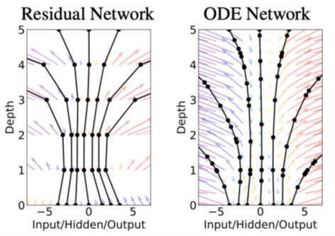
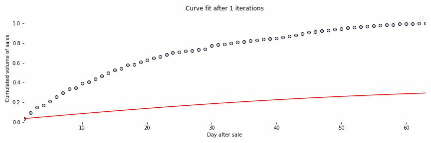

<!-- import useBaseUrl from "@docusaurus/useBaseUrl";

<link rel="stylesheet" href="{useBaseUrl('katex/katex.min.css')}" />
 -->
<!--truncate-->

For decades, time series forecasting has been a popular topic among the scientific community related to data science and artificial intelligence (AI). The reason behind this is that time series, data measured over time, are omnipresent in our day-to-day life and are used in a wide range of industries. For instance, in the retail industry, forecasting is a crucial task to optimize processes and increase efficiency. Many examples can be found in the literature mainly focusing on demand forecasting [1] and sales forecasting [2].

In the past, retail companies have relied on traditional time series forecasting approaches based on statistics. More recently, companies and researchers have grown interest in machine learning and deep learning techniques and algorithms to predict the demand more accurately among other requirements. To evolve as a leader in data science, at Ekimetrics, we keep an eye on the state-of-the-art of time series forecasting and investigate new techniques to eventually, adopt them and improve our solutions in the long run.

This article will focus on our journey with __neural ordinary differential equations__ (neural ODEs) applied to time series forecasting and specifically focused on a client’s use case.

## Selling magazines

Before entering into the subject, if you have not read our article on how we use Bayesian inference to increase our predictions of magazines sales have a look at it [here](https://ekimetrics.github.io/blog/2022/06/14/bayesian_inference/). It is an interesting application of a Bayesian framework to enhance sales prediction for a publisher. Our exploration of neural ODEs focuses on the same use case.

In the world of newspapers and magazines, it is crucial to be able to estimate the final volume of sales for accounting and management purposes. Indeed, publishers adjust their production and distribution of issues based on these forecasts. Conventionally, the projections rely strongly on the domain expertise of the people in charge. But nowadays, with all recent advances in the field of data science and improvements with regards to data availability, publishers can leverage modern forecasting techniques to enhance their predictions.  

The figure below, Fig. 1, represents the cumulative sales of a magazine composed by a set of 14 different issues. Note that the data have been anonymized for confidentiality purposes. Our task is to use the observed data, including the sales curves of all historical issues and the beginning part of the current issue’s curve, to predict the final sales of the current issue.

 Fig. 1: Example of magazine sales curves

 

 

## Introduction to neural ODEs

In this section we provide an overview of what neural ODEs are, and what makes them so special. For the curious readers, complementary resources and blog posts that present this topic in detail, are provided at the end of this article.

To understand neural ODEs, we need to introduce some basic concepts on neural networks (NNs). In essence, NNs are a succession of input, hidden and output layers originally inspired by the human brain. The Multilayer Perceptron (MLP) is one the most popular feedforward neural network due to its simplicity. By means of activation functions and linear combinations of the input data, these networks introduce non linearities and become universal approximators [3]. The equation h(t+1) = f(ht, θt), captures the evolution of the hidden layers of a MLP network with ht referring to the previous layer and θt to a parameter of the network. Without entering too much into the details, these networks are usually trained by minimizing a loss function and backpropagation, propagating the computed error, and updating the weights accordingly.

What we must keep in mind here is that these networks have a limited number of layers and thus, of evaluation points. Could we achieve an infinite number of evaluation points for time continuous applications? The instinctive answer is no since we cannot have an infinite number of layers. However, we are going to review some interesting properties of residual networks (ResNet) that will help us answer this question.

 Fig. 2: ResNet schema [4]

 

 

A ResNet is a neural network that has an architecture based on the pattern pictured in Fig. 2 which entails that the network follows the equation ht+1 = ht + f(ht, θt). This equation might be familiar to some readers with a background in mathematics since it resembles Euler’s method. In short, this method is useful to solve initial value problems, a problem modelled by an ordinary differential equation with an initial condition. Interestingly, a residual network adds hidden states between the input and the output and discretizes the continuous relationship between them, which is similar to Euler's method. In [5] the authors take a different approach by considering the continuous limit of each discrete layer of the network. Thus, instead of having a discrete number of layers, the progression of the hidden states is continuous, obtaining the following equation where h(t) is the value of the hidden state evaluated for some t.

 dℎ(𝑡)/𝑑𝑡 = 𝑓(ℎ(𝑡), 𝜃t, 𝑡)

 

 

Then, in a neural ODE the hidden state dynamic can be parametrized by the equation above where 𝑓(ℎ(𝑡), 𝜃t, 𝑡) is a neural network parametrized by 𝜃t at layer t. Therefore, it is possible to solve this ODE by solving its integral.

 h(t) = ∫ f(h(t), 𝜃t, t)

 

 

By means of a numerical ODE method, it is possible to evaluate the network at any desired depth. And thus, it is possible to approximate functions over these hidden state dynamics by using ODE solvers such as:

 ŷ = h(t1) = ODESolve(h(t0), t0, t1, 𝜃t, f)

 

 

Now, if we go back to our initial question regarding the possibility of having an infinite or quasi-infinite number of evaluation points, we can state that neural ODEs enable us to achieve that Fig. 3 illustrates this idea by comparing the vector field created by a traditional residual network and an ODE network. In essence, an ODE network defines a continuous vector field since this network can be evaluated at any depth. Whereas, on the other hand, the residual network is limited to a discrete number of layers.

 Fig. 3: Comparison between a ResNet and an ODE network vector fields transformations [5]

 

 

Before moving on to the applications of neural ODEs, it is important to note the endeavor of performing backpropagation. Essentially, the more evaluation points you have in your network, the higher the number of intermediate forward passes to store. To overcome this, the authors of the original paper [5] which received the 2018 NeurIPS best paper award, introduced a mathematical trick known as the Adjoint method. We will not get into the details here, but you can dig deeper into this concept by checking the resources we have left at the end of this article.

## Applications of neural ODEs

The main advantage of neural ODEs is the possibility of working with continuous-time series models. In addition, they are generally more memory efficient than other networks such as the MLP and can gain from adaptive computation since modern ODE solvers allow to monitor the level of error and adapt the evaluation strategy. For example, we can reduce accuracy for low power applications.

All these benefits make neural ODEs a great tool for applications dealing with continuous time systems, irregularly sampled data, and scalable and invertible normalizing flows. Besides, neural ODEs are very interesting for time series forecasting too. Basically, they can be used to fit time series and then extrapolate them. Since 2018, we have seen an increasing number of scientific papers presenting neural ODEs to deal with forecasting challenges in the energy [6] and the healthcare [7] sectors.

Coming back to our specific use case, although Fig. 1 introduced at the beginning of this article shows that applying a curve fitting model does not seem like a feasible option, we considered our sales curves as trajectories to employ neural ODE models to fit the curves and forecast the final volumes of sales. We can formulate our problem with the following equation.

 xθt+1 = xθ0 + ∫ b(xθu, u) du

 

 

Where x is an issue belonging to a magazine and b in our case is a neural network, something resembling to b(xθu, u) = MLP(xθu), with its corresponding parameters.

## Results

Initially, we have used a standard neural ODE network to deal with our time series forecasting use case. The figure below, Fig. 4, is an animation representing the fitting of a curve of sales of a specific issue. Bear in mind that the data have been anonymized for privacy purposes.

In this figure, we can observe that the model is able to fit the curve successfully after some iterations. The idea then is to fit the sales curves from all historical issues and the beginning part of the current issue’s curve to predict the final sales by extrapolation. Although we have obtained promising results, they are not good enough. The main reason being that neural ODEs are well suited for deterministic systems and in our case, we deal with a non-deterministic one.

 Fig. 4: Curve fitting of the sales curve of an issue

 

 

Inspired by the ideas presented in [8], instead of a standard neural ODE network like the one introduced before, we have been recently working with stochastic differential neural networks (SDEs). SDEs are a type of continous neural network enabling to introduce a stochastic component and consequently, work with non-deterministic systems and consider external factors. We have obtained promising preliminary results with this procedure, but they require further analysis.

## Conclusion

In this article, we have introduced you into the world of neural ordinary differential equations applied to time series forecasting. We have gone through a short theoretical explanation and presented you our exploration with neural ODEs to strengthen predictions for a magazine publisher.

At Ekimetrics, we accompany a large portfolio of clients across a wide range of industries to help them steer their data opportunity, build capabilities, and deploy actionable DS solutions to power up a sustainable growth. As a leader in the field of data science, we perform recurring technological watches and stay tuned on the state-of-the-art of the fields of machine learning and deep learning. As stated during this article, we are particularly interested in time series and investigate recent advances on the subject to eventually, embrace them and expand our solutions.

## References

[1] J. Wang, G. Q. Liu, and L. Liu, "A selection of advanced technologies for demand forecasting in the retail industry", [A Selection of Advanced Technologies for Demand Forecasting in the Retail Industry | IEEE Conference Publication | IEEE Xplore.](https://ieeexplore.ieee.org/document/8713196)

[2] X. dairu and Z. Shilong, "Machine learning model for sales forecasting by using xgboost", [Machine Learning Model for Sales Forecasting by Using XGBoost | IEEE Conference Publication | IEEE Xplore.](https://ieeexplore.ieee.org/document/9342304)

[3] K. Hornik, M. Stinchcombe, H. White, “Multilayer feedforward networks are universal approximators”, [Multilayer feedforward networks are universal approximators.](https://www.sciencedirect.com/science/article/abs/pii/0893608089900208)

[4] Kaiming He, Xiangyu Zhang, Shaoqing Ren, Jian Sun, "Deep Residual Learning for Image Recognition", [Deep Residual Learning for Image Recognition.](https://arxiv.org/abs/1512.03385)

[5] Ricky T. Q. Chen, Yulia Rubanova, Jesse Bettencourt, David Duvenaud, "Neural ordinary differential equations", [Neural Ordinary Differential Equations.](https://arxiv.org/abs/1806.07366)

[6] X. Xie, A. K. Parlikad, and R. Puri, "A neural ordinary differential equations based approach for demand forecasting within power grid digital twins", [A Neural Ordinary Differential Equations Based Approach for Demand Forecasting within Power Grid Digital Twins | IEEE Conference Publication | IEEE Xplore.](https://ieeexplore.ieee.org/document/8909789)

[7] Intae Moon, Stefan Groha, Alexander Gusev, "SurvLatent ODE : A Neural ODE based time-to-event model with competing risks for longitudinal data improves cancer-associated Deep Vein Thrombosis (DVT) prediction", [2204.09633.pdf (arxiv.org).](https://arxiv.org/pdf/2204.09633.pdf) 

[8] Xuechen Li, Ting-Kam Leonard Wong, Ricky T. Q. Chen, David Duvenaud, "Scalable Gradients for Stochastic Differential Equations", [Scalable Gradients for Stochastic Differential Equations.](https://arxiv.org/abs/2001.01328)

## Additional resources

- In-depth blog post: [Understanding Neural ODE's - Jonty Sinai](https://jontysinai.github.io/jekyll/update/2019/01/18/understanding-neural-odes.html)

- Presentation on mathematics behind neural ODEs: [20200402_Guelph_Neural_ODEs_tutorial.pdf (voletiv.github.io)](https://voletiv.github.io/docs/presentations/20200402_Guelph_Neural_ODEs_tutorial.pdf)

- Interesting blog post: [Neural ODEs: breakdown of another deep learning breakthrough | by Alexandr Honchar | Towards Data Science](https://towardsdatascience.com/neural-odes-breakdown-of-another-deep-learning-breakthrough-3e78c7213795)

- Neural ODEs Github repository: [GitHub - msurtsukov/neural-ode: Jupyter notebook with Pytorch implementation of Neural Ordinary Differential Equations](https://github.com/msurtsukov/neural-ode)

- SDEs Github repository: [GitHub - google-research/torchsde: Differentiable SDE solvers with GPU support and efficient sensitivity analysis.](https://github.com/google-research/torchsde)