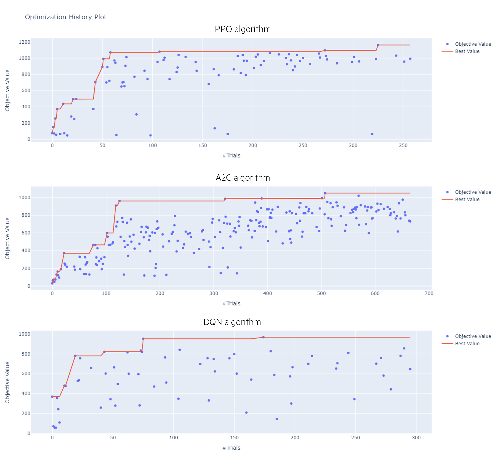

<!-- import useBaseUrl from "@docusaurus/useBaseUrl";

<link rel="stylesheet" href="{useBaseUrl('katex/katex.min.css')}" />
 -->
<!--truncate-->


This article is the third part of the series of articles introducing optimization techniques for solving the classical Operations Research problem of multi-knapsack. The main objective of this article is to demistify the use of Deep Reinforcement Learning for combinatorial optimization, and highlights how in a few lines of code, we can easily play with fine-tuned versions of state-of-the-art Deep Reinforcement Learning algorithms.

First, we will introduce OpenAI Gym, a package which allows the formulation of all kinds of problems for Reinforcement Learning. Then, Stable-Baselines3 will be introduced

## The optimization problem: Multi-knapsack problem

This section is a reminder of what was seen in the first article of this series.

The objective here is, given a set of n items and a set of m knapsacks, to maximize the total value of the items put in the knapsacks without exceeding their capacity.

Below, wi represents the weight of item i, pi the value of item i while cj represents the capacity of knapsack j.


## OpenAI Gym

### Key notions

To create RL environments, the reference is the Python library called Gym. The main goal of Gym is to provide a rich collection of environments for RL experiments using a unified interface. Environments are thus always defined in the same manner, which allows many other solutions (such as Stable Baselines3) to be plugged on top of this. More on this later.

 

At a high level, every environment provides:

- An __action_space__. This is the field of the Space class and provides
a specification for allowed actions in the environment.

- An __observation_space__. This field has the same Space class, but specifies the
observations provided by the environment. The observations correspond to the State $S_t$ mentioned in the Reinforcement Learning framework.

- A reset() method. It resets the environment to its initial state, returning the initial
observation vector.

- A step() method. This method allows the agent to take the action and returns
information about the outcome of the action – the next observation, the local
reward, and the end-of-episode flag.

Other methods are made available in the Env class such as render(), a useful method for visualizing the observations in a human-friendly form. 

### Creating custom RL environments

A squeleton for creating custom environments (environments describing new optimization problems) is provided below.

```
import gym
from gym import spaces

class CustomEnv(gym.Env):
  """Custom Environment that follows gym interface"""
  metadata = {'render.modes': ['human']}

  def __init__(self, arg1, arg2, ...):
    super(CustomEnv, self).__init__()
    # Define action and observation space
    # They must be gym.spaces objects
    # Example when using discrete actions:
    self.action_space = spaces.Discrete(N_DISCRETE_ACTIONS)
    # Example for using image as input:
    self.observation_space = spaces.Box(low=0, high=255,
                                        shape=(HEIGHT, WIDTH, N_CHANNELS), dtype=np.uint8)

  def step(self, action):
    ...
    return observation, reward, done, info
  def reset(self):
    ...
    return observation  # reward, done, info can't be included
  def render(self, mode='human'):
    ...
  def close (self):
    ...
```

### OpenAI Gym environment for multi-knapsack

In order to solve this problem, an environment simulating it was created, in accordance with the environment structure proposed by Open AI Gym. The screenshots below highlight the most important points for this environment.

In the figure below, the __init__ method is used to initialise our problem in the desired configuration. In lines 72 to 79 we call a data file containing, for a given number of bags and objects, the characteristics of the bags and objects (capacity, weight, value). The reward values are initialized to 0, a list telling us for each object if it has already been selected or not is given on line 94 and the ratio values/weight is introduced on line 96, which will allow the reinforcement learning algorithms to learn faster. Finally, the observation and action spaces are defined from lines 100 to 106.


```
    def __init__(self, n_knapsacks=3, n_items=10, max_weight=150, saved_data=False):
        
        done = False

        if saved_data == True:
            data = pd.read_pickle('/dbfs/FileStore/tables/rl/data_for_knapsack_{}_knapsacks___{}_items.pkl'.format(n_knapsacks, n_items))
            self.n_knapsacks = len(data['bins'])
            self.max_weights = np.array(data['bin_capacities'])
            self.current_weights = np.array([0]*self.n_knapsacks, dtype=np.float32)
            self.n_items = data['num_items']
            self.item_numbers = data['items']
            self.item_weights = data['weights']
            self.item_values = data['values']
            

        else:
            # Number of knapsacks
            self.n_knapsacks = n_knapsacks
            self.max_weights = np.array([max_weight]*self.n_knapsacks, dtype=np.float32)
            self.current_weights = np.array([0]*self.n_knapsacks, dtype=np.float32)

            # Number of items
            self.n_items = n_items
            
            # Items creation 
            self.item_numbers = np.arange(self.n_items, dtype=np.float32)
            self.item_weights = np.random.randint(1, 100, size=self.n_items)
            self.item_values = np.random.randint(0, 100, size=self.n_items)
        
        # Transfer to list format due to bug in neural net algos with different format
        self.max_weights_list = np.zeros([self.n_items])
        self.current_weights_list = np.zeros([self.n_items])
        for i in range(0, len(self.max_weights)):
            self.max_weights_list[i] = self.max_weights[i]
        for i in range(0, len(self.current_weights)):
            self.current_weights_list[i] = self.current_weights[i]
        
        self.reward = 0
        self.immediate_reward = 0
        self.total_reward = 0
        
        # Used to check if an item has already been used or not
        self.item_limits = np.ones(self.n_items, dtype=np.float32)
        self.timestep_in_episode = 0
        
        # To speed up learning
        self.ratio_value_weight = data['values'] / data['weights'] 
        
        # Define State for analysis 
        self.state_analysis = [[] for _ in range(self.n_knapsacks)]
        
        self.episode = -1
        self.stop = False
        
        # Define the space of possible value for observation (state) space
        high = np.vstack([[np.inf]*self.n_items, [np.inf]*self.n_items, [np.inf]*self.n_items, [np.inf]*self.n_items, [np.inf]*self.n_items, [np.inf]*self.n_items])
        low = np.vstack([[0]*self.n_items, [0]*self.n_items, [0]*self.n_items, [0]*self.n_items, [0]*self.n_items, [0]*self.n_items])
        # Only discrete values are accessible for the action space
        self.action_space = spaces.Discrete(self.n_items*self.n_knapsacks)
        # Continuous values are available for the observation space.
        self.observation_space = spaces.Box(low=low, high=high, shape=(6, self.n_items,), dtype=np.uint8)
```

<div align="center"> Initialization of the multi-knapsack environment, according to the OpenAI Gym guidelines


 </div>
<br/>

In the figure below, following our agent's choice, we update the environment according to the agent's decision. We start by checking that the object chosen by the agent has not already been added to a bag.

If so, we calculate the sum of the values of the chosen object and the objects already in the case, as well as the sum of the weight of the object and the weight of all other objects.
If the addition of the object chosen by the object causes us to exceed the maximum capacity of the bag, we move on to another episode. If not, we continue the episode.


```
    def step(self, action):
        
        action_list = [0, 0]
        action_list[0] = action % self.n_items # Number of the chosen item
        action_list[1] = action // self.n_items # Number of the chosen knapsack
        action = action_list
        item = action[0]
        knapsack = action[1]
        self.reward = 0

        done = False
        self.timestep_in_episode = self.timestep_in_episode + 1

        # All the items have been chosen --> End of the episode
        ## DEBUG Not true, in case of negative and positive allowed
        if np.sum(self.item_limits)==0:
            done = True
#             print('All items were chosen')

        
        if self.item_weights[item] + self.current_weights[knapsack] <= self.max_weights[knapsack]: # Check that chosen item will fit
            if self.item_limits[item] == 1: # Check that the chosen item has not been taken yet
                self.current_weights[knapsack] += self.item_weights[item]
                self.reward += self.item_values[item]
                self.immediate_reward = self.item_values[item] # DEBUG

                # If all bags are exactly full, the episode is done
                count=0
                for bag in range(0, self.n_knapsacks):
                    if self.current_weights[bag] == self.max_weights[bag]:
                        count+=1
                if count == self.n_knapsacks: # All bags are full
                    done = True
                
                else:
                    done = False # The case where knapsacks exceed maximum weights is covered below
                
            # If the chosen item didn't fit, the episode is stopped. The algo has to choose better items which fit first
            # Masking would help the algorithm learn faster by not allowing the algo to choose solutions leading to this bad outcome
            else:
                done = True
                
        #State Analysis Update 
        if self.item_limits[item] > 0 :
            state_analysis_temp = self.state_analysis.copy()
            state_analysis_temp[knapsack] = state_analysis_temp[knapsack] + [item]
            state_analysis_temp[knapsack].sort()
        else:
            state_analysis_temp = self.state_analysis.copy()
        
        self.state_analysis = state_analysis_temp.copy()
    
                
        self._update_state(item)
        
        self.total_reward = self.reward + self.total_reward
        info = {}
        
        return self.state, self.reward, done, info
```

<div align="center"> The step method updates the environment following the action chosen by the reinforcement learning agent


 </div>
<br/>

Following the execution of the step method, we update the state variables with _update_state using the values calculated in step.

```
       def _update_state(self, item=None):
      
        if item is not None:
            self.item_limits[item] -= 1


        # Transfer to list format due to bug in neural net algos with different format
        self.max_weights_list = np.zeros([self.n_items])
        self.current_weights_list = np.zeros([self.n_items])
        for i in range(0, len(self.max_weights)):
            self.max_weights_list[i] = self.max_weights[i]
        for i in range(0, len(self.current_weights)):
            self.current_weights_list[i] = self.current_weights[i]

        # That is all the info the RL algo will get as input
        self.state = np.vstack([
            self.item_weights,
            self.item_values,
            self.item_limits,
            self.max_weights_list, # There are 0 not used at the end of the list
            self.current_weights_list # There are 0 not used at the end of the list
        ])
        
```

<div align="center"> Update of the state variable via the _update_state method


 </div>
<br/>


## Stable Baselines 3 for fast experimentation with state-of-the-art Reinforcement Learning algorithms

This library provides a consistently growing number of algorithms ready-to-use in a sklearn manner (similar to how sklearn is used for Machine Learning) along with extensive documentation. The community is quite active and the algorithms are really easy to use. Furthermore, other libraries such as Optuna for hyperparameter tuning can easily added as we'll see in the rest of the notebook.

Extensive control on the architecture of the algorithms and the hyperparameters used is allowed by the library.

Stable Baselines 3 is extremely useful as it allows you to write code to train a given algorithm in a few lines of code, algorithm that you can then replace by another state-of-the-art algorithm provided by the library just by importing it in a line of code.

For instance, the following lines are sufficient to train advanced Deep RL algorithms to solve our optimization problem.

```
from stable_baselines3 import PPO, DQN
from stable_baselines3.common.monitor import Monitor 

%run "../../rl/environments/env_knapsack_NaR v4"

n_knapsacks=5
n_items=55

env_name = "Knapsack"
algo_name = "PPO"

# Create log dir
log_dir = "/tmp/gym/{}/".format(env_name+'_'+algo_name)
os.makedirs(log_dir, exist_ok=True)

env = KnapsacksEnv(n_knapsacks=n_knapsacks, n_items=n_items, saved_data=True)
env = Monitor(env, log_dir)

model = DQN(policy="MlpPolicy", env=env, verbose=1) # Creating the PPO agent
model.learn(total_timesteps=150000) # Training the PPO agent (similar to sklearn .fit() function)
```

## Optuna for hyperparameter tuning

The choice of hyperparameters and architecture are crucial in the field of Deep Reinforcement Learning in order to obtain power results. Optuna is a powerful and easy-to-use library allowing to evaluate the performance of models with different combinations of hyperparameters, chosen in an efficient manner by the library. Optuna provides a very extensive libraries with many examples on how to use it on most libraries such as Sklearn, Tensoflow, Keras, PyTorch, Stable Baselines. Many examples of Optuna uses, not restrained to reinforcement learning, are provided [here](https://github.com/optuna/optuna-examples/)... A simple use of the library is highlighted below.

Only a few hyperparameters are considered here. Many others could be considered. A suggestion of pertinent hyperparameters for each Reinforcement Learinng algorithm is provided [here](https://github.com/araffin/rl-baselines-zoo/blob/master/utils/hyperparams_opt.py).

Optuna proposes several advanced features for hyperparameter optimization. In addition to its relatively simplicity to use, below are given some useful additional features:
- __Pruning__: automatically stops unpromising trails at early stages of the training (a.k.a. automated early stopping).
- __Sampling__: several sampling algorithms are provided, each with different strategies for choosing some hyperparameter combinations among the many available combinations

Below is provided code to highlight the use

## Results

In this section, we show the results we obtained by doing a quick tuning of the PPO, A2C and DQN algorithms. For each



<div align="center"> Results from the hyperparameter tuning, comparing 3 state-of-the-art Reinforcement Learning algorithms, PPO (Proximal Policy Optimization), A2C (Advantage Actor Critic) and DQN (Deep Q Network)


 </div>
<br/>

## Notebook for training on another example Traveling Salesman Problem

## Resources

### Stable Baselines 3
- Several examples [available on their website](https://stable-baselines3.readthedocs.io/en/master/guide/examples.html) on using Stable Baselines on multiple environments, exploring most of the functionalities offered by the library
- Creating a custom environment to frame a business optimization problem to Reinforcement Learning: [link](https://stable-baselines3.readthedocs.io/en/master/guide/custom_env.html)
- [RL Baselines3 Zoo](https://github.com/DLR-RM/rl-baselines3-zoo): framework giving access to the best hyperparameters found in the literature and to already pre-trained algorithms for most of the classic Gym environments 

### Choosing a Deep Reinforcement Library
- [Dataiku article](https://blog.dataiku.com/on-choosing-a-deep-reinforcement-learning-library?utm_campaign=Data%20from%20the%20Trenches&utm_content=170196272&utm_medium=social&utm_source=twitter&hss_channel=tw-816825631) comparing several Deep Reinforcement Libraries

### Open AI Gym
- [List of the official Gym environments](https://www.gymlibrary.ml/environments/classic_control/): see the different types of problems (classic control, atari games, robotic)...
- [List of third-party environments](https://www.gymlibrary.ml/environments/third_party_environments/), including environments covering control of microgrids, trading, autonomous driving, online advertising, online recommendation and many other applied problems
- [List of Operational Research problems](https://github.com/hubbs5/or-gym) adapted as Reinforcement Learning algorithms

### Courses and notebooks on Reinforcement Learning
- [Course by David Silver](https://www.deepmind.com/learning-resources/introduction-to-reinforcement-learning-with-david-silver) (Deep Mind): reference course, but quite theoretical and no coding applications directly offered during the course
- Very nice [course offered by Thomas Simonini](https://simoninithomas.github.io/deep-rl-course/) (Hugging Face) with theoretical foundations of Reinforcement Learning and most used algorithms explained, along with practical notebooks where the theory is applied to video game environments