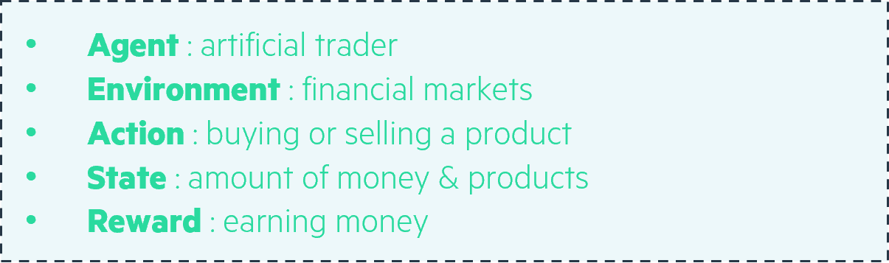
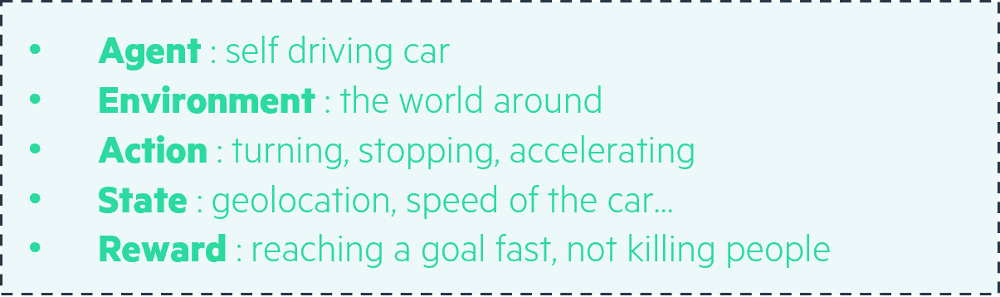
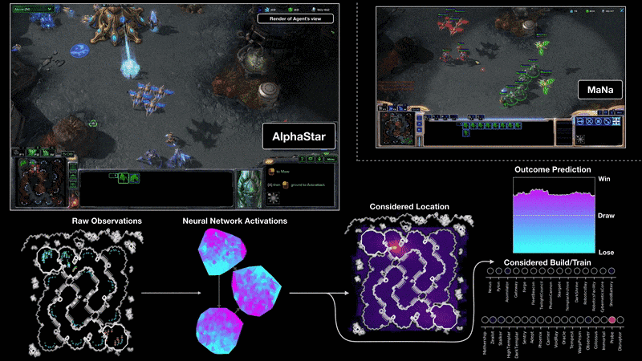
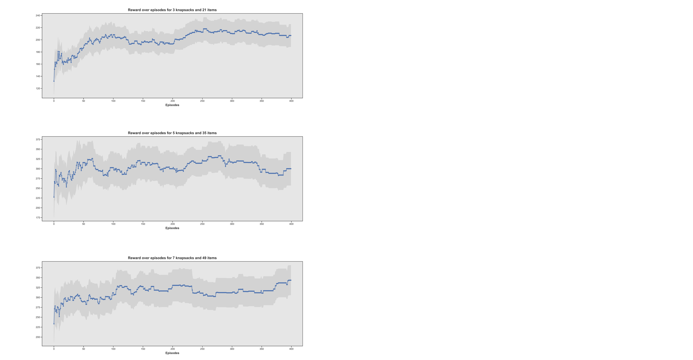

<!-- import useBaseUrl from "@docusaurus/useBaseUrl";

<link rel="stylesheet" href="{useBaseUrl('katex/katex.min.css')}" />
 -->
<!--truncate-->

  

This article is the second part of the serie of articles introducing optimization techniques for solving the classical Operations Research problem of multi-knapsack. The main objective of this article is to introduce Reinforcement Learning as a way to solve combinatorial optimization problems (Reinforcement Learning can actually be used to solve a much wider range of optimization problems). 

First, the classical Reinforcement Learning framework will be briefly presented. Then, we'll see how to frame the multi-knapsack problem for Reinforcement Learning, followed by explanations on why we chose to explore RL for this combinatorial optimization problem. Eventually, the Q-learning (no neural networks) and Policy Gradient (with neural networks) approaches will be introduced and their performance will be evaluated on the knapsack problem.

## Reinforcement Learning for the Knapsack problem 

### What is Reinforcement Learning?

The image below represents the Reinforcement Learning framework. It describes in a simple, yet accurate manner, one of the main ideas behind Reinforcement Learning. 

 

Figure 1 : The Reinforcement Learning framework

 

 

Basically, an agent receives information about the state of an environment he evolves in, information we will call St as it describes the state at timestep t.

Based on this information it receives, the RL agent will choose an action among all the actions it has the right to take at each timestep. We will call such action At, the action at time t, with At belonging to AAt(st) the set of available actions given the state St. When an action is taken, it has an impact on the environment and the agent will receive information about the new state of the environment St+1 but also a reward to incentivize it to take actions which will maximize the total rewards it expects to obtain at the end of an episode.

To apply reinforcement learning to solve business problems, these problems have to be framed as a Markov Decision Process, as seen above. More details can be found on how to rigorously define the Reinforcement Learning in the [excellent course given by David Silver](https://deepmind.com/learning-resources/-introduction-reinforcement-learning-david-silver) (principal research scientist at DeepMind, now owned by Google). You may find his lectures using the previous link, with lectures 1 and 2 being the most pertinent.

Now, to get a better grasp on how to frame a problem for Reinforcement Learning, let’s consider two practical examples.

As a first example, we can consider for instance an AI trader. It could have as available actions the possibility to buy or sell many different products. Its actions have an impact on the environment. First, the money it has and the products it owns will be modified, but also if it buys a massive amount of a certain product, it may have an important impact on the future prices. The final goal for it may be to earn as much money as possible. The description of this first example with the prism of Reinforcement Learning is given in figure 2.

 Figure 2 - Example of an AI trader described through the prism of Reinforcement Learning

 

 

For the case of a self driving car as the AI agent, the actions it can take could be turning, stopping, accelerating. The information it will receive at each timestep are the speed of the car, its geolocation and probably many others. The environment can be the real world around the car, or just a simulator. The final reward will take into account how fast the car has reached a certain goal position, without damaging things or killing people for instance. Should it damage objects, it could for instance receive negative rewards. This information is summarized in the figure 3 below.

 Figure 3 - Example of a self driving car described through the prism of Reinforcement Learning

 

 

Let’s now tackle the case of the multi-knapsack problem!

### How to adapt the multi-Knapsack problem for solving with Reinforcement Learning

The precise definition of the multi-knapsack problem was given in the first part of this serie of articles on the knapsack problem. The figure below describes visually the problem at stake.

 Figure 4 - Description of the multi-knapsack problem

 

 

In our case, one could think about the agent as a person trying to carefully choose among the many clothes he/she possesses before going on a long trip. The environment would be the empty bags and all the clothes to choose from. At each timestep, the person would have the choice to take one element among the available clothes to put it inside one of the bags, the bags needing to be closed (and thus not to full) before leaving for the trip.

The objective is to maximize the value of the clothes chosen for the trip.

And that’s it! Our problem is framed for Reinforcement Learning.

### Why we chose to explore RL for combinatorial optimization problems
The last two decades have known the breakthrough of Deep Learning which is now massively entering all fields of industry whether this is for Computer Vision, disease predictions, product recommendation, Natural Language Processing applications, etc. Massive investments follow in the field of Machine Learning implying a virtuous circle with more results and regular new breakthroughs. Due to these developments, Deep Reinforcement Learning has emerged from the field of Reinforcement Learning which has been studied for a long time and whose goal is to take actions in an environment in order to maximize a defined cumulative reward. This allowed new recent breakthroughs, such as the AI AlphaGo beating professional Go players in 2016 and more recently AlphaStar beating world champions of the video game Starcraft (more on that in [DeepMind blog article](https://deepmind.com/blog/article/alphastar-mastering-real-time-strategy-game-starcraft-ii) or in the [Nature paper](https://www.nature.com/articles/s41586-019-1724-z.epdf?author_access_token=lZH3nqPYtWJXfDA10W0CNNRgN0jAjWel9jnR3ZoTv0PSZcPzJFGNAZhOlk4deBCKzKm70KfinloafEF1bCCXL6IIHHgKaDkaTkBcTEv7aT-wqDoG1VeO9-wO3GEoAMF9bAOt7mJ0RWQnRVMbyfgH9A%3D%3D)). 

 

Figure 5 - Visualization highlighting the trained AlphaStar performing against a top Starcraft human players

 

 

We’ll say a few words about this video game environment, because this achievement is one of the reasons which motivates the use of Reinforcement Learning for solving combinatorial optimization problems. Indeed, with the knapsack problem, we have a discrete action space with a limited number of actions, although the range of available actions can become extremely high by changing the number of available items and knapsacks. 

Having an AI agent beating the world’s best players on this game is an important breakthrough as this video game environment is extremely complex, with only imperfect information being provided to the agent, the action space being enormous with a choice between up to 1026 different actions, and actions being taken almost in real time, every 0.2 seconds. Eventually, planning is made on long term and the agent doesn’t know until the end of the game whether it has won the game or not. While applying Deep Reinforcement Learning to video games allows to test the performance of the algorithms very accurately, allowing to judge how it performs in very different environments, applications also begin to appear in other fields, opening the perspective of using these techniques in different industry fields in the next few years. Deep Reinforcement Learning is definitely a field with high potential, and proofs have been shown that it can solve very well high-dimensional problems. Especially, many articles were published where these algorithms were applied to finance problems.

Now that we have seen the potential of Reinforcement Learning for solving a problem such as the knapsack problem, it is important to keep in mind some important characteristics of Deep Reinforcement Learning approaches: 

- Reinforcement Learning algorithms provides us with approximations of the optimal solutions on the contrary to the solutions that could provide Mixed Integer Programming solvers as the ones introduced in the first part of this series of articles on the knapsack problem;
- For the same reason, Reinforcement Learning algorithms will always provide us solutions to the problem, on the contrary to exact methods which could be unable to provide any solution for very complex problems. For that reason, Reinforcement Learning approaches are for instance being developed in order to solve partial differential equations of very high dimensionality, where usual solvers are unable to provide a solution;
- Reinforcement Learning algorithms perform online optimization, meaning that once they have been trained, they are able to solve very complex problems immediately. They have thus tremendous potential for applications which require to solve problems very frequently in a limited time window, such as in trading or product recommendation for instance.

As seen in the beginning of this section, Reinforcement Learning algorithms have a very high potential for a wide range of business problems. Let's now introduce one of the two Reinforcement Learning approaches used in this notebook. The first one, the Q-learning approach, isn't based on neural networks and doesn't scale well when the dimensionality of the problem increases. We have studied it as it is at the core of other important algorithms such as Deep Q Learning, much more powerful. We will thus concentrate on another promising approach, based on neural networks: the Policy Gradient approach.

## Using Q-Learning and Policy Gradient algorithms on the Knapsack problem

### A simple introduction to Policy Gradient 
The basic principle with a policy gradient approach is that, for each state _s_ received as input, our algorithm will provide us a probability distribution for the actions to take, allowing us to know which object our algorithm recommands us to put first in the knapsack.

In the formula below, 𝜋 gives us this probability. More precisely, 𝜋 gives us the probability to take action _a_ knowing that we currently at state _s_ and given the 𝜃 values of the model parameters, neurons in our case as we use neural networks. 

 

 

 

The use of neural networks isn't mandatory here, but very frequent to obtain good results on complex problems. An example of a representation of a simple neural network is given recalled below.  

 

Figure 6 - Representation of a simple neural network

 

 

Our model architecture can be visualized with this representation. If we dig a bit deeper into the details of our model's architecture, we have:

- As input of the neural network, a description of the current state of the system, that is the value and price information for all items, information about the already selected items and about the current and maximum weight limit inside the different bags;

- Thanks to this information, our model associates to each possible action a probability and we can then select the action that the algorithm recommends us to take first, that is which object should be stored in which knapsack at the current timestep. This is the output of our model;

- The parameters of this model, the neurons, are updated at the end of each episode, an episode beginning when all the objects are available and ending when the bags are sufficiently full (or all objects have been selected...). The update of the parameters (𝜃) of the model taking place at the end of each episode only and not each time an action is proposed by the model, the approach is called a __Monte Carlo approach__;

- The updates of the parameters are made in order to maximize the value of the items stored inside the knapsacks and this approach is based on techniques such as __stochastic gradient descent__.

Now that the Policy Gradient has been described, let's see how our algorithms performed on the knapsack problem!

### Evaluating the performance of the RL algorithms

As summarized in figure 7 below, in order to evaluate the performance of the different algorithms, we chose to apply our two RL algorithms (Q-Learning and Policy Gradient) to 3 different environments of increasing difficulty. We trained each algorithm over 400 episodes.

At the beginning of a new experience, the algorithm had all its coefficients reinitialized. We perform several experiences in order to evaluate how robust is the algorithm. 

 Figure 7 - Description of the evaluation process for the different algorithms

 

 

Eventually, we evaluated the performance of the algorithms with 3 metrics:
- The mean reward shows how good on average the algorithm is;
- The standard deviation highlights the potential lack of robustness of the algorithm;
- The performance ratio RL vs MILP tells us how close is the RL algorithm to the optimal solution provided by a MILP solver (details on how to obtain such a solution are given in the notebook). 

### Results with Q-Learning (no neural networks)

The graphs on the left show that overall our Q-Learning algorithm does indeed improve through training as its reward improved over time. However, we can see that the performance ratio RL vs MILP is very low, meaning that it is far from achieving as good results as what we could get using state-of-the-art MILP solvers.

 Figure 8 - Performance of the Q-Learning algorithm

 

 

Furthermore, environments of increasing complexity / dimensionality will be much more difficult to handle for Q-Learning, as its Q-value matrix has as number of columns the number of items multiplied by the number of knapsacks and as rows all the possible states which could exist. Increasing only slightly the number of knapsacks or bags will thus quickly make the Q-Learning algorithm unusable.

### Results with Policy Gradient (based on neural networks)

The results of the learning process with Policy Gradient are much better than with Q-learning. At the beginning, due to random initialization of the neural network parameters, the actions are taken at random and the reward is very low, but it quickly improves until reaching a local maximum, not global as it is still lower than the solution obtained with the MILP solver. 

The performance ratio is quite good on the three different environments, reaching approximately 80% for each. The algorithm scales well when the complexity increases.

We see however that the standard deviation is quite high, which highlights the fact that each time a model is initialized, it can converge to quite different values. It is thus not extremely robust and several initializations are required before finding good results approaching the optimal solution.

 Figure 9 - Performance of the REINFORCE (policy-gradient approach) algorithm

 

 

On the graph below are highlighted some of the limitations we have witnessed with Policy Gradient algorithms such as the REINFORCE algorithm. We have a lack of robustness, having our algorithm sometimes working very well, sometimes leading to a poorer reward.

 

Figure 10 - REINFORCE algorithm (gradient-policy approach) appears as lacking robustness

 

 
For that reason, the hyperparameter tuning is made more complicated. Indeed comparing one combination of hyperparameters with another one isn't enough to be certain about which combination of hyperparameters is the best, because of the high variability of results for fixed hyperparameters. 

## Opening

For obtaining the results given in this article, we reproduced classical Reinforcement Learning algorithms: the Q-learning algorithm which does not rely on the use of neural networks, and a Policy Gradient algorithm which relies on neural networks. We saw that the latter obtained much better results than the former as we could expect. 

We also built our own multi-knapsack environment file, allowing us to easily modify greatly the complexity of the environment by increasing both the number of available items to put in the knapsacks and the number of knapsacks. 

While creating the environment file, we followed the nomenclature proposed by Open AI Gym for building Reinforcement Learning environments, using the same method names used to define an Open AI Gym environment. The objective was to be able to experiment much more quickly in the future by making use of one of the different Deep Reinforcement Learning libraries (Stable Baselines, TF Agents, Tensorforce…). Indeed, these libraries allow access to many different advanced Deep Reinforcement Learning algorithms already implemented, which can directly be used on new problems if the environment file describing the problem has been built using Open AI Gym nomenclature.

Another article will be written soon to tell more about how to perform hyperparameter tuning for RL using the hyperparameter optimization framework [Optuna](https://optuna.org/) and how to compare and evaluate the efficiency of many different RL algorithms using [Stable Baselines](https://stable-baselines3.readthedocs.io/en/master/)!

