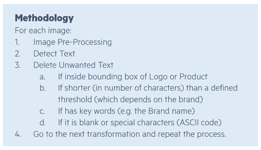

<!-- import useBaseUrl from "@docusaurus/useBaseUrl";

<link rel="stylesheet" href="{useBaseUrl('katex/katex.min.css')}" />
 -->
<!--truncate-->


<div align="justify"> 

This article is **Part III** of a set of five technical articles that accompany a [whitepaper](https://ekimetrics.com/news-and-events/exploring-the-links-between-creative-execution-and-marketing-effectiveness-exclusivepreview) written in collaboration between Meta and Ekimetrics. Object Detection (OD) and Optical Character Recognition (OCR) were used to detect specific features in creative images, such as faces, smiles, text, brand logos, etc. Then, in combination with impressions data, marketing mix models were used to investigate what objects, or combinations of objects in creative images in marketing campaigns, drive higher ROIs.
In this Part III we explore the methodology for using Tesseract to detect text in creative images.
 </div>

## Detecting Text with Tesseract
<div align="justify"> 
Tesseract is an open-source optical character recognition (OCR) Engine that allows for the recognition of text characters within a digital image. It is an open-source resource, originally developed by Hewlett-Packard, and now managed by Google. This package does not have any parameters to optimise, but, as is exposed here, the basic performance of this resource can be improved with a combination of image processing and detected text correction. 

In this work, Tesseract was used to detect text in all images, in a process outlined in Figure 1. Performance of this detection tool was done using Confusion Matrices, to gain insight not only into the Accuracy, but also other metrics such as the True Positive and True Negative Rates.  
 </div>


<div align="center"> Figure 1 - Three stage process by which the basic performance (accuracy) of Tesseract on the original images was improved by up to 28% points.

 </div>
<br/>


<div align="justify"> 
To start with, the functionality was used on the original images to measure a baseline for performance on our sets of images. From this first step, we derived the following learnings:

- For general Text (both non-promotional Text and Promotional Text), the Accuracy is 69%, the True Positive Rate is around 65%, the False Positive Rate is about 35%.
- Tesseract does not recognise symbols such as % (which may indicate promotional text) accurately.
- Tesseract does not perform well on images that have a busy background.
- Tesseract does not recognise slanted Text.

Based on the low total volume of Promotional Text in our dataset, as well as the poor performance of Tesseract to detect Promotional Text, the decision was made to remove Promotional Text as one of the desired objects to study.

Building on those learnings, we implemented a pipeline, outlined in Figure 2, that would help us improve the performance from baseline, by up to 28 percentage points on Accuracy : 
 </div>




<div align="center"> Figure 2 - Pipeline for pre-processing images before Optical Character Recognition Models, and correcting detected text.

 </div>
<br/>


<div align="justify"> 

For Step 1, pre-processing methods included the following, as well as combinations of those (illustrated in Figure 3): **Binary Threshold, Sharpen, Normalisation, Histogram Equalisation, Histogram Adaptive Equalisation**. As can be imagined, a processing method that enhances the performance of the detection method for one image, might decrease it for different images. Therefore, to ensure we obtained the highest accuracy for all images, we applied all pre-processing methods to all images, running Tesseract on each modified image, and keeping track of the text detected in each iteration. 
 </div>


 

<div align="center"> Figure 3 - Effect of various image processing methods on the original. Images for illustrative purposes. Original images sourced from <a href="https://unsplash.com/s/photos/coca-cola" target="_top">unsplash.com</a>


 </div>
<br/>


<div align="justify"> 
In Step 2 we use Tesseract to detect text in the pre-processed images. Step 3 consisted of removing any “incorrect” text, such as text inside the bounding boxes of Logo or Product objects, if the text was shorter than a threshold length (which depended on the brand), if it consisted of keywords, such as the brand name, or if it had ASCII characters. 

With the current methodology (figure 2), the accuracy cannot be improved any further by changing the length of text that is considered to be “true” Text. Furthermore, there is a trade-off between the True Negative Rate and the True Positive Rate, which helped us choose a threshold for the length of string to accept: Since Accuracy does not improve further after length 4, but this value does optimise the other two metrics, 4 characters long is the threshold chosen. 
 </div>


<br/>


<div align="justify"> 
The performance of Tesseract may be improved further by adding another step to the pipeline in figure 2, where the image is rotated several degrees, and after each rotation, text is detected. Due to time constraint issues, and the fact that we had already achieved a significant improvement above baseline and reached an accuracy of high 90s for some of the brands, we did not implement this step.
 </div>


## Code snippets

### Install required libraries

```
# To install tesseract
# !sh apt-get -f -y install tesseract-ocr 
!sudo apt-get install tesseract-ocr -y

# To install pytesseract
!pip3 install pytesseract
```

### Import required libraries

```
import pytesseract
from sklearn.metrics import confusion_matrix, accuracy_score
import cv2
from PIL import Image
```


### Processing images

```
def normalise_img(image):
            
    # normalise original and detect
    norm_img = np.zeros((image.shape[0], image.shape[1]))
    normalised = cv2.normalize(image, norm_img, 0, 255, cv2.NORM_MINMAX)
    normalised = cv2.threshold(normalised, 100, 255, cv2.THRESH_BINARY)[1]
    normalised = cv2.GaussianBlur(normalised, (1, 1), 0)
    
    return normalised
```

```
def threshold_image(image, threshold=200):
    image = cv2.threshold(image, threshold, 255, cv2.THRESH_BINARY)[1]
    return image
```   
    
```    
def remove_noise_and_smooth(image):

    # convert to grayscale
    gray = cv2.cvtColor(image, cv2.COLOR_BGR2GRAY)

    # blur
    blur = cv2.GaussianBlur(gray, (0,0), sigmaX=33, sigmaY=33)

    # divide
    divide = cv2.divide(gray, blur, scale=255)

    # otsu threshold
    thresh = cv2.threshold(divide, 0, 255, cv2.THRESH_BINARY+cv2.THRESH_OTSU)[1]

    # apply morphology
    kernel = cv2.getStructuringElement(cv2.MORPH_RECT, (3,3))
    morph = cv2.morphologyEx(thresh, cv2.MORPH_CLOSE, kernel)

    return morph
```

```
def im_to_gray(image):
    # convert to grayscale 
    gray = cv2.cvtColor(image, cv2.COLOR_BGR2GRAY)
    return gray
 ```

```   
def create_binary(image):
    # create binary - converting a colored image (RGB) into a black and white image - Adaptive binarization works based on the features of neighboring pixels (i.e) local window.
    gray = cv2.cvtColor(image, cv2.COLOR_BGR2GRAY)
    binary = cv2.threshold(image ,130,255,cv2.THRESH_BINARY + cv2.THRESH_OTSU)[1]
    return binary
```

```    
def hist_equaliser(image):
    # Image Contrast and Sharpness: histogram equalization
    gray = cv2.cvtColor(image, cv2.COLOR_BGR2GRAY)
    equalised = cv2.equalizeHist(gray)
    return equalised
 ```

```   
def adaptive_hist_equaliser(image):
    # Image Contrast and Sharpness: adaptive histogram equalization
    gray = cv2.cvtColor(image, cv2.COLOR_BGR2GRAY)
    clahe = cv2.createCLAHE(clipLimit=2.0, tileGridSize=(8, 8))
    equalised = clahe.apply(gray)
    return equalised
   ```

``` 
def invert_image():
    # invert the image - Color Inversion when different regions have different Foreground and Background colors
    inverted = cv2.bitwise_not(image)
    return inverted
  ```

```  
def im_blur(image):
    # Blurring or Smoothing 
    averageBlur = cv2.blur(image, (5, 5))
    return
  ```

```  
def im_gaussianBlur(image):
    # Blurring or Smoothing (Gaussian Blur)
    gaussian = cv2.GaussianBlur(image, (3, 3), 0)
    return
  ```

```  
def im_medianBlur(image):
    # Blurring or Smoothing (Median Blur (good at removing salt and pepper noises))
    medianBlur = cv2.medianBlur(image, 9)
    return
```

```  
def im_bilateralBlur(image):
    # Blurring or Smoothing (Bilateral Filtering)
    bilateral = cv2.bilateralFilter(image, 9, 75, 75)
    return image
 ```

```     
def unsharp_mask(image, kernel_size=(5, 5), sigma=1.0, amount=1.0, threshold=0):
    """Return a sharpened version of the image, using an unsharp mask."""
    blurred = cv2.GaussianBlur(image, kernel_size, sigma)
    sharpened = float(amount + 1) * image - float(amount) * blurred
    sharpened = np.maximum(sharpened, np.zeros(sharpened.shape))
    sharpened = np.minimum(sharpened, 255 * np.ones(sharpened.shape))
    sharpened = sharpened.round().astype(np.uint8)
    if threshold > 0:
        low_contrast_mask = np.absolute(image - blurred) < threshold
        np.copyto(sharpened, image, where=low_contrast_mask)
    return sharpened
 ```

```     
def apply_filter_sharpen(image):
    kernel = np.array([[-1,-1,-1], [-1,9,-1], [-1,-1,-1]])
    image = cv2.filter2D(image, -1, kernel)
    return image
```

```      
def im_erode_dilate(image):
    # apply noise reduction techniques like eroding, dilating
    kernel = np.ones((2,2),np.uint8)
    image = cv2.erode(image, kernel, iterations = 1)
    image = cv2.dilate(image, kernel, iterations = 1)
    return image
 ```

```     
def process_image(image):

    """
    Example of a pipeline to pre-process an image.
    """
    
    # convert to grayscale 
    image = cv2.cvtColor(image, cv2.COLOR_BGR2GRAY)

     # create binary
    image = cv2.threshold(image ,130,255,cv2.THRESH_BINARY + cv2.THRESH_OTSU)[1]

    # invert the image
    image = cv2.bitwise_not(image)

    # apply noise reduction techniques like eroding, dilating
    kernel = np.ones((2,2),np.uint8)
    image = cv2.erode(image, kernel, iterations = 1)
    image = cv2.dilate(image, kernel, iterations = 1)
    
    return image
    
  ```


### Detect text
```
def detect_text(image, brand_name, t, bboxes_file, verbose=True):
    data = pytesseract.image_to_data(image, output_type=pytesseract.Output.DICT)
    bboxes = get_bbox_pts(data)
    data_out, bboxess, tt = check_text_ok(data, brand_name)
    
    return data, bboxes
```


### Manipulate bounding boxes
```
def get_bbox_pts(data):

    """
    From the output of the text detection model, extract the [x1,x2,y1,y2] points.
    """
    data['x1'] = []
    data['x2'] = []
    data['y1'] = []
    data['y2'] = []
    for i, txt in enumerate(data['text']):
    
        # extract the width, height, top and left position for that detected word
        w = data["width"][i]
        h = data["height"][i]
        l = data["left"][i]
        t = data["top"][i]
        
        # define all the surrounding box points
        x1 = l
        x2 = l + w
        y1 = t
        y2 = t + h

        data['x1'].append(x1)
        data['x2'].append(x2)
        data['y1'].append(y1)
        data['y2'].append(y2)
        
    return data
```

```
def transform_bbox(bbox):

    """
    Transform Azure labels of valid set from [x,y,w,h] (in absolute numbers, prev. transformed) to [x,y,x1,y1].
    """
    x = bbox[0]
    y = bbox[1]
    w = bbox[2]
    h = bbox[3]
    
    x1 = x + w
    y1 = y + h

    return [x,y,x1,y1]
```    

## Useful Links
- [Tesseract - Github](https://github.com/tesseract-ocr)
- [Tesseract - User Manual](https://tesseract-ocr.github.io/tessdoc/Home.html)
- [Pytesseract - Pypi](https://pypi.org/project/pytesseract/)

## Next article
In the next article, we outline the MMM process, focusing on how the creative elements are used as variables in a multivariate regression, as well as how the final ROIs were calculated.