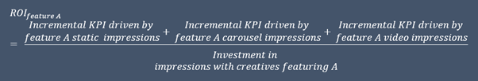

<!-- import useBaseUrl from "@docusaurus/useBaseUrl";

<link rel="stylesheet" href="{useBaseUrl('katex/katex.min.css')}" />
 -->
<!--truncate-->

 

This article is **Part IV** of a set of five technical articles that accompany a [whitepaper](https://ekimetrics.com/news-and-events/exploring-the-links-between-creative-execution-and-marketing-effectiveness-exclusivepreview) written in collaboration between Meta and Ekimetrics. Object Detection (OD) and Optical Character Recognition (OCR) were used to detect specific features in creative images, such as faces, smiles, text, brand logos, etc. Then, in combination with impressions data, marketing mix models were used to investigate what objects, or combinations of objects in creative images in marketing campaigns, drive higher ROIs.
In this Part IV we explore the MMM methodology applied.
 

## Why you should read this

 
This article is mostly directed to marketing measurers. Here you will learn that to improve accuracy in your measurement you must treat creatives differently. We provide the MMM methodlogy to reproduce this type of analysis for your brands.
 
 

## MMM Process

 
An optimizsed two-staged modelling approach was applied to existing MMM models developed by Ekimetrics for a range of brands, products and KPIs. First, the base models were optimizsed, and second, sub-models were created to explain the variation in Meta contribution using the creative features. Bayesian optimization was used in both steps for variable transformation in relation to lag, adstock and saturation.
 

 
&nbsp;

 

 Modelling Workflow
 

 

## MMM Model

 
The MMM models used in this analysis are multilinear regressions accounting for all significant factors driving the KPI (most commonly sales), including digital social. The selection of these models was based on the criteria of model stability (high R2, no autocorrelation, controlled heteroskedasticity) and enough variation in social activity (spend and impressions threshold of 5% per object). Some of the modelling periods were cut to account for sparse data, low correlation between creative impressions and modelled impressions or low variation. Therefore, a trusted relationship from social to the KPI of each MMM was established but could be enhanced by choosing more accurate parameterization of Meta activity through MMM model optimisation. Table 1 details the models included in the study. 
 

 
&nbsp;

 

 Table 1: Specifications of MMM models selected Detail of Models selected
 

 

 
Once the MMM models were optimized, we isolated the impact of Meta on the KPI according to the following relationship:
 
&nbsp;

 

***Meta Contribution to KPI = Coefficient of Meta Variable ×Transformed Meta Variable***

The Meta contribution became the dependent variable of the Sub-Model, along with the constant and residuals. The object detection impressions timeseries served as the explanatory variables. The objective of this was to understand the impact of different feature splits into the overall Meta performance, allowing room for movement through the constant and residuals. 

A sub-modelling approach allowed for the object detection features to have indirect effects on the KPI, through the Meta variable. Bayesian Optimisation Methods were employed to find the optimal transformations for each variable. 

Each Sub-model is a linear regression, testing the impact of the appearance of a feature, or feature group, and its opposite (partner feature) against the total Meta performance. Since the features are not mutually exclusive (between 48%-66% of creatives contained at least two objects), they could not all be tested in the same model. Furthermore, the daily impressions and spend per feature were split according to creative type. That is, the impressions associated with a feature or combination of features, e.g., Person & Product, were split out by static, video and carousel. While it was not in the scope of the study, doing this allowed for further analysis into the impact of features by creative type. 

A sequential approach was followed in which each feature group was tested in isolation. Within each sub-model, the transformations of the features (lag, adstock, and diminishing returns) which maximized R2, and minimized p-values were chosen. The transformations that the Meta features follow were bounded to the following ranges: lag of 0-3, adstock of 0-50, saturation (K; S) of 0.1-0.8; 1-9. 

An example of sub-model is shown below.

 

Where:

  

Same for Video (V) and Carousel (C)

One major challenge with the approach of testing the appearance of a feature or a set of features against its partner feature (e.g., impressions of creatives where a Brand Cue appears vs impressions of creatives where a Brand Cue does not appear), is that the partner feature is indirectly testing the appearance of other features or no features at all.
To manage the risk of results inaccuracy we made sure that:

1. Both the main feature and the partner feature in the sub-models had to be statistically significant at a 10% level. For example, if the appearance of a feature is significant but the partner is not, the results of that regression were not used.
2. The percent of Impressions of the feature being tested had to be > 5%

## ROI Calculations

 
The last step of the analysis centred around calculating ROIs and deriving ROI uplifts for each feature per brand, using the feature contributions from the sub-models and the associated spend. This involved the following steps:

 

1.	Calculate the ROI of each feature (and partnering feature/s) using the contribution and the spend associated with that feature. Because the features were modelled by creative type (static, carousel, and video), the results were weighted by the percent of impressions each type represented over the total of the feature.
 

&nbsp;

2.	Calculate the ROI of the partnering variable (e.g., No Product) 
3.	Calculate the Uplift:

&nbsp;

4.	Index and rank ROI uplifts
    a.	ROI uplifts are standardized, so they are comparable across brands
    b.	They are then ranked so that #1 is the feature with the greatest uplift (maximum difference between the feature appearing and not appearing).

## Results

 

The results can be found in the   [whitepaper.](https://ekimetrics.com/news-and-events/exploring-the-links-between-creative-execution-and-marketing-effectiveness-exclusivepreview)

## Next article
 In the next article, we outline the key learnings from this project, including key paths to success and common pitfalls to avoid.
 