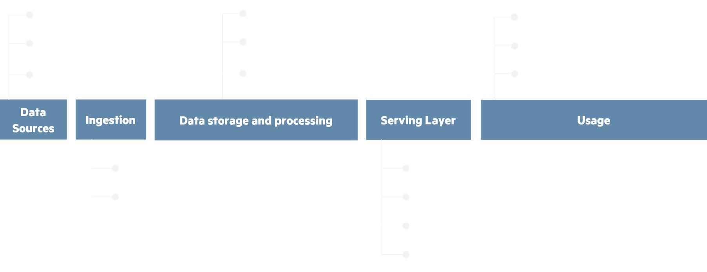

<!-- import useBaseUrl from "@docusaurus/useBaseUrl";

<link rel="stylesheet" href="{useBaseUrl('katex/katex.min.css')}" />
 -->
<!--truncate-->

  

## Article Scope

 

In a previous article - [Building a datalake - Part 1 - Usable, Useful, Used, or how to avoid dataswamp and empty shell traps | Eki.Lab](https://ekimetrics.github.io/blog/2022/02/07/building_datalake_part_1/) - we took a look at the foundation architecture used at Ekimetrics when building a datalake. Its focus was to present design elements to ensure your datalake is useful and usable at its core, as well as best practices to avoid falling into the so-called data swamp and empty shell traps.

For this second part, we’ll go deeper into the journey of data, more specifically expand on storage and compute strategies, and see how the organisation of data and the way it is transformed impact a datalake’s usability & usefuleness.

## Introduction

 

The overview of data’s journey through a datalake or data platform can be broken down into five steps, represented below from left to right.

  
 Data’s journey, from source to usage
  

   

A data platform is highly versatile in providing technical options the five steps above. Getting your data from one step to the next means applying a strategy for how the data input is stored, how it is processed and how the output is exposed for the next step.

These strategies will vary depending on the use case and platform, taking business as well as technical constraints in consideration. Designing your datalake’s strategies to be versatile and homogeneous is essential. It allows your data platform to grow fast, in terms of data content as well as use case possibilities. It also ensures that the datalake is under control with a common way of treating data, where its only varying specifities are the entry point (data sources) and output (serving layer). 

At Ekimetrics, we’ve developed versatile strategies that are applicable to most common use cases, easily reproducible. These strategies help build new capabilities and provide a better understanding of your data platform.

 

## Where designing storage & compute strategies really matters

In most datalake architectures, the data journey’s step where the most impactful design decisions can be made is _Data storage and processing_. The other steps are more straightforward:

- Data sources are usually out of the architect or data engineer’s control, as they often sit outside of the data platform (e.g. on a third-party server).
- Ingestion is a step for which design questions around data validation & organization processes may be worth considering. We’ve talked about these processes in the first part of our “Building a datalake” articles. As for streaming vs batch, it is only dependent on the source: if the source system is streaming data, a resource to ingest that is necessary ; otherwise, recurrent batch ingestion is the go-to.
- Serving will depend on the target use case, so even if there are important design decisions to make, they will only be impactful in the scope of their use case, not for the whole datalake.
- Usage will most of the time be outside the datalake and depend on the use case. The few design decisions that may be necessary here won’t be as impactful to the datalake’s usability and usefulness either.

Of course, this is not to say that designing relevant strategies and architecture for these steps doesn’t matter: they must be tailored to the business case and technical constraints.

On the flipside, the _Data storage and processing_ step is the central piece in the datalake puzzle. It is where storage and compute strategies will be the most impactful. 

What could it look like, then ? Inside this central step, data transits through four zones, from its raw form to fully processed for a particular use case, ready to serve to your businesses. These four zones are detailed below, in between ingestion and serving.

  
 Data storage and processing - storage zones
  

   

These zones can be found under various names: Landing - Bronze - Silver - Gold, or Temp - Raw - Cleaned - Conformed, etc. The intent is the same, where data becomes more and more usable and business use case oriented with each zone.

In between each storage zone, organization and transformation processes are applied to organize and extract insights out of data. This is where our storage and computing strategies come in.

### Going from source to raw: storage strategy

An ingested source will usually be exposed in one of two possible ways: 

- Incremental changes, where only what is new or updated is exposed.
- Full datasets, where all of the up-to-date data (or a new timeframe of data) is exposed.

In these two cases, the ingestion strategy we recommend results in the same outcome. Here the strategy is to historize all received data, adding metadata about its reception date (or validity date) through organization in the storage architecture or in the dataset itself. The RAW storage zone becomes a source of historical knowledge about all data points and their changes through time. Doing this, we’re also able to add a “slowly changing dimension” / “change data capture” aspect to our data, where we can easily find a data point’s values at any moment in time.

  
 Fig. 1: Computing & storage strategies in between Landing and Raw zones
  

   

:::note

There are limitations to historizing all received data, notably storage costs: this is where the data’s lifecycle must be discussed. Keeping all older versions of a single dataset may start to become expensive as the data piles up, outweighing the pros if only the latest values are used.

In this case, a solution can be to keep only the latest values of the source’s data points, or just one version of the source every N periods on top of the latest ones. We can then archive older and unused versions in cold, less costly storage resources. The archived data enters a different lifecycle, where it could be removed at some point in the future if it doesn’t serve any business purpose.

:::

The “historize everything” strategy ensures RAW storage is the most useful it can be: use case agnostic, your businesses can use and explore the data at its full potential. It also helps unify the way RAW storage is meant to be read by your later processes, improving usability while allowing for costs optimization without sacrificing the underlying principle.

### Going from raw input to refined output: computing strategy

By applying this highly inclusive storage strategy for our RAW storage, we’re then able to fetch the necessary data for our business cases, whether it’s using the full history of a source, its latest version or the latest changes only.

The most common computing strategy will be to generate an up-to-date view of the data: at the time of computing, what are the insights’ state ? We’re also able to use older data to track changes and generate insights from these.

Refined data can then be exposed in two ways, acting as the source for another system: 

- Exposing the full dataset, where all data is up-to-date
- Exposing incremental changes, where only what is new or updated is sent to the serving layer

  
 Fig. 2: computing and storage strategies in between Raw, Trusted and Refined zones
  

   

For some use cases, you can generate “frozen in time” views of the data, only updating the current timeframe’s view. For instance, we could update the current month’s exposed insights each day, then stop updating it at the end of the month, writing a new one for the next month’s computed insights, and so on.

:::note

Historizing our transformations and results is useful for debugging and business exploration, but iterations may start to pile up, so defining a lifecycle for Trusted (TRD) and Refined (RFD) storage is important as well: do our technical processes or business use cases need all the iterations history stored in trusted TRD ? Can our business use cases work with a simplification of RFD storage, similar to the Delta historization for RAW zone in figure 1 ? 

:::

You may have noticed, our exposed Refined storage looks strangely similar to what we had in the data source: we’re exposing either the full up-to-date version of our insights, or just updates and new ones, just like our sources. The datalake is now a source for your business’ use cases, so it makes sense that it would be able to expose data in a similar way.

The “up-to-date view” strategy is highly useful for most use cases, and through smart use of historization, still allows for your businesses to get insights on the data’s evolution through time. It also ensures versatility in making your datalake a usable source for other systems when exposing data.

From there, the serving layer can leverage this source in a wide range of solutions, be it a database, reporting, CRM, AI models, etc. 

 

## Conclusion

In essence, storage & compute strategies can be sumarized in three questions: 

- Why are these strategies necessary: to ensure versatility for businesses and technical processes, all the while improving usability.
- How do they do that: by capturing and organizing data’s history efficiently, unifying the way we look at data while allowing for versatility in its usage.
- What they mean: a unified, highly useful and usable storage, and computing that help the datalake become the source for a wide range of systems and use cases.

As data engineers and architects, we’re always looking for ways to improve our data products. In the context of building a datalake, this means finding ways to make data easy to find, explain and extract insights from. The strategies we’ve talked are key answers to these challenges ; as we use them to grow data platforms and apply them to new use cases, these storage & compute strategies have proved themselves to be highly useful for other data challenges, providing new capabilities and solutions for our clients.

