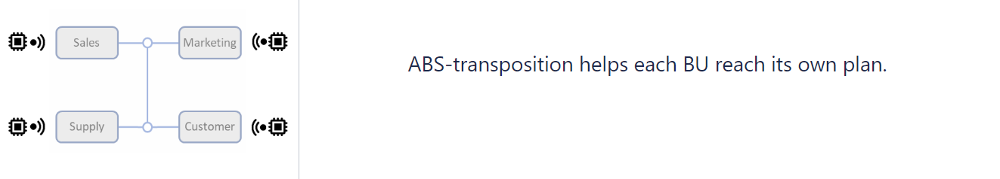
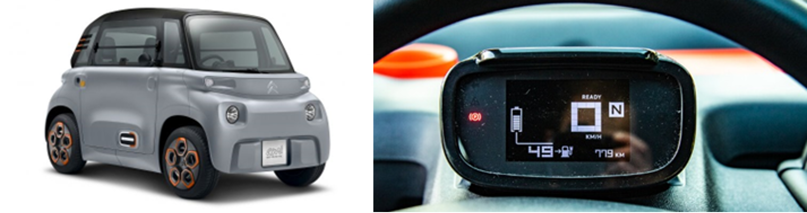

<!-- import useBaseUrl from "@docusaurus/useBaseUrl";

<link rel="stylesheet" href="{useBaseUrl('katex/katex.min.css')}" />
 -->
<!--truncate-->

## Introduction

 

Data Engineers at Ekimetrics use Spark to execute data ingestion and data preparation tasks, and Spark can process incoming data in batches as well as data in real-time streams. We also work on GCP and Cloud Dataflow, where Apache Beam provides the same flexibility to process streams as well as batches.

But IT teams ans Business teams are so used to batch analytics that it is hard to convey the value of real-time or up-to-date analytics, even though we now have platforms to handle the sources that can stream data. And with the emergence of micro-services, we also have more and more of these sources.

Based on current market evolutions and on our previsions:

- **Companies should create real-time views** of customers, products, suppliers and production plans on an easy-to-grow platform with the adequate governance,
- **Companies should assemble a real-time analytical view of their whole business** to be able to steer it appropriately,

Because this article is about real-time analytics, it starts with the definition of these terms. We use the example of driving a car as parallel for running a company. We all drive cars, we all see cars change, for example from “manual gearbox” to “automatic gearbox” to “no more gearbox”, and we all have a lot of knowledge about cars. Car technology will be used in this article to illustrate the following questions:

- What is the minimal data available to drive a car and what is the benefit of additional data ?
- How to transpose for example the ABS of a car into a platform to help drive a company ?

 

Below are the steps in this article, as they will be presented and explained: 

 

## Definitions

Let’s first introduce definitions of the two topics of this article (independent of the car illustration):

**Analytics**, as separated from **Operational**, is related to **data**:

- **Operational data** is internal data from the business operations,
- **Analytical data** is operational data that is aligned, consolidated, reprocessed and possibly augmented with external data.

  

**Real-time**, as separated from **Batch**, is related to **processing**:

- **Batch processing** is about processing data on a schedule, between every few hours and every month. Users gets an image that is always a bit old, but for many businesses and operations this is seen as acceptable,

- **Real-time processing** is about reflecting the current status of the operations. The latency depends of the source rather than the processing, it is between a few seconds and a few hours depending on the capability of the source system.

When analyzing a business process, it is always a very interesting exercise to diagnose if a certain metric is operational or analytic. And if the data is analytic, the next question is to wonder if the business could benefit from having that metric in real-time.

## Car-wise, let’s start in the 1950s

I work in Paris, and tourists love to tour the city in Citroën 2CV, a French car that was produced between the 50s and the 80s, like the picture below from one of the numerous companies renting these cars.

No electronics in there, this is pure mechanics and a few electrical wires, an ideal starting point for our journey !

What data do you have to drive a Citroën 2CV? Speed, battery level, gas levels, total mileage, that’s it.
And the engine is so noisy that there is no need for an engine RPM meter !

According to the definitions above, the data is the direct readings of the mechanical operations of the car, for example from the speed of the wheels, so this is operational data.

No further processing here, so no analytical data at all.

 

Finally, let’s introduce this diagram of the car with no Analytics at all:

 

### How does driving a 2CV transpose to driving a company?

When we transpose to driving a company, operational data is the data that resides in the operational systems, such a CRMs and ERPs. It contains all the referential and transactional information necessary to run the company, from HR to Sales to Finance. All reports and dashboards that are directly embedded in these applications or close to them are also considered operational data.

Since there is enough information to run the business, we can jump to our first conclusion:

 

## Born in the 80s and mandatory in EU in 2003, the ABS

The ABS, or Anti-lock Braking System, measures the speed of each wheel and reduces the pressure on the brakes to avoid the wheel locking up when losing grip.

To brake efficiently, it applies “threshold braking” and “cadence braking” that are techniques of the most skillful drivers, taken here at a much faster rate than what these drivers can perform.

 

### What is real-time analytical processing of operational data in a business?

If we change the wheels of the cars by the BUs of a company, we get to a functional diagrams like the one below, where each BU includes efficient controls applied in real-time on the data from the operations:

 

Data Science is applied locally on the operational data, for purposes like segmentation, scoring, pricing and other applications of Machine Learning. The purpose here is to get value from investments in each BU, **but there are no insights to make the whole bigger than the sum of its parts.** It is like in the example of the ABS, we want to replicate the techniques of the best players, locally in each domain.

It is important to note that local AI initiatives do not require a dedicated platform for analytical data and that improving the operations locally can be achieved in the operational applications. For example, SAP and Salesforce include more and more predictive features. And since these platform work on up-to-date information, **embedding Machine Learning in operational systems is the closest to what ABS is in a car.**

## In 2014, the ESP becomes mandatory in all European cars

The ESP (Electronic Stability Program) is an anti-skid system. It leverages four wheel-speed sensors, the steering angle sensor and an inertial measurement unit to act on the break pressure of each wheel and engine acceleration command. Depending on the situation, it can reduce the speed of the engine and brake all wheels or activate the brake on only one wheel only to alter the heading of the car.

The diagram changes, since all insights are now consolidated before they are processed:

 

### What does an ESP looks like in a company?

In your company, we are leaving the territory of ERPs, because even SAP does not cover all aspects that must be monitored and given sense together.  
In addition, ERPs have many limitations regarding Advanced Analytics:

- ERPs are complex to query and it may impact production,
- ERPs don’t need and don’t keep history,
- ERPs don’t care about weak signals and don’t make sense of unstructured data,
- ERPs are not designed to consolidate data with other ERPs or other operational platforms,
- And lastly, when a change is interesting, it takes ages to impact ERPs.

 

Because consolidation cannot occur in the operational systems, **we introduce an additional data storage and processing layer called the analytical data plane** . We assemble data platforms that can host data assets of different Business Units, with some local autonomy and some global governance, so insights can be derived from many elements. This is where the Lakehouse and the Federated Governance patterns apply. 

This is also where we believe we must now work in real-time, like in the ESP in the car analogy. The driving force is that **the analytical plane should be up-to-date with the data that is shared from the operational systems**, it should not add an hourly or a daily delay between the times it processes data.

Most use-cases that we currently in batch will benefit from being executed with up-to-date data from the operations. Let’s take a two examples:

- The purpose of a Customer 360° use-case is to consolidate Transaction history, Social media presence, Customer support interactions, Segmentation history, Sensitivity to the promotions and prices, etc. into a single view of the customers. 

  Having that information always up-to-date could let you, for example:
  * Target, or restrain from targeting, in certain situations,
  * Send messages at the right moment,
  * Propose Next Best Action when the customer calls,
  * etc.

- Expanding on that up-to-date Customer 360 and adding up-to-date supply-chain information and up-to-date suppliers information will enable new use-cases to better serve the customers needs.

In addition to use cases, and if we consider a company as a complex system, **it is important to monitor all its moving parts together to better understand its reactions.** And when there are days or weeks between an action and the monitoring of its effect, it is more difficult to steer.

For these reasons, we want to propose real-time as the new standard, today: 

 

## Mandatory in 2022, AEB is the current state-of-the-art

In addition to sensors that focus on the inside of the car, AEB (Automatic Emergency Braking) uses sensors that look outside of the car, like Front radar sensor, multi-purpose dashboard camera(s) and corner radar sensors. All these components embark object detection and tracking with deep neural networks and share their insights to a central unit that can act on the car brakes. 

This is the most complex system that we study here and we can anticipate that the next step will be cars exchanging information together about conditions of the road. In the projects we currently participate in on connected cars, no data is currently shared between cars.

So our last diagram is the most complete:

 

### Do you have AEB-like system in your company?

AEB is about adding data sources to better anticipate market conditions, to better understand your customers, to better interact with your suppliers and your distributors, to gather data about your competitors, etc.

And by now you have understood that in the context of the AEB, the purpose is to consolidate these insights in real-time and leverage these to take the best decisions.

While buying or trading data is good, sharing data on platforms like Snowflake, BigQuery or Databricks Delta Sharing is better, because it is maintained in real-time by the other parties and you don’t have to replicate it in batches.

 

## Conclusion

While the focus of this article has been on the value of up-to-date analytics, we’ll close this article with a preview of a next topic : the costs of the streaming datasets compared to traditional batch approaches.

Ekimetrics is investing a lot in making sure we manage the environmental aspects of the solutions we build, so this last point is critical! We currently work with Spark streams that have the .trigger(availableNow=True) option so they only process the newly arrived rows when the pipelines are executed every hour for example.  
So that it remains cost- and emission- efficient.

 
And as a closing remark, as I was looking for the dashboards of the Renault 4L, Peugeot 205 and other 2CV, I found that in the latest small car from Citroën, called the AMI, it is nearly as frugal as its predecessors ! 

And it weighs only 500kg, which is frugal too.

