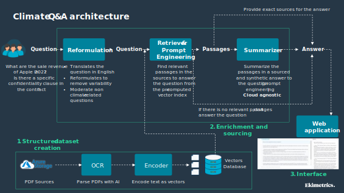
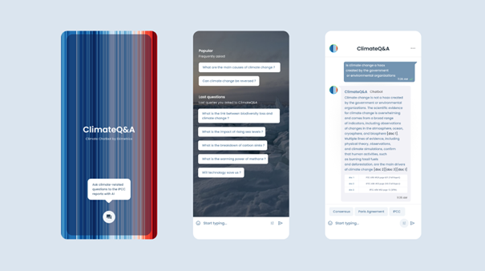

<!-- import useBaseUrl from "@docusaurus/useBaseUrl";

<link rel="stylesheet" href="{useBaseUrl('katex/katex.min.css')}" />
 -->
<!--truncate-->

  

 

ClimateQ&A is an AI-powered tool that has been specifically developed to help address the challenges associated with understanding and accessing climate change and biodiversity-related literature. The tool aims to democratize access to the scientific literature of climate change and biodiversity, making it easier for researchers, policymakers, and the public to understand and use this critically important information. This article aims to provide users with information regarding the tool, encompassing its contextual framework, technical operation, as well as its inherent limitations.

Disclaimer : for simplicity, we use “climate” as an umbrella term to designate the phenomena of climate change & biodiversity loss. We are currently thinking about more inclusive names.

For a shorter version of this article, please refer to the [conference ClimateQ&A](https://www.youtube.com/watch?v=DwGm0-53iTQ) by Datacraft and Ekimetrics (only in French). 

Click [here](https://www.climateqa.com/) to access the latest version of the tool, now featuring a kids version.

Click [here](https://fr.linkedin.com/posts/th%C3%A9o-alves-da-costa-09397a82_bilan-2-mois-apr%C3%A8s-le-lancement-de-la-activity-7067146668965519361-AUgW) to access a preliminary analysis of the questions asked to the tool.

## I. Introduction: Why ClimateQ&A

 

Against the backdrop of rising global temperatures and the alarming decline of biodiversity, human societies are not catching up on action. Across geographies, widespread climate literacy remains low, which limits and hinders actions to mitigate and adapt to these pressing challenges. This lack of actionable knowledge is due to several factors, including the increasing demand for climate-related information from all groups of society (including the public sector, students, corporates, policymakers, investors, and local communities, among many others), and rising fake news & climate skepticism. Another important issue is that scientific reports of IPCC and IPBES present some inherent limitations regarding accessibility, language, and understanding. Indeed, at a Side Event at COP21 in Paris, in the lead-up to the Oslo Expert Meeting on Communication in 2016, IPCC Chair Hoseung Lee asked :

> “*What use are the IPCC reports if many of the intended users cannot understand them, do not know where to find them, or cannot use them in their work?”*

In this part we explore these issues, which are vital to inform the development of our tool ClimateQ&A.

 

### A.	Climate knowledge and literacy are still lagging

 
In order to act against climate change, citizens need to be climate-literate:

> *"Climate literacy is a subset of the broader science literacy that refers to the knowledge, skills, and attitudes that individuals, communities, and societies need to understand and address climate change effectively. It draws on climate science, the quantitative and geospatial technologies by which it is understood, and the interconnectedness of human beings with their environment . Literacy on climate change is vital for informed decision-making, emissions reduction, and community resilience."* [^1]

Despite the importance of climate literacy, studies find that in advanced economies, ~70% of people are aware of climate change and its consequences, but only 20% are climate-literate[^2] [^3].
Additionally, climate awareness is unequally distributed: in 2015, 40% of adults in the world had never heard of climate change – roughly 2Bn people. In some developing countries like Egypt, Bangladesh, or India, this represents more than 65% of the adult population[^4].

 

### B.	The demand for climate-related information is increasing

 

Driven by the global and far-reaching implications of climate change - across geographies, populations, sectors of activity, organizations- the demand for accurate, timely, and relevant climate information is increasing. Businesses and investors seek to understand their exposure to climate and biodiversity-related risks. Educators need to train a new generation of students, who will live with the consequences of climate change. Policymakers require reliable information for effective strategies. The media plays a vital role in disseminating factual information to the general public. As climate change shapes our world, this demand will continue to grow, requiring informed decision-making across sectors. 

Another significant catalyst for information demand stems from the targeting of the IPCC by misinformation campaigns. The surge in media coverage surrounding climate change has witnessed a simultaneous surge in influential campaigns disseminating misinformation. These campaigns employ tactics such as selective media exposure, contrived controversies, alternative facts, and distorted media balance. Adding to this, social media algorithms amplify existing social circles and reinforce pre-existing opinions, while individuals increasingly rely on these platforms as their primary sources of information. Consequently, people find themselves trapped in echo chambers, unaware of the consensus or under the false impression that substantial uncertainty exists[^5]. Frequently, socio-economic narratives and a sense of loss resulting from climate change policies direct individuals toward disbelief and denial. These narratives create a clash between scientific communications on climate change and one's familiar ideas and way of life, often intertwined with automobiles, industry, consumption, and a carbon-centric economy. As climate skepticism is based on narratives that do not even revolve around climate itself[^6], climate science communications have often achieved limited success.

In this context, it becomes paramount for climate scientists to multiply their communication endeavors and generate tailored content that caters to diverse audiences. By doing so, they would ensure that each segment of society has access to information that is relevant to their specific needs and concerns. This would enable users to not only access the desired information but also empower them to fact-check the information they come across. While the IPCC has made significant efforts to improve its communication strategy (e.g.; the organization held The Expert Meeting on Communication of 2016 which led to a number of recommendations to enhance IPCC communications activities, strategy and capacity), there are a number of limitations to this strategy stemming from how these organizations operate.

### C.	The role of the IPCC and IPBES : practical limitations and consequences

 

IPCC and IPBES reports are the Gold Standard of the science of climate and nature, as they present a scientific consensus and synthetize in great detail, coverage, and historical depth the key considerations regarding living and countering with climate change, and the trends of biodiversity and nature’s contribution to people. Despite the unquestionable thoroughness and quality of these assessments, challenges to their true adoption by policymakers and civil society persist. Some practical challenges include:

- **Language.** One significant limitation is the language barrier. Due to their affiliation with the United Nations, the IPCC and IPBES reports are only available in the UN's official languages, namely Arabic, Chinese, French, Russian, Spanish, and English. While these languages are spoken by approximately four billion people as either a first or second language, which accounts for 50% of the global population, the remaining 50% are unable to access climate science information from official sources due to this language restriction.

-	**Audience.** Another challenge lies in the intended audience of these reports. Originally designed to provide a comprehensive review and recommendations on the state of climate science, the main recipients of these reports are technical audiences, such as scientists and policymakers. The IPCC and IPBES produce various types of documents, including Summary for Policymakers (SPMs), Full Reports, and Technical Summaries. These reports are often lengthy, exceeding 15,000 pages for the main IPCC and IPBES reports, and are filled with specialized terminology, such as confidence levels and uncertainty. Additionally, these reports are accessible only in PDF format through the respective organizations' websites.

The level of complexity of this publications is such that at the 5th Assessment Report, senior policymakers called for a “Summary for Citizens” to complement the Summary for Policymakers[^7].

Moreover, as the organizations' mandates emphasize neutrality and a "policy-relevant" but not "policy-prescriptive" approach, their ability to communicate and engage with stakeholders is limited. They are constrained from publishing any information that has not undergone rigorous multilateral validation or that lacks contextualization. With the general purpose of bridging climate and nature science to policymaking, both organizations are built on three emergent principles: holding the line between policy relevance and prescription, enlisting geographically diverse participants, and evolving a thicket of procedures to guard scientific credibility[^8]. The first principle aims to provide policy-relevant information without prescribing specific policies[^9], thus upholding neutrality and respecting the mandates of multilateral environmental agreements[^10]. In an official statement, the IPCC declares :

*“By endorsing the IPCC reports, governments acknowledge the authority of their specific content. The work of the organization is therefore policy-relevant and yet policy-neutral, never policy-prescriptive[^11].”*

What this means, is that in order to publish approved, adopted, and accepted reports, these organizations avoid technocratically mandating a particular policy solution when a range of options are feasible (even to different degrees)[^12]. While this neutrality reinforces the credibility that is derived from their strict processes, it gives rise to two major improvement areas:

1. **The need to consider reports collectively**[^13].  To avoid missing important information, it is essential to consider the entire body of reports collectively. The IPCC reports undergo a formal review process involving multiple drafts. Comments and feedback are provided by scientific experts, as well as representatives from governments and appointed consultants. These comments are taken into account during the approval of the Summary for Policymakers (SPM) and acceptance of the full report. Given that SPMs are subject to a high degree of compression, each sentence requires approval from the parties involved (scientists and government representatives), which often leads to rigorous discussions[^14]. While this dialogue-based approach strengthens the IPCC assessment, it is important to make other relevant documents accessible to interested audiences.

2.	**That scientific knowledge must be accessible to non-technical audiences**. Building upon the previous point, the strict rules governing report texts restrict their modification. The IPCC faces challenges in presenting reports to non-specialists in a language that is more accessible, avoiding jargon such as confidence levels and likelihood language[^15], as well as reducing their length. While the IPCC may face criticism for delivering messages in a clearer, shorter, and potentially less rigorous manner, collaboration with other stakeholders can help bridge this gap.

 

## II. Implications for the tool : desired features & outcomes

Stemming from 1. The need for increased climate-related information in a relevant and fast manner and 2. The practical limitations stemming from IPCC and IPBES operating principles, we derive some features to inform the product development of ClimateQ&A. The tool must be, and provide answers that are: 

- **Truthful**: Our tool aims to present climate change and biodiversity information as accurately as it is documented in scientific reports. It serves as a reliable resource for fact-checking fake news, and its content can be easily fact-checked with the original sources. It should also follow the structure of IPCC reports, from SPMs to Full Reports.
- **Clear**: With a focus on catering to diverse audiences, our tool avoids technical jargon and provides concise answers that are easily understandable by both technical and non-technical users. It ensures that complex concepts, such as uncertainty and confidence levels, are explained in a user-friendly manner.
- **Comprehensive**: The tool compiles information from a wide range of available reports, supplementing individual report findings with additional sources and relevant discoveries. This comprehensive approach ensures that users gain a holistic understanding of the subject matter.
- **Accessible**: Our tool is designed to be freely accessible to all users, transcending language barriers by providing multilingual support. It is optimized for compatibility across various devices, allowing users to access the tool seamlessly.
- **Fast & Intuitive**: By utilizing advanced search functionalities, our tool enables users to navigate through reports swiftly, eliminating the need for cumbersome manual searches (e.g., Ctrl + F). It automatically identifies and retrieves relevant words and topics related to the user's query, streamlining the information retrieval process.
- **Collaborative**: The development of our tool is a collaborative effort that incorporates feedback and input from stakeholders across different domains, including non-technical users, technical experts, and scientists. This collaborative approach ensures that the tool meets the needs and expectations of a diverse user base.

We have designed the technical core of the tool to fit the aforementioned specifications.

## III. Technical core

ClimateQ&A is built of several technical algorithmic modules, ChatGPT being the last one (the generation of an answer). The core of Climate Q&A consists of three steps, summarized in Figure 1: creation of a structured dataset, question enrichment and sourcing, and generation & display in an interface.

Figure 1: Climate Q&A global architecture. First, a structure dataset is created from a set of heterogeneous documents in an offline mode (1.Structured dataset creation). 
Then, user questions  are enriched and sources (step 2). Finally, the answers with its sources are displayed in a web application.

 

All the documents used for Climate Q&A are listed in the application page (section Sources) : https://huggingface.co/spaces/Ekimetrics/climate-question-answering 

<ins> Step 1: Creation of a structured dataset from a set of heterogeneous documents</ins>

 

The first step parses a heterogeneous set of documents (PDFs, Words etc) and extracts information, which is stored in a structured database.

The algorithm uses OCR techniques for all the documents stored in any given folder. The document structure is preserved, meaning that paragraphs are linked to section titles, figures are linked to the passages that cite them, etc. A structured database is thus created, containing all the information extracted from the documents and the relationships between the different entries in the database. These entries are then represented as a vector of finite dimension. In ClimateGPT, we use SentenceBert, but any type of representation is possible. This will serve as the basis for a quick search in the database for step 3.

<ins>Step 2: Enrichment of the user's LLM query</ins>

 

In the second step, the user's query is reformulated and enriched by searching for similar passages in the structured database. The relevant question and passages are encapsulated in a prompt, which also serves to limit the scope of acceptable answers for ClimateQ&A.

Within the step of enriching the user's query, the goal is to create a query on an LLM from the question, whose answer will be formulated from the documents of interest (the structured database from step 1). First, the user's question is reformulated in a more intelligible way for a LLM by asking the model to do it. Then, the new question is compared to all entries in the database using the Faiss algorithm developed by Facebook, known for its execution speed on data corpora up to billions of entries. The most relevant entries, meaning those with the most significant similarity to the question, are selected, filtered by a thematic classification model (in this case, does the entry discuss climate?) and encapsulated in a prompt, necessary for querying an LLM (in our case, GPT-3.5 Turbo). The prompt contains other information, such as not going beyond the scope of its knowledge and formulating its answer based on the selected entries. The prompt created is then used to query an LLM.

<ins>Step 3: Displaying the results : generative part</ins>

The query result (i.e.; the question) is displayed on an interface. The answer is generated using the 10 most relevant references found in the corpus of documents. The sources are displayed alongside the answer, so that the user can verify the information and extract it for a report if necessary.
The display is based on two parts: the LLM's answer with the notes serving as a reference, as well as the sources used to formulate the answer. For ClimateQ&A, we use the OpenAI Azure environment to send the request and get the response. Just like the ClimateQ&A interface, the user can continue their search by asking several questions in a row like a real ChatBot.

<ins>Comments and future work</ins>

We use GPT-3.5 Turbo for Climate Q&A, but our methodology can be applied to any type of LLM. We have chosen this tool for the generative part of our model because it has been exceptionally optimized for dialogue using Reinforcement Learning with Human Feedback (RLHF) – a method that uses human demonstrations and preference comparisons to guide the model towards desired behaviors. In the future we will test other models like Bard and Llama.

The hierarchy of the documents are not taken into account in the first version. Summary reports can be used in a first time to a concise answer. If the user wants more details, global and longer reports can then served as references to add additional facts, numbers to the answer. Looking for passages or references in the most recent documents could also make our approach more relevant. This feature will be added in the next version of Climate Q&A. 

Qdrant is an excellent alternative to FAISS algorithm for search similarity, as it allows natively metadata featuring ( e.g. : search for a specific set of documents, or creating filters on passages), whereas FAISS can not. Moreover, Qdrant is faster for a small amount of data and is easier to use and maintain in production. We will add Qdrant as an option of similarity search for our next version.

The interface of the first version of Climate Q&A displays textual information only. In the future, we will integrate images and graphics to enrich the answer. Building a specific graph for the answer would also be a notable improvement. For example, a graph which shows the evolution of the carbon footprint for a country per year is of a great interest to the question : “Did the carbon footprint of France increase the last five years?” 

Textual data is now the main source of references for Climate Q&A, but a lot of information is contained in tabs or graphics (like checked numbers etc). One of the main improvements for Climate Q&A is to better parse and retrieve information from graphics and tabs. It will include novels features in OCR techniques and information retrieval techniques. 

 

## IV.	Algorithm performance

In order to assess the performance of our model, we evaluate the individual performances of each of the elements that form the generation of an answer.
<ins>Retrieval</ins>: evaluating the retrieval process specifically on our data is a difficult task without a custom labialized dataset. Our approach to quantitatively evaluate it was to sample a thousand paragraphs from our knowledge base, and for each ask a LLM to generate a question that could be answered with each paragraph. Then, we did the inverse process and tried retrieving the documents using the questions. For the model we currently use, the paragraph was in the top 10 documents retrieved in 3 cases out of 4. There are lots of biases to this method and we are still working to refine it, but the results allow us to test and compare performance for different retrieval models.

 
 

<ins>Generation</ins>: answers provided by ClimateQ&A are subject to a human evaluation whose evaluation criteria are outlined below.
 
 

We analyse the performance of our model by comparing the answers of ChatGPT and ClimateQ&A to those provided by the IPCC, assumed to be a “ground of truth”. We evaluate the answers based on the below criteria, i.e. relevance, accuracy and completeness, structure, quoting, and consistency. These serve as a qualitative measure of performance for the algorithm.

 

## V.	Limitations

ClimateQ&A has been built to answer to climate and biodiversity-related questions by finding 10 relevant paragraphs in the original IPCC and IPBES documents and generating an answer from those paragraphs. There are inherent limitations to this configuration and the underlying assets and tools that we use to parse the documents, retrieve relevant sources, and generate answers. In this part, we elaborate on these limitations, which we are planning to address in the following versions of the tool. These limitations are related to the content of the answers, biases inherent to the configuration of the model and the generative module, and the environmental footprint of AI.

**Limitations regarding the answers** : ClimateQ&A performs well in questions that are somewhat specific and whose answers can be found in the reports.
- ClimateQ&A does not work well when it comes to summarizing entire documents. For example, a question such as “What are the conclusions of the last IPCC report on climate mitigation?” will not yield a high quality answer. The questions need to be more precise and concise in order for the retriever to find relevant passages and produce a better answer.
- ClimateQ&A cannot directly answer questions whose answers cannot be found in the reports, but that are relevant to understand and fight against global warming in specific contexts, for example “What is the IPCC’s position on the use of megadams as a solution to climate change?”, “Which French political party has the strongest measures against climate change?”, etc. These questions might not be answered precisely and could even be blocked by our moderation feature.
- For other limitations of GPT-3 models regarding text synthesis and structural & algorithmic limitations, please refer to (Brown, et al. 2020). 

**Bias**: there are some bias associated to how the model is built and the underlying assets.

<ins>Bias from the generation of answers linked to ChatGPT</ins>: GPT-3 was trained on a massive dataset of text from the open internet, including the entire public internet toughly every month since its inception (60% of weight in training mix, also called CommonCrawl), a crowd-sourced curated selection of the internet most popular page referrals from Reddit and Social Media (with a weight of 22%, also called the WebText2 dataset), portions of books that are available online (16%), and Wikipedia in English (3%).

 Though sources are diverse, the biases of the data that the model has been trained on are retained. Biases favor language & culture (predominantly English and Western-centric) and men. Conversely, negative sentiments are recorded for black people and Islam in GPT-3[^16]. These biases represent an important aspect to assess the broader societal impacts of tools like ClimateQ&A, especially as those biases translate in prejudices and views about climate change, which are, as seen in Part 1, very context-specific. In general, we find that the Anglo-Saxon single-materiality approach, i.e. to consider climate change risks that might have a financial impact on businesses (and not also the impacts of businesses on climate change), might produce some biases in our model. ChatGPT has also been finetuned via human feedback and user feedback. These might represent additional biases to the model.

 
<ins>Bias in structure and selection</ins> :  The developers of ClimateQ&A are European data scientists, engineers and climate / biodiversity consultants. There may be some biases related to the background of these persons, as well as the fact that none are climate or biodiversity scientists. While we have received feedback from expert scientists, most users that have given feedback are non-technical regarding climate change. These might influence how the model is built and the answers that are generated.
 
 
<ins>Positive bias in the questions that are asked to the algorithm</ins>: we have introduced a positive bias in the questions asked to the model by providing a reformulation feature that softens the contents of the answers. For example, questions that read “Should we eat the rich?” were reformulated as “What are the most effective ways to reduce the carbon footprint of the wealthiest people in society?”.
  
  

**Limitations regarding the environmental impact of AI**: training and using large AI models requires substantial amounts of resources. The progress driving large models has been achieved through increasingly large and computationally-intensive deep learning models and in general, improving accuracy of models is at the expense of economic, environmental, and social costs[^17]. In order to evaluate the environmental impact of our model, we need indicators that measure the environmental impact of each module (given that we don’t train the model ourselves), and that can be aggregated for total. As the environmental impacts of AI depend on the local energy infrastructure, hardware used, running time, and the number of parameters, there are still few measures available to perform this task and inform users.

<ins>Carbon footprint</ins>: 

to estimate the carbon footprint of our model, we use CodeCarbon, a Python package that estimates the power consumption of hardware (GPU, CPU and RAM) and applies the carbon intensity of the region where the computing is done[^18]. We estimate the following emissions for each phase of the project at Ekimetrics.
 
  

*Link for [The carbon footprint of ChatGPT](https://medium.com/@chrispointon/the-carbon-footprint-of-chatgpt-e1bc14e4cc2a)

 

Carbon Emissions are **relatively low but not negligible** compared to other usages: one question asked to ClimateQ&A is around 0.482gCO2e - equivalent to 2.2m by car and 1ml of water[^19].
In this calculation we do not include the carbon footprint of training ChatGPT (done by OpenAI) that has been estimated to 1,287MWh, corresponding to 552 tons of CO2 equivalent, which is similar to 1.2M liters of water and 2.5M km by car, 63x the Earth’s circumference. These calculations are estimates and should be considered carefully[^20].

[^1]: Lesley-Ann L. et Cole 2018
[^2]: Oliver and Adkins 2020
[^3]: Bell, et al. 2021
[^4]: Lee, et al. 2015
[^5]: Fake news threatens a climate literate world 2017)
[^6]: Lejano 2019
[^7]: Lynn, Araya, et al. 2016)
[^8]: De Pryck and Hulme 2022
[^9]: IPCC, Appendix A to the Principles Governing IPCC Work 2013
[^10]: IPBES, Functions, operating principles and institutional arrangements of the Intergovernmental Science-Policy Platform on Biodiversity and Ecosystem Services 2012
[^11]: IPCC, Organization n.d.
[^12]: Havstad and Brown 2017
[^13]: Havstad and Brown 2017
[^14]: Broome 2014
[^15]: Lynn and Peeva, Communications in the IPCC’s Sixth Assessment Report cycle 2021
[^16]: Brown, et al. 2020
[^17]: Schwartz, et al. 2019
[^18]: BCG Gamma 2020
[^19]: ADEME n.d.
[^20]: Patterson, et al. 2022
