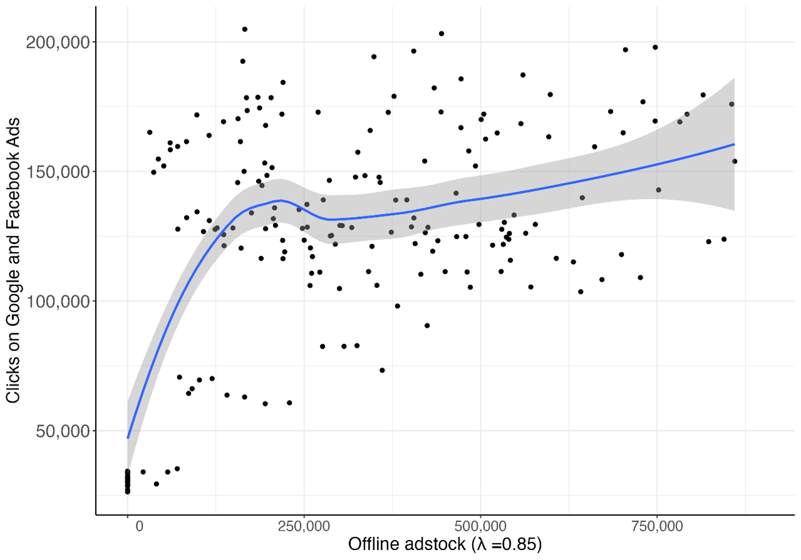
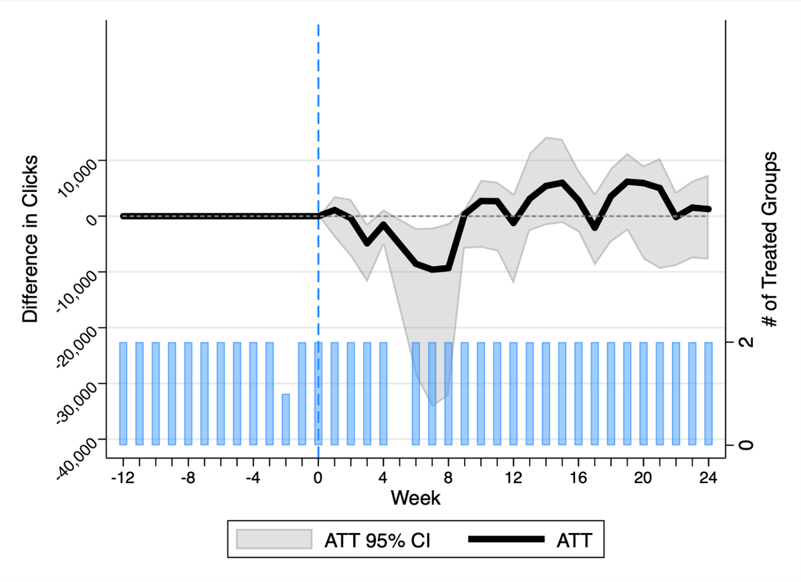

<!-- import useBaseUrl from "@docusaurus/useBaseUrl";

<link rel="stylesheet" href="{useBaseUrl('katex/katex.min.css')}" />
 -->
<!--truncate-->

  

 

 

This article wraps up the content of a PhD thesis in economics defended on April 4th 2023, by Rémi Devaux, now senior consultant in data science at Ekimetrics. This PhD thesis was part of a 3-year academic partnership between Ekimetrics and Mines Paris PSL. 

## What is New with Online Advertising

 

Accounting for 67% of the 930 billion media spend worldwide[^1], online advertising is an obsessive presence in our online life. Search engines, video-sharing platforms, social media and now streaming services: ads are present in many formats on the Internet. In fact, most online platforms are partially or totally financed by advertising. Ad spending by brands subsidies online services, allowing platforms to charge no price to users. This is not new: classified ads financed free newspapers, just as brand sponsoring subsidized radio broadcast. So, what’s new with online advertising? 

Economists pointed out that online advertising decreased the cost of targeting consumers[^2]. This is a major change in the marketing industry. While offline, advertisers can only target their ads toward a general context (newspaper title, TV show, billboard location), online ads can be addressed on a consumer-level basis using personal data (socio-demographics, web history, online behaviors). This decrease in targeting cost acted as a game-changer on many parts of the advertising industry:

-	**Pricing and auctions**: finer targeting increases the quantity of ad impressions available to advertisers. As a result, such a massive volume of impressions cannot be sold at a flat price, just as in the offline advertising world. On the Internet, ad impressions are thus often allocated by auctions. Advertisers compete for a given ad impression based on the characteristics of the impression (user data, website…). The brand associated with the higher bid then wins the impression and displays its ad. This allows ad spaces to be priced at their right price, making advertisers and publishers better off.

-	**Intermediaries**: this complex system of auctions induces that brands and publishers should be able to manage their ad opportunities and bidding strategy on an impression-per-impression basis. Naturally, given the high volume of ad impressions traded every minute, this is not feasible. That is why, online, many ad intermediaries manage the trading of ad spaces on the supply-side (publishers) as well as on the demand-side (advertisers).

-	**Data and Measurement**: the technical nature of online advertising emphasizes the power of data. Views, clicks, conversions: low-targeting costs allow advertisers to observe individual responses to their ads, producing a huge amount of data. Machine learning and data analysis are used at every stage of the ad-serving to optimize advertisers’ bid, click-through-rate, publisher revenues, post-campaign attribution… 
That is why observers often made the claim that with the Internet, the advertising industry went from *Mad Men to Maths Men*.

This PhD thesis focuses on two questions: (i) how online advertising is distinct from traditional advertisement and (ii) how context plays a role in online ads effectiveness. These questions are answered using econometric techniques applied to advertising data.

## Old World, New World?

 

The first part of the thesis studies whether online advertising is a complement or a substitute to traditional advertisements (the one defined by offline mediums such as TV, radio, billboards, newspapers, or cinema). As we saw in the introduction, online advertising works in a very different way compared to offline media where ad buying involves human negotiation, discounts and where ad effectiveness cannot be observed directly. However, many economists claimed that offline and online advertising were close substitutes[^3]. 

One can investigate this question according to two viewpoints: advertising supply and demand.

On the supply-side, we can determine that two types of advertising media are substitutes if brands tend to use both interchangeably. Conversely, two advertising media types are complements when advertisers tend to use them together, with the goal of generating synergies. Substitutability between two media types can be investigated using the concept of *cross-price elasticity*: when the price of a media type increases, how does it impact the demand for another media type? 

Using data from 10 big national advertisers in three different industries, I investigate how firm’s spending on offline, internet display[^4]  and search ads react to each media price. Using an econometric model derived from microeconomic theory, I find that offline and online advertising media types are not close substitutes.  
Intuitively, offline and search do not substitute for each other. Display and offline ad media types seem to be substitutes, but mostly for non-audiovisual media such as newspapers, magazines, and billboards. Indeed, internet display formats substitutes more easily to print advertisement than to TV or radio ads.  
Finally, the model shows that display and search ads are substitutable for advertisers. This can be natural as it seems certain types of display ads (such as retargeting) can be used to generate conversions, just as search ads.

We can also determine whether offline and online ads are complements or substitutes by looking at the demand side: i.e., how consumers respond to ads. Marketing researchers showed that advertising campaigns on different media may generate *synergies*[^5]. That is, the return of investing on two media may be greater than the sum of the two returns taken individually. This kind of synergy typically happens when branding and conversion media are played together. For example, a national TV campaign may raise awareness and desirability for a product, increasing online search volume and thus the effectiveness of sponsored links.

In another study of the thesis, I try to draw a line between offline ad spending and the effectiveness of search ads. Using data from a panel of brands in the hotel sector, I build an econometric model where clicks on sponsored search ads depend on the brand’s own offline ad spending, other ad spending, seasonality, search ad exposure and market-specific factors. Because the effect of offline ad campaigns may be inter-temporal, the investments of period t-1 enters period t after being discounted by a factor *λ*. I find that, on average, increasing the discounted stock of offline ad investments by 10% increases the volume of clicks recorded on search ads by more than 9%. Thus, the effectiveness of online ads also depends on the investment offline, making both types of media complementary.

  
 Figure 1: Relationship between Clicks on Online Ads and Offline Advertising
  

 

Overall, my results suggest that offline and online advertisements are not close substitutes. Looking at how both types of media work, the way advertisers use them and how consumers react to them, offline and internet advertising are different, and sometimes complementary, markets.

## Context Matters!

 

The ability to finely-target advertisements has allowed brands to better match their message to consumers. Targeted advertising thus generates gains by reducing ad ‘waste’[^6] (which occurs whenever the ad is distributed to a consumer who has no preference for the product advertised).

However, focusing solely on individual targeting obliterates an important factor: context. In many cases, internet advertising as been subject to placement issues: an ad may be placed on an unviewable part of the page or worse, inside a bad context. The latter case includes ads displayed on controversial websites (e.g., conspiracy-related blogs, pornographic websites), or inside a content that is irrelevant to the ad: in 2012, an ad for cruise vacations run on a YouTube showing the sinking of the Costa Concordia[^7]. There are many other examples.

This kind of issue arises from an information asymmetry between the advertiser and the publisher. Online advertising features so many possible ad placements and the process of matching ads to placements is so complex that, eventually, advertisers rarely know where their ad appears. Without carefully considering contextual effects, advertisers may waste their ad budget, and even harm their brand image by appearing in bad contexts. Two works of my studies try to shed light on such contextual effects.

In a first study, I use data from a viewability provider to investigate the determinant of ad viewability. The data showed that more than 20% of video ads for a healthcare advertiser were never seen. I try to investigate the determinant of ad viewability. Using an econometric model, I show that when the ad network did not have incentives to make ads viewable, it reduced the overall viewability rate of the campaign. Buying ads on a cost-per-view instead of cost-per-impressions basis induces the ad network to make the ad viewable, increasing viewability by almost 20%. Programmatic advertising also deters ad viewability by introducing opacity between the advertiser and the publisher.

In a second study, I investigate how controversial content on socials impact advertising effectiveness. I use the 2020 Facebook Ad Boycott as a natural experiment. In July 2020, more than 1,000 advertisers pulled out their ad spending from Facebook and Instagram as both platforms were hosting controversial content. Using data from an advertiser in the skincare industry that continued to advertise, I estimate how Facebook ad effectiveness changed compared to the brand’s ads on other platforms. Controlling for platform-specific effectiveness and seasonality, I find that during the boycott, Facebook Ads experienced a decrease of up to 10,000 clicks compared to the expected effectiveness of the ads.

  
 Figure 2: Effect of the boycott (week 0) on clicks recorded on Facebook Ads. Estimates are reported with 95% confidence interval.
  

## Conclusion

 

Online advertising is evolving at an unprecedent pace and so is regulation. Since 2020, political initiatives foster consumer protection, privacy, and abuse of dominance in the digital economy. This has at least two implications for online advertising.

First, for antitrust purposes market regulators need to define the relevant market for advertising. Does regulation on the online ad market affect offline advertising? Does Google Ads compete with national TV networks? Such questions are crucial to understand the market power of online advertising players. This thesis brings some insight from this perspective.

Second, the strengthening of personal data regulation, along the end of third-party cookies will emphasize the importance of ad context. As targeting individual-level characteristics will be more and more difficult, brands will gain in leveraging context to target their ads. For example, targeting hotel ads on travel blog pages is a way to reach relevant consumers. 

Finally, cookies limitation will impact advertiser’s ability to finally measure the return of their advertisement. More than never, holistic econometric measurement with Marketing Mix Modeling is a key tool to measure advertising effectiveness.
 

[^1]: eMarketer (2023). Worldwide Digital Ad Spending 2023. *Insider Intelligence*. https://www.insiderintelligence.com/content/worldwide-digital-ad-spending-2023
[^2]: Goldfarb, A. (2014). What is different about online advertising? *Review of Industrial Organization, 44*, 115-129.
[^3]: Goldfarb, A., & Tucker, C. (2011). Substitution between offline and online advertising markets. *Journal of Competition Law and Economics, 7*(1), 37-44.
[^4]: Here, Internet display is defined as banners, videos, and social media ads.
[^5]: Naik, P. A., & Raman, K. (2003). Understanding the impact of synergy in multimedia communications. *Journal of marketing research, 40*(4), 375-388.
[^6]: Iyer, G., Soberman, D., & Villas-Boas, J. M. (2005). The targeting of advertising. *Marketing Science, 24*(3), 461-476
[^7]: Heilpern, W. (2016, 22 mai). 26 of the most hilarious, unfortunate online ad placements. Business Insider. https://www.businessinsider.com/here-are-the-most-hilarious-unfortunate-online-ad-placements-ever-2016-5?r=US&IR=T
