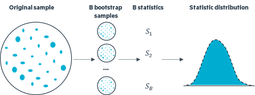
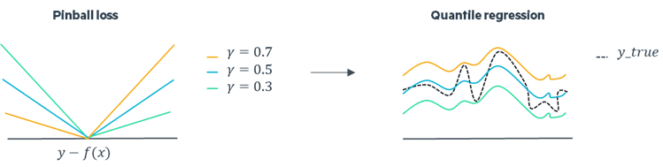
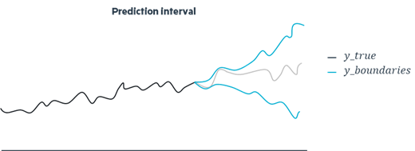
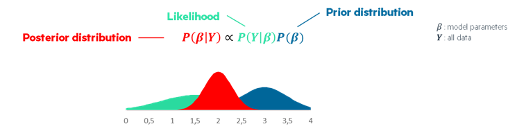
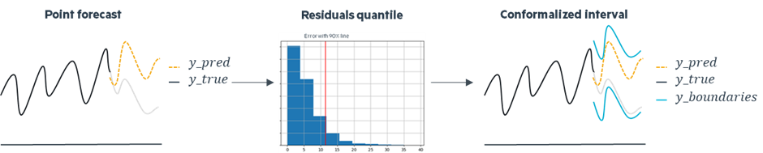

<!-- import useBaseUrl from "@docusaurus/useBaseUrl";

<link rel="stylesheet" href="{useBaseUrl('katex/katex.min.css')}" />
 -->
<!--truncate-->

  

 

 

Uncertainty in time series forecasting refers to the unpredictability and variability associated with predicting future values in a sequence of data points over time. Time series forecasting involves analyzing historical data to make informed predictions about future trends, patterns, or values. However, due to various factors such as randomness, external influences, and incomplete information, forecasting models often encounter uncertainty. Managing and quantifying uncertainty in time series forecasting is crucial for decision-making processes across diverse domains such as finance, economics, weather forecasting, and supply chain management. 

## Why prefer uncertainty? 

 

Most issues related to time series are attempted to be addressed through accuracy methods, which are essentially point forecasting ones. When we talk about accuracy, we refer to probable events occurring, attempting to estimate the closest value to reality without truly considering all risk-related factors. This approach leans more toward a retrospective examination of past errors.

Considering the stochastic nature of the universe, ideally, we aim to discuss plausible events occurring, to approach an interval within which the true values will fall, considering potential future risks and potential future errors. We're no longer referring to point forecasting but rather interval forecasting.  

The need to quantify uncertainty can arise in various ways, for example:

- Uncertainty forecasting helps energy companies make decisions about buying and selling energy in real-time markets, considering fluctuations in demand and supply.

- Forecasting uncertainty in demand and supply can help retail businesses optimize their production, distribution processes and stock management.

- Hospitals can use uncertainty forecasts to anticipate patient admissions, enabling better resource allocation, staffing decisions and pharmaceutical orders.

  

 

**The most important thing to keep in mind is that even a good regressor can make important errors due to the volatility that a time series can present. To prevent this problem, the use of prediction intervals is recommended.**

## Popular methods 

 

There are a huge number of methods capable of creating prediction intervals that quantify the uncertainty surrounding an observation. However, it is possible to group most of them into 5 main types of method.

### Bootstrap

Bootstrap is a statistical technique used to estimate the variability of a statistic. It involves generating multiple bootstrap samples through resampling with replacement from the original dataset. These samples are then analyzed using the same statistical model. The results provide a range of values that represent the uncertainty associated with your forecast or analysis, offering a more nuanced understanding of potential fluctuations in outcomes. This approach provides a flexible and data-driven method to assess the precision of statistical estimates.

  

 

Advantages of this approach include its utilization of non-parametric methods, requiring a minimal amount of data, and ease of implementation. However, the method has disadvantages such as demanding intensive computing resources, being highly dependent on input data, and posing challenges in terms of interpretation.

### Asymmetric regression

 

In machine learning, altering the loss function can reshape a model's predictions by influencing how it handles errors. During the training phase, a machine learning model learns to adjust its parameters to minimize the overall loss  , but in the case of asymmetric loss functions, penalties for overestimations and underestimations are different. The optimization process involves balancing the penalties associated with overestimating and underestimating based on parameter values. Fine-tuning these parameters allows to adapt the model's behavior. This introduces a nuanced response to errors. Among other things, this is the principle behind quantile regression.

  

Advantages of the approach include its compatibility with non-parametric methods. However, it comes with disadvantages such as the absence of mathematical guarantees, uncalibrated forecasts, and the complexity of interpretation associated with the method.

### Probabilistic models

 

Probabilistic models are favored for their capacity to output distributions instead of single points. Numerous probabilistic models exist for time series forecasting, and among them, ARIMA models stand out as particularly popular. 

The process begins with the model fitting the time series data, capturing the autoregressive (AR) and moving average (MA) components, and ensuring stationarity through differencing (integrated component). After generating point forecasts, the model assesses the residuals, which represent the differences between the observed and predicted values. ARIMA utilizes the standard deviation of the normally distributed residuals to construct prediction intervals around the point forecasts. Essentially, the wider the prediction interval, the greater the uncertainty associated with the forecast. This technical methodology not only refines the accuracy of point forecasts but also provides a statistically sound measure of the range within which future observations are likely to fall.

  

Advantages of this method include its simplicity and interpretability, along with the absence of a requirement for exogenous variables (even if it could be also a disadvantage). However, the method comes with disadvantages such as reliance on assumptions about the data and the need for parameter selection like most probabilistic methods.

### Bayesian approach

 

Bayesian time series forecasting employs a technically advanced approach, involving probabilistic modeling, Bayesian inference, and iterative parameter estimation. During modeling, prior distributions are specified, which are updated through Bayesian inference with observed data to obtain posterior distributions. Techniques such as Markov Chain Monte Carlo or variational inference optimize these distributions for parameter estimation. It allows you to quantify uncertainty in your forecasts thanks to posterior distributions.

Advantages of this approach include the ability to incorporate business knowledge and the capability to yield results even with weakly informative datasets. However, a notable disadvantage is that incorrect priors may lead to inaccurate results.

### Conformal prediction

 

Conformal prediction offers finite-sample conformal intervals applicable to any model and dataset without additional costs. It is particularly valuable for black box models, requiring no modification to their analysis or training. The methodology relies on a calibration set in addition of the training and testing usual ones, which aids in generating conformalized intervals by rectifying errors introduced by the regressor. A crucial aspect in the design of conformal prediction is adaptivity. The objective is to ensure that the procedure yields larger intervals for more challenging inputs and smaller intervals for simpler inputs, tailoring the predictive uncertainty to the inherent difficulty of each input.

 
Advantages of this method encompass mathematical coverage guarantees, consistent and robust performance, and applicability to any model or dataset. However, there are drawbacks, such as certain methods requiring intensive computing, which may pose challenges in a business application context, and a dependency on a good regressor.

## Evaluation key points

### Coverage

 

Coverage is a critical aspect in uncertainty prediction, particularly when considering an error level α (0 < α < 1). The anticipated outcome is that, for a given confidence level of (1 - α), we expect that (1 - α)% of the observations fall within the predicted uncertainty intervals. In other words, this statement underscores the importance of the model accurately capturing and quantifying uncertainty, ensuring that the specified percentage of observations is encompassed by the predicted uncertainty range, aligning with the desired level of confidence.

This concept becomes especially crucial in scenarios where robust and reliable uncertainty estimates are required.

### Interval

 

In uncertainty quantification, a brief interval is commonly seen as advantageous, suggesting improved precision in predictions with constrained uncertainty. While a narrow uncertainty interval signifies heightened confidence in the model's predictive capabilities, it is imperative to remain watchful of another critical factor: variance. Although low variance can indicate prediction stability, an excessively low variance may raise concerns. This could suggest that the model oversimplifies the complexity of the problem, potentially overlooking crucial nuances in the data.

Thus, achieving a balance between pursuing tight uncertainty intervals, indicative of precision, and considering variance is vital to ensure the resilience of the uncertainty quantification model, aligning it with the characteristics of the data.

### Adaptiveness

 

Adaptability is a crucial aspect in evaluating uncertainty quantification, focusing on temporal and sectional adaptiveness. Temporal adaptiveness ensures that the model can dynamically adjust its uncertainty estimation over time, maintaining relevance amid evolving data trends. Similarly, sectional adaptiveness underscores the need for adaptability within different segments or subsets of a dataset. An adaptive model should effectively address variations in uncertainty within these sections, acknowledging potential diversity in conditions or characteristics.

In summary, within the realm of uncertainty quantification evaluation, adaptability, exemplified through temporal and sectional adaptiveness, represents a comprehensive and nuanced approach that return larger sets for harder inputs and smaller sets for easier inputs.

## Conclusion

 

In conclusion, the exploration of time series forecasting underscores the shift from traditional accuracy methods to uncertainty quantification. Various methods, such as Bootstrap, Asymmetric Regression, Probabilistic Models, Bayesian Approach, and Conformal Prediction, offer diverse approaches, each with its pros and cons. Conformal prediction, a set of recent methods still in the research and development phase, holds the potential to outperform other approaches in the field. That's why, at Eki.Lab, we're pushing ahead with many studies linked to Conformal Prediction.

The main things we need to look at when evaluating these methods are coverage and adaptivity. We want our predictions to be able to change over time and across different parts of the dataset to ensure a good coverage rate whatever the particularities of the predicted observation. It's important to find a balance between keeping our uncertainty ranges narrow enough to be precise but also considering how much our predictions might vary. This is all the key to building a strong model that can handle the complexities of real-world data.

