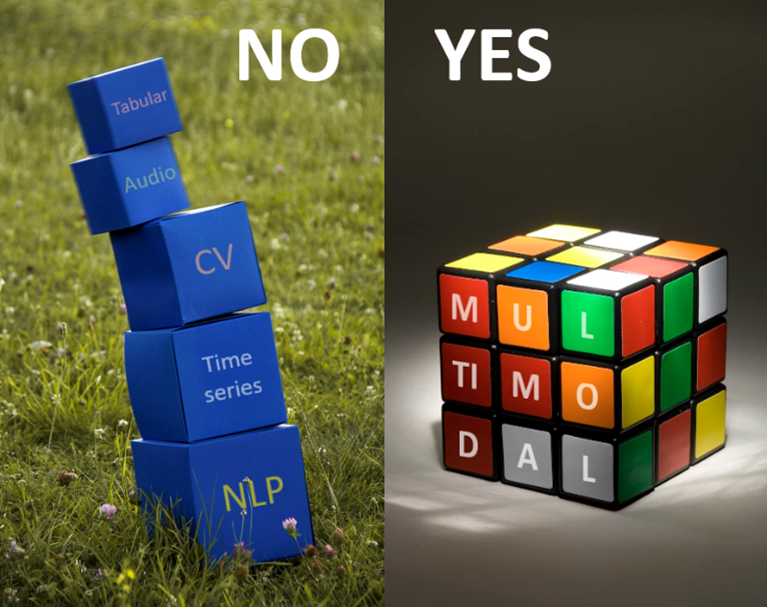
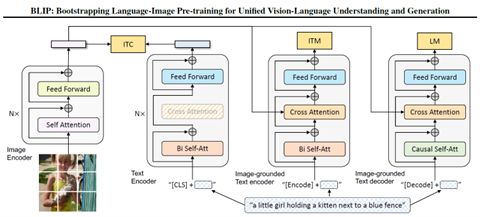
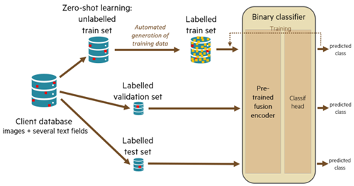

<!-- import useBaseUrl from "@docusaurus/useBaseUrl";

<link rel="stylesheet" href="{useBaseUrl('katex/katex.min.css')}" />
 -->
<!--truncate-->

# Part 1: Why we use a fusion weapon

 

Data science (and specifically machine learning) is often seen as made up of different fields of expertise and research: « classical » machine learning (on tabular data), time series analysis & forecasting, computer vision, natural language processing… Indeed, each kind of (input or output) data, which we call **modality** – e.g. image, text, time series –, has specific properties, raises specific challenges, and therefore requires dedicated solutions and evaluation methods. A pastry chef may ignore how to cook a black truffle risotto; a renowned ophthalmologist may deny any knowledge on kidney function; as well, in a siloed view of data science, a computer vision expert might pay no attention to the latest advances in gradient boosting or large language models.

At **Ekimetrics**, we have abandoned that siloed view: useful and meaningful data often is multimodal, and leveraging the predictive or generative power of several modalities cannot just be a matter of stacking or superficially connecting each field’s solutions. Let us see why this is important.

## Multimodal data is everywhere

In many fields of economy and science, data is multimodal, and each modality may contain useful information. Multimodality is not just a theoretic use case! Let us provide three examples:

- Product databases (manufacturing, retail, tourism, real estate…) may contain tabular data, product descriptions or other textual information, product photos, time series for price or sales history… Each product has multimodal data. Each modality contains potential predictive information, for instance to forecast future demand or sales.
- Medical records include textual documents, tabular data, images, regular or irregular time series. Here again, for each patient, every modality may contain precious information to help diagnosis or prognosis.
- Advertisements, e-mails, newspaper covers and articles and social media posts are usually bimodal: texts combined with one or several images (and sometimes, texts within images). Both modalities surely have an influence on the impact (clicks, “likes”, sales…) of these signals, and should be addressed when predicting this impact.

This is why, in our job as data scientists, we must design and implement the best solutions to harness combined data modalities.

## A multimodal brain is better than several unimodal brains

Every minute or even second, our human brain reacts, evaluates, and makes decisions after combining and processing several signals of different kinds, gathered from several senses. Each sense (or each modality) is correctly interpreted **thanks to the knowledge of all other signals**:

- To know if the noise I heard on my right reveals a danger, I must concentrate my vision sense to the same direction (maybe turn my head) and look at the source of the noise.
- Imagine that someone shows me a document and gives oral explanations. Something sounds weird in these explanations. To know if my interlocutor is serious or joking, I must stop looking at the document, and look at his/her facial expression.
- To select what to pay attention to in this [famous awareness test](https://www.youtube.com/watch?v=KB_lTKZm1Ts), I must know and understand the written instructions (or game rule).
- As a specialist physician, to avoid missing weak signals in exam results (imagery, blood test history…) and symptoms, I must understand why the patient was sent to me, which means reading the cover letter or medical report, so as to know what to focus on.
- In many bimodal documents, for instance scientifical articles, understanding the images (diagrams, charts) help understanding the text, and reading some texts (e.g. captions) can be necessary to understand the images or to deduce what is important to be watched in the image.

If all these examples, suppose each modality is observed by a different person (a different unimodal brain), without any communication with the other persons, and afterwards, only afterwards, these persons can communicate and decide, without any access to the modalities. What will happen? They will probably miss something, because they did not look in the right direction, or did not focus enough on some detail, or misinterpreted a signal.

What if the neurons are artificial ones?

## Unimodal embeddings are not all you need

In simple (or maybe naive) multimodal deep learning architectures, unimodal state-of-the-art (SoTA) neural networks work independently. Each unimodal brain classically produces a **unimodal embedding**, which is usually a vector (1D-array) or a sequence of vectors (2D-array) of numerical values, which is supposed to concentrate all useful information on the modality, in a reduced mathematical space. Then, a prediction is built from all these gathered embeddings, thanks to the addition of a few more trained neural layers (a “head” block), or with numerical machine learning solutions such as tree boosting. It looks SoTA, but it often induces poor performance.

The first reason is that each unimodal embedding is given in a different latent space: it means that it uses a language which is completely different from the other unimodal embeddings. Thus, the image embedding does not help guessing what is important to check in the text embedding, and vice versa. In the human scenario (unimodal brains), it would be as if the involved persons could not communicate correctly together: making a good decision would be quite unlikely.

Fortunately, public pre-trained models and architectures called **dual encoders**, like CLIP[^1] , can produce text embeddings and image embeddings in the same latent space (same language), which significantly helps bridging the gap between modalities, and improve predictive performance.

But this is not enough. You already know the second reason: even with dual encoders, each unimodal brain (network) does not communicate with the other brains when analyzing its modality, and therefore, does not focus enough on what is important in it. This is why a new family of multimodal models has been designed: **fusion encoders**. They allow, in each modality analysis, to progressively introduced useful information from other modalities. Thus, useful information is jointly extracted from all modalities of a same data sample.

Pretrained image & text (bimodal) fusion encoders, ingeniously assembling SoTA expertise of both computer vision and natural language processing, are now publicly available: ViLT[^2] , FLAVA[^3] , BLIP[^4] , BLIP-2[^5] … They can output **bimodal embeddings**, which contain rich relevant information from a pair `{image, text}`, analyzed together. They are excellent candidates for “transfer learning” strategies: adding a trained “head” network on top of a fine-tuned fusion encoder, to make the desired prediction or forecast.

## A demonstration by Ekimetrics

Huge product databases sometimes suffer from insufficient or irregular quality, due to historical or heterogeneous (sometimes manual) feeding processes. For instance, an irrelevant picture (product photo) may have been associated to an unmatching product. Manual thorough detection of errors, on millions of products, would be extremely costly. At Ekimetrics Innovation Lab (Eki.Lab), we have designed, built, evaluated, and validated a deep learning solution to efficiently semi-automate that task: it can detect most mismatches between an image and the known text fields (name, properties, description, summary…) of the same product.

Our most efficient solution mainly relies on a fine-tuned fusion encoder and trained head. Even with artificially generated hard-to-find image permutations (e.g. replacing an image with a similar but slightly different one) in test database, our solution can detect 87% (recall) of existing mismatches, with a tolerated precision of 50% (i.e. allowing that that only 1 suspicious image out of 2 is actually incorrect). On top of that, we have designed and validated a method to adapt the model to any unlabeled product database (self-supervision): costly human labelling is unnecessary.

Our experiments confirm that without a fusion encoder, and even using CLIP as a dual encoder, results are much worse: recall remains under 30% with the same constraint on precision.

## What about tabular data and time series?

Now, what would be the best solution for a predictive task in which multimodal input includes tabular data and/or time series? In most cases, there is no relevant pre-trained fusion encoder on these modalities, since there is no universal knowledge to deduce from pre-training on time series or tabular data. However, a few recent research papers, such as the Perceiver family (Perceiver[^6] , Perceiver IO[^7] , Hierarchical Perceiver[^8] ), show promising ways to build and train an accurate unique (fusion) deep learning model based on any combination of various modalities.

Combining such a “multimodal-by-design” architecture with pre-trained models (including fusion encoders) for both text and images, which may still bring useful knowledge with small-sized training datasets, is an active field of research[^9] , in which Ekimetrics is fully involved. A high range of disruptive use cases can be designed: in the near future, efficient multimodal models will help optimize media communication, forecast demand or sales to optimize product design or supply chain, forecast or optimize prices, help diagnosis or prognosis, perform impactful social media analysis… Please stay connected for future news on the subject!

[^1]: « Learning Transferable Visual Models From Natural Language Supervision », A. Radford et al., 2021
[^2]: « ViLT: Vision-and-Language Transformer Without Convolution or Region Supervision », W. Kim & al., 2021
[^3]: « FLAVA: A Foundational Language And Vision Alignment Model », A. Singh, 2022
[^4]: « BLIP: Bootstrapping Language-Image Pre-training for Unified Vision-Language Understanding and Generation », J. Li et al., 2022
[^5]: « BLIP-2: Bootstrapping Language-Image Pre-training with Frozen Image Encoders and Large Language Models », J. Li et al., 2023
[^6]: « Perceiver: General Perception with Iterative Attention », A. Jaegle et al., 2021
[^7]: « Perceiver IO : a general architecture for structured inputs & outputs », A. Jaegle et al., 2021
[^8]: « HiP: Hierarchical Perceiver », J. Carreira et al., 2022
[^9]: For instance, see « Flamingo: a Visual Language Model for Few-Shot Learning », J.B. Alayrac et al., 2022
