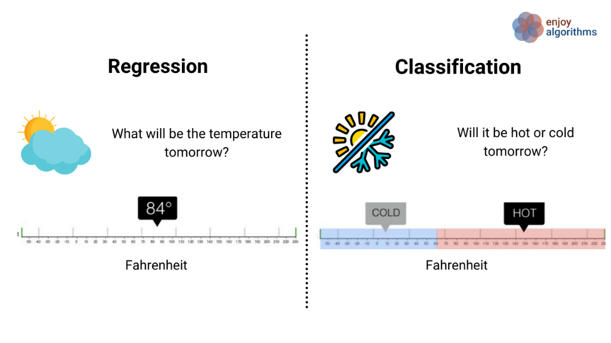
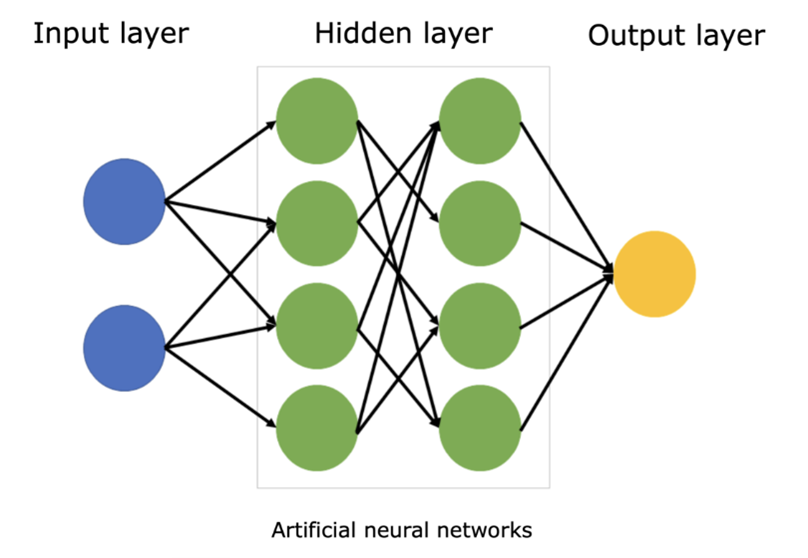
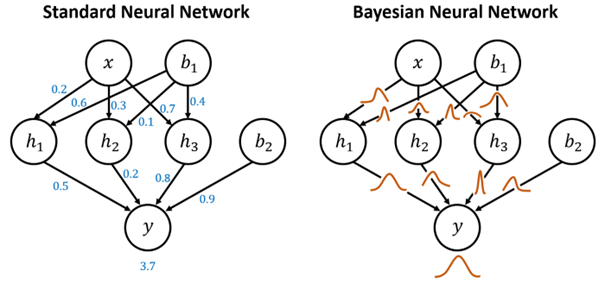

<!-- import useBaseUrl from "@docusaurus/useBaseUrl";

<link rel="stylesheet" href="{useBaseUrl('katex/katex.min.css')}" />
 -->
<!--truncate-->

 

# Introduction

  

 

Artificial neural networks (ANNs) have revolutionized countless fields, from powering self-driving cars to aiding medical diagnoses. Yet, these marvels often lack a crucial human trait: the ability to say "I don't know." While ANNs excel at making predictions, they struggle with uncertainty, confidently providing answers even when data is limited or unreliable. This can lead to misleading results, especially in critical areas where trust is paramount.

Enter Bayesian neural networks (BNNs), a pioneering approach that embraces uncertainty as a strength. Inspired by Bayesian statistics, BNNs confidently acknowledge "I don't know" when the data gets hazy. This seemingly simple addition unlocks a treasure trove of benefits:

- **Confidence, not certainty**: BNNs don't just predict, they provide confidence intervals, allowing users to understand the level of trust they can place in each answer. This leads to more informed decision-making, especially in critical situations.
- **Real-world robustness**: Built to handle the noise and outliers inherent in real-world data, BNNs are more reliable in uncertain environments, offering more trustworthy results.
- **Active learning**: BNNs can pinpoint their areas of highest uncertainty, actively seeking out the most informative data points to refine their knowledge. This continuous learning loop makes them even more powerful.

This fascinating world of BNNs holds immense potential, not just for improving traditional AI applications, but for building trust and transparency in a future increasingly reliant on artificial intelligence. As we delve deeper into their inner workings, explore their diverse applications, and discuss the exciting challenges and opportunities they present, be prepared to witness how "I don't know" becomes the secret weapon of the future's AI.

# Neural Networks Essentials

 

In order to understand the way bayesian neural networks, we will have to dive into what bayesian neural networks are based on : artificial neural networks.

Artificial neural networks are part of the Artificial Intelligence that aims at replicating the way human brain works, this field is also commonly called “Deep Learning”.

An artificial neural network can be used for 2 main tasks :

1.	Classification: task where the network learns to map input data to discrete categories or classes. This is achieved through the training process, where the network adjusts its weights and biases to minimize the difference between predicted class probabilities and the actual class labels in the training data.

2.	Regression: task where the network is trained to predict a continuous output variable based on input data. In regression tasks, the network learns to capture the underlying patterns and relationships in the data, allowing it to make predictions on new, unseen data points. The training process involves minimizing the difference between predicted and actual continuous values.

An artificial neural network will work this following way :

 

The artificial neural network (ANNs) can be considered as a mathematical function where you put in input the features which will be useful to predict an output.

ANNs are made up of interconnected nodes, called neurons, which process information and transmit it to other neurons. The neurons are arranged in layers, with each layer performing a different function.

We can split layers into 3 categories :

1. Input layer is the first layer, it will receive the input data . The input layer neurons then process the data and transmit it to the hidden layers.
2. The hidden layers are the layers of an ANN that are not directly connected to the input or output layers. The hidden layers are responsible for learning complex patterns in the data. The hidden layers are also responsible for making predictions about the data.
3. Output layer is the last layer, the one that predicts the desired output.

Neurons (rounds in our schema) in ANNs work by:

1. **Receiving input signals**: From other neurons.
2. **Multiplying input signals by weights**: The weights determine the influence of each input signal on the neuron's output signal.
3. **Adding the weighted inputs**: To produce a sum.
4. **Passing the sum to an activation function**: Which produces the neuron's output signal.

ANNs are trained by adjusting the weights of the neurons. The goal of the training process is to minimize the error between the predicted output of the ANN and the actual output of the ANN.

Once the ANN is trained, it can be used to make predictions on new data. The new data can be anything from images and sounds to text and sensor readings. The ANN will then produce an output for the new data.

Now that we have a basic understanding of artificial neural networks (ANNs), let's discuss Bayesian neural networks (BNNs). BNNs are a type of ANN that uses Bayesian probability theory to represent uncertainty in the model's parameters. This allows BNNs to learn more robust models and make more accurate predictions, especially when dealing with limited or noisy data.

# Bayesian Neural Networks : "I know that I know nothing"

 

Bayesian Neural Networks (BNNs) have emerged as a powerful solution to address a fundamental limitation of traditional Artificial Neural Networks (ANNs): the ability to express uncertainty.

While ANNs are proficient at making predictions, they often lack the capability to quantify uncertainty or admit when they don't have enough information. BNNs, on the other hand, introduce a Bayesian framework that inherently accounts for uncertainty in the model parameters.

Indeed, one key difference between ANNs and BNNs is that ANNs learn a single point estimate of the model's parameters, while BNNs learn a probability distribution over the model's parameters.

By treating weights as probability distributions rather than fixed values, BNNs can express a range of possibilities for each weight, allowing them to convey a degree of uncertainty in their predictions. This inherent probabilistic nature makes BNNs more flexible and generic in handling situations where an ANN might simply provide a confident but potentially misguided answer. BNNs excel in scenarios where acknowledging uncertainty is crucial, providing a more nuanced and cautious approach compared to the deterministic nature of traditional ANNs. In essence, BNNs offer a valuable advancement by enabling neural networks to say, "I don't know," thereby enhancing their applicability in real-world scenarios that demand a nuanced understanding of uncertainty.

# Conclusion

 

In conclusion, while Bayesian neural networks (BNNs) present exciting possibilities in the realm of artificial intelligence, addressing challenges such as computational complexity and the need for efficient training algorithms is imperative for unlocking their full potential. The computational efficiency of BNNs, often demanding more resources than traditional ANNs, necessitates advancements in both hardware and algorithms to make them practical for real-world applications. Ongoing research focused on developing scalable training algorithms for BNNs is a key endeavor, with the promise of making these networks more accessible across various domains. Additionally, the interpretability of BNN outputs, despite their transparency in uncertainty quantification, requires further exploration to enhance widespread acceptance.

On the flip side, exploring the applications of BNNs reveals their transformative impact across diverse fields. In medical diagnoses, BNNs offer transparency and caution, providing not only accurate predictions but also confidence intervals that empower healthcare professionals to make informed decisions. In the financial sector, BNNs excel at predicting market trends, offering confidence intervals that assist investors and analysts in navigating the inherently uncertain landscape. The cautious approach of BNNs is particularly valuable in the realm of autonomous vehicles, where real-time quantification of uncertainty enhances safety in unpredictable environments. Furthermore, BNNs play a crucial role in robotics, allowing robots equipped with these networks to navigate complex environments with sophistication, adapting to unforeseen obstacles and uncertainties in ways traditional neural networks cannot.

As we navigate the evolving landscape of AI, Bayesian neural networks emerge as a beacon of progress, not just in making better predictions but in fostering trust, transparency, and adaptability. By embracing the notion of "I don't know," BNNs illuminate a path toward collaborative interactions between AI systems and humans, providing nuanced and cautious insights in the face of uncertainty. The ongoing research and development in this field underscore the pivotal role that Bayesian neural networks are poised to play in shaping the next generation of intelligent systems.

