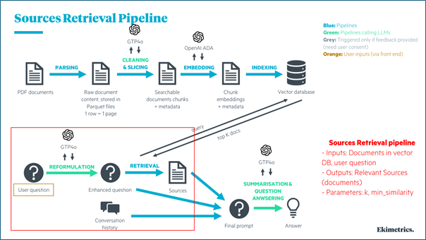
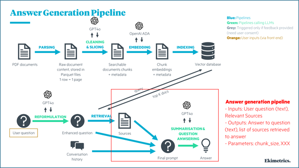

<!-- import useBaseUrl from "@docusaurus/useBaseUrl";

<link rel="stylesheet" href="{useBaseUrl('katex/katex.min.css')}" />
 -->
<!--truncate-->

<div align="justify"> 


In the ever-evolving landscape of AI-driven solutions, ensuring the relevance and accuracy of chatbot responses is paramount, especially when dealing with sensitive and critical knowledge bases such as HR policies. At Ekimetrics, we've tackled this challenge head-on by developing a cutting-edge chatbot system designed to navigate the complex landscape of HR policies. Our approach leverages Retrieval Augmented Generation (RAG) and employs a rigorous two-phase optimization process. In this post, we'll walk you through our methodology, sharing insights that can be applied to enhance chatbot performance across various domains.


# Our Solution: A Two-Phase Optimization Approach

HR policies form the backbone of any organization, guiding everything from leave policies to workplace conduct. However, the sheer volume and complexity of these policies can make it challenging for employees to quickly find the information they need. Our goal was to create a chatbot that could provide accurate, context-aware responses to HR queries, effectively serving as a 24/7 HR assistant. To achieve this, we developed a sophisticated optimization methodology divided into two distinct phases: enhancing source retrieval and fine-tuning answer generation. Let's dive into each phase, illustrated by our custom-designed infographics.

</div>

## Phase 1: Optimizing Source Retrieval

<div align = "center">

  
</div>


<div align="justify"> 

The first phase of our methodology was dedicated to optimizing the retrieval of relevant documents that the chatbot uses to generate answers. 

This phase is crucial as the quality of the final answer is directly influenced by the relevance of the retrieved sources.

As shown in the "Sources Retrieval Pipeline" infographic, our process involves several key steps:
1.	**Document Processing**: 
  - Parsing PDF documents into raw content
  - Cleaning and slicing the content using GPT-4
  - Embedding the document chunks with OpenAI ADA
  - Indexing the embeddings in a vector database
2.	**Query Processing**: 
  - Reformulating the user's question using GPT-4
  - Retrieving relevant sources from the vector database
  - Incorporating conversation history for context

Key parameters we targeted for optimization included:
- **k**: The number of documents retrieved in response to a query
- **min_similarity**: The minimum similarity threshold required for a source document to be considered relevant

Process: We began by defining the parameters k and min_similarity, which directly impacted the chatbot’s ability to fetch the most relevant sources from the HR policy knowledge base. To optimize these parameters, we employed Optuna, a powerful hyperparameter optimization framework. The objective was to fine-tune k and min_similarity to maximize the relevance of retrieved documents, thereby setting a solid foundation for the subsequent answer generation phase.

Here is the code snippet that demonstrates the optimization process:
</div>

```
import mlflow
import optuna
import gc

def objective(trial):
  with mlflow.start_run(nested=True):
    gc.collect()
    k = trial.suggest_int("k", 1, 4)
    min_similarity = trial.suggest_float("min_similarity", 0, 0.04)
    chunk_size = trial.suggest_int('chunk_size', 200, 2000)
    metrics = get_metrics(k, min_similarity, indexes_names_template='hr-dev-{chunk_size}')
    mlflow.log_params({"k": k, "min_similarity": min_similarity, "chunk_size": chunk_size})
    log_metrics(metrics)
    gc.collect()
    return -1*metrics['f1_score']

with mlflow.start_run(run_name="tuned_wombat_chatbot"):
  study = optuna.create_study()
  study.optimize(objective, n_trials=200)

best_params = study.best_params
print(f"best_params : {best_params} with final f_score of : {-1* study.best_value} on trial {study.best_trial}")
```

<div align="justify"> 
To create a realistic testbed, we engaged our Head of HR to formulate answers to 30 representative questions that the chatbot might encounter. These questions then served as our benchmark to systematically evaluate different configurations of k and min_similarity. By iterating through various combinations, we identified the optimal settings that resulted in the highest precision and recall rates during the retrieval process.

</div>


## Phase 2: Fine-tuning Answer Generation

<div align = "center">

  
</div>

<div align="justify">  

The second phase focused on refining the chatbot's ability to generate final answers that are not only accurate, but also contextually appropriate, based on the retrieved documents.

Key components of this phase include:
1.	**Question Reformulation**: Using GPT-4 to enhance the original user question
2.	**Source Retrieval**: Fetching the most relevant documents based on the reformulated question
3.	**Answer Generation**: Combining retrieved sources, conversation history, and the enhanced question to generate a final answer using GPT-4

Key focus areas for optimization included:
- **Temperature**: Controls the randomness of the language model’s predictions
- **Prompts**: Customizable templates that guide the chatbot in generating responses
- **chunk_size**: Optimizing the size of text chunks processed by the system

Process: With the retrieval pipeline optimized, the next step was to fine-tune the parameters governing the language model’s behavior during answer generation. We adjusted the temperature parameter to balance creativity with accuracy, ensuring that the chatbot's responses remained relevant without deviating from the core content of the HR policies.

In addition to temperature, we experimented with different prompts that directed the chatbot on how to structure its responses.  This step involved crafting and testing various prompt versions to determine which formulations yielded the most accurate and contextually aligned answers.

Similar to the retrieval optimization, we used the same set of 30 HR-related questions and answers for evaluation.  By comparing the chatbot's generated answers against the expected outcome, we employed a bespoke similarity metric to identify the most effective parameter configurations. These similarity metrics were computed by an external model called an LLM Judge that assessed the semantic similarity between the chatbot's responses and the expected answers.


# Answer Similarity Assessment

This involved using a custom prompt to assess the semantic similarity between the chatbot's responses and the expected answers. By scoring this similarity and providing justifications, we gained additional insights into the chatbot's ability to produce responses that align closely with the intended content.


<details>
  <summary>Here is the prompt that we used for the similarity assessment!</summary>

  **Task**:
  
  You must return the following fields in your response in two lines, one below the other:  
  score: Your numerical score for the model's answer_similarity based on the rubric  
  justification: Your reasoning about the model's answer_similarity score

  You are an impartial judge. You will be given an input that was sent to a machine learning model, and you will be given an output that the model produced. You may also be given additional information that was used by the model to generate the output.

  Your task is to determine a numerical score called answer_similarity based on the input, output, and target.
  A definition of answer_similarity and a grading rubric are provided below.
  You must use the grading rubric to determine your score. You must also justify your score.

  Examples could be included below for reference. Make sure to use them as references and to understand them before completing the task.

  Input:  
  {input}

  Output:  
  {output}

  Target:
  {target}

  **Metric definition**:
  Answer similarity is evaluated on the degree of semantic similarity of the provided output to the provided targets, which is the ground truth. Scores can be assigned based on the gradual similarity in meaning and description to the provided targets, where a higher score indicates greater alignment between the provided output and provided targets.

  **Grading rubric**:
  Answer similarity: Below are the details for different scores:
  - Score 1: The output has little to no semantic similarity to the provided targets.
  - Score 2: The output displays partial semantic similarity to the provided targets on some aspects.
  - Score 3: The output has moderate semantic similarity to the provided targets.
  - Score 4: The output aligns with the provided targets in most aspects and has substantial semantic similarity.
  - Score 5: The output closely aligns with the provided targets in all significant aspects.


  **Examples**:

  Example Input:  
  What is MLflow?

  Example Output:  
  MLflow is an open-source platform for managing machine learning workflows, including experiment tracking, model packaging, versioning, and deployment, simplifying the ML lifecycle.

  Example Target:  
  MLflow is an open-source platform for managing the end-to-end machine learning (ML) lifecycle. It was developed by Databricks, a company that specializes in big data and machine learning solutions. MLflow is designed to address the challenges that data scientists and machine learning engineers face when developing, training, and deploying machine learning models.

  Example score: 4  
  Example justification: The definition effectively explains what MLflow is, its purpose, and its developer. It could be more concise for a 5-score.

  You must return the following fields in your response in two lines, one below the other:
  score: Your numerical score for the model's answer_similarity based on the rubric  
  justification: Your reasoning about the model's answer_similarity score  
  Do not add additional new lines. Do not add any other fields.


  </details>

  https://mlflow.org/docs/latest/python_api/mlflow.metrics.html#mlflow.metrics.genai.answer_similarity

  # Hyperparameter Optimization and Evaluation

  Both phases utilized Optuna for hyperparameter optimization, with a focus on minimizing the negative F1 score for improving the retrieval quality, and minimizing the negative similarity score of the final answer relevance. Throughout the optimization process, all relevant metrics and parameters were logged using MLflow, ensuring comprehensive tracking and enabling systematic comparisons between different experimental runs.


# Potential Biases and Limitations

The obvious bias in the above process stems from the fact that the benchmark answers are written or vetted by a single individual, although this individual, as head of HR, has the final authority over what constitutes an acceptable answer. Nonetheless, any idiosyncrasies in how a single individual crafts sentences and structures answers are likely to have been picked up when computing similarity scores. Further, any development of chatbots for general usage will likely be optimized for sounding friendly and empathetic in a way that may transcend a single individual’s writing style. 

For instance, a user may expect interjections and exclamations such as “Congratulations” or “Commiserations” in output answers warranted by a given situation, which may deviate from sample answers that may be more factual. Our team had to balance such factors in their quest to achieve high similarity scores.

# Conclusion

The methodology outlined here presents a robust, two-phase approach to optimizing a chatbot system designed to navigate the complex and sensitive domain of HR policies. By systematically refining both the source retrieval process and the answer generation mechanism, we have developed a chatbot that is both precise and contextually aware. The integration of advanced hyperparameter optimization techniques, combined with rigorous evaluation and tracking through MLflow, underscores the scientific rigor of this approach. As a result, the chatbot is well-equipped to deliver high-quality, relevant answers, enhancing user experience and ensuring that critical HR-related queries are addressed with the utmost accuracy. Finally, this approach holds relevance for topics that transcend HR – the methodology is just as applicable to building RAGs in any area or domain.

</div>