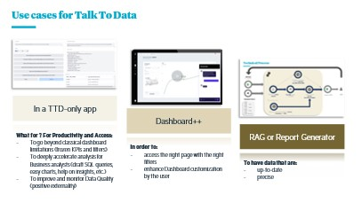
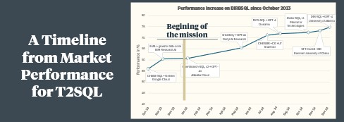
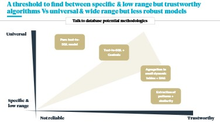
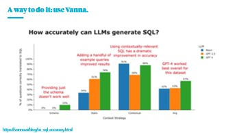
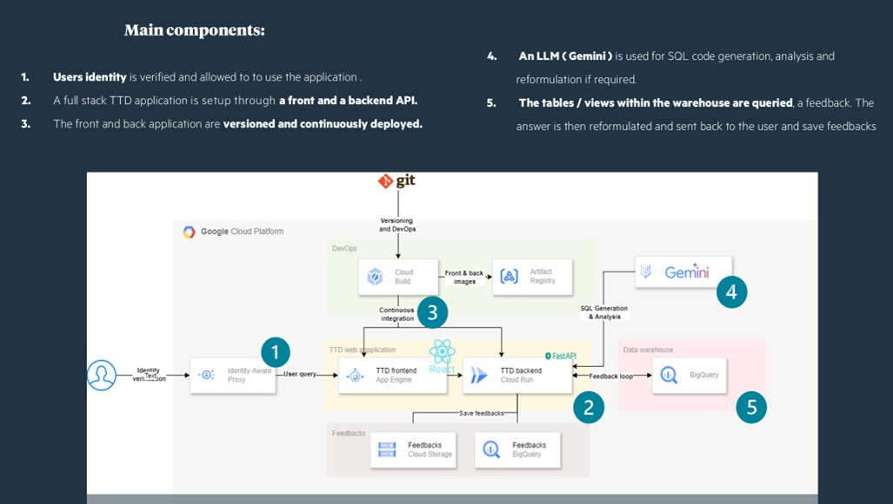
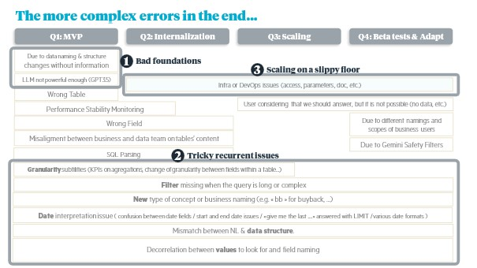

<!-- import useBaseUrl from "@docusaurus/useBaseUrl";

<link rel="stylesheet" href="{useBaseUrl('katex/katex.min.css')}" />
 -->
<!--truncate-->

 

## 1. Talk to data: a new frontier

‘2024 will be the year of talk-to-data’. It was with this conviction that we resolved, at the end of 2023, to tackle this challenge – mostly known under the technical name “Text-to-SQL”.
The widespread use of GPT-4-turbo and the upgrading of the Open AI competition, the fall in costs, the increase in the size of the context, and the incredible speed of the market meant that this huge challenge was going to be our new horizon.

## 2.	Why it is useful ?

If it's interesting for the data scientist, the challenge had to be interesting for the business.
We identified 3 types of useful use, which convinced our first customer:

  

 

What's more, we now have more feedback from the market to back up our belief in the value of such a system - for example, Uber claims to have cut SQL query authoring by 70% – supposedly saving 140,000 hours a month thanks to such a tool (source: https://medium.com/wrenai/how-uber-is-saving-140-000-hours-each-month-using-text-to-sql-and-how-you-can-harness-the-same-fb4818ae4ea3).

## 3.	Why it is hard ?

Hey, but wait! We've managed to build useful RAGs that can be used with LLMs such as GPT3.5, right? So why shouldn't that be enough to interact with a simple database, which often has the advantage of being tabular and therefore formatted? There's no need for parsing, chunking or preprocessing, is there?

Well... There are at least 4 main reasons explaining why this task is difficult:
1.	Ambiguity in Natural Language: varies from one user to another, and one question can have several answers
2.	Complex SQL syntax: You may need nested queries, aggregations, filters and conditions
3.	Schema & Naming Understanding: Alignment between the user question, the format of data, the naming of fields, and then the SQL... are not trivial
4.	Error Sensitivity: small errors in SQL lead to invalid queries or incorrect results, unlike natural language, where minor errors are often tolerated.

  

 

## 4. Our thoughts & plans

At the very beginning, we tried to frame the various ways to query tabular data in natural language.

This reflection resulted in the scheme below, balancing specificity of developments versus robustness (and maintainability) of the solution.

4 types of solutions were foreseen:
1.	A pure text-to-sql LLM
2.	A text-to-sql LLM enhanced by various controls & helpers
3.	Aggregation of data in automatically generated small tables
4.	A very laborious pattern extraction model to try to match natural language pieces with predefined SQL pieces

  

 

To fill in the gaps between these two axes, the “text-to-SQL + controls” solution was chosen, and the framework “Vanna” selected to quickly build a foundation for this.

  

 

## 5.	What we created

#An Architecture & a Baseline

To begin with, we created an architecture fitting with the client environment & the architects’ requirements – I won't go into too much detail here, but you can find a simplified diagram below.

  

 

To launch our work, we reframed the business need: the customer only wanted an application that would enable him to query his database: one question, one answer, directly in the form of data.
There was no need to generate text, but the main risk of Text-to-SQL became immediately apparent: how could a business user, unfamiliar with SQL and the tables available, know whether the tool was giving him a figure that answered his question precisely?
To address this issue, we immediately incorporated a natural language reformulation of the SQL query - which only addresses part of the problem, however. The human feedback loop was also native, because it's thanks to the examples (question, SQL answer) that Vanna works.
At this stage, we had:
- A dockerised architecture connecting back and front via FastAPI
- Vanna 0.0.3x
- A GPT 3.5 turbo (to limit costs on iterations, which proved useful at first)
- Access to 2-3 tables in an initially fixed format

# Issues & Solutions
What’s interesting with LLMs with “small” capabilities, is that the rest (code & prompts) needs to be super robust & meaningful.

Our work initially consisted of testing and identifying problems, the better to reflect on them and devise solutions.

Here is a non-exhaustive list of our worst problems:

  

 

From this experience, working iteratively, we have created new building blocks.
Here are a few of them, associated with 3 issues that we feel are emblematic of Text-to-SQL:

### a/ Problems linked to the database:

To manage problems linked to a change in the data (change of name, addition of field, modality, etc.), we created 3 types of referential that enabled us to observe and integrate table changes as automatically as possible, even when they were not communicated: 
1.	A replica of the data dictionary (Excel) used by the data team, listing the table name, field, type, description and an example of a value.
2.	A configuration automatically generated from the data available at the time of generation, listing the table schemas (CREATE TABLE ...), and examples of SQL queries automatically translated into natural language, the main purpose of which is to link a word with a field in a table (list the countries France, GB and Germany // SELECT country FROM table_A WHERE country in (‘FRA’, ‘GBR’, ‘DEU’))
3.	A repository of field values in STRING format

These repositories do not solve the fundamental problem of data instability and communication problems between teams, but they do provide a clear picture of what is being used, enable alerts to be raised quickly, and allow the most automatic possible adaptation to changes in the databases. Because the best response is above all to have real data governance, quality controls, bodies and processes for validating and communicating changes.

### b/ Problems linked to the lack of correspondence between the business language and the database language

This is the major difficulty with TTD.

There are several factors, and therefore several solutions:

- Unclear questions.

  - Example: what is the price of XXX -> no date, no distinction between new and used, etc.

  - Solution: 
    - Add default filters (e.g. most recent date)
    - Choose one of several possible tables, and specify this in the SQL query reformulation in natural language.

- Questions that are too specific. 
  - Example: ‘What is the price of X on 1 January at 1.03pm according to website Y in region Z?’ when the information is only available on average on a monthly basis.

  - Solution: in general, the LLM responds as best it can, and rephrasing allows the user to be informed of the level of detail in the response. But be careful, too much detail can lead the LLM to add aberrant filters - which again is visible in the reformulation.

- An implicit context

  - Example:

    - User A, living in France: what is the price of XXX? (implied: in France)
    - User B, living in the UK: what is the price of XXX? (implied: in the UK)

  - Solutions (not all integrated): 

    - Personalise the TTD with a simple prompt presenting the user's context
    - Add default filters based on country, entity, etc.

- Unclear field names

  - Example: field names such as ‘DL_MKT_TIME’. The description of the field allows the LLM to understand it, but the name of the field is very important.
  - Solutions: 

    - Create views dedicated to TTD
    - Use a business name in the TTD code, which will be replaced on the fly by its technical name when the request is made.

- Jargon in user questions

  - Example: business abbreviations (‘bb’ for ‘buyback’, etc.).

  - Solution: 

    - Specific jargon must necessarily be given to the LLM, either upstream (FT) or in the document base (which feeds the prompt).
    - Hybrid search can be used to retrieve specific business vocabulary that is not well represented in the latent vector space.

- Table formats (aggregation, filter, etc.) of which the user is unaware, leading to complex or impossible queries

  - Example: ‘what is the average selling price of X’ on a table aggregated by shop (requiring a weighted average).
  - Solutions: 

    - Information & instructions:

      - The description of the tables and fields must be clear about their level of aggregation.
      - More examples

    - Safeguards: 
    
      - Identify certain patterns in the query, then raise an error with a corrective message for the LLM
      - Even on-the-fly replacement of certain operations

- Specific field formats
  - Example: two fields for a single word, several words in one field value, etc.
  - Solution: in this case, the best solution is still to change the data. If this isn't possible and TTD doesn't work as expected, you can use ad-hoc prompts and fairly open SQL queries (e.g. ‘LIKE’ instead of ‘=’).

### c/ Performance drift & speed of development
To test the performance, a dedicated team of users asked regularly new questions (not the golden questions) to the tool on various tables & topics, the metric being simply here the rate of correct answers on answerable questions.

The final difficulty, linked to the high error sensitivity of text-2-sql, was its initial instability during development.
To remedy this, two minimum solutions quickly became apparent.
1.	Any new change must be accompanied by a drift measurement (loss of reliability on questions that have already been mastered).
2.	By adding tables, new prompt elements can be confused with older ones, which were not designed at the same time. To counter this, a table assignment mechanism upstream of the chain should enable the LLM to be directed towards a list of candidate tables.

## 6.	What’s next?
There are now many more interesting ‘talk to data’ tools, whether from Databricks, Google or elsewhere. 

The Bird SQL benchmark continues to fill up with new records, and LLMs have greatly improved their code generation, thanks in particular to the ‘test time compute’ approach.

But our experience shows that all these use cases will always require the following fundamental elements: excellent data governance, a solid business sense on the part of the players responsible for maintaining text-to-SQL-based products, and well-parametrized tools to ensure robust responses.

