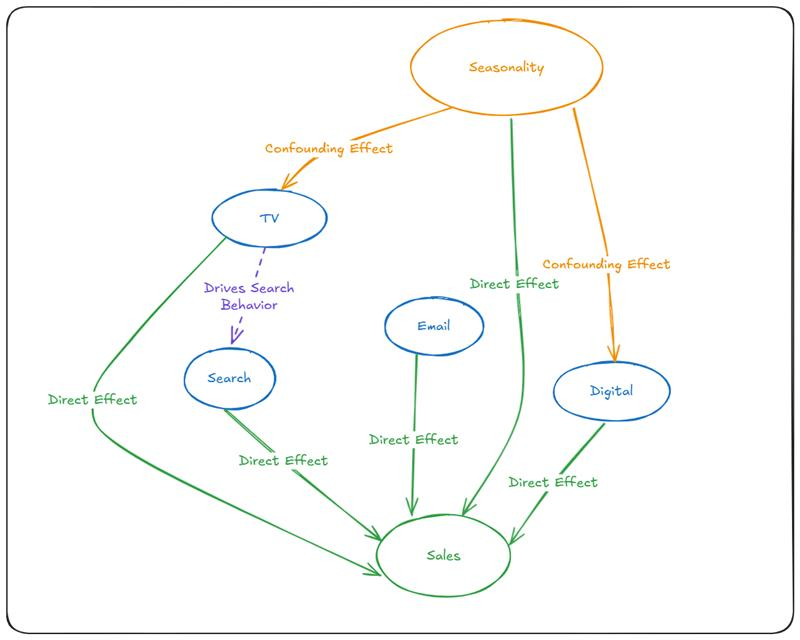

<!-- import useBaseUrl from "@docusaurus/useBaseUrl";

<link rel="stylesheet" href="{useBaseUrl('katex/katex.min.css')}" />
 -->
<!--truncate-->

<div align="justify"> 


# Marketing Mix Modeling: Opportunities of Using Causal Inference

Marketing Mix Modeling (MMM) has served as a foundational methodology for quantifying marketing effectiveness for decades. Its enduring relevance stems from its ability to provide aggregate insights across channels without relying on individual-level tracking. In today's privacy-centric landscape, this advantage has become even more valuable.

However, as marketing ecosystems grow increasingly complex, traditional MMM frameworks face new challenges in capturing the true dynamics of modern campaigns. This isn't to suggest that classical MMM approaches are obsolete—quite the contrary. Instead, we propose that integrating causal inference methodologies can enhance and extend these proven frameworks, addressing their limitations while preserving their strengths.

## The Causal Nature of Marketing ROI  

When any ad designer or CMO asks, "What was the return on investment of our TV campaign?", they are not simply inquiring about correlation – they're asking a causal question. In statistical terms, they're seeking to measure the effect of TV advertising spend on sales. This is the so-called Average Treatment Effect (ATE) in the causal inference field of study. More specifically, they might want to understand this effect for:
- Specific time periods or conditions
- Weeks or campaigns

All of these questions are trying to explain the true incremental impact of marketing activities on business outcomes.

Traditional MMM approaches typically employ regression techniques to model the relationship between marketing activities and business outcomes. These models have delivered substantial value by:

1. **Quantifying Channel Contributions**: Estimating the impact of different marketing channels on sales or other KPIs
2. **Optimizing Budget Allocation**: Providing guidance on how to distribute marketing investments
3. **Forecasting Outcomes**: Predicting the likely impact of planned marketing activities

These capabilities remain valuable, and the established MMM ecosystem offers robust tools for addressing fundamental marketing measurement questions. However, classical approaches often make simplifying assumptions that can limit their accuracy in certain contexts.

## The Independence Assumption Bait

While traditional regression models might seem sufficient when input variables are independent, real-world marketing data rarely satisfies this condition. Marketing plans are typically optimized to maximize sales, creating inherent correlations between channels and activities. This interdependence introduces several critical biases:

- **Selection Bias**: Advertisers naturally allocate more budget to channels that historically perform well, creating a self-fulfilling prophecy in the data.
- **Temporal Confounding**: Seasonal effects and marketing calendar events influence both advertising decisions and sales outcomes.
- **Channel Interaction Effects**: Marketing channels don't operate in isolation but influence and reinforce each other, creating complex causal pathways.

Rather than replacing traditional MMM, causal inference methodologies can be integrated to address specific limitations while building upon the existing foundation. This integration helps solve several persistent challenges:

### Challenge 1: Confounding Variables

Classical MMM struggles when unobserved factors influence both marketing decisions and outcomes. For example, a company might increase TV advertising during periods of expected high demand (holidays), making it difficult to disentangle the true impact of advertising from the seasonal effect.

Causal inference explicitly models these confounding relationships:

```python
# Traditional approach might look like:
import statsmodels.api as sm

# Simplified regression model treating all variables as independent
model = sm.OLS(sales, [tv_spend, digital_spend, search_spend, email_spend, seasonality]).fit()

# Causal approach explicitly models the confounding structure:
from dowhy import CausalModel
import networkx as nx

# Create a graph showing both direct effects and confounding relationships
g = nx.DiGraph()

# Add nodes for all variables
g.add_nodes_from(['TV_Spend', 'Digital_Spend', 'Search_Spend', 'Email_Spend', 'Seasonality', 'Sales'])

# Add direct effects on sales
g.add_edges_from([
    ('TV_Spend', 'Sales'),
    ('Digital_Spend', 'Sales'),
    ('Search_Spend', 'Sales'),
    ('Email_Spend', 'Sales')
])

# Add confounding relationships (seasonality affects both marketing and sales)
g.add_edges_from([
    ('Seasonality', 'TV_Spend'),
    ('Seasonality', 'Digital_Spend'),
    ('Seasonality', 'Sales')
])

# Add channel interaction effects (TV drives search behavior)
g.add_edges_from([
    ('TV_Spend', 'Search_Spend')
])

# Create causal model for a specific treatment (TV_Spend in this example)
causal_model = CausalModel(
    data=df,
    treatment='TV_Spend',
    outcome='Sales',
    graph=g
)
```

By explicitly modeling this causal structure, we can obtain unbiased estimates of the true effect of TV advertising, isolated from seasonal influences.

</div>

<div align = "center">

  
</div>

<div align="justify"> 

### Challenge 2: Channel Interactions and Spillover Effects

Traditional models often treat marketing channels as independent contributors, but modern marketing ecosystems are characterized by complex interactions. TV advertising might boost search volume, social media campaigns might amplify email effectiveness, and so on.

Causal modeling allows us to represent these dependencies mathematically:

</div>

<div align = "center">

  
</div>

<div align = "left">
where


  
</div>

<div align="justify">  

represents the indirect effect of TV advertising on sales via its influence on search behavior. This captures the reality that when TV campaigns run, they often drive consumers to search for the product or brand online, creating an indirect pathway to conversion. By modeling these pathways explicitly, we can attribute effects more accurately and understand both direct and indirect impacts of each marketing channel.

### Challenge 3: Non-Random Media Allocation

Marketing investments aren't randomly assigned—they're strategically allocated based on past performance, creating a form of selection bias. This can lead to misleading conclusions when using traditional regression approaches.

The potential outcomes framework from causal inference helps address this by explicitly considering counterfactuals:

</div>

<div align = "left">

  

where

  
  is the Average Treatment Effect
</div>


<div align="justify">

Y(1) is the outcome with treatment, and 

Y(0) is the outcome without treatment. 

This framework forces us to consider what would have happened without a particular marketing intervention, providing a more accurate measure of true incremental impact.

## Moving Toward Causal Solutions

To address these challenges at Ekimetrics, we've developed a hybrid approach that integrates causal inference into the classical MMM pipeline. By introducing a causal graph, we incorporate human expertise into the model, allowing us to explicitly represent and validate the relationships between variables. This step transforms MMM from a correlation-based tool into a causality-driven framework capable of uncovering adjusted marketing effectiveness.

### MMM Preprocessing

Begin with established MMM preprocessing techniques:
- Adstock transformations to capture carryover effects
- Saturation functions to model diminishing returns
- Seasonality adjustments to account for cyclical patterns

### Building a Causal Graph

Next, we build a causal graph that visualizes relationships between variables. Unlike traditional approaches, this step embeds domain expertise directly into the model. For instance, media_X might depend on media_Y, media_Z. Our causal graph explicitly encodes this dependency and establishes direct and indirect paths to the outcome variable.

### Validating Relationships

Once the causal structure is in place, we validate it through a combination of rigorous methods to ensure robustness and credibility:

- **Independence Tests**  
  We run statistical independence tests, such as the Chi-squared test, to verify whether the proposed relationships in the causal graph hold true in the data. These tests help confirm that the dependencies between variables are statistically significant and align with the causal structure.

- **Overlap Testing**  
  When conditioning on specific variables (e.g., during causal discovery or effect estimation), it's crucial to ensure sufficient data points remain for robust analysis. We carefully assess data quantity and overlap to avoid issues of sparsity that could compromise the validity of the results. This step ensures that the model remains reliable even after stratifying or subsetting the data.

### Quantifying Causal Effects

To understand the impact of each media campaign on sales, we use tools like DoWhy to estimate the Average Treatment Effect (ATE) for each media variable. The ATE provides a quantitative measure of how much a given campaign influences sales, both directly and indirectly.

```python
# For each channel, identify proper adjustment variables
identified_estimand = model.identify_effect(treatment='TV_Spend',
                                           outcome='Sales')

# Estimate causal effect using a method that leverages traditional MMM strengths
causal_estimate = model.estimate_effect(identified_estimand,
                                      method_name="backdoor.linear_regression")
```

This analysis also helps uncover synergies and spillover effects between variables, shedding light on how different campaigns interact with each other to drive outcomes.

### Ensuring Robustness

Validation is a critical step in ensuring the reliability and practical utility of our causal model. Rather than simply accepting point estimates, we systematically quantify the uncertainty associated with our causal effect measurements—an approach that enhances both analytical rigor and decision-making transparency.

We employ several complementary techniques to measure uncertainty:
- **Confidence Intervals**: Using bootstrapping approaches to generate confidence intervals around our Average Treatment Effect (ATE) estimates. This provides stakeholders with a clear understanding of the range within which the true causal effect likely falls.
- **Hypothesis Testing**: Calculating p-values that indicate the statistical significance of identified effects, helping differentiate between genuine causal relationships and potential statistical noises.
- **Sensitivity Analysis**: Systematically varying model assumptions to understand how robust our causal estimates are to different specifications and data conditions.
  
This focus on uncertainty measurement acknowledges the inherent limitations of causal inference in real-world settings with finite data. We recognize that causal estimates may be imperfect when data volume is limited, measurement noise is present, or when important variables might be unobserved. By transparently communicating these uncertainties, we enable more informed decision-making.


We also reconcile the experiment's results with Business validation. This involves comparing your causal MMM results against actual experimental data to verify that your model's predictions match observed outcomes in controlled settings. This process serves as a reality check that bridges statistical models with empirical evidence.

## Conclusion

As marketing ecosystems become increasingly complex, the need for robust causal inference in MMM grows more critical. By acknowledging and addressing the causal nature of marketing effectiveness measurement, we can deliver more accurate and actionable insights to decision-makers.

Understanding MMM as a causal inference problem rather than just a regression task is crucial for modern marketing analytics. This perspective enables more accurate measurement of marketing effectiveness and better-informed decision-making in an increasingly complex digital landscape.

---

## Glossary
 
**Average Treatment Effect (ATE)**  
The mean difference in outcomes between units that received a treatment and units that did not. In marketing, this represents the average incremental impact of a marketing intervention (e.g., TV campaign) on a business outcome (e.g., sales).

**Causal Discovery**  
The process of learning causal relationships from observational data. This involves identifying which variables cause others and constructing a causal graph based on statistical patterns in the data, often combined with domain knowledge.
 
**Causal Graph**  
A visual representation of causal relationships between variables using a Directed Acyclic Graph (DAG). In marketing, causal graphs explicitly show how marketing channels influence each other and sales, as well as how external factors like seasonality affect both marketing decisions and outcomes.
 
**Directed Acyclic Graph (DAG)**  
A mathematical structure consisting of nodes (variables) and directed edges (causal relationships) with no cycles. DAGs provide a formal way to represent causal assumptions and identify proper adjustment sets for causal estimation.
 
**Confounding Variables**  
Variables that influence both the treatment (e.g., marketing spend) and outcome (e.g., sales), potentially creating spurious associations. In marketing, seasonality is a common confounder as it affects both marketing decisions and consumer behavior.
 
**DoWhy**  
An open-source Python library for causal inference that implements a four-step process: modeling, identification, estimation, and refutation. DoWhy provides tools to build causal graphs, identify proper estimation techniques, and validate causal assumptions.
 
**Overlap Testing**  
A validation technique that ensures sufficient data exists across different values of treatment variables to enable robust causal estimation. This helps avoid extrapolation beyond the support of the data.


</div>