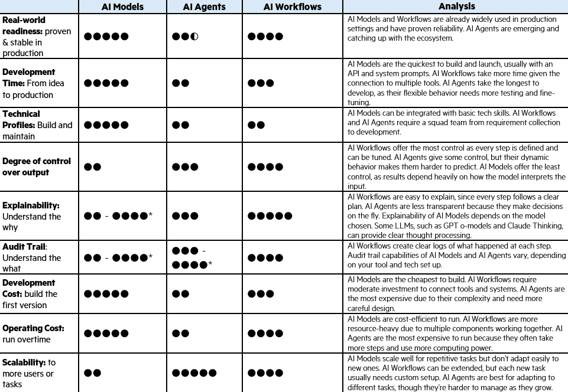
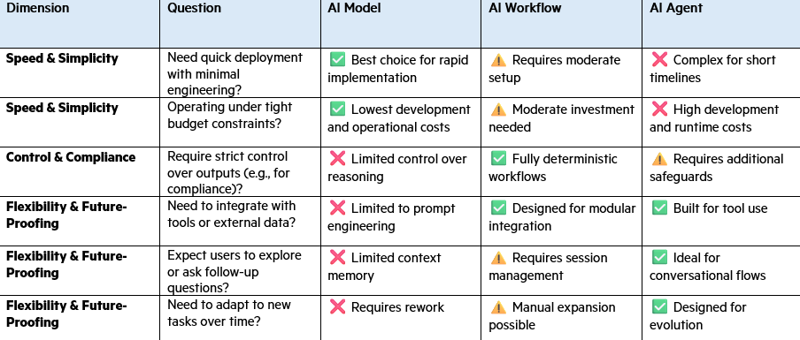

<!-- import useBaseUrl from "@docusaurus/useBaseUrl";

<link rel="stylesheet" href="{useBaseUrl('katex/katex.min.css')}" />
 -->
<!--truncate-->

 

## Motivation
Since the launch of ChatGPT in November 2022, Generative AI and Large Language Models (LLMs) have gained enormous traction across industries. Yet the limitations of standalone LLMs, particularly around factual accuracy, transparency, and task execution, have pushed many organizations to augment them with other tools and even other LLMs.

Two design patterns have emerged since then: **Workflow AI Agent**, where LLMs and tools are orchestrated through predefined code paths, and **AI Agents**, where LLMs are autonomous systems, capable of directing their own processes and tools. Both architectures have drawn significant attention, validated by their respective Google Trend Index. 
Given the heightened interests, we aim to explore the strengths and weaknesses of these different architectures based on our work in deploying different GenAI solutions for clients in financial services, gaming, and NGOs. We believe that in a field that is rapidly evolving, there is rarely a ‘best’ architecture that fits every scenario. As such, it is important to find the most suitable approach, based on the business objectives, development time, resources, scalability, context, and future proofing needs.

  

*Figure 1: Google Trends Worldwide*

 

## Define key terms: AI Model, AI System, AI Agent, Workflow AI Agent

Before diving deeper into our discussion, let's clarify some key terms: AI Models, AI Workflows (or AI Systems), and AI Agents.
### AI Models

In this article, we use the term **AI Models** to describe the integration of Large Language Models (LLMs) into an AI solution’s architecture. For instance, you might need to deploy an LLM to power a conversational assistant that fields customer queries, generate concise summaries of lengthy technical documents, or even translate content between multiple languages in real time. In each scenario, the LLM focuses on producing the best possible language outputs based on the data and instructions provided, without autonomously orchestrating additional steps or tools.

### AI Workflows

**AI Workflow** is one of the foundational design patterns seen in many compound AI systems. It brings together components like LLMs, retrieval modules, external tools, and scripts into a **structured sequence** to complete a defined task. What makes this pattern distinct is that it is deterministic: the logic and flow are defined in advance by developers, so the system behaves consistently across runs. While LLMs may handle language-related tasks within the workflow, they do not drive the overall process. Control remains with the orchestration logic.

### AI Agents

AI Agents take a different approach. While they may look structurally similar to **AI Workflow** by using many of the same components with the same goal to automate workflows, the key difference is in how decisions are made. Instead of following a fixed logic path, **an agent uses LLM’s reasoning to decide what to do next.** It can evaluate the situation on the fly and choose which tools or steps to use, making the system more flexible and capable of adapting to real-time changes.
 
To illustrate, imagine an AI Workflow-based itinerary planner – it follows a predefined logic: user inputs are processed through a fixed sequence to produce a structured plan. In contrast, an AI Agent-driven planner adapts dynamically – taking the same user input, LLM will determine whether clarifying questions needs to be asked and decide next steps to tailor the itinerary based on real-time context.
Both applications give you a travel itinerary, but the workflow-based approach offers high reliability and predictability, making it well-suited for use cases require stability in the output. The agent-based approach, while less predictable, provides greater flexibility and adaptability, especially valuable in handling ambiguous inputs or changing user needs.

   

 

#### Comparison of AI Architectures
Now that we have defined each architecture, let's visualize how they fundamentally differ in operation through a concrete example of an itinerary planner. While all three approaches can create travel plans, their implementation and behavior differ significantly.

  
*Figure 2: Comparison of AI Model, AI Workflow vs AI Agent approaches for an itinerary planner*

 

The diagram above illustrates how the same task of creating a travel itinerary is handled differently by AI Workflow and AI Agent architecture:

- **AI Models**: This approach represents the simplest form of AI implementation, where the LLM directly processes user input to generate a response. In our itinerary example, the user provides their travel preferences, and the LLM generates a plan in a single step. While straightforward, this approach lacks the structured integration of external data and tools, making it less suitable for complex, multi-step tasks.

- **AI Workflow**: This approach follows a strictly defined, linear process. The system begins by taking user input such as destination, dates, and preferences. It then systematically validates this input before querying a database of attractions. The LLM is employed in a controlled manner to generate the itinerary, after which the output is formatted into a structured plan. This deterministic approach ensures consistent, predictable results every time, with the LLM acting as a component within a larger, predefined system.

- **AI Agent**: In contrast, the agent-based approach centers around the LLM's reasoning capabilities. Starting with the same user input, the LLM acts as the central decision-maker, determining whether it needs additional information through clarifying questions. It dynamically decides which tools to use and how to adapt the plan based on real-time context. The process is iterative, with the LLM continuously refining the plan until it reaches a satisfactory outcome. This results in a more personalized, context-aware itinerary that can adapt to changing requirements and preferences.

This fundamental difference in architecture creates distinct implications for development, control, and operational characteristics. The model-based approach offers simplicity and speed but lacks sophistication. The workflow-based approach offers high reliability and predictability, making it well-suited for use cases requiring stability in the output. The agent-based approach, while less predictable, provides greater flexibility and adaptability, especially valuable in handling ambiguous inputs or changing user needs.

Choosing between these architectures is not always straightforward. While they can often solve the same business problem, they differ in development time, required technical expertise, and the level of control over outputs – especially in terms of accuracy, consistency, ethics, safety, and auditability. Cost, scalability, and explainability also play a significant role.

To simplify some of these complexities, we have tried to distill our experience into a straightforward table below, comparing how architecture compares with each other, assuming working on the same hypothetical use case as a baseline:

  

 

### Architecture Decisions in Real-World Use Cases
 
While the comparison framework above offers a useful lens for evaluating different AI architectures, the real test comes when theory meets reality. Every business challenge presents its own constraints—whether it's regulatory pressure, budget limitations, or the need for speed. In the following section, we’ll walk through a few real-world use cases where we had to choose between AI Models, Workflow AI Agent, and AI Agents. These examples highlight how architecture decisions are shaped not just by technical fit, but by business context, risk appetite, and long-term goals.

#### Automated Risk Assessment
**Industry**: FinTech  
**Problem**: Climate-related risk assessments were highly manual and inconsistent with a heavy reliance on ESG experts. This has made the process almost inaccessible for SMEs  
**Objective**: Build a production-read scalable, automated climate risk assessment solution using Generative AI that delivers structured, explainable, and audit-ready outputs without requiring sustainability expertise in 3 months

**Architecture Considered**:
- AI Model:  
    Considered for its speed and simplicity but pivoted to Workflow AI Agent after one week of trial. There were too many data points (200+) and thus lack consistency and reproducibility, which is considered crucial for a risk assessment tool.	
- AI Agent:  
    Not considered viable at the time of development (early 2024) due to the relative immaturity of agentic frameworks. Given the tight development timeline (3 months), we prioritized stability, reliability, and architectural maturity over autonomy.

**Final Architecture Chosen**:  
✅AI Workflow:  
- The need for transparency, auditability, and structured integration of external data made Compound Systems the best fit. The deterministic workflows allowed domain experts to review and validate the LLM-assisted risk assessment prior to rollout, supporting both automation and compliance.

**Outcome**:
- Over **200 data points** incorporated into each risk assessment.
- **1,023** industries mapped using ISIC classifications.
- **100% automation** achieved with no sustainability expertise required from end users.
- Combined LLM-driven reasoning with structured frameworks and expert-reviewed logic.
- Built-in scalability to extend across other qualitative risk domains.

 

#### Talk-to-Data Agentic AI Chatbot
**Industry**: Environmental NGO  
**Problem**: A global non-profit had built a powerful data platform to track global plastic waste flows, but the insights were underutilized. Non-technical users struggled to access and analyze the data due to the need for SQL knowledge and a deep understanding of the data model.  
**Objective**: Make sustainability data more accessible through a natural language interface that allows users to explore, analyze, and visualize complex datasets without needing technical skills.

**Architecture Considered**:
- AI Model:
    - Simple Q&A possible, but too limited for multi-step reasoning and dynamic chart generation. Lacked memory, tool use, and contextual adaptability.
- AI Workflow:
    - Considered for its control and structure, but required explicit flows and didn’t scale well for open-ended, exploratory queries.

**Final Architecture Chosen**:  
✅AI Agent:  
- Chosen for its ability to interpret user intent, reason across multiple steps, and dynamically generate queries, retrieve data, and trigger visualizations—all within one conversational experience. The flexibility of AI agents made it possible to support open-ended exploration, follow-up questions, and task-switching within a single conversation. This was essential for allowing users to interact with the data naturally, especially when queries involved comparing metrics, filtering across regions, or generating visual summaries.  

**Outcome**:
- Achieved a **40% increase in query accuracy** compared to traditional SQL.
- **Query execution time reduced by 70%**, with visual results returned in ~5 seconds.
- Enabled **non-technical users** to explore data and uncover insights independently.
- Created a scalable, interactive solution that can grow alongside the organization’s data and user base.

 

#### International Gaming Company
**Industry**: Gaming  
**Problem**: The company faced ongoing bottlenecks in decision-making due to limited data accessibility. Complex database structures required frequent developer support for even basic queries, preventing business users from retrieving insights independently. To improve efficiency, they needed a solution that could simplify access to complex data, reduce reliance on technical teams, and integrate seamlessly with existing communication tools—all through an intuitive, self-serve interface.  
**Objective**:
Build a natural language interface that allows business users to query any data point from their complex database through messenger application, eliminating the need for custom API development while maintaining accuracy, performance, and scalability.

**Architecture Considered**:
-	AI Model:
    - It is considered for its simplicity but lacked the ability to handle complex multi-step queries and data integration requirements.
    - Limited in handling structured data operations and maintaining context across queries.
-	AI Agent:
    - Considered but deemed too complex for the current requirements, with concerns about predictability and control.

**Final Architecture Chosen**:
✅ AI Workflow 
-	Chosen because of its fit to the use case: deterministic nature of the user queries with no requirement on supporting functions beyond getting data from the system in natural language. 
-	The timeline for this use case is tight, as such a more stable and proven framework is preferred, with development focus on overcoming data integration challenge, accuracy, and latency.

**Outcome**:
- Successfully implemented a production-ready talk-to-data bot integrated to instant messenger in **1.5 months**.
- Achieved a **98% improvement in query efficiency** by enabling customer service associates to independently access the data they needed. What once took 30 minutes and required IT team support was reduced to just 30 seconds through a **self-serve interface**—dramatically accelerating customer response times and reducing internal bottlenecks.
- **Maintained 90% accuracy** in SQL query generation and execution.
- Created a traceable and auditable system for data operations.

 

### Decision-Making Framework
Choosing the right AI architecture is more than a technical decision—it's a strategic choice that must align with your business objectives, constraints, and risk tolerance. Based on our experience across various industries and use cases, we've developed a practical framework to guide this decision-making process. This framework considers key factors that influence architecture selection, from development timelines to operational requirements.

The following table provides a comprehensive comparison across three key dimensions: Speed & Simplicity, Control & Compliance, and Flexibility & Futureproofing. Each dimension includes specific questions that help determine which architecture best suits your needs.

  

 

When using this framework, consider these key insights from our real-world implementations:

1.	**AI Models** excel when you need a quick, cost-effective solution for straightforward tasks. They're particularly suitable when you have well-defined inputs and outputs, and don't require complex integrations or strict compliance requirements. However, they may struggle with tasks requiring multi-step reasoning or tool integration.
2.	**AI Workflows** shine in scenarios where you need predictable, auditable processes with clear control over each step. They're ideal for compliance-heavy industries like finance or healthcare, where you need to maintain strict oversight and documentation. The trade-off is reduced flexibility and higher initial setup costs.
3.	**AI Agents** are best suited for complex, exploratory tasks where users need to interact naturally with the system. They excel in scenarios requiring dynamic decision-making and tool usage, but require careful consideration of cost, complexity, and control mechanisms.

Remember that this framework is not static — as AI capabilities evolve, so should your evaluation criteria. The choice between these architectures often involves trade-offs, and the optimal solution may involve combining elements from multiple approaches to meet your specific needs.

If you are interested, please [connect with us](mailto:inno@ekimetrics.com)

