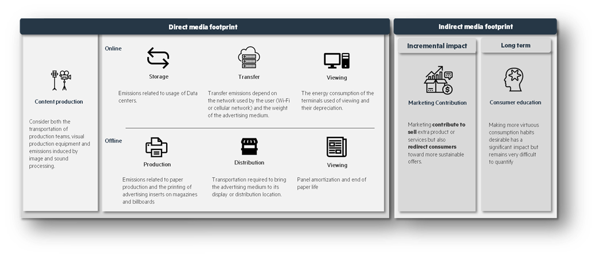
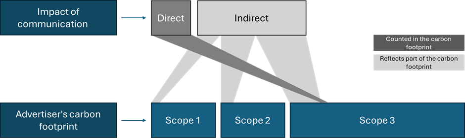

<!-- import useBaseUrl from "@docusaurus/useBaseUrl";

<link rel="stylesheet" href="{useBaseUrl('katex/katex.min.css')}" />
 -->
<!--truncate-->

 

Have you ever considered the ecological footprint left by an advertising banner or a magazine filled with advertisements? In a world where ecological transition has become imperative, no sector can escape scrutiny of its environmental impact - and communication is no exception, being directly and indirectly responsible for 5% of French emissions.

Our research, of which we present the first part here, aims to break down and analyze the carbon footprint of the communication industry. This analysis is structured around two complementary publications:

In this first article, we establish the conceptual foundations necessary to understand the complexity of the sector's environmental impact. We explore the crucial distinction between direct and indirect effects, before delving into the various mechanisms through which communication influences our consumption behaviors. This theoretical framework is essential for grasping the true environmental challenges facing the sector.

The second part will focus on precisely quantifying these impacts through a rigorous methodology. We will reveal data on the carbon impact of communication in France, showing orders of magnitude that could transform our perception of this sector's role in the climate crisis.

Together, these two articles offer a holistic understanding of the challenges and opportunities facing the communication industry considering the climate emergency. Because while understanding is the first step, precise measurement is the essential prerequisite for any effective action.

## A Dual Impact

The environmental impact of communication breaks down into two main effects, fundamentally different in their nature and scale:

- **Direct emissions**: linked to the consumption and purchases necessary for the creation and distribution of communications. These correspond, for example, to the pollution generated by powering advertising servers and printing posters.
- **Indirect emissions**: resulting from changes in consumption and behaviors caused by these communications. Advertising contributes to expanding market sizes, and consequently the production of polluting goods.

  
*Figure 1 : Breakdown of marketing impact (Ekimetrics, 2023)*

 

This distinction is key to properly understanding the environmental responsibility of the sector. Let's examine each of these dimensions in more detail.

However, be careful, the notion of scope 4 is often used to refer to these indirect emissions. This doesn't make sense because indirect emissions are related to emissions that the company records in its scopes 1, 2, and 3 to produce the goods and services sold thanks to marketing. However, these emissions could have been avoided if marketing had promoted other less emissive products or not promoted products at all.

  
*Figure 2 : Contribution of direct and indirect impact to a company's carbon footprint*

 

Let's look at each of these elements in more detail:

 

## Direct Impact: A Highly Structured Area in France with Ongoing Internationalization

Unlike the indirect impact, still largely unexplored, the direct impact of communication benefits from growing attention and significant standardization efforts in methodology to quantify environmental impacts. These efforts focus on establishing consistent measurement frameworks and assessment protocols across the industry.

### French Professionalization of Measurement
France is at the forefront of this structuring, with an ecosystem of specialized tools according to communication sectors. It's interesting to distinguish between work done to evaluate emissions due to production and those related to message distribution:

### Production: France Conditions its Aid on Environmental Assessment
In the field of audiovisual production, several calculators have been approved by the National Center for Cinema (CNC):
- [SeCO2](https://www.flyingsecoya.com/) developed by Secoya Eco-tournage, allowing measurement of the footprint of live-action productions.
- [Carbon' Clap](https://ecoprod.com/) created by the Ecoprod association, a pioneer in this field.
- [Carbon Stage](https://greenly.earth/) designed by the company Greenly.

The animation sector is also well represented with [Carbulator](https://www.animfrance.fr/), developed by Anim France, while the video game industry has  [Jyros](https://www.gameonly.org/), created by Game Only. This structuring is accompanied by progressive institutionalization: the CNC now conditions certain subsidies on conducting environmental impact analyses, strongly encouraging the adoption of these practices.

### Distribution: Towards Standardization of Methods

On the communication distribution side, professional unions and audience measurers such as [SRI](https://www.sri.fr/sri/fr/) or [SNPTV](https://www.admtv.org/communiques/le-snptv-publie-son-referentiel-methodologique-pour-la-mesure-de-lempreinte-carbone-de-la-diffusion-des-campagnes-publicitaires-en-tv-lineaire/) are developing calculators to homogenize data collection and impact analysis. Among advertisers, the Union Des Marques (UDM) is taking a step back and proposing to aggregate these initiatives in a [meta-framework](https://uniondesmarques.fr/nos-services/actualit%C3%A9s/article/2023/06/29/LUnion-des-marques-lance-son-m%C3%A9ta-r%C3%A9f%C3%A9rentiel-sur-la-mesure-de-limpact-carbone-des-campagnes-de-communication) intended to harmonize and make visible all these tools (Press: [SEPM](https://www.lapressemagazine.fr/actualite/presse-magazine-sengage-le-climat-le-sepm-lance-eco-impact-sepm-calculateur-dempreinte), Digital: [SRI](https://www.sri.fr/sri/fr/), Radio: [Bureau de la Radio](https://d-k.io/media/pages/ressources/referentiel-bureau-de-la-radio/3155003852-1690875731/radio-et-audio-referentiel-calcul-empreinte-carbone-diffusion-campagnes-publicitaires-radio-audio-vdef.pdf), TV: [SNPTV](https://www.admtv.org/communiques/le-snptv-publie-son-referentiel-methodologique-pour-la-mesure-de-lempreinte-carbone-de-la-diffusion-des-campagnes-publicitaires-en-tv-lineaire/), outdoor: [UPE](https://carbone-calculateur-adoohcc.upe.fr/…))

### An Internationalizing Dynamic
This French movement is rapidly extending internationally. The multiplication of specialized third parties measuring environmental footprint ([Scope 3](https://scope3.com/), [I-Care](https://icare.com/), [DK](https://d-k.io/en), [ALICE developed by Publicis](https://alice.publicisgroupe.com/fr/), [Ekimetrics](https://www.ekimetrics.com/fr)) has led to the birth of a global initiative: [Add Net Zero](https://adnetzero.com/). This coalition aims to harmonize methodologies and create a global standard for the communication industry. Digital giants are also beginning to integrate these concerns. For example, Google now publishes information on the carbon footprint of its advertising campaigns.

### A Persistent Blind Spot
Despite these significant advances, a fundamental dimension remains absent from current frameworks: the impact of the message conveyed. Existing tools focus exclusively on production and distribution processes, neglecting the effect of content on consumption behaviors.  
This gap is problematic because our conceptual analysis suggests that this indirect impact could far exceed that of direct operations. Precisely measuring the carbon footprint of a filming or the energy consumption of a digital campaign is necessary but insufficient to understand the overall environmental responsibility of the sector. That's why we want to address it as an equally important subject to indirect impact.

 

## Indirect Effect: The Hidden Power of Communication on Our Consumption Choices

The indirect impact of communication represents a complex ecosystem of intertwined influences on our consumption behaviors. Far from being monolithic, this impact unfolds through several distinct mechanisms, forming a web of influences with varied environmental consequences.

### The Triptych of Advertising Impact
Our analysis of scientific literature has allowed us to identify three fundamental mechanisms through which communication modifies consumption behaviors:

**The (adverse) redistribution effect** postulates that the market is a zero-sum game and that advertising changes the distribution of demand among brands. When a car brand communicates effectively, it can attract 100 customers who would otherwise have bought from a competitor, without increasing the total number of vehicles sold (Dubois et al., 2018). It's a transfer of market share without modification of the overall volume of sales.

**The growth effect** represents the ability of communication to extend the boundaries of the market itself. A campaign for smartphones can convince consumers who had not planned to buy a new device this year to take the plunge, thus creating additional demand that would not have existed without this communication.

**The price effect**, particularly subtle, leads advertising to transform the perception of value and price sensitivity (Erdem et al., 2008). Premium communication for organic coffee can simultaneously justify a higher price for certain consumers (potentially decreasing the volume sold) while drawing attention to the entire category, stimulating price sensitivity and sometimes pushing competitors' prices downward (thus increasing the overall volume).

### Radically Different Environmental Consequences
These three effects are compatible with brands' objective of maximizing profitability. However, they fundamentally diverge in their environmental implications:

**The redistribution effect**, although seemingly neutral since it does not modify the overall volume of consumption, can nevertheless lead to significant indirect consequences. If an SUV manufacturer captures market share at the expense of a manufacturer of low-consumption city cars, the overall carbon impact increases without any additional cars being sold. This effect reveals the ability of communication to redirect consumption flows between products with different carbon footprints.

**The growth effect** constitutes the most directly problematic mechanism from an environmental perspective. Each additional act of consumption represents a new drain on planetary resources and new greenhouse gas emissions. The effectiveness of communication in generating additional demand then becomes a direct amplifier of environmental pressure.

**The price effect** presents a fundamental ambivalence. On one hand, communication can help valorize sustainable products, justifying a price premium that finances ecological innovation. On the other hand, by making consumers less sensitive to price, it can democratize access to certain high-impact product categories, increasing their diffusion. The directionality of this effect fundamentally depends on the nature of the products promoted.

### Towards an Operational Analytical Framework
To establish a rigorous conceptual framework for the indirect impact of communication, we must recognize these nuances while keeping in mind the objective of a practical assessment. The redistribution effect, although important for understanding market dynamics, presents an apparent neutrality that can be misleading when applied to products with different environmental footprints. The price effect, meanwhile, would require detailed econometric data to be properly evaluated.

This complexity reminds us that any measure of the environmental impact of communication must integrate not only the volume of consumption generated, but also the nature of the products and services promoted, as well as their alternatives in the market.

In the second part of our article, we try to quantify the [Impact of Communication on Our Carbon Footprint](http://localhost:8080/blog/Quantifying_Impact_Communication)

## Conclusion

At the end of this analysis, one observation stands out: the iceberg of the environmental impact of communication shows only its tip. With only 6% direct impact against 94% indirect impact, we must fundamentally rethink our approach to the sector.

In our next article, we will dive into the precise figures and methodologies that allow us to quantify this impact, revealing how communication could become a major lever for ecological transition rather than an accelerator of unsustainable consumption.

The question that awaits us is crucial: how to transform a sector whose historical purpose has been to stimulate consumption into a catalyst for sobriety?

## Works Cited

Arcom. (2024). *Perspectives d’évolution du marché.*  
CITEPA. (2024). *Émissions de gaz à effet de serre 1990-2023.*   
Delloite. (2017). *The economic contribution of advertising in Europe. A report for the World Federation of Advertisers.*   
Dubois, P. G. (2018). The effects of banning advertising in junk food markets. *The Review of Economic Studies*, 85(1), 396-436.  
Ekimetrics. (2023). *How MMM can become a powerfull tool for sustainble business performance. *  
Erdem, T. K. (2008). The impact of advertising on consumer price sensitivity in experience goods markets. *Quantitative Marketing and Economics*, 6, 139-176.  
Giraud, G. (2014). *How Dependent is Growth from Primary Energy ? *  
Greenpeace France, l. R. (2020). *PUBLICITE :POUR UNE LOI EVIN CLIMAT.*  
INSEE. (2024). *LES COMPTES DE LA NATION EN 2023. *  
Molinari, B. &. (2017). Advertising and Aggregate Consumption: A Bayesian DSGE Assessment. *The Economic Journal*, 128. 10.1111/ecoj.12514.  

