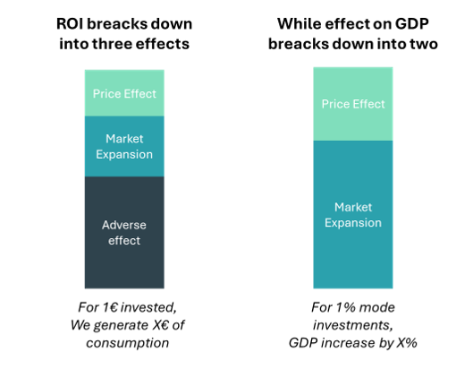
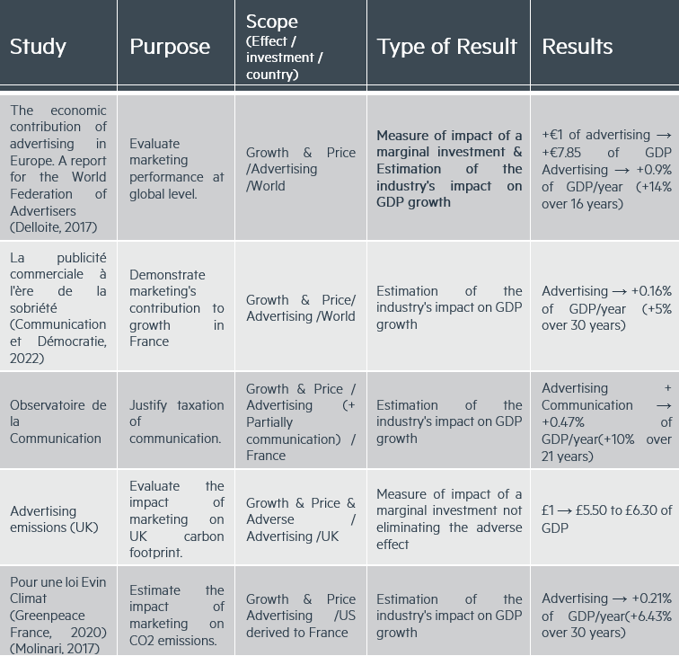

<!-- import useBaseUrl from "@docusaurus/useBaseUrl";

<link rel="stylesheet" href="{useBaseUrl('katex/katex.min.css')}" />
 -->
<!--truncate-->

 

"Numbers tell stories that words cannot express." This maxim takes on its full meaning when addressing the environmental impact of communication. In our previous article, we established a conceptual framework distinguishing between the direct and indirect impact of communication, revealing the complexity of the mechanisms through which this sector influences our collective carbon footprint. Today, we transform this theoretical framework into a concrete measurement tool.  
In a context where companies are called upon to reduce their greenhouse gas emissions by 5% per year, the communication industry faces a fundamental question: how to evaluate and optimize its real contribution to the ecological transition?

This question is all the more crucial as the recent [French ministerial report](https://www.linforme.com/energie/article/le-rapport-choc-qui-veut-rendre-la-publicite-plus-durable_2686.html) proposes a transformation of climate contracts and increased regulation of commercial communications. To respond in a quantified manner, we have conducted an in-depth analysis distinguishing between the direct footprint (linked to agency and media activities) and the indirect footprint (resulting from generated consumption behaviors).
Our study reveals an undeniable finding: while the direct footprint of the sector represents approximately 1.02 MtCO2e (or 0.27% of French national emissions), its indirect footprint reaches 16.55 MtCO2e, equivalent to 4.44% of the national carbon footprint. This ratio of 1 to 16 between direct and indirect impact persists even in our most conservative sensitivity analyses, where it varies from 4 to 80 depending on the assumptions. This disproportion upends the traditional perspective and demonstrates that beyond eco-designing campaigns, the sector's main lever for action lies in the strategic orientation of marketing investments.

## Direct Effect: Quantifying the Operational Footprint of Communication

To evaluate the direct carbon footprint of the sector, two methodological approaches are available:

- The **top-down approach** relies on carbon assessments published by major players in the sector to estimate the overall impact of the industry. This method offers a macroscopic vision and allows capturing the diversity of communication professions.
- The **bottom-up approach** uses specific emission factors by type of activity to build an estimate from elementary processes. It allows a more granular analysis of emission sources.

The table below synthesizes the strengths and limitations of each method:

  

*Table 1: Comparative study of methods for estimating the direct impact of communication.*

 

For this first global assessment, we favored the top-down approach, while recognizing that it may lead to a high estimate of the sector's footprint.

### Data from Major Communication Groups

Our analysis is based on the CSR reports of the six largest global communication groups, whose carbon intensities (kgCO₂e/€) were calculated by relating their total emissions (scopes 1, 2, and 3) to their turnover:

  

*Table 2: Comparison of emissions from communications companies according to their level of activity*

\* No clear location-based data were available for scope 2, therefore market-based emissions might have been used.  
\** Average conversion factor was used for the year to turn the data in euro    
\*** Scope 3 covers only aviation, so the data were ignored

This analysis reveals an interesting trend: French groups (Publicis, Havas) present a significantly lower carbon intensity than their international counterparts. This difference could be explained by earlier sensitivity to environmental issues in France or by specificities in the structure of activities. However, the variation remains contained within a factor of 1 to 4, suggesting a certain sectoral consistency.

For our national estimate, we retained the average value of **0.031 kgCO₂e/€**, which represents a prudent and robust approximation of the sector's carbon intensity.

### Carbon Footprint of the Sector in France

According to data from Arcom (Arcom, 2024), the business volume of communication in France amounts to 33 billion euros, divided between media (52%) and non-media (48%). By applying our average carbon intensity factor of 0.031 kgCO₂e/€ to this activity volume, we obtain a direct footprint **of 1.02 MtCO₂e for the entire sector, or about 0.27% of French national emissions** (373 MtCO₂e in 2023 according to CITEPA, 2024).

This estimate, although significant, places the communication sector among moderate contributors to direct national emissions. However, as we will see in the next section, this vision captures only a fraction of the sector's real environmental impact.

## Indirect Effect: Measuring the Impact of Communication on Consumption

After quantifying the direct operational footprint of communication, we tackle a more complex challenge: evaluating its impact on consumption behaviors and, consequently, on the associated greenhouse gas emissions.

### Review of Scientific Literature

Our approach is based on an in-depth analysis of academic studies and gray literature. We identified two main categories of relevant publications:
- ROI aggregation studies that estimate the economic effectiveness of communication at the advertiser level.
- Macroeconomic analyses that measure the effect of advertising on consumption volume and GDP growth.

  

*Figure 1: Decomposition of measured effects as a function of the observed variable.*

 

The table below summarizes the main international studies on the subject:

  

*Table 3: Summary of analyses on the impact of communication*

 

## Methodology: Translating Economic Impact into Carbon Footprint

To establish a robust method, we distinguished three different approaches in these studies:

1.	**ROI aggregation** without accounting for the adverse effect between competitors
2.	**Estimation of overall impact** on consumption (useful for modeling contribution to growth)
3.	**Calculation of marginal impact** allowing modeling of the effect of variations in investments

We favored the results of the "Value of Advertising" study (Deloitte, 2017) as a starting point, while adjusting them by a corrective factor integrating the more moderate results of other publications.

### Structuring Hypotheses

Our model is based on three fundamental hypotheses:

1.	**Hypothesis of communication market efficiency**: We consider that media and non-media, each representing about 50% of investments, generate an equivalent median ROI.
2.	**Hypothesis of marginality of the price effect**: The price effect is considered secondary compared to the market growth effect. The work of Dubois, Griffith, and O'Connell (Dubois, 2018, p. 421) on the British chip market shows that a total stop of advertising would generate only an increase in price sensitivity of less than 3%.
3.	**Hypothesis of GDP-Energy-Carbon correlation**: We rely on the work of Giraud (Giraud, 2014) demonstrating the strong historical correlation between GDP and energy consumption, allowing us to establish a carbon intensity factor per euro of GDP.

For methodological prudence, we did not integrate the adverse effect (redistribution between competitors) in our model, which leads to a minimal estimate of the potential impact of communication.

### Calculation of the Indirect Footprint

Our approach breaks down into three steps:

**Step 1: Estimation of generated consumption**

We start with the GDP generation factor of €7.85 per euro invested (Deloitte, 2017), which we adjust by a corrective factor of 0.48 to reflect the average of other studies (ratio 0.43/0.9 between the average impact and that of the reference study).
Calculation: €33 billion (communication investment) × 7.85 (GDP factor) × 0.48 (corrective factor) = **€125.2 billion** of additional consumption generated by communication in France.

**Step 2: Conversion to carbon intensity**

We calculate the average carbon intensity of French GDP by dividing national emissions by GDP:
- National emissions 2023: 373 MtCO₂e (CITEPA, 2024)
- French GDP 2023: €2,822.5 billion (INSEE, 2024) 

Yielding an intensity of **0.13 kgCO₂e per euro of GDP.**

**Step 3: Calculation of the indirect footprint**

By applying this carbon intensity to the generated consumption: €125.2 billion × 0.13 kgCO₂e/€ = **16.55 MtCO₂e** This indirect footprint represents approximately **4.44% of the French national carbon footprint**, or more than 16 times the direct impact of the sector.  
This result underlines the critical importance of considering the influence of communication on consumption behaviors when evaluating its overall environmental impact.

## Conclusion: Transforming Communication into a Lever for Ecological Transition

Our study reveals a fundamental truth for the communication industry: with 94% of its carbon impact coming from indirect effects versus only 6% from direct impact, the sector must profoundly rethink its contribution to the ecological transition. This disproportion, robust even in our most conservative sensitivity analyses, demonstrates that eco-designing campaigns, while necessary, cannot suffice given the scale of the challenge.
The real issue lies in the strategic orientation of the €125.2 billion of additional consumption generated each year by the sector in France. How can this considerable influence be transformed into a positive force for the planet?

At Ekimetrics, we have developed the MM4S (Marketing Mix for Sustainability) methodology to precisely answer this question. Our approach quantifies and optimizes the dual dimension of marketing:
- Its traditional commercial performance
- Its overall environmental impact

Our analyses demonstrate that a strategic reallocation of marketing budgets can simultaneously improve sales and reduce the carbon footprint. In practice, this means:
- Reducing advertising pressure on high-impact products
- Accelerating the visibility of sustainable offerings
- Objectively quantifying marketing's contribution to the company's environmental objectives

At a time when regulations are rapidly evolving, this data-driven approach allows companies to anticipate future constraints while transforming their communication into a real lever for ecological transition. Because the message is clear: communication can no longer be content with greening its image – it must become a measurable catalyst for the transformation of our consumption patterns.

Faced with this observation, professionals in the sector now have the opportunity to reinvent their profession, combining marketing expertise and environmental responsibility. It is this new paradigm that Ekimetrics accompanies, with concrete solutions to measure, pilot, and optimize the global impact of your marketing investments.

## Cited Works

Arcom. (2024). *Perspectives d’évolution du marché*.  
CITEPA. (2024). É*missions de gaz à effet de serre 1990-2023*.  
Delloite. (2017). *The economic contribution of advertising in Europe. A report for the World Federation of Advertisers.*  
Dubois, P. G. (2018). The effects of banning advertising in junk food markets. *The Review of Economic Studies*, 85(1), 396-436.  
Ekimetrics. (2023). *How MMM can become a powerfull tool for sustainble business performance.*  
Erdem, T. K. (2008). The impact of advertising on consumer price sensitivity in experience goods markets. *Quantitative Marketing and Economics*, 6, 139-176.  
Giraud, G. (2014). *How Dependent is Growth from Primary Energy ?*  
Greenpeace France, l. R. (2020). *PUBLICITE :POUR UNE LOI EVIN CLIMAT.*   
INSEE. (2024). *LES COMPTES DE LA NATION EN 2023.*  
Molinari, B. &. (2017). Advertising and Aggregate Consumption: A Bayesian DSGE Assessment. *The Economic Journal*, 128. 10.1111/ecoj.12514.  

