<!-- import useBaseUrl from "@docusaurus/useBaseUrl";

<link rel="stylesheet" href="{useBaseUrl('katex/katex.min.css')}" />
 -->
<!--truncate-->

 

## The Technical Implementation

As mentioned above, the UI tools are:
- The Document Upload Dashboard with the following functionalities:
    - Company file upload
    - Company score generation
    - Company report generation
    - A chatbot that answers questions specific to a company and based only on their documentation

- The Global Assessment Dashboard – which enables management, commercial, and sustainability leads to explore and understand the overall ESG performance of our client-base, at a glance.
In the following pages we explore in detail the tech-stack and technical implementation of: the UI, the backend of the Document Upload Dashboard, and the Global Assessment Dashboard.

### The Tech-Stack

The Document Upload Dashboard is powered on the backend by the following resources:
- Streamlit – For building the front-end UI 
- Azure App Service – Hosts the webapp
- Azure App Service Plan – Defines the computing power and scaling rules for the App Service, ensuring smooth performance.
- Azure Storage Account – Where all the uploaded company documents, generated reports, and the due diligence questionnaire are stored. 
- Eki.Parser – Extracts text from company documents (PDFs, reports, etc.). Library created by Ekimetrics.
- Azure Databricks – Hosts the Python functionality that processes the documents, generates vector embeddings (numerical representations of text for better searching), and stores them for efficient retrieval. It also sends requests to GPT-4.o API to answer the pre-defined questions.
- Azure Container Registry – Stores Docker images for the front end.
- Docker - A containerization platform that packages applications and their dependencies into isolated environments called containers, making it easier to deploy and run applications, as it ensures consistency of dependencies across different environments.
- Azure Search Service – Acts as the "brain" for finding relevant documents. When a user asks a question, it looks for the most relevant information in the stored data.
- Azure Key Vault – Stores and protects sensitive information such as API keys and passwords.
- Azure OpenAI– Service that provides access to an GPT-4.o API -  the LLM that takes the retrieved documents and generates a well-formed response.
- Bitbucket – A Git-based platform for source code management and version control. Bitbucket hosts the project repositories, tracks changes, and integrates with the CI/CD pipeline to automatically trigger builds, tests, and deployment processes when updates are made to the dev or main branches. We have two repositories, one for the UI, and the other for the backend of the Document Upload Dashboard.
- Poetry – A Python dependency management tool that helps package and manage libraries, ensuring consistent dependencies across different environments.
- Python – A high-level programming language widely used for data science, machine learning, web development, and automation, and known for its readability and extensive ecosystem of libraries. This is the only language we use to create the tool.

The Global Assessment Dashboard is powered by:
- Storage Account – Where all the generated reports with the company scores are stored. 
- Power BI – A business analytics tool by Microsoft that enables the creation of interactive visualizations and reports.

### The RAG architecture 

RAG stands for Retrieval-Augmented Generation. It is an AI framework that leverages large language models (LLMs) to answer user queries more precisely. It works in three steps:
- Retrieval – Searches a knowledge base (e.g., databases, documents, or APIs) for relevant context, based on the user query.
- Augmentation – Injects the retrieved data into the prompt to an LLM, to provide additional context.
- Generation – Uses an LLM to generate a response, grounding answers in factual data.

As such, RAGs reduce hallucinations by ensuring that responses are based on actual data rather than only the model’s pre-trained knowledge, and enhances explainability by providing references to the text used for generating the response. This architecture also leverages the state of the art LLMs, and avoids having to go through the expensive and complex process of training a specialised LLM.

Example use cases of RAG implementations include Ekimetrics’ Climate Q&A [2], and CLAIRE [3]. Climate Q&A simplifies access to environmental science by answering questions based on extensive scientific reports, including those from the IPCC and IPBES. CLAIRE is a multi-agent generative AI system that helps to democratize topics of Responsible AI. Both are part of the “digital communs” that Ekimetrics provides for free to the community.

Figure 6 shows the RAG architecture of the ESG Due Diligence tool. The flow begins with a set of predefined due diligence questions, stored as a file in Azure Blob storage, which are also retrievable on the UI to allow users to see the questions when they select the dedicated option. Next, we have users uploading company documents, which are stored in Azure Blob Storage, and are also made retrievable to allow the user to download them on demand (useful, for example, when a user might like to generate an updated company score that uses a recently published financial statement, and they want to see whether that document has already been used). The architecture of data and file storage follows Ekimetrics data engineering standards, with data layers. Next, parsing, chunking, summarising of chunks, embedding and indexing are deployed and raun in Databricks, as a Workflow that calls these functionalities (illustrated in Figure 7). Summaries of chunks are indexed by including meta data such as the company name, document type, document year, page number, etc, ensuring that the retrieval is company-specific, and in the future will facilitate other functionality such as year-specific report generation. With the Indexed Data available, we are ready to do two things: 

1.	Generate the report for the company. That is, creating an Excel file with the answers to all the due diligence questions, based on the available company documents. The report also contains all the summarised chunks used to provide answers. This helps the user to check for themselves the references.  This is done as part of the first Databricks Workflow (figure 7).
2.	To answer user queries prompted through the UI chatbot.

The report generated for each company is stored in Azure Blob Storage. The report is then used in three following steps:
1.	It is made available for on-demand retrieval, so users can download the document
2.	It is used for showing the company scores on the UI
3.	It is used for updating the scores on the Global Assessment Dashboard (see dedicated section below)

  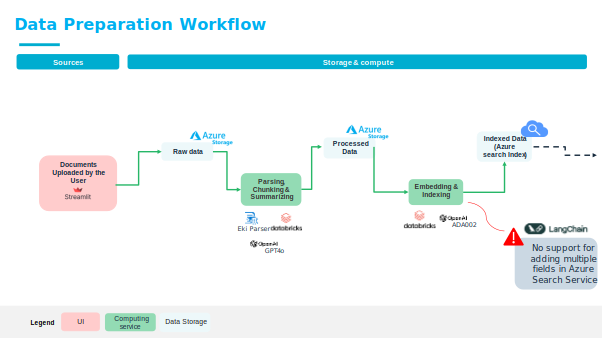
  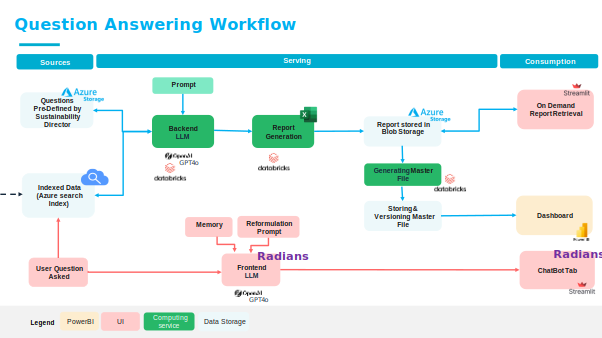

*Figure 6 - RAG architecture( Data Preparation Workflow and Question Answering Workflow)*

  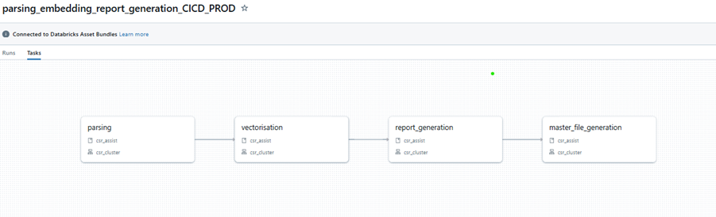

*Figure 7 - Databricks Workflow*

 

### GenAI and RAG Architecture Optimisations

We have made several optimisations to the baseline Ekimetrics RAG architecture. These are described below.

#### Reformulation prompt

We use a reformulation prompt which converts user input, and historical exchanges within the same session into a well-structured, standalone question. Our reformulation prompt begins by presenting a summary of the previous conversation to provide context. Then, it instructs the model to rewrite the user’s message as a concise, self-contained query in natural language (in this case, English). This structure ensures that the reformulated question is clear and contextually relevant. Reformulation improves document retrieval accuracy. The uplift of this approach still needs to be tested and quantified for our particular use case.

#### Embedding of summary of chunks

We embed summaries of chunks, instead of the raw chunks themselves, as this provides several advantages: 
1.	Summaries are shorter, resulting in smaller embeddings, which means that vector searches are faster and storage costs are lower.
2.	Raw text chunks often contain redundant or irrelevant details, but a summary distils the key information and encodes high-level meaning, making embeddings more focused, and leading to better semantic retrieval.
3.	Feeding summaries, rather than raw chunks, to the context window for the LLM can lead to better generation.
4.	It may lead to reduced hallucinations, as LLMs may generate hallucinations when retrieving overly large or unstructured chunks.

Such a strategy is not applicable to a RAG in every context. For example, when using a RAG to cite legal text, it would be necessary to have specific details; summarisation would not be appropriate.

The uplift of this approach still needs to be tested and quantified for our particular use case.

#### Choice of model
We are using LLMs at four stages of the RAG process:
1.	Reformulation
2.	Chunk summarisation
3.	Generation
4.	Testing framework

We have used ChatGPT 4.o for all the stages due to lower costs and performance..  We plan on testing different models for different purposes, including using a superior model in a testing framework to judge the performance of ChatGPT 4.o in answering the questions.

#### Chatbot prompts

We have a structured prompting strategy for the LLM that answers, both, the due diligence questions and the chatbot user queries, that provides several advantages for the RAG. We force fact-based responses that are grounded on the documents provided. This ensures that responses are more accurate, and hallucinations are reduced. We provide the tool clear guidelines on how to handle ambiguity, for example, if a company does not meet a criterion or if it does not find relevant information, the model will state "No" as an answer to the question,  preventing the model from making up answers. We force the tool to provide structured answers, for example, clear ‘yes’/ ‘no’ responses, which, in turn, help the later stages in the pipeline to automate the scores calculations. 

We instruct the tool to provide references, to ensure traceability and verifiability of facts. This is important, not only to provide confidence to the users to trust the output, but also, in fields such as finance, ESG reporting, or compliance, clear referencing and fact-based responses help meet regulatory requirements. 

#### Parameter value

To improve the quality of the answers generated by the tool, several key parameters were optimized based on Faithfulness, Contextual Relevancy, and Answer Relevancy performance scores. These metrics are explained in detail in [GenAI Testing Framework section] of the article. We focus on specific parameters that impact how the system processes, retrieves, and generates responses. 

- Optimising **Chunking parameters**: Chunking directly influences text segmentation and  encoding; it determines how the input text is divided into segments, affecting how much context is retained per segment, before each chunk is summarised, indexed and stored. The specific metrics optimised were the maximum chunk size (max_tokens), and the chunk_overlap, which is a parameter that ensures continuity between chunks, so that details are not lost. 
- Optimising **Retrieval parameters**: Retrieval parameters control how the tool selects relevant (summarised) chunks of text from the (indexed) database before generating answers. The parameter optimised is the number of relevant chunks retrieved for answering a question (top_k). 
- Optimising **Generation parameters**: The Generation Parameters controls the LLM output tuning, that is, how the model formulates responses, balancing creativity and precision. The parameters that have been tuned are the temperature, which makes the responses more deterministic and grounded on the resources available at lower values (close to 0), or more creative, at values closer to 1. The top_p parameter controls response diversity by selecting the most probable rather than random variations or words. 

When tuning the parameters for chunking, retrieval, and generation, different trade-offs emerge. The challenge is to find a balance that maximizes faithfulness, contextual relevancy, and answer relevancy without compromising efficiency or cost. For example, optimising chunk size is a trade-off between completeness vs. overload, where larger chunks (i.e. higher values for max_token and chunk_overlap) would improve between faithfulness (because we would have more context within a single pass) and improved contextual relevancy  (because it would reduce fragmentation), but it would incur higher computation costs, and have a risk of losing critical context and introducing irrelevant information as the chunks may contain unrelated data. Similarly, optimising retrieval depth is an exercise in striking the right balance between relevance and noise; retrieving more chunks (higher top_k), would provide more information and increase the chances of retrieving the right context, therefore improving answer relevancy; however, this would come at a cost of introducing contextual irrelevancy and slower performance due to having to process more data. Generation parameters define the balance between precision and diversity; lower temperature would ground answers on retrieved information, but would make the answers too rigid. Lower top_p would prioritise high-confidence responses, but may ignore less common but relevant insights.

Table 3A shows the optimised parameter values, and Tables 3B and 3C show performance metrics based on these parameter values. Noting that the scores on table 3B are the arithmetic averages of the scores across all the general (36) and industry specific (5) questions for one company. The total_score on table 3C is the average mean between the faithfulness_score and the answer_relevancy score. This global metric was chosen as it is a simple and intuitive way to summarize the performance of the whole tool and  provides a balanced assessment of both accuracy and direct usefulness.

When evaluating retrieval performance, in our case, it's important not to overemphasize **contextual relevancy**, as this metric assesses the proportion of retrieved sources that are pertinent to the query. If only some references are relevant, the score may appear low, even when the relevant information has been correctly extracted. In our case, we aim to determine whether all pertinent information has been extracted, even if, for example, only one out of ten documents is relevant. Ideally, if the language model utilizes that single relevant document appropriately, the contextual relevancy should be 100%. However, DeepEval's contextual relevancy metric evaluates the overall relevance of all extracted documents to the question, as an example, resulting in a score of 10% when only one out of ten documents is relevant. Creating a custom metric within DeepEval would better align with our evaluation objectives, and we plan to look into this in the future.

  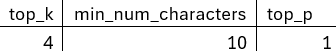

*Table 3A – Optimised parameters values*

  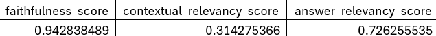

*Table 3B – Optimised performance metrics*

  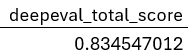

*Table 3C – Total performance score of the tool*

As mentioned above, the optimisation of the metrics has so far been implemented based on one company, and using a grid search of a specific set of values for each parameter value, recommended by members of Ekimetrics’ GenAI Taskforce. More work will need to be done to optimise other parameter values, such as the temperature, as well as to take into account the answers across all industry sectors, and to evaluate the performance based on other considerations, such as number of documents available for example.

### GenAI Testing framework

We have established an evaluation pipeline for assessing responses generated by the tool, using the DeepEval framework [4]. We focus on three evaluation metrics: Faithfulness, Answer Relevancy and Context Relevancy. These three metrics have been prioritised for practical purposes, as they provide a comprehensive testing of the performance of both the retriever and the generator (Table 4), and, essentially, together they provide a measure of “reliability” of the answer.

Contextual Relevancy tests the relevance of the retrieved text to the user input. Mathematically it is calculated as shown below, hence taking values between 0 and 1. Higher values indicate that the retriever selects chunks that are relevant to the user query (and previous conversations due to the reformulation prompt – see the relevant section under “GenAI and RAG Architecture Optimisations”).

  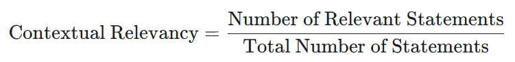

Faithfulness assesses whether the response accurately reflects the provided source material. Mathematically it is calculated as shown below, therefore ranging between 0 and 1. Higher values indicate more factual responses.

  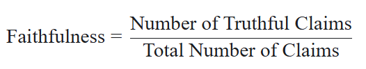

Answer Relevancy checks if the response appropriately answers the question.  Mathematically it is calculated as shown below, therefore ranging between 0 and 1. Higher values indicate more on point responses.

  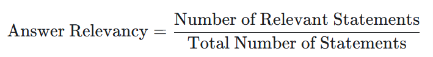

Other metrics we considered implementing were Hallucination, Summarisation, and Faithfulness against the testing dataset (see table 3).

  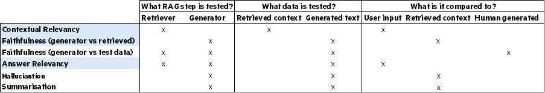

*Table 4 - RAG performance metrics; in blue are those implemented in our solution.*

The testing framework essentially consists of a function that iterates over the Pandas DataFrame containing the questions, answers and references that will be used to generate the company report; it scores the responses with the performance metrics, storing the result for each question-answer pair. Then, the arithmetic averages of each metric across all answers, as well as the arithmetic mean of the Faithfulness and Answer Relevancy metrics is also calculated – named the total score. Tables 3B and 3C show the values of these global metrics with the optimised parameter values in table 3A. Section GenAI and RAG Architecture Optimisations explains how the parameters were optimised.

The testing framework is integrated into the report-generating Databricks workflow (Figure 7). To evaluate parameters, we set a chosen parameter value and run the workflow for a company that has already been parsed and embedded. The output is an Excel file containing answers to each question, their respective scores on the three selected metrics, and a summary tab with overall scores and the parameter values used in that test run. This structure allows for easy comparison of parameters, scores, and responses across different test runs. 

### Packaged Solution with CI/CD

To enhance the scalability of our solution, we have transitioned from a manual deployment process to an automated, package-based approach. This shift improves maintainability, reduces human error, and streamlines the integration of new features, thus ensuring the stability and longevity of the tool.

#### POC version of the tool

The POC production pipeline ran directly on Databricks. This setup presented several risks: dependencies were partially listed in workflow tasks and partially installed dynamically during execution, so the process required manual management of dependencies. The POC also had environment file vulnerabilities as .env files were not versioned, making scripts sensitive to unintended modifications. There was no automated testing - updates would require manual testing. Version control was also not well established, creating versioning risks with later teams of developers.

#### The Packaged Solution with CI/CD

To address these challenges, we implemented a CI/CD pipeline in Bitbucket, which automates packaging and deployment to Databricks. The full pipeline is illustrated in Figure 8. The key improvements include a package-based deployment to Databricks, automated dependency management using Poetry and automatically made available to job clusters, bundled in the CI/CD pipeline, .env files were phased out in favour of environment variables managed in Bitbucket and Azure Keyvault (for secrets), and automated testing with a dedicated test stage in the Bitbucket pipeline which runs unit tests (and in the future integration tests) before allowing merges into dev or main (i.e. if tests fail, the merge is blocked).

  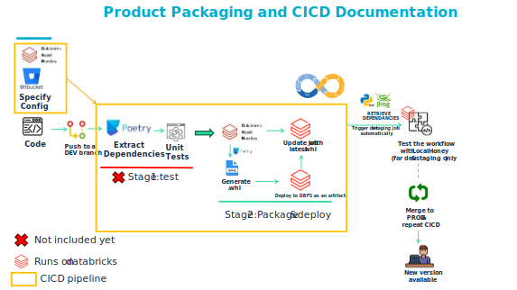

*Figure 8 – Product packaging and CI/CD pipeline*

Now, updates to the code base will work as follows:
1.	Developers create a feature branch in Bitbucket’s dev workspace and start an interactive cluster where all dependencies are pre-installed.
2.	Code changes are implemented, and if new dependencies are required, they are added to the Poetry configuration.
3.	A merge request is submitted to the dev branch, triggering the CI/CD pipeline.
4.	The CI/CD pipeline automatically: 
    - Runs tests to validate the changes. 
    - Packages the project and dependencies.
o	Updates the workflow tasks on Databricks dev.
5.	Testing is streamlined: once the pipeline finishes, the new version is ready to test.
6.	Deployment to production: when merging dev into main, the same CI/CD pipeline executes, ensuring a smooth, error-free rollout.

The uplift in efficiency of the tool translates to accelerated feature development and release cycles, as well as freeing up valuable development time to focus on innovation rather than maintenance.

  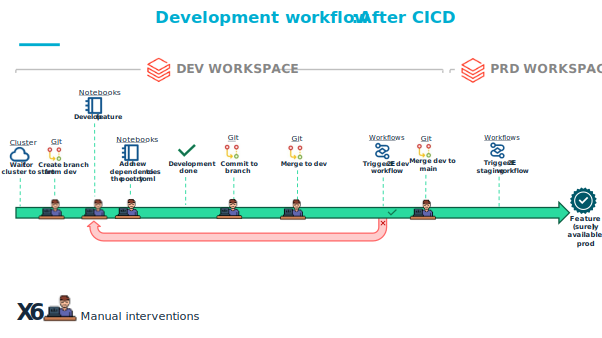

*Table 9 – Development workflow in packaged version of the solution.*

### Responsible AI

Ekimetrics’ Responsible AI Framework [5] ensures that AI models are developed and deployed with comprehensive awareness of their impact. The framework consists of seven key pillars: transparency, explicability, interpretability, security, robustness, vigilance, and sustainability. By applying these principles, Ekimetrics ensures we implement solutions that use AI responsibly, preventing misuse and ensuring they are ethical, reliable, and sustainable.

Our tool abides by these pillars in the following ways:

Transparency: This pilar refers to adopting ways to clearly communicate the actual way the tools is implemented, how the data is collected, and how it is envisioned to be used. Concretely, Ekimetrics suggests several approaches, including creating a model card  and releasing open source code and scientific papers. We start our journey with this pillar through the publication of this paper, with work on a model card under way.

Explicability: To adopt the explicability pillar we provide users with all the references, or retrieved data, that was used to generate each answer, both for the report and the chatbot functionality. Future implementation will include user feedback features.

Robustness: Robustness is about measuring and ensuring the performance of the system and its stability all along its life cycle, together with monitoring and retraining when necessary, as well as the ability to manage adversarial attacks. We have implemented a robust testing framework with through-out relevant performance metrics. The tool is designed to keep track of the performance of reports generated year-on-year.

Sustainability: is concerned with the environmental costs of running the solution. We have used Ekimetrics’ existing tool, the Carbon Tracking Dashboard, which helps us monitor the carbon footprint and costs of IT solutions ran on Azure resources. This tool enables optimised use of Databricks clusters, both for cost and carbon footprint management.

Security: The core concept of this pillar is to ensure the protection of personal and sensitive data. As no personal data is used in the tool, this is not a concern.

Vigilance: The purpose of this pilar is to avoid any possible harm to the users’ interests, especially to exclude discriminatory biases. One immediately applicable concern could be that the tool could provide more favourable scores to companies that have more, rather than less documentation provided to the tool. It would be important to also ensure that we study the correlation of the score against other company criteria, such as gender and ethnicity distribution of the company’s leadership, geography, company size, etc, to ensure there is no inherent bias. As of yet, we have not observed such bias, but a detailed study is outstanding.

### Backend of the Global Assessment Tool

This is a sub-flow from that shown in Figure 6. Given all the company reports, the Data bricks Workflow in figure 7 finishes the last step and stores the report in Azure blog storage, which then feeds the Global Assessment Dashboard. The data is refreshed automatically on the web app.

## Implementation timeline and team expertise

It took 80 FTE days to build this solution to the standard described above. This time represents a significant internal investment, mainly from Ekimetrics UK and Ekimetrics France, contributing to the global sustainability effort. The tool was built on existing Ekimetrics resources, such as the Eki-parser and a proprietary templated RAG architecture, which was optimised by the developer team for this particular use case. The team consisted of specialists in sustainability, infrastructure as code, data engineering and GenAI methodologies, as well as general data science consultants and developers.

## Looking Ahead

We are committed to continuously improving the tool to enhance its usability, accuracy, and impact (table 5).

On the user adoption front, we will track user uptake metrics and integrate with our CRM to ensure the tool remains aligned with our customer base. Additionally, we plan to develop an automated gap analysis and recommendation engine to guide our teams, alongside year-on-year sustainability maturity assessments and benchmarking capabilities.

To refine model performance, we will assess the use of a reranker step, enhance the GenAI testing framework with automated monitoring, and improve prompting to ensure better alignment with sustainability topics. For tool performance, we will implement logging and monitoring, add background information on CSR regulations, and integrate insights on Ekimetrics’ offerings. From a data perspective, we will establish a structured database to support analysis and reporting, ensuring transparency and accountability through model cards. We will assess the GenAI performance metrics based on industry sectors, company size, geography, number of documents and other factors, to ensure we assess any bias.

We are also committed to making our Generative AI usage more sustainable by optimizing energy consumption and reducing unnecessary model usage. To achieve this, we will track environmental performance through the Green IT Dashboard, monitoring carbon footprint and energy consumption at each stage of the RAG process. Specifically, we will evaluate trade-offs between model size, accuracy, and sustainability, experiment with smaller models where possible. 

Finally, as we expand go-to-market features, we will incorporate additional sustainability frameworks to enhance the tool’s versatility and relevance.

  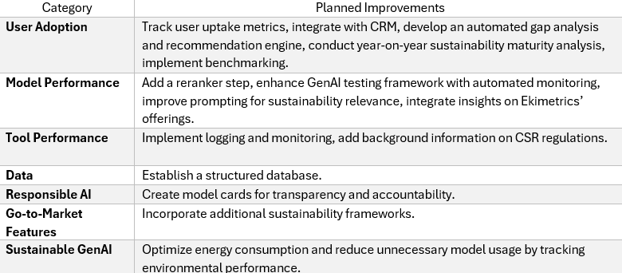

*Table 5. Planned improvements for the Client ESG Due Diligence Tool*

## Acknowledgements

This work would not have been possible without the support of Caroline Milliotte, Ekimetrics' Global Director of Sustainability, whose leadership and vision as an "Agent of Change" have been instrumental in aligning sustainability with business strategy. We extend our gratitude to our project lead, Karin Sasaki who steered the team and the many contributors with great consistency and clarity throughout the project, and to our lead developer, Ruslana Tymchyk and Tiago Fleur, as well as to Daniel Martin-Williams, Ricardo Nasr, and Farah Amorri for their contributions to building and refining the ESG Due Diligence Tool. Tsiresy Rasoamanarivo carried out in- depth user testing, helping us share the development of the tool. Vinod played a key role in establishing the UK’s GenAI taskforce, while Jean-Baptiste Gette, Basile El Azhari, Anand Krishnakumar, Julien Le Cerf, Alexis Cunin, Jean Le Long, and Hasnaa TAHRI provided invaluable expertise on GenAI, Data Engineering, GreenIT, and Cloud Infrastructure. Finally, we thank William Nait Mazi and Claire Saignol for their insights on sustainability topics, which have helped shape this initiative.

## References

## Appendix – Model Card

### Model Overview

The ESG Due Diligence Tool leverages a Retrieval-Augmented Generation (RAG) architecture built on top of OpenAI’s GPT-4o to automate the evaluation of ESG risks and opportunities from company documentation. The tool integrates advanced NLP techniques with responsible AI principles to provide accurate, traceable, and standardised assessments aligned with Ekimetrics’ sustainability mission.

### Intended Use

**Primary Use Case:**
Automated ESG due diligence on prospective and current clients by:
- Generating structured responses to a set of predefined ESG questions.
- Generating a company risk score.
- Producing downloadable company reports.
- Powering a chatbot to answer user queries based only on company-provided documents.
- Feeding ESG scoring dashboards to guide decision-making.

**Intended Users**:
- Commercial teams
- Sustainability leads
- Risk and compliance officers

**Operational Context:**
- B2B consulting
- Internal client onboarding and review processes
- Non-public or sensitive documentation processing (uploaded PDFs, ESG reports, etc.)

