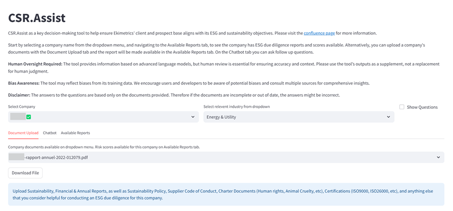
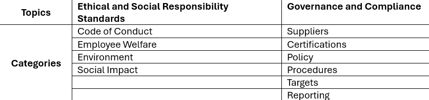
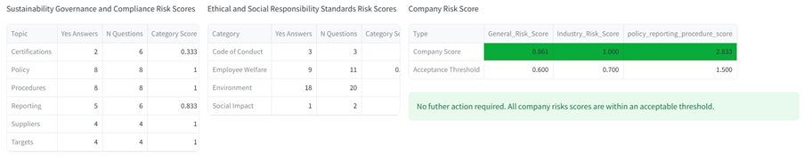
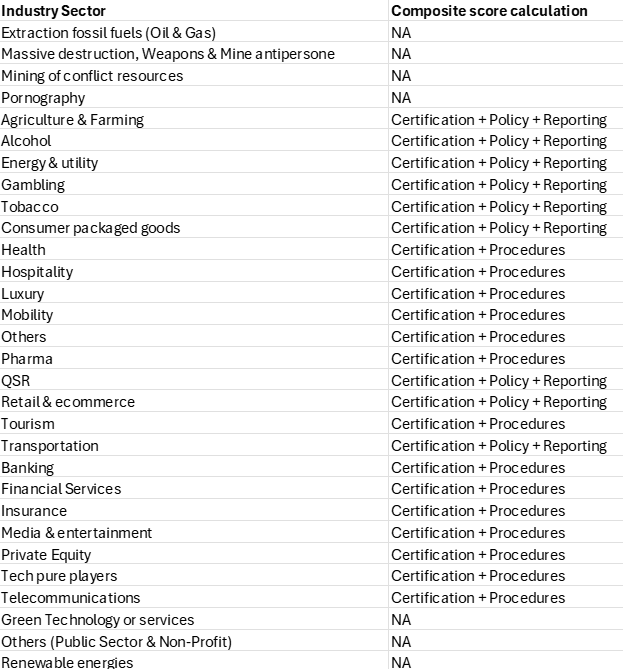
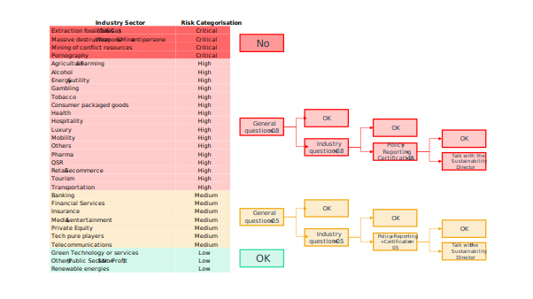
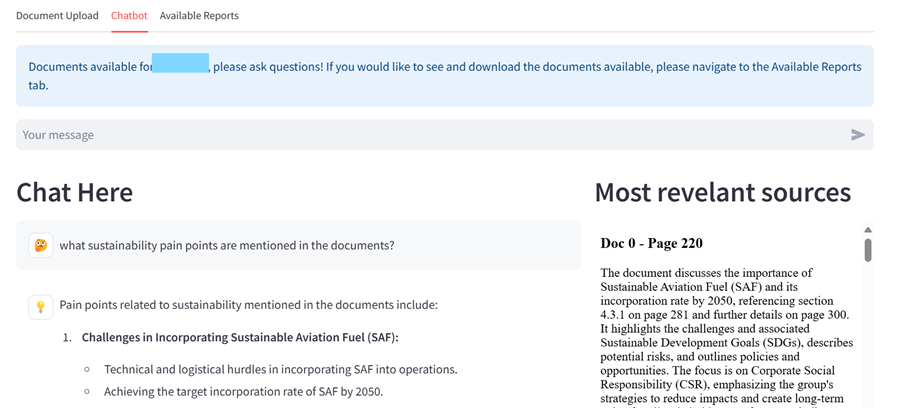
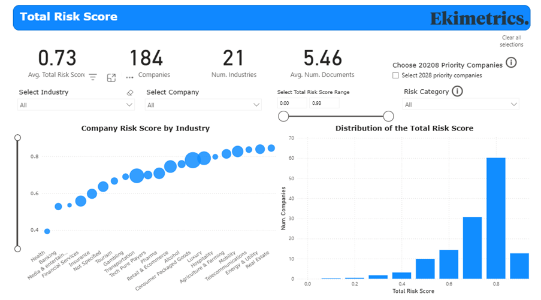

<!-- import useBaseUrl from "@docusaurus/useBaseUrl";

<link rel="stylesheet" href="{useBaseUrl('katex/katex.min.css')}" />
 -->
<!--truncate-->

 

### Summary

As a mission-driven company, Ekimetrics is legally committed to integrating sustainability throughout the organization, operational processes, and business services we offer. This paper introduces the Client ESG Due Diligence Tool, an automated solution that evaluates sustainability risks and opportunities of working with clients, whatever the industry they operate in. Questioning how we do our business is an essential part of our “Mission”. Built on our rigorous GenAI, Data Engineering, Responsible AI and MLOps standards, it is a packaged product that showcases our expertise in creating and implementing GenAI solutions for businesses, which enhance efficiency by streamlining workflows and standardizing processes. We share our approach, tech stack, and implementation insights, showcasing how this kind of automation can drive impactful ESG business decisions.

## Introduction 
Ekimetrics' Sustainability Report[^1] showcases our company’s commitment to embedding sustainability into its operations, processes, and services. Assessing the sustainability practices of clients and prospects enables us to ensure that our services contribute to positive impact, rather than enabling unsustainable business models. The tool described in this article, the Client ESG Due Diligence Tool, plays a crucial role in this endeavour.  The tool automates client company evaluation, providing structured insights that help identify risks, as well as areas where Ekimetrics can support clients in improving their own sustainability efforts. It is a similar concept to the classic “supplier due diligence” ESG-check, except that here, we question our downward value chain for its sustainability alignment, rather than the upward value chain.

The tool is, in essence, a RAG (Retrieval-Augmented Generation), an AI framework that leverages large language models (LLMs) to answer user queries more precisely, and in specialised domains. This kind of architecture ensures that responses are based on factual data, rather than only the model’s pre-trained knowledge, and enhances explainability by providing references to the text used for generating responses. Such optimisation avoids having to go through the expensive and complex process of training a dedicated LLMs for a specific topic.

The tool is built upon Ekimetrics’ rigorous standards in GenAI, Data Engineering, MLOps and Responsible AI, ensuring reliability, scalability and trustworthiness. This work is reflective of our expertise in developing robust GenAI software solutions that drive business operational efficiency, by streamlining workflows, freeing up valuable time from maintenance, for innovation, as well as providing standardisation to processes. We believe this specific solution – an automated due diligence based on documentation – is, indeed, applicable, and valuable, to other business settings, so in this paper we share, in detail, our approach, showcasing the tech stack and technical implementation of the solution.

## How the Tool is Used

ESG due diligence allows partners, managers, and commercial teams at Ekimetrics to determine how well a client company aligns with our own sustainability goals.  
Ekimetrics’ ESG due diligence process involves analysing company reports that are, publicly available online, such as financial reports, sustainability reports, supplier code of conduct, charter and certifications, and other company documentation, and extracting relevant information in order to answer predefined ESG-specific questions. If done manually, this process can be time-consuming and resource-intensive, risking inconsistent assessments and delayed decision-making.

The Client ESG Due Diligence tool is designed to address these pain points, in a way that is intuitive and user friendly. It consists of a dashboard – the Document Upload Dashboard – where users can upload company documents, which are then used to automatically carry out the due diligence and to calculate company risk scores (Figure 1). The dashboard also facilitates the search for scores of existing and already-screened companies and the download of the full company diligence report (Figure 2). Finally, a specialised chatbot, available directly on the same dashboard, assists users in developing a deeper understanding of the screened companies, and helps them identify new opportunities where Ekimetrics could support clients on their own sustainability practices (Figure 3).  The tool also allows the user to check existing company documents in the database, as well as past due diligence reports, which helps them assess the date and reliability of the scores. The more documents provided for a client company, the more accurate their ESG risk score. 

  

*Figure 1 – Users can upload company documents on the Document Upload Dashboard*

 

### The Due Diligence Questionnaire

The due diligence questionnaire consists of a mixture of questions that, either apply to all companies, or that are industry specific. The questions are labelled by the categories shown in Table 1, and include questions such as “Does {the company} have a sustainability policy to promote diversity and inclusion?” (as an example of the general question) or “Does {company} have a strategy with clear targets and timelines to switch to renewable energy sources?” (as an example of an industry-specific question for the Transportation/Mobility sector). Each question is answered by the tool automatically, basing the response only on the company documents provided by the user.

The questions have been developed by Ekimetrics’ ESG team, with the support of an external consultant to ensure the relevance and alignment on international frameworks. The tool allows for the questions to evolve over time. 

  

*Table 1 – Topics and categories of Ekimetrics’ client ESG due diligence*

 

### The Company Report

Each company's report is generated as an Excel file containing automatically produced responses to both general and industry-specific questions. For each answer, the report includes the supporting references, detailing the extracted text along with the document name and page number. This structure allows users to delve into the specifics and assess the reliability of each response as needed. Scores are then calculated based on the number of affirmative answers, as outlined in the following section.

### The Scoring System 

Figure 2 shows that for each client there are multiple scores. In fact, we derive thirteen elementary scores:
- one for each of the categories listed in Table 1
- one for the general questions
- one for the industry questions
- one total score – i.e. for all the questions

and one composite score, made up of the policy, reporting and certifications scores. The elementary scores are calculated as the proportion of questions that have “yes” as an answer, out of all the questions. The composite score is the sum of the policy, reporting and or certification scores, depending on the industry sector (see Table 2).

  

*Figure 2 – Check the scores for a company*

 

Once a score is calculated, deciding how to engage with the client is an automated process, based on a decision tree (Figure 3). The decision tree is not only dependent on the score, but also the industry sector. First, industry sectors are categorised into four groups of risk: critical risk, high risk, medium risk, and no risk. By default, we willingly engage in business with companies that fall in the no risk industry sectors category, which include green technologies and renewable energy. As a matter of policy, Ekimetrics does not engage in work with companies in critical risk industry sectors. For the high and medium risk categories, Ekimetrics’ engagement is determined by their commercial and sustainability goals, strategies, and commitments. 

  

*Table 2 – Procedure for calculating the composite risk score depending on the industry sector.*

  

*Figure 3 – Decision tree on how to engage with clients – the actual threshold of acceptance for each industry sectors within a particular risk category also has a range and depends on the specific sector.*

 

### The Chatbot

Figure 4 shows the chatbot tab on the User Interface (UI). The user selects the company they want to explore, and asks a question on the dedicated window. The tool answers all questions based only on the available company documents as well as the history of their conversation. Further, following our company’s standards for Responsible AI [5], specifically the Explainability pillar, all parts of the answer are referenced to specific text in the resources section of the page.

  

*Figure 4 – Specialised chatbot that helps the user to understand the company more deeply.*

 

### The Global Assessment Dashboard

This resource displays summarised visualisations of all the scores for all the client companies in the database (Figure 5), allowing top management, commercial and sustainability leads to understand the overall ESG performance of our client-base at a glance. This can help them identify high-risk companies, and assist them to prioritize industry sectors for sustainability improvements and strategic engagement. As the tool is built on PowerBI, it enables easy manipulation and filtering of the data, allowing the user to focus on specific sectors, companies, or groups of companies that fall within a specific range of a score, or are a particular risk category.  

  

*Figure 5 - The Global Assessment Dashboard*

### User feedback

From Renaud Pirel (Partner at Ekimetrics):
- We all carry unconscious biases when assessing the "ESG compliance" of a particular industry or business. Leveraging a data-driven tool helps us make more objective decisions and stay aligned with our mission at Ekimetrics.

### Technical Implementation

In our second article we describe in detail [the implementation and techstack of this tool](https://ekimetrics.github.io/blog/Under_The_Hood)

## References
[^1] Ekimetrics’ 2023 ESG report [ekimetrics-2023-esg-report](https://www.ekimetrics.com/en-gb/articles/ekimetrics-2023-esg-report)

