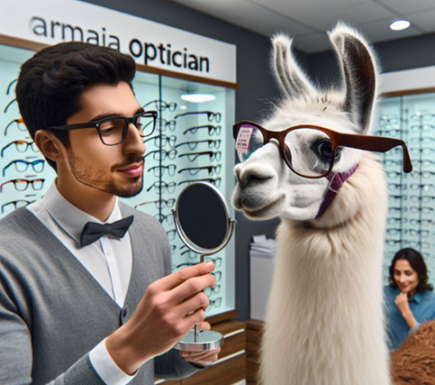
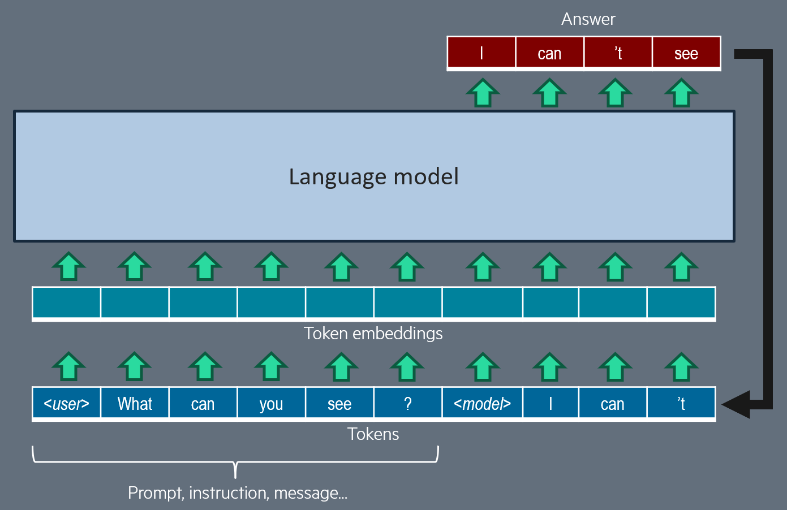
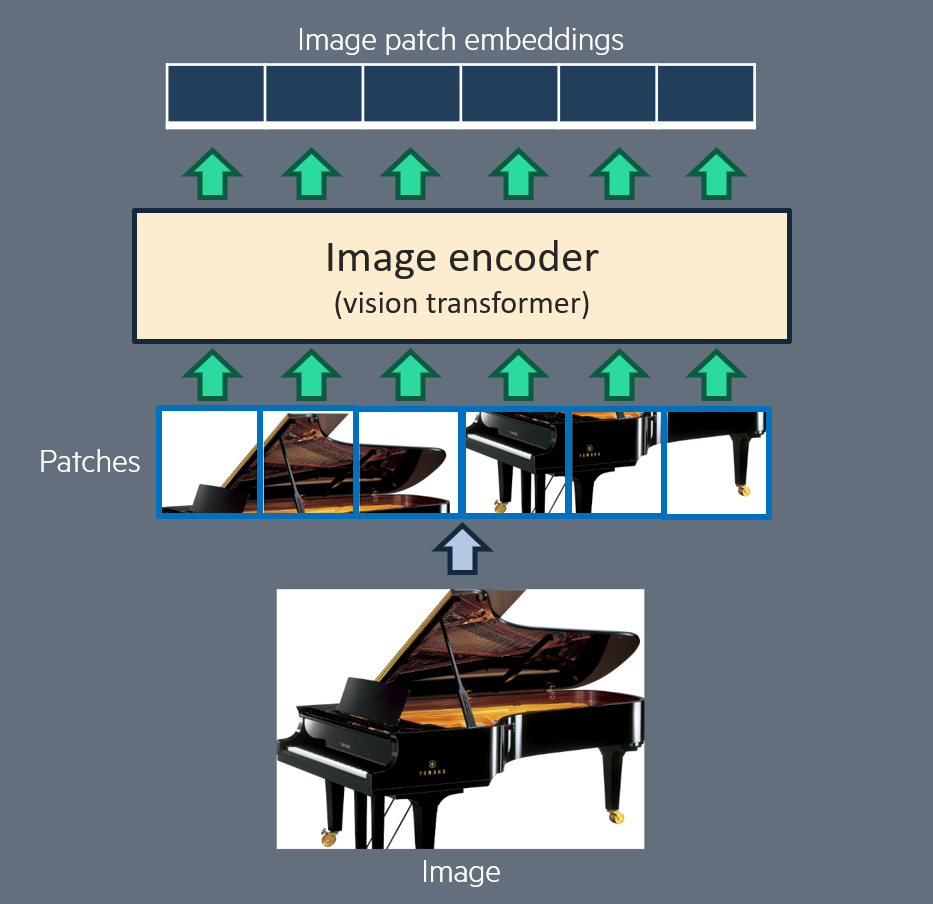
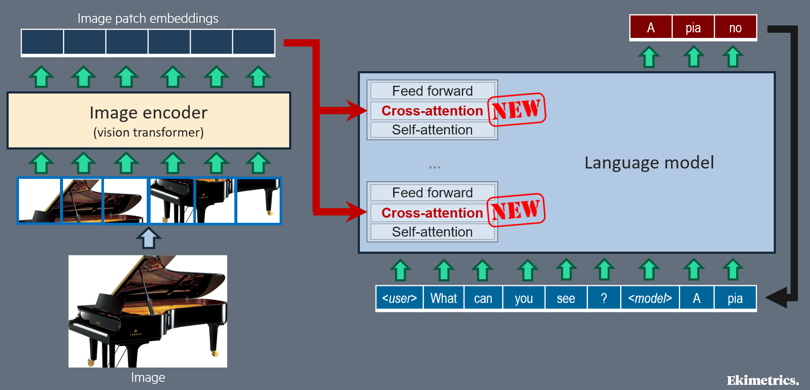
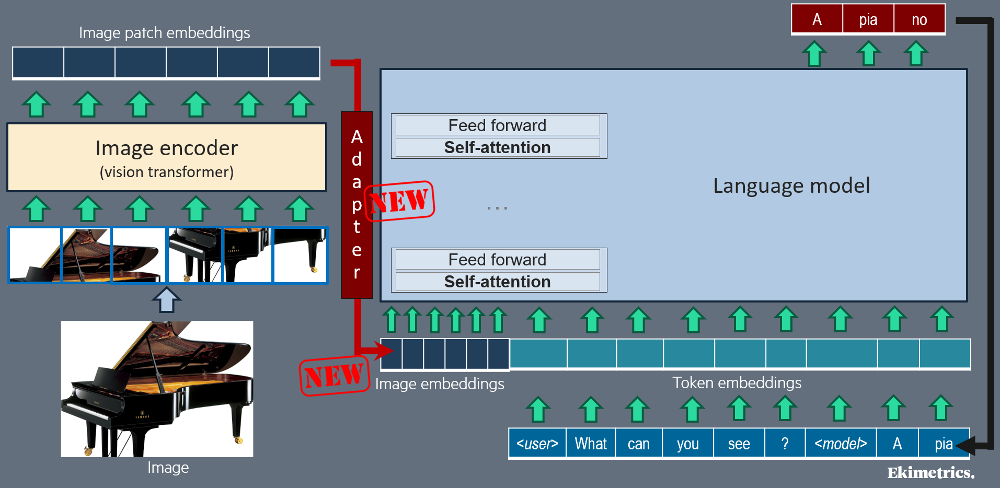
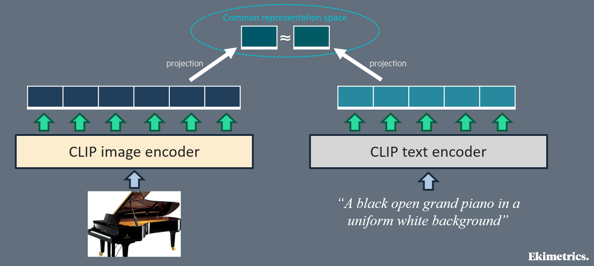
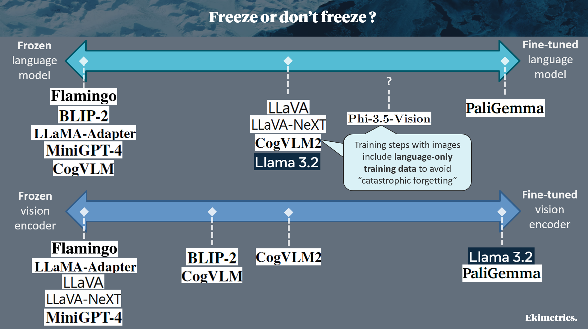

<!-- import useBaseUrl from "@docusaurus/useBaseUrl";

<link rel="stylesheet" href="{useBaseUrl('katex/katex.min.css')}" />
 -->
<!--truncate-->

  

&nbsp;

 

_Note: this technical article is intended for data scientists and machine learning engineers having a good understanding of deep learning fundamentals and a basic knowledge of transformers and language models. If too long for you, just have a look at [conclusion](#conclusion) :-)_

## Introduction

A notable trend we have observed in generative AI for the last few years is the development of **vision-language models (VLMs)** which are just special versions of language models with ability to receive one – sometimes, several – image(s) as a new input, in addition to the textual input. Most ambitious closed-weight large language models (e.g. GPT-4o, Gemini Pro) now include vision capacities. Many “blind” open-weight language models have been used as starting points for new VLMs having more and more image understanding skills, such as LLaVA [[1]](#1), CogVLM [[2]](#2), PaliGemma [[3]](#3), Phi-3-vision [[4]](#4), Llama-3.2 [[5]](#5) and Pixtral 12B [[6]](#6).

Although the performance of VLMs across different vision tasks may be very irregular and sometimes disapointing (see for instance the [OpenVLM Leaderboard](https://huggingface.co/spaces/opencompass/open_vlm_leaderboard)), they are a new field of hope for various use cases such as accessibility improvement through image captioning, automated web user interface coding from mockup images, zero-shot rich feature extraction from images for machine learning, for retrieval-augmented generation or product catalog automation...

In this article, we will not focus on potential use cases, but we will help you get a good (though certainly not comprehensive) and technical understanding of how vision-language models are built.

## Ingredients

A common choice in reference papers we have gathered for this review (see last section: [references](#references)), to build a VLM, is to combine two already trained models: a blind **language model** and an **image encoder**.

The **trained language model** has a transformer decoder architecture, and has previously been trained in multiple steps, to be able to produce a relevant text, given an input text or sequence of texts, which may be an instruction, context data, chat history... Text generation is an iterative process: at inference time, the text is generated token per token (a token is a word or part of a word). At each generation iteration, the input of the model is made up of all prompted and previously generated tokens; each input token is converted to a token embedding (learnt during training, for all possible tokens in the token dictionary); then all token embeddings are analyzed and updated thanks to multiple transformer blocks. These blocks include **masked self-attention** layers, so that the model, to predict next token, can decide to pay different attention to any of the previous tokens.

  

The **trained image encoder** has a transformer encoder architecture. As an input, it receives one image, which is divided into small patches (smaller images), as designed for Vision transformers [[14]](#14). These patches are gathered in a single sequence, and then go through a stack of transformer blocks which include a self-attention mechanism (attention between image patches at different positions in the original image). The output is a sequence of embeddings: one for each patch, which can be seen as a representation of the patch in the context of all other patches.

  

 

## Cross-attention vs. self-attention

The first question you may ask is: how to plug these two deep learning models together? Well, two alternative solutions are implemented, and you know them: **cross-attention** vs. **self-attention**.

**Cross-attention**, is the now commonly used name for encoder-decoder attention, as defined in the original transformer [[7]](#7). It is a way for a transformer decoder, at each position of its input sequence, to selectively pay attention to some of the embeddings produced by a separate encoder: it is the normal connection mode between a transformer decoder and a transformer encoder. So it seems to be the most natural way to teach the language model (decoder-only transformer) to pay attention to the image embeddings produced by the image encoder. Flamingo [[8]](#8), OpenFlamingo [[13]](#13) and LLama 3.2 [[5]](#5) apply this cross-attention solution: cross-attention layers are inserted in the transformer blocks of the blind language model. Note that cross-attention is asymetrical: the representation of the image is not influenced by the text content.

Note that with cross-attention between text and image, positional embeddings and self-attention masking strategies, previously defined in the image encoder and in the language model, are fully preserved. However, for interleaved texts and (possibly multiple) images, as in Flamingo [[8]](#8), a special masking strategy can be defined in cross-attention, so that text tokens may pay attention to an image only if the image is before that text token in the interleaved content.

  

**Self-attention** between text tokens and image patches seems counterintuitive, since image patch embeddings and text token embeddings are two different sequences in two different representation spaces. Yet, self-attention is the most commonly used way to condition text generation with information from image: it is applied in BLIP-2 [[9]](#9), LLaMA-Adapter [[10]](#10), MiniGPT-4 [[11]](#11), LLaVA-NeXT [[1]](#1), CogVLM2 [[2]](#2), PaliGemma [[3]](#3), Phi-3-vision [[4]](#4), Pixtral [[6]](#6)... The “trick” to make this possible is to add and train an **adapter** that converts the image patch embeddings into text token embeddings, which are inserted into the text sequence before the full sequence goes through all (or some) transformer blocks of the language model; different kinds of adapters have been experimented (see next section). After that conversion, the inserted converted embeddings are addressed just like text token embeddings, in the same self-attention layers and feed-forward (FF) layers of the language model; except for CogVLM [[2]](#2) models, which use dedicated self-attention and FF weights for sequence positions coming from the image.

Adopting this self-attention solution requires making decisions on the image token embeddings which are inserted in the text sequence: which position to assign them for position embedding? Must they follow a causal mask as for text tokens (i.e. each token can only see previous tokens in self-attention computation)? Only a few papers mentionned here are explicit on their choices. For instance, CogVLM [[2]](#2) relies on a causal mask for image tokens, but for position embedding, all tokens from image share a single position identifier. In Pixtral [[6]](#6), the image tokens are treated identically to the text tokens, including RoPE-1D positional encodings for all tokens, and causal self-attention. On the contrary, PaliGemma [[3]](#3) avoids causal masking on image tokens. 

  

## Vision and language alignment

Image patch embeddings hold information in a representation space which is specific to the trained image encoder. Image encoders are usually trained on computer vision tasks, so they are not natively optimized for the job of providing useful information to a language model. So, how to ensure that the image encoder brings maximal useful information for text generation, for instance on various image-to-text tasks?

First intuition to reduce the risk of misalignment (misunderstanding) between the image encoder and the language model is to choose the most appropriate image encoder. Almost all studied VLMs, except Pixtral 12B [[6]](#6), rely on a **“CLIP-like” image encoder**. CLIP is a pair of image encoder and text encoder, which were jointly trained to embed any image and its caption (text) to very close representations in a same representation space. Therefore, we can consider that the image patch embeddings produced by CLIP image encoder contain almost the same information as would contain a good caption of the image. CLIP original paper [[12]](#12) has inspired other scientific works based on the same image-text contrastive learning principle: we call them “CLIP-like”. With this training recipe, which “aligns” image representation and text representation, the image representation of CLIP-like models is expected to be more easily understood by a language model, or more easily convertible to text token embeddings.

  

Second intuition is that **the image representation must be adapted to tasks with vision during VLM training**, not only in VLMs based on self-attention (where an adapter is required), but also in those based on cross-attention between text and image. This adaptation principle is generalized; yet, adaptation strategy is very different between papers. In some earlier works such as BLIP-2 [[9]](#9) and MiniGPT-4 [[11]](#11), a complex adapter (named “Q-Former”) is trained alone, during dedicated training steps (including on image-text matching and image-text contrastive training tasks), to convert the output of the image encoder into a new representation, fully optimized for text models. Other and more recent papers choose a simpler adapter, from a (still complex) Perceiver resampler in Flamingo [[8]](#8), to a classical multi-layer perceptron in LLaVA-NeXT [[1]](#1), CogVLM2 [[2]](#2) and Pixtral 12B [[6]](#6), or even a mere linear projection in LLaVA [[1]](#1), LLaMA-Adapter [[10]](#10) and PaliGemma [[3]](#3).

As for LLama 3.2 [[5]](#5), it relies on a different adaptation method: new trainable gated (i.e. inactivated before training) self-attention layers are inserted inside the image encoder, and progressively activated and trained during training on vision-language tasks.

## Train, train, and train again

Okay ladies and gentlemen, we have solved the architecture questions: our language model is now fully connected to the trained image encoder. Now, how to fine-tune this vision-language model to ensure it can satisfy users on various image-text tasks, as if the language model had gained general vision abilities?

Well, the solutions implemented in our reference papers are widely inspired from state-of-the-art language model training strategies. The principle is to design and implement a path of various training tasks, starting with the simpler ones, and then jumping to more complex jobs.

More precisely, here are the most common or interesting **supervised vision-language training tasks** (or task families) for VLMs. Note that all of them just aim at improving next text token prediction:

* **Image captioning**: used for most VLMs, such as BLIP-2 [[9]](#9), LLaMA-Adapter [[10]](#10), LLaVA & LLaVA-NeXT [[1]](#1), CogVLM 1 & 2 [[2]](#2), PaliGemma [[3]](#3), Phi-3-vision [[4]](#4), LLama 3.2 [[5]](#5).

* **Optical character recognition** (OCR): used for CogVLM 1 & 2 [[2]](#2), PaliGemma [[3]](#3), LLaVA-NeXT [[1]](#1), Phi-3-vision [[4]](#4), LLama 3.2 [[5]](#5).

* VQA i.e. **visual question answering** (answer questions regarding the provided image): used for BLIP-2 [[9]](#9), LLaMA-Adapter [[10]](#10), PaliGemma [[3]](#3).

* Various **visual grounding** tasks, in which the model learns to understand or generate references to positions inside an image, such as “grounded captioning”, “referring expression generation”, “referring expression comprehension”, “grounded VQA”... : used for CogVLM 1 & 2 [[2]](#2), PaliGemma [[3]](#3), LLama 3.2 [[5]](#5).

* Reverse-engineering, to generate image source in **HTML, Markdown or Latex** : used for LLama 3.2 [[5]](#5).

* Next text token prediction on **interleaved content** (text interleaved with one or several images, e.g. simplified web pages): used for Flamingo [[8]](#8), Phi-3-vision [[4]](#4). When several images are allowed, this can include training for **in-context learning**, which means that in training data, the text input (prompt or instruction) can include one or several examples of image paired with the expected answer, before inserting the image on which the model must answer.

* **Multi-turn conversations** (chat) with image input, including **instruction following**, **image understanding**, multi-turn VQA, OCR, reasoning...: used for LLaVA & LLaVA-NeXT [[1]](#1), CogVLM 1 & 2 [[2]](#2), Phi-3-vision [[4]](#4), LLama 3.2 [[5]](#5).

* **"Safety" training**, i.e. train to generate best answer among multiple candidate answers, as selected by human labellers: used for Phi-3-vision [[4]](#4).

Moreover, additional fine-tuning steps based on **reinforcement learning with human feedback** (RLHF) can be added to increase (human) user satisfaction, for instance on VQA and chat with vision: this is applied for Phi-3-vision [[4]](#4) and LLama 3.2 [[5]](#5).

Available bimodal (paired text and image) training data is probably not as big and diverse as unimodal data (text only or image only), which may induce risks of **overfitting** during these bimodal training steps. Unfortunately, most papers studied here are not verbose on solutions against overfitting. Dropouts, weight decays seem commonly used and tuned; yet, Llava 1.5 [[1]](#1) avoids weight decay. Image augmentation is studied but not generalized: for instance, BLIP-2 [[9]](#9) benefits from random resized cropping and horizontal flipping, and Flamingo [[8]](#8) adds color augmentation; but PaliGemma [[3]](#3) just relies on label smoothing and dropout, without any data augmentation, which is proven to have no significant benefit. Llama-3.2 [[5]](#5) goes further with a model soup: a "hyperparameter sweep" is run with multiple random data subsets and hyperparameter combinations, then the models are ranked, and finally, the weights of best models are averaged to obtain the final model.

## Freeze or don't freeze?

We have understood that the most impressive VLMs, such as LLama 3.2 [[5]](#5), have followed a quite long chain of training steps, with different task(s) at each step. We know that bimodal (vision-language) training steps follow the unimodal (language-only and vision-only) ones, that had previously been implemented to train the blind language model and the image encoder. But a question remains: how the ensure that during vision-language training, the VLM does not (catastrophically) forget what its two components (image encoder, language model) had correctly learnt?

The answer is in the **freezing strategy** chosen for each model. Freezing the weights of both the image encoder and the language model, while training only the adapter and new layers added when building the VLM, is a secure way to avoid catastrophic forgetting, and to reduce risks of overfitting on images: it was adopted in earlier papers (Flamingo [[8]](#8), LLaMA-Adapter [[10]](#10), MiniGPT-4 [[11]](#11)). However, total freezing probably reduces the ability of the VLM to maximize its performance on new vision-language tasks. Therefore, more recent works have experimented, with success, various unfreezing strategies. An intermediate strategy is to freeze the 2 initial models during the first vision-language training steps, and to unfreeze them (or one of the two) in the last training steps, as explained for BLIP-2 [[9]](#9), LLaVA & LLaVA-NeXT [[1]](#1), CogVLM 1 & 2 [[2]](#2). Some research teams go further: in LLama 3.2 [[5]](#5), the image encoder is not frozen at all, whilst the language model is unfrozen after a few vision-language training steps. More impressively, PaliGemma [[3]](#3) is trained without any freezing.

Additionally, to preserve performance on text-only tasks, some papers explain that some vision-language training steps include language-only data, for instance CogVLM 2 [[2]](#2) and Phi-3-vision [[4]](#4).

Here is a simplified summary of the freezing strategies:

  

## Conclusion

Vision language models, and more generally multimodal generative AI, are a very active field of research: we have lifted the hood of some foundational or recent scientific papers, with no claim to exhaustiveness. To sum up what we have observed in this article, we may remember that:

* An already trained language model can be “converted” to a vision language model (VLM) thanks to image encoder plugging and dedicated additional training steps, without significant decrease of its language abilities. Thus most VLMs defined in state-of-the-art papers are based on a previously trained blind (unimodal) language model, and rely on this “conversion” process. 

* Plugging the image encoder may rely on cross-attention, or on self-attention with an adapter; there is currently no clear winner between these two alternative options.

* Simple deep learning layers can be applied to compensate initial misalignment between image representation and text representation.

* Rich and various training tasks (and of course, training data) are essential to get a performant VLM, and are presumably more important than architecture details.

* Most advanced recipes to build and train a VLM rely on progressive vision-language training (up to six steps) with progressive unfreezing of the language model.

## References

#### [1]

[Visual instruction tuning](https://arxiv.org/abs/2304.08485) (H. Liu et al., 2023), [Improved Baselines with Visual Instruction Tuning](https://arxiv.org/abs/2310.03744) (H. Liu et al., 2024)

#### [2]

[CogVLM: Visual Expert for Pretrained Language Models](https://arxiv.org/abs/2311.03079) (W. Wang et al., 2023), [CogVLM2: Visual Language Models for Image and Video Understanding](https://arxiv.org/abs/2408.16500) (W. Hong et al., 2024)

#### [3]

[PaliGemma: A versatile 3B VLM for transfer](https://arxiv.org/abs/2407.07726) (L. Beyer et al., 2024)

#### [4]

[Phi-3 Technical Report: A Highly Capable Language Model Locally on Your Phone](https://arxiv.org/abs/2404.14219) (M. Abdin et al., 2024)

#### [5]

[The Llama 3 Herd of Models](https://arxiv.org/abs/2407.21783) (A. Grattafiori et al., 2024)

#### [6]

[Pixtral 12B](https://arxiv.org/abs/2410.07073) (P. Agrawal et al., 2024)

#### [7]

[Attention is all you need](https://arxiv.org/abs/1706.03762) (A. Vaswani et al., 2017)

#### [8]

[Flamingo: a Visual Language Model for Few-Shot Learning](https://arxiv.org/abs/2204.14198) (J.-B. Alayrac et al., 2022)

#### [9]

[BLIP-2: Bootstrapping Language-Image Pre-training with Frozen Image Encoders and Large Language Models](https://arxiv.org/abs/2301.12597) (J. Li et al., 2023)

#### [10]

[LLaMA-Adapter: Efficient Fine-tuning of Language Models with Zero-init Attention](https://arxiv.org/abs/2303.16199) (R. Zhang et al., 2023)

#### [11]

[MiniGPT-4: Enhancing Vision-Language Understanding with Advanced Large Language Models](https://arxiv.org/abs/2304.10592) (D. Zhu et al., 2023)

#### [12]

[Learning Transferable Visual Models From Natural Language Supervision](https://arxiv.org/abs/2103.00020) (A. Radford et al., 2021)

#### [13]

[OpenFlamingo: An Open-Source Framework for Training Large Autoregressive Vision-Language Models](https://arxiv.org/abs/2308.01390) (A. Awadalla et al., 2023)

#### [14]

[An Image is Worth 16x16 Words: Transformers for Image Recognition at Scale](https://arxiv.org/abs/2010.11929) (A. Dosovitskiy et al., 2020)

