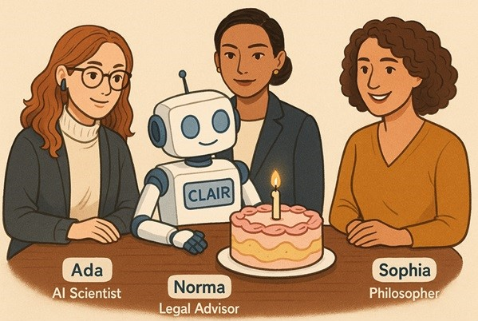
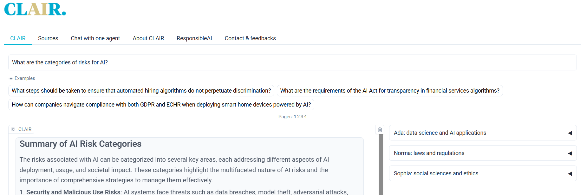

<!-- import useBaseUrl from "@docusaurus/useBaseUrl";

<link rel="stylesheet" href="{useBaseUrl('katex/katex.min.css')}" />
 -->
<!--truncate-->

  

&nbsp;

 

## Origins: AI to Inform, Demonstrate and Transform

February 2024. Generative AI is everywhere. Since the release of ChatGPT, public opinion has swung between fascination and anxiety. Some predict the end of humanity; others foresee the solution to all our problems. At Ekimetrics—a mission-driven company and pioneer in responsible AI—we saw, amid the noise, an essential need: to create the foundations of a calm, informed, and nuanced dialogue.

From this vision came [CLAIR.bot](https://clair.bot/). Designed as an open, free tool to help everyone better understand AI, CLAIR also plays an internal role: it showcases our technological expertise and our commitments to frugality, open source, and digital sovereignty. Inspired by [ClimateQ&A](https://www.climateqa.com/)—a chatbot providing sourced answers about climate change—CLAIR tackles another major contemporary concern: artificial intelligence.

Our ambition was twofold: to show that AI can serve the common good, and to offer an exemplary user experience from technical, ethical, and societal perspectives. All of this with a then-unique multi-agent vision.

## Purpose and Audience: A Tool for Everyone

CLAIR is for anyone curious or concerned about AI: students and teachers looking for reliable references; journalists exploring complex concepts; companies monitoring risks and opportunities; and everyday citizens who are often curious, sometimes anxious, and frequently lost.
The idea is simple: ask any question freely and receive a rich, contextualized, and multi-perspective answer. To do this, we built an interface featuring four specialized AI agents. Ada, the technical expert, answers scientific and technological questions. Norma focuses on standards, laws, and especially the European AI Act. Sophia handles ethics, social sciences, and the philosophy of technology. Finally, CLAIR synthesizes the three perspectives into a coherent summary.

Each response is sourced, explainable, and traceable. The aim isn’t to deliver THE truth but rather a broad overview of viewpoints to encourage deeper understanding.

## Design and Challenges: From Multi-Agent to Technological Frugality

Developing CLAIR.bot was an open-air laboratory that led us to make bold choices. We adopted a multi-agent architecture—one of the first of its kind in open-access—where each agent answers the question in parallel, drawing on its own specialized document base. Each agent also uses an agentic retrieval approach: independently running multiple dynamic searches based on the question, allowing for richer answers.

A major UX/UI effort ensured users could view four distinct answers without feeling overwhelmed. CLAIR’s synthesis appears at the center, with the specialized agents displayed around it. We relied heavily on open-source technologies—for front-end, search, and embeddings—achieving excellent retrieval performance where open source often outshines proprietary alternatives. As for the language models, we initially used the best available, even proprietary ones, pending the emergence of more energy-efficient options.

  

Alongside this, we implemented rigorous security measures: red teaming (including jailbreak tests), continuous monitoring (logs, latency, error rates, qualitative assessments), and even a CO2 tracker for every question asked, using [Ecologits](https://ecologits.ai/latest/). By design, CLAIR.bot is GDPR-compliant, collects no personal data, and offers full transparency about its sources and usage terms.

## User Benefits: Accessibility, Responsibility, Clarity

In a landscape often dominated by monolithic AI answers, CLAIR.bot stands out by offering nuanced information. Its design ensures explainability: each agent cites its sources and links directly to the documents consulted. It remains fully free, accessible to all, and respectful of privacy, inviting users to reflect rather than simply consume a ready-made answer.

Feedback has shown that CLAIR reassures, demystifies, and makes AI understandable without oversimplifying. It serves as a kind of popular education, matching the scale of 21st-century challenges.

## One Year Later: Toward More Specialization and Frugality 

Since July 2024, CLAIR.bot has kept evolving. Ada now connects in real time to OpenAlex, accessing up-to-date scientific publications. Sophia will soon be able to consult an incident database to better assess social and ethical risks. For Norma, our roadmap aims to transform her into an online AI use case auditor, reasoning step by step through AI Act obligations.

We are also investing in fine-tuning smaller models (like Gemma 9B) to replace models that pose ethical or environmental concerns. Other efforts include automatically measuring bias, toxicity, and factuality—combining human benchmarks with LLMs as evaluators—and designing a modular architecture ready to host new specialized agents in fields like health, climate, or labor law.

## CLAIR, a Compass in the AI Debate

CLAIR isn’t an endpoint; it’s a beginning. In just twelve months, we’ve shown that it’s possible to build a different kind of AI: more responsible, more frugal, and more useful. CLAIR.bot remains a living project, constantly improving while staying true to its mission: revealing complexity, clarifying AI’s stakes, and opening debates rather than closing them.

Thanks to everyone who designed, tested, critiqued, and used it—and see you next year!

