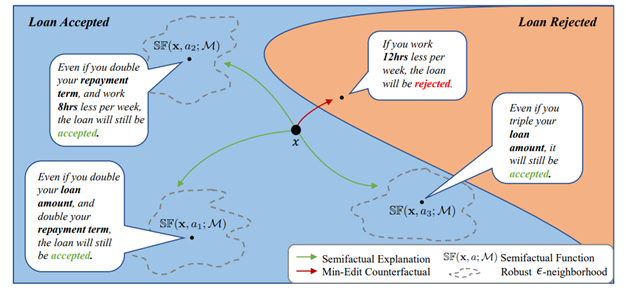
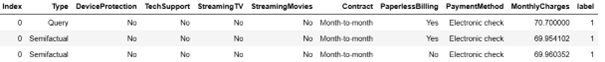
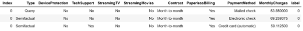
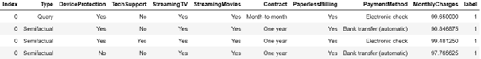

<!-- import useBaseUrl from "@docusaurus/useBaseUrl";

<link rel="stylesheet" href="{useBaseUrl('katex/katex.min.css')}" />
 -->
<!--truncate-->

<div align="justify"> 

In our [previous blog post](https://ekimetrics.github.io/blog/Counterfactual_Explanations/), we explored counterfactual explanations and how counterfactuals can be used to interpret machine learning models. Counterfactuals are powerful tools for uncovering actionable insights and enhancing model transparency by answering “what if things had been different”.  

However, not all "what-if" questions are meant to change the outcome. In this post, we shift our attention to a different kind of hypothetical: the "even if" scenario: semifactual explanations [^1] [^2] (or simply semifactuals). These are hypothetical scenarios where some aspects of the input are altered, but the model’s prediction remains the same. Rather than exploring what would have changed the outcome, semifactuals help us understand why the outcome didn’t change, even under different plausible circumstances.

This subtle difference opens up new possibilities in explainable AI (XAI), particularly in areas like robustness testing, fairness assessment, and model auditing. Semifactuals can also be valuable for identifying optimized alternatives that might be more desirable or cost-effective, yet still lead to the same outcome.

Through this post, we’ll define what semifactuals are, explore how they can be generated, walk through a code example, and consider their practical relevance, especially in domains like marketing. We’ll also reflect on their role in the broader future of interpretable machine learning.


## I. What is a semifactual in Explainable AI (XAI)?

In the context of XAI, understanding how small changes in input features can affect a model's prediction is crucial for interpreting and improving the model. Semifactuals and counterfactuals are two related concepts that help us explore this.

A semifactual is a hypothetical scenario in which we change some of the input features of a machine learning instance while keeping the model’s prediction the same. In other words, a semifactual asks, “What could have changed while still getting the same outcome?” This contrasts with a counterfactual, which focuses on exploring what needs to change in the input features to get a different outcome. A typical semifactual explanation might sound like: “Even if X and Y had been Z and K, you would still have been classified as P.”

Just like counterfactuals, semifactual explanations can be generated for both classification and regression problems. However, most of the existing work and practical use cases focus on classification tasks, where the model's output falls into discrete categories (e.g., loan approved or denied, churn prediction). The discrete nature of these problems makes it easier to explore meaningful alternative scenarios around the decision boundary.

Example: Semifactuals in Loan Approval
Let’s consider a simple loan approval example. Suppose we have a machine learning model that predicts whether a loan application will be approved based on various features, such as:
- Income: The applicant’s monthly income.
- Debt: The applicant’s existing debt.
- Credit Score: The applicant’s credit score.

If the model predicts that the loan application will be denied, a counterfactual might suggest that increasing the applicant’s income by $10,000 or reducing their existing debt by $5,000 could change the outcome to approved.

A semifactual, on the other hand, would focus on realistic, minor changes that don’t change the outcome. For example: “What if the applicant’s income was $2,000 higher?” or “What if their debt was reduced by $1,000, would the loan still be denied?” These adjustments help us explore the stability of the model’s decision: is it robust to slight variations, or does it sit near a tipping point?

As mentioned, semifactuals can also be used for optimization. Imagine the model approves a loan application for someone earning $5,000 per month. A semifactual could explore whether the same positive decision could have been made if the applicant had earned $4,000 or had a slightly higher debt level. This allows decision-makers to identify less demanding, lower-cost, or more accessible alternatives that still lead to successful outcomes [^3]. In practice, this can reveal whether the model’s threshold is unnecessarily strict and highlight opportunities for more inclusive or cost-effective policies.


### The Decision Boundary and Semifactuals

In machine learning, a decision boundary is the threshold at which a model’s prediction switches from one class to another. In our loan example, the decision boundary might be the point where the model moves from denied to approved.

By adjusting input features slightly and observing that the prediction remains the same, semifactuals help us understand how close an instance is to that boundary. This is particularly useful for identifying which features are most influential and how sensitive the model is to them.

The image below demonstrates the decision boundary along with examples of semifactuals.

</div>

<div align = "center">

  
  
  Source: Aryal, S., & Keane, M. T. (2023, August). Even if explanations: prior work, desiderata & benchmarks for semi-factual XAI [1]
</div>

<div align="justify"> 


## II. Why Semifactuals Matter in Explainable AI

Much like counterfactuals, semifactual explanations bring a unique perspective to explainable AI. By exploring what could have changed while keeping the same prediction, semifactuals help address several key challenges in model interpretability, trust, and optimization:

### 1. Robustness and Stability Insights

Traditional feature attribution methods or counterfactuals explain why a decision was made or how to alter it. Semifactuals, however, answer a subtler but equally important question:
“How much flexibility exists before the model would make a different decision?”

This is crucial for understanding the confidence and stability of the model's predictions. If a prediction remains unchanged across a wide range of feature variations, it suggests that the model is robust. Conversely, if the prediction flips with a small change, the decision may be fragile and could require further scrutiny.

### 2. Optimizing Feature Profiles Without Changing Outcomes

One of the most compelling use cases for semifactuals is optimization, finding alternative input combinations that lead to the same outcome but in a more desirable or efficient way.

For example, in a marketing context (which we’ll cover in more detail later), a campaign typically refers to a coordinated series of actions such as advertisements, email outreach, social media posts, and promotional events aimed at achieving specific goals like increasing brand awareness, generating leads, or driving sales. Suppose a campaign is already deemed successful based on metrics like conversion rate or return on investment (ROI). A semifactual could identify a different ad budget allocation or timing strategy that achieves the same level of success but at a lower cost or with better audience reach.

This ability to optimize while maintaining the same outcome is unique to semifactuals and highly valuable for:
- Reducing costs or resource usage.
- Discovering more efficient strategies.

### 3. Enhancing Trust Through Confirmatory Explanations

While counterfactuals are often used to show how a user could achieve a better outcome, semifactuals can provide confirmation that a decision wasn’t made arbitrarily.

For instance:
“Even if your income had been $2,000 higher, the loan would still be denied.”
This type of explanation helps users understand that the model's decision is consistent and not overly sensitive to small changes. This can be particularly important in regulated or high-stakes domains such as healthcare or finance, where justifying decisions is crucial for trust and compliance.


## III.	How to generate semifactuals?

Generating semifactuals in machine learning involves identifying alternative instances that are meaningfully different from the original input while still yielding the same model prediction. This distinguishes semifactuals from counterfactuals, which aim to produce a different prediction through minimal input changes. 
The overall process of generating semifactuals typically includes the following steps:

1.	**Instance Selection**
  Begin with a specific instance of interest for which the model's decision is to be analyzed. This is often a prediction where robustness, fairness, or optimisation is under review.
2.	**Constraint Definition**
  Determine which features are mutable and which should remain fixed, based on domain knowledge. Constraints play a critical role in ensuring that generated semifactuals remain realistic, actionable, and relevant to the problem context.
3.	**Search for Valid Semifactuals**
  Employ optimization or sampling techniques to explore the input space. The goal is to find alternative instances that (1) differ sufficiently from the original input to yield new insight, and (2) preserve the original model output.


#### Leveraging Existing Counterfactual Tools

A practical and efficient method for generating semifactuals is to repurpose established counterfactual generation frameworks such as DiCE[^4] or MACE[^5]. These tools are typically designed to identify input modifications that alter the model’s prediction. However, with a slight adaptation, they can be used to find inputs that instead preserve the original prediction, thereby producing semifactuals.

One straightforward strategy involves applying these frameworks in two stages. First, generate a set of counterfactuals. Then, use the same generator again, but now targeting counterfactuals of the counterfactuals selecting only those which return to the original prediction class. The resulting instances can be interpreted as semifactuals: they differ meaningfully from the original input but ultimately lead to the same decision, while being close to the decision boundary.

This two-step approach provides several advantages:
- Minimal adaptation required: It leverages existing software libraries and objective functions without requiring fundamental changes to the underlying algorithms.
- Enhanced diversity: Because the second step begins with counterfactuals that already differ from the original input, the final semifactuals tend to exhibit greater diversity.
- Improved plausibility: When using constraint-aware generators like MACE, the returned semifactuals remain within defined plausible bounds, offering explanations that are both realistic and actionable.

However, this approach may also result in semifactuals that are further away from the original input in feature space, potentially raising interpretability trade-offs[^6]. The extent of this effect depends on the structure of the feature space, the constraints applied, and the generator used.

In the following section, we illustrate this concept with a Python implementation using MACE, highlighting how such a workflow can be integrated seamlessly into existing explainability pipelines.


## IV.	Code Example: Generating Semifactuals for Churn Prediction

#### Applying Semifactuals to a Marketing Use Case

In this section, we explore how semifactual explanations can be applied to a real-world marketing use case: customer churn prediction. Churn describes the situation where customers cut ties with a company, wether by canceling a subscription, switching to a competitor, or ending a service agreement. Understanding why a customer leaves is important but equally valuable is knowing which customer traits could vary while still resulting in the same risk of churn. This can help identify hidden structural patterns, optimize engagement strategies, and test the stability of our model’s decisions.

We use the [Telco Customer Churn dataset](https://www.kaggle.com/datasets/blastchar/telco-customer-churn), a well-known benchmark from the telecom sector. 

#### What We Aim to Show
In this experiment, we use semifactuals as a tool for feature optimization and model auditing, with two goals in mind:
1.	**Action Optimization**: Pinpoint which features can be tweaked without shifting the churn prediction, paving the way for sharper customer profiling and more precisely targeted marketing strategies.
2.	**Stability & Bias Testing**: Analyze the diversity and plausibility of semifactuals to assess whether the model treats different groups fairly, or if it consistently relies on sensitive or unstable features.


#### Applying Semifactuals to a Marketing Use Case

In this section, we explore how semifactual explanations can be used in a real-world marketing use case: customer churn prediction. In highly competitive industries like telecom, banking, or SaaS, understanding and mitigating churn is essential to maintaining a healthy customer base, especially since retaining an existing customer is often significantly more cost-effective than acquiring a new one.

Traditionally, churn prediction models are trained to detect which customers are likely to leave, enabling companies to proactively engage them with retention strategies (e.g., promotions, improved support, personalized offers). But there's more to gain than just identifying who’s likely to churn. Semifactuals can help uncover optimized alternatives within the same predicted outcome—revealing, for example, how a customer could remain non-churn while reducing cost, simplifying their service plan, or aligning better with business goals. In this way, semifactual explanations support not only retention but also efficient resource allocation and customer experience optimization, all while maintaining the desired predictive outcome.

#### Dataset: Telco Customer Churn

The Telco Customer Churn dataset includes a variety of customer-related features such as:
- Demographics (e.g., gender, age group, senior citizen status)
- Subscribed services (e.g., internet service, streaming TV, phone lines)
- Account information (e.g., contract type, payment method, paperless billing)
- Behavioral data (e.g., tenure with the company, monthly charges, total charges)

The target variable is binary:
- Churn = Yes: The customer has left the company.
- Churn = No: The customer is still active.

#### What We Aim to Show

In this experiment, we use semifactual explanations as a tool for feature optimization and model auditing, with two primary goals:
1.	Action Optimization
  Identify which features can be changed without altering the predicted churn status to inform more robust customer profiling and design more efficient, cost-effective marketing actions. For example, if a customer is predicted to churn, semifactuals can tell us what aspects of their profile can vary while remaining in the "churn" class helping us explore more personalized interventions and optimize our positive outcome.
2.	Stability & Bias Testing
  Analyze the diversity and plausibility of generated semifactuals to assess model stability. Are there customers whose predictions rely too heavily on sensitive features (like gender or age)? Do similar customers get different treatments due to small differences? Semifactuals offer a unique way to stress-test the model’s fairness and consistency by observing how much change it tolerates before switching decisions.


#### Preprocessing Steps

```python
# Import
from omnixai.data.tabular import Tabular
from omnixai.preprocessing.tabular import TabularTransform
from sklearn.model_selection import train_test_split

# Create a Tabular object with features, categorical columns, and the target
tabular_data = Tabular(
    df,
    feature_columns=feature_names,
    categorical_columns=categorical_columns,
    target_column=target
)

# Fit a transformer to handle encoding and normalization of the data
transformer = TabularTransform().fit(tabular_data)

# Get the class names from the transformer (e.g., ['No', 'Yes'] for churn prediction)
class_names = transformer.class_names

# Transform the dataset into a NumPy array with processed features and target
x = transformer.transform(tabular_data)

# Split the data into training and testing sets (80% train, 20% test)
train, test, labels_train, labels_test = train_test_split(x[:, :-1], x[:, -1], train_size=0.80)
```

The dataset undergoes typical preprocessing, including:
- Encoding categorical variables (e.g., contract type, internet service)
- Imputing missing values, especially for fields like TotalCharges
- Feature scaling for numerical variables like MonthlyCharges and Tenure
- Splitting into training and testing sets

This step ensures that the data is correctly formatted for the model and free from formatting-related biases, enabling counterfactual tools to explore the feature space meaningfully.

#### Model: XGBoost Classifier

```python
#Import
from xgboost import XGBClassifier

# Initialize an XGBoost classifier model
xgb_model = XGBClassifier()

# Train the model on the training data and corresponding labels
xgb_model.fit(train, labels_train)
```

We train an **XGBoost classifier**, a tree-based ensemble model well-suited for tabular data with mixed variable types. XGBoost captures nonlinear relationships and interactions between features—ideal for modeling the complex dynamics of churn behavior.

Once the model reaches satisfactory performance on the test set (using metrics like accuracy, precision, and AUC), we proceed to generate counterfactual and semifactual examples for customers predicted to churn.


#### Generating Semifactuals Using MACE (Twice)

```python
#Import
from omnixai.explainers.tabular import MACEExplainer

# Define the prediction function for MACE, using the model's predicted probabilities
# Input data is transformed to match the training format
predict_function = lambda z: xgb_model.predict_proba(transformer.transform(z))

# Initialize the MACE explainer with the original dataset and relevant column information
# Initialize the MACE counterfactual explainer
maceexplainer = MACEExplainer(
    training_data=tabular_data,  # Provide the training dataset
    predict_function=predict_function,  # Use the defined prediction function
    ignored_features=non_actionable_features  # Specify features that should not be modified
)

# Select test instances (excluding the target column) for explanation
test_instances = tabular_data.remove_target_column()[0:1]

# Generate counterfactual explanations for the selected test instances
explanations = maceexplainer.explain(test_instances, max_number_examples=1)

# Retrieve the counterfactual explanation for the first data instance
counterfactual = explanations.get_explanations(index=0)["counterfactual"]

# Remove the 'label' column from the counterfactual DataFrame
counterfactual.drop(['label'], axis=1, inplace=True)

# Generate a new explanation = semifactual using the MACE explainer
explanations_bis = maceexplainer.explain(counterfactual, max_number_examples=1)

# Visualize the semifactual explanation for the first test instance
explanations_bis.ipython_plot(index=0, class_names=class_names)
```

To generate semifactuals, we first apply **MACE** to find standard counterfactuals. Then, we **reapply MACE with a modified constraint**: instead of flipping the prediction, we constrain the optimization to maintain the original “churn” outcome. This second pass generates semifactuals, feature variations that **do not affect** the prediction. In other words, we find nearby data points that are different yet still result in the same model decision.


#### Analysis of the Results

We generated semifactuals for several customer profiles to better understand the model’s behavior. Each example shows how certain features can change without affecting the churn prediction, offering insights into model stability, feature sensitivity, and opportunities for optimization.

</div>

<div align = "center">

  
</div>

<div align="justify"> 

In this first example, the model predicts that the customer will churn (label = 1). The generated semifactuals include small, realistic changes such as a slight reduction in MonthlyCharges and toggling PaperlessBilling, yet the prediction remains unchanged. This suggests that the model’s decision might be relatively stable and not overly sensitive to these features. While we can’t definitively say which features the model relies on most, the consistency across these variations hints at a degree of robustness in this region of the input space.

</div>

<div align = "center">

  
</div>

<div align="justify"> 

In this second case, the customer is predicted not to churn (label = 0). Interestingly, the semifactuals show that certain feature changes such as switching the payment method or activating streaming services can increase the MonthlyCharges significantly (from $53.85 to over $69) without altering the model’s prediction. This suggests potential for revenue optimization: the customer appears loyal enough pricier service options don’t significantly riase their risk of churn. While we should interpret these changes with care, they hint at opportunities to adjust service offerings in a way that maximizes value without jeopardizing retention.

</div>

<div align = "center">

  
</div>

<div align="justify"> 

In this third case, we highlight the diversity of the semifactuals, where changes across multiple features such as switching the payment method, enabling streaming services, and modifying MonthlyCharges lead to a range of outcomes, yet the churn prediction remains unchanged. This flexibility indicates that businesses could experiment with various service configurations to enhance both customer satisfaction and revenue, without necessarily raising the risk of churn.


## V.	The Future of Semifactuals and Explainable AI

While counterfactual explanations have gained significant attention in the XAI community, semifactuals remain relatively underexplored. Most existing research and tooling such as DiCE and MACE has been restricted to counterfactuals generation and adapting them to semifactual use cases is still an emerging practice.

This presents both a challenge and an opportunity. On the one hand, current methods are not fully optimized to evaluate or generate high-quality semifactuals. On the other hand, the conceptual shift introduced bu semifactuals, emphasizing feature changes that leave the outcomes unchanges, opens up new pathways for understanding model robustness and the structure of decision boundaries.

Challenges remain, particularly around the evaluation of semifactuals. Unlike counterfactuals, there is no clear-cut "flipped" prediction to verify. This calls for new metrics to assess their plausibility, proximity, and usefulness, especially when applied in real-world decision-making pipelines.
Despite those challenges, semifactuals hold great potential. They provide deeper insight into model behavior, offer a means to stress-test predictions, and foster user trust by illustrating how models behave under varied but outcome-preserving scenarios. As tools evolve to support semifactuals generation, and as more applications emerge, semifactuals are expected to play a central role in the next generation of transparent, accountable, and resilient AI systems.


### References

[^1] Aryal, S., & Keane, M. T. (2023, August). Even if explanations: prior work, desiderata & benchmarks for semi-factual XAI. In *Proceedings of the Thirty-Second International Joint Conference on Artificial Intelligence* (pp. 6526-6535).

[^2] Kenny, E. M., & Keane, M. T. (2021, May). On generating plausible counterfactual and semi-factual explanations for deep learning. In *Proceedings of the AAAI Conference on Artificial Intelligence* (Vol. 35, No. 13, pp. 11575-11585).

[^3] Kenny, E., & Huang, W. (2023). The utility of “even if” semifactual explanation to optimise positive outcomes. Advances in Neural Information Processing Systems, 36, 52907-52935. 

[^4] othilal, R. K., Sharma, A., & Tan, C. (2020, January). Explaining machine learning classifiers through diverse counterfactual explanations. In *Proceedings of the 2020 conference on fairness, accountability, and transparency* (pp. 607-617).

[^5] Yang, W., Li, J., Xiong, C., & Hoi, S. C. (2022). Mace: An efficient model-agnostic framework for counterfactual explanation. *arXiv preprint arXiv:2205.15540.*

[^6] Aryal, S., & Keane, M. T. (2024, June). Even-Ifs from If-Onlys: Are the Best Semi-factual Explanations Found Using Counterfactuals as Guides?. In *International Conference on Case-Based Reasoning* (pp. 33-49). Cham: Springer Nature Switzerland.

</div>