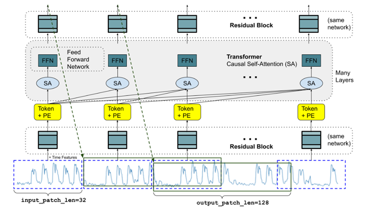

<!-- import useBaseUrl from "@docusaurus/useBaseUrl";

<link rel="stylesheet" href="{useBaseUrl('katex/katex.min.css')}" />
 -->
<!--truncate-->

 

## Generative AI and Foundation Models

Generative AI refers to a subset of artificial intelligence that creates new content like images, text, music, or videos by learning from existing data. Foundation models are a type of AI model trained on vast datasets, enabling them to perform a wide range of tasks across different domains. These models often serve as the base for developing more specialized applications, making them highly adaptable and efficient. Generative AI, which includes foundation models, focuses on creating original outputs similar to the data they were trained on. 
One of the first notable advancements in generative AI is the development of Generative Adversarial Networks (GANs), introduced in 2014. GANs consist of two neural networks, the generator and the discriminator, that compete against each other in a manner similar to a game. The generator creates data samples, while the discriminator evaluates them, distinguishing between real and fake samples. This adversarial process continues until the generator produces data indistinguishable from real data. GANs revolutionized the field of generative models, enabling the creation of realistic images, music, and even text.

The success of GANs opened the door for further advancements in AI, leading to the development of more sophisticated models. One of the notable successors to GANs is the Transformer model, introduced in 2017. Transformers initiated a paradigm shift, particularly in natural language processing (NLP), by leveraging self-attention mechanisms, allowing models to weigh the importance of different words in a sentence more effectively. This innovation significantly improved the performance of tasks such as translation, summarization, and question-answering.

Building on the foundation set by Transformers, more powerful models known as Foundation Models have been developed. These models, such as BERT (Bidirectional Encoder Representations from Transformers) and GPT (Generative Pre-trained Transformer), are pre-trained on vast amounts of data and can be fine-tuned for specific tasks. Foundation Models have demonstrated remarkable capabilities in understanding and generating human language, making them indispensable tools in various applications.

## Application in Time series can be challenging

Foundation models have recently demonstrated remarkable success, particularly in natural language processing (NLP) and computer vision (CV). However, applying foundation models (FMs) to time series data presents unique challenges due to the inherent complexities of temporal structures:

- **Transformer Architecture**: Most FMs are built upon the transformer architecture. The continuous nature of time series data poses a fundamental challenge for transformer-based models, which are originally designed for discrete token-based inputs, such as those in natural language processing (NLP). Unlike NLP tasks, where predictions are made based on a finite and well-defined vocabulary of tokens, time series data is continuous, requiring models to capture subtle temporal dependencies and variations over an unbounded numerical space. This continuous nature increases the complexity of learning meaningful representations, making it more difficult for transformers to generalize effectively compared to tasks involving discrete sequences.

- **Covariates in Forecasting**: In time series forecasting, covariates play a crucial role in improving predictive accuracy. These covariates can be static, dynamic, or even additional time series that evolve alongside the primary series. However, most forecasting models struggle to effectively incorporate covariates, especially when the covariates themselves are time series that require simultaneous prediction. This scenario, known as multivariate time series forecasting, adds another layer of complexity.

- **Dataset Availability**: While NLP, CV, and multimodal tasks benefit from an abundance of publicly available datasets, time series forecasting faces a significant challenge due to the limited availability of high-quality, diverse datasets. This lack of data makes it hard to develop and generalize forecasting models, as they often depend on specific or private data.

- **Semantic Differences**: The semantic aspect of time series data is different from that of other data types. In NLP, individual words carry inherent meaning, even without context, allowing models to leverage predefined semantic relationships. In contrast, time series data consists of ordered sequences where meaning emerges from the variability and structure of the data rather than from individual points. A single data point in a time series holds little significance on its own, as its interpretation depends entirely on the surrounding temporal context and underlying trends. This fundamental difference poses a unique challenge for time series models, requiring them to capture dependencies across time rather than relying on discrete semantic units.

Due to the reasons mentioned above, the field of time series forecasting remains predominantly dominated by statistical models and gradient boosted decision trees. Statistical models, such as ARIMA (AutoRegressive Integrated Moving Average) and exponential smoothing, have long been favored for their simplicity and effectiveness in capturing temporal patterns. Meanwhile, gradient boosted decision trees, like CatBoost, XGBoost and LightGBM, have gained popularity due to their ability to handle complex datasets and deliver high predictive accuracy. These methods continue to be the go-to choices for practitioners seeking reliable and interpretable forecasts in various domains.

Despite this, the development of foundation models for time series forecasting is currently a highly active field and is receiving significant attention across academia and industry. Researchers are increasingly adapting the transformer architecture to create time series foundation models (TSFMs).

## Famous foundation models for time series forecasting 

### Amazon Chronos

Amazon Chronos is a sophisticated time series forecasting model that leverages language model architectures, specifically the T5 Transformer from Google. Chronos reimagines time series forecasting as a language modeling task by transforming continuous series into discrete tokens through a quantization method. This method maps scaled numerical values into a finite set of tokens (typically 4096), allowing the use of a transformer architecture based on the T5 encoder-decoder framework. The architecture processes input sequences with an encoder that embeds the quantized tokens and a decoder that generates future tokens autoregressively. This setup captures temporal dependencies using self-attention and positional encoding, without explicitly including external temporal features. Training utilizes a standard cross-entropy loss over token sequences, and inference involves iterative token sampling, which is then de-quantized to reconstruct continuous forecasts. While this approach benefits from extensive pretraining on diverse time series data for strong zero-shot performance, the sequential generation of forecasts can be computationally demanding over long horizons. This issue is partially addressed by optimizations in the latest version, Chronos-Bolt.

Chronos-Bolt, an advanced extension, enhances efficiency and accuracy by processing data in chunks, delivering faster and more memory-efficient forecasts.

  
  
  Overview of the Chronos architecture

 

### Google TimesFM

TimesFM is a decoder-only transformer model tailored for long-horizon forecasting. It introduces an innovative approach by segmenting time series data into patches, which are groups of consecutive time steps that act as the model's fundamental tokens. By embedding these patches with positional information and processing them through a transformer with causal self-attention, TimesFM effectively captures both short-term intra-patch patterns and long-term inter-patch dependencies. This method significantly reduces the effective sequence length and computational overhead compared to stepwise approaches.

The model is trained using a regression objective (mean squared error) to predict entire blocks of future values in a single forward pass, making TimesFM rapid even for extensive horizon forecasts. Despite its large parameter count (around 200 million) and extensive pretraining on diverse datasets, which provide robust zero-shot performance across various domains, TimesFM's lack of intrinsic probabilistic output requires auxiliary techniques for uncertainty estimation. This positions it as a highly efficient yet deterministically focused solution for long-term prediction tasks.

TimesFM2, an advanced extension, offers several improvements over TimesFM, including enhanced forecasting accuracy, the ability to handle longer context lengths, and architectural enhancements like input patching and patch masking. 

  
  
  The TimesFM architecture during training

 

### Lag-Llama

Lag-Llama is a general-purpose foundation model for probabilistic time series forecasting, leveraging a decoder-only transformer architecture. Lag-Llama is a decoder-only transformer model specifically designed for univariate time series forecasting. It stands out by explicitly integrating lagged values and calendar features into its input representation. Rather than solely depending on implicit temporal dependencies through self-attention, Lag-Llama constructs its input tokens to include recent observations (such as values from the previous day, week, or year) along with time-specific indicators. This approach embeds periodic and seasonal patterns directly into the model. Lag-Llama utilizes the LLaMA language model as its foundation. It employs causal self-attention mechanisms with normalization and rotary positional encodings to preserve temporal order. 

The model outputs a probability distribution (modeled as a Student-t distribution) for the next time step's value using a dedicated distribution head. This design enables efficient, probabilistic forecasting within a lightweight framework, although its autoregressive, single-step prediction method can lead to error accumulation over extended horizons.

  
  
  The Lag-Llama architecture

 

## Conclusion

In conclusion, while foundation models have not yet revolutionized the field of time series forecasting, they propose an exciting new solution worth considering. While traditional methods still dominate, foundation models offer an alternative that can improve forecasting accuracy and reliability in specific situations, especially due to their zero-shot forecasting capabilities.

One particularly promising application of foundation models is in the realm of conformal prediction. By incorporating foundation models, conformal prediction can achieve more precise and robust interval predictions, offering greater confidence in the results in certain setup.

As research and development in this area continue to progress, foundation models are likely to play an increasingly significant role in time series forecasting. Their flexibility and innovative potential make them a valuable addition to the forecasting toolkit, able to support and improve existing methods. Although they haven't completely transformed the field, their contributions are leading to more refined and effective forecasting solutions.

In the [second part of this article](https://ekimetrics.github.io/blog/Foundations_Models_Time_Series_2/), we'll see time series foundation models enhance conformal prediction through higher forecasting accuracy and more stable calibration, especially in low-data scenarios.

