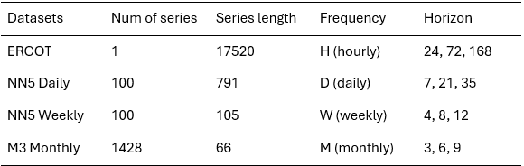
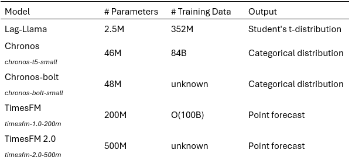
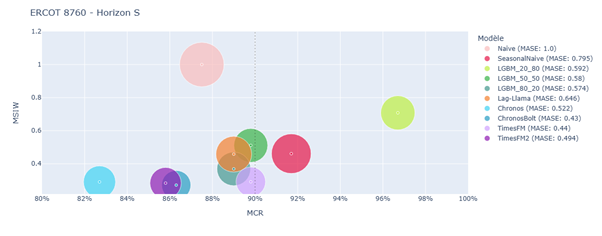
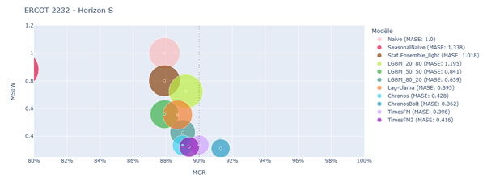
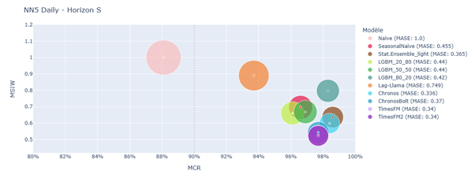
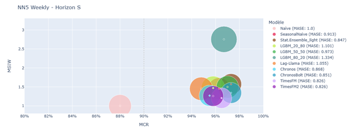
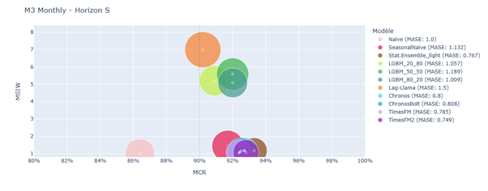

<!-- import useBaseUrl from "@docusaurus/useBaseUrl";

<link rel="stylesheet" href="{useBaseUrl('katex/katex.min.css')}" />
 -->
<!--truncate-->

 

## Application of foundation models in conformal prediction

In our [previous blog post](https://ekimetrics.github.io/blog/Foundations_Models_Time_Series_1/), we saw that foundation models offer a powerful alternative for time series forecasting, boosting accuracy and reliability across diverse applications.

In this article, we investigate a novel application of foundation models (FMs) in the field of time series forecasting - specifically, their integration with Conformal Prediction (CP) for uncertainty quantification. CP, introduced in 2007, is a powerful statistical framework that generates predictive intervals with a user-defined confidence level. These intervals are designed to contain the true values a specified proportion of the time (e.g., 90%), based on model calibration using a separate dataset.

While CP offers robust uncertainty estimates, its reliance on a separate calibration set in addition to the traditional training and testing sets can be a drawback, especially when data is limited. This requirement often forces a trade-off between model training and calibration accuracy. However, the zero-shot capabilities of foundation models (FMs) for time series forecasting present a promising opportunity for conformal prediction, as they allow most of the available data to be dedicated to calibration rather than training.

This study evaluates the performance of Time Series Foundation Models (TSFMs) against traditional approaches, including statistical models and gradient boosting methods, within a conformal prediction framework. Our results reveal two main advantages of TSFMs. First, in low-data scenarios, TSFMs produce more reliable conformalized prediction intervals due to their superior forecasting accuracy. Second, the calibration process becomes more stable because a larger portion of the data can be used for it. These benefits become even more significant as data availability decreases, since traditional models require a substantial amount of data for effective training. Overall, the findings highlight the strong potential of foundation models to enhance the reliability of conformal prediction in time series applications, particularly when data is limited.

## Conformal prediction

Conformal Prediction represents a highly effective statistical approach for quantifying uncertainty that can be applied to any forecasting model. It leverages a subset of historical data - known as the calibration set - to compute a conformity score, which evaluates how well the model's predictions align with observed outcomes. This score is then used to construct prediction intervals that adapt to the underlying data distribution. 

In time series forecasting, CP offers a reliable way to generate prediction intervals with a specified confidence level over time.
There are several methods for constructing conformalized prediction intervals for time series forecasting, including Split Conformal Prediction (SCP), Adaptive Conformal Inference (ACI), and Ensemble Batch Prediction Intervals (EnbPI). These approaches differ primarily in how they handle the temporal dependencies inherent in sequential data when forming the calibration set. In this work, we adopt SCP due to its simplicity, computational efficiency, and broad applicability.

Given a user-defined miscoverage parameter α∈[0,1] and N data points, SCP constructs the predictions intervals that cover the true values at least ((1-α)  ×100)% of the time over the prediction horizon, using the following procedure:
1. Split N available data points into two subsets: a training set and a calibration set.
2. The model is first trained on the training set. 
3. After training, the model is applied to the calibration set to generate predictions and compute absolute errors at each time step, forming a distribution of residuals—known as conformity scores—for uncertainty quantification.
4. To quantify uncertainty, SCP selects an upper quantile of the residual distribution—corresponding to the desired miscoverage rate (e.g., the 90th percentile for 10% miscoverage)—and uses this value to construct symmetric prediction intervals around future forecasts.

This results in intervals that are expected to contain the true value with the specified confidence level, assuming the calibration residuals are representative of future errors.

*Note: In time series forecasting, SCP faces a key challenge: the assumption of data exchangeability (i.e., that data points are independent and identically distributed) is often violated due to temporal dependencies. This can affect the validity of the coverage guarantees.*

## Experiments and Results

### Datasets

In this study, we used the ERCOT, NN5 Daily, NN5 Weekly, and M3 Monthly datasets as benchmarks. These datasets span different temporal granularities to ensure that the results accurately reflect industry-relevant contexts. We conducted experiments across three forecasting horizons: Short (S), Medium (M), and Long (L), with lengths varying by dataset. The details are provided in the table below.

  
  
  Dataset description

 

### Estimators

We evaluated three TSFM candidates: Amazon Chronos, Google TimesFM and Lag-Llama, against various TS forecasting methods, including the Naive method, Seasonal Naive method, LightGBM (LGBM), and a light version of StatisticalEnsemble. We selected Chronos, TimesFM, and Lag-Llama because they were not present in our benchmark data, enabling zero-shot evaluation. Chronos and TimesFM were chosen for their strong performance and frequent citations, while Lag-Llama’s smaller size allows us to explore size-performance trade-offs. For Chronos and TimesFM, we tested both the original versions, dubbed as Chronos and TimesFM, and the more recent ones, dubbed as Chronos Bolt and TimesFM2, respectively. We show later in this article that during just a short period, Chronos and TimesFM have improved their performance significantly with the updates. LGBM was selected as a representative of the Gradient Boosted Decision Trees (GBDT) family. StatisticalEnsemble is an ensemble of statistical models, consisting of the mean of forecasts from AutoARIMA, AutoETS, AutoCES, and DynamicOptimizedTheta. These models were chosen for their good performances in the M4 competition. However, due to its high computational complexity, AutoARIMA is not used in this study.

  
  
  TSFMs setup description

 

### Metrics

To assess the performance of forecasting models, three key metrics were used, offering a balanced view of each model’s accuracy, reliability, and precision in both forecasting and uncertainty quantification.
- Mean Coverage Rate (MCR)
This measures how often the true values fall within the model’s prediction intervals. It reflects the reliability of the uncertainty estimates. A good model should have an MCR close to the target confidence level (e.g., 90% for a 10% miscoverage rate).
- Mean Scaled Interval Width (MSIW)
This evaluates how wide the prediction intervals are, relative to a naive baseline. Narrower intervals are better, as long as they still capture the true values. MSIW helps assess the precision of the model’s uncertainty estimates.
- Mean Absolute Scaled Error (MASE)
This measures the accuracy of the point forecasts, scaled against a naive model. A lower MASE indicates better predictive performance.

### Results on ERCOT

The ERCOT dataset, which contains hourly electricity demand data, was used to evaluate model performance under slightly more extensive and slightly more constrained data conditions. Two experimental setups were tested:

- **Scenario 1**: 8760 data points (1 year of hourly data)
- **Scenario 2**: 2232 data points (about 3 months of data)

In both scenarios, 20 windows were sampled from the historical data to simulate repeated forecasting conditions. Each model was evaluated across all windows to ensure robust and consistent results, with final performance metrics computed as the average over these runs. Additionally, each scenario was tested across three forecasting horizons: short (1 day), medium (3 days), and long (7 days).

Results in terms of MCR, MSIW, and MASE are shown in the figures below:

  
  
  Split conformal prediction results on ERCOT 8760 – Horizon S
   

  
  
  Split conformal prediction results on ERCOT 2232 – Horizon S
   

 

The results clearly show that Time Series Foundation Models (TSFMs) such as Chronos, Chronos-Bolt, TimesFM, and TimesFM2 consistently outperformed traditional models like LightGBM and StatisticalEnsemble_light. This was particularly evident in the low-data scenario (ERCOT-2232), where TSFMs showed less dependence on training data volume and leveraged their zero-shot capabilities to prioritize calibration. This flexibility allowed them to produce more reliable and sharper prediction intervals, even when data was scarce.

In contrast, traditional models struggled with the trade-off between training and calibration data. LGBM_80_20, for instance, showed very good performance when more data was available for training, but its accuracy and interval quality deteriorated significantly in the 2232-point scenario. This effect is amplified by the need to generate lag features, which are essential for tabular models but reduce the effective training size.

The study also highlighted a key trade-off in conformal prediction: achieving high coverage often comes at the cost of wider intervals. Some models, like Seasonal Naive and certain LightGBM configurations, met the target coverage but did so by producing overly conservative intervals. These intervals, while technically valid, were too wide to be practically useful. On the other hand, TSFMs occasionally fell slightly short of the target coverage but offered much narrower and more informative intervals, making them more valuable in operational settings.

Among the TSFMs, Chronos-Bolt and TimesFM2 stood out as the most balanced models. They consistently delivered strong point forecast accuracy, maintained competitive interval widths, and achieved coverage rates close to or above the target. Their performance was particularly impressive in the low-data, short-horizon setting, where Chronos-Bolt achieved the best overall results.

Overall, the ERCOT experiments demonstrate that TSFMs are not only more robust in data-constrained environments but also more effective at balancing the competing demands of accuracy and reliability in conformal prediction. 

### Results on NN5 Daily, NN5 Weekly and M3 Monthly 

The first experiment evaluated the performance of our models on an univariate timeseries dataset. Subsequently, we aimed to compare their effectiveness on multivariate time series notably because, in the multivariate context, the number of available data points is determined not only by the number of available time steps but also by the number of available series. In this section, we present the benchmarking results on three multivariate datasets: NN5 Daily, NN5 Weekly, and M3 Monthly. Here, the results were aggregated over all time series in each dataset, rather than over 20 sample windows as in the ERCOT experiment described in the previous section.

Results in terms of MCR, MSIW, and MASE are shown in the figures below:

  
  
  Split conformal prediction results on NN5 Daily – Horizon S
   

  
  
  Split conformal prediction results on NN5 Weekly – Horizon S
   

  
  
  Split conformal prediction results on M3 Monthly – Horizon S
   

 

The performance gap between TSFMs and other models was less pronounced here. A positive correlation was observed between MASE and MSIW, suggesting that models with more accurate predictions also produced narrower prediction intervals.

Chronos, ChronosBolt, TimesFM, and TimesFM2 consistently ranked among the top performers. For instance, in the NN5-daily-S setting, TimesFM2 achieved the best MASE and MSIW while maintaining the target coverage rate. LGBM models occasionally matched TSFMs but generally struggled due to limited training data and lack of exogenous variables. StatisticalEnsemble_light also performed well. Lag-Llama and SeasonalNaive showed inconsistent results.

*Note: The quality of uncertainty quantification varied across datasets due to differences in data frequency. Smaller calibration sets led to imprecise estimation of coverage thresholds, impacting model performance.*

In the NN5 Daily dataset, ChronosBolt led the performance, followed by TimesFM2, TimesFM, Chronos, and StatisticalEnsemble_light. LGBM models failed to adapt prediction intervals effectively, and Lag-Llama underperformed.

For NN5 Weekly, TimesFM and TimesFM2 delivered strong results with consistent coverage and top MASE and MSIW. LGBM models again struggled due to limited calibration data.

In the M3 Monthly dataset, StatisticalEnsemble_light, TimesFM, and Chronos-based models performed best, followed by SeasonalNaive. LGBM and Lag-Llama models performed poorly. The similarity in performance across LGBM variants was attributed to the low size of the calibration set, which hindered accurate error estimation and reduced coverage rates.

Overall, model accuracy declined at higher levels of granularity, particularly in the NN5 Weekly and M3 Monthly datasets. The conclusions remain consistent across different horizons, which enhances the robustness of the insights derived above.

## Discussions and future works

This [paper](https://arxiv.org/pdf/2507.08858) introduces time series foundation models (TSFMs) into the conformal prediction framework and evaluates their effectiveness compared to traditional statistical and gradient boosting methods.

The results show that:
- TSFMs, particularly TimesFM and the Chronos family, consistently outperform traditional approaches, especially in data-scarce scenarios. One key advantage is that TSFMs require data only for context rather than training, which allows more data to be allocated for calibration. This is particularly beneficial in conformal prediction, where the trade-off between training and calibration data could be critical.
- Larger TSFMs tend to perform better, indicating that these models have not yet reached the limits of scaling. 
- Despite their size, optimized models like Chronos Bolt offer inference speeds that are at least on par with, if not better than, traditional statistical models.

In the near future, it would be beneficial to conduct these tests on a broader range of datasets to enhance the robustness of the results and to gauge if there are performance differences in specific application domains. Regarding TSFMs, it would be valuable to include other methods that have proven their accuracy in prediction within this benchmark. Additionally, varying the amount of data allocated to context and calibration would be interesting to quantify the difficulty presented by this trade-off more precisely. For conformal prediction, other CP methods more suited to time series could be considered.

