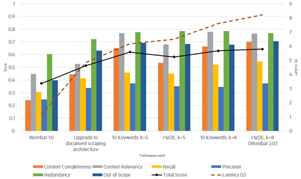

<!-- import useBaseUrl from "@docusaurus/useBaseUrl";

<link rel="stylesheet" href="{useBaseUrl('katex/katex.min.css')}" />
 -->
<!--truncate-->

 

As part of our ongoing development of GenAI capabilities at Ekimetrics, we decided to revisit our research from 2024 where we developed a [RAG chatbot assistant](https://ekimetrics.github.io/blog/Wombat_HR/) – since released internally as ‘Wombat’ – to help answer questions on our internal HR policies. Our goal: upgrade the tool based on user feedback as well as quantitative data from a broader evaluation framework. We discuss our implementation here.

**Our goal**: upgrade the tool based on user feedback as well as quantitative data from a broader evaluation framework. We discuss our implementation here.

# 1. Introduction

Since the proliferation of generative AI within business and everyday life, a range of barriers to its adoption have been identified. In their [2025 study](https://kpmg.com/xx/en/our-insights/ai-and-technology/trust-attitudes-and-use-of-ai.html), KPMG single out human resources as a particularly challenging area of AI integration, where the one of the main obstacles is a lack of trust from users. Our feedback sessions with key stakeholders corroborate the finding that trust may be among the biggest hurdles for such a project.

In their report, [The Ingenuity of generative AI](https://www.ibm.com/thought-leadership/institute-business-value/en-us/report/scale-generative-ai), IBM provide a range of reasons suggested by business leaders to explain slow progress on AI integration: interestingly, accuracy and bias, and lack of proprietary data, consistently outrank other limitations such as costs or security concerns. This highlights the key role that high quality engineering and architecture solutions play in maximising the impact of bespoke AI applications in business – they can be the determining factor in the success or failure of such applications.

We describe the improvements we made to Wombat to exploit as much internal data as possible and to optimise response accuracy, thus creating a user experience that maximises genuine trustworthiness, leading to a successful launch of version 2.0.

# 2. Optimisation Techniques

The first bottleneck identified both in quantitative and qualitative evaluation of Wombat 1.0 was its insufficient and outdated context data. The context documents made available to the old chatbot were static and limited to web pages on confluence only. We improved the data scraping architecture to access PDFs from the HR confluence pages, which made key handbooks and HR guides with crucial information accessible. These PDFs were processed using document intelligence to enable parsing of elements such as tables which often contain useful information. The second key change here was to automate document scraping to a weekly cycle, where any previously unseen documents are added to the full database, ready to be used by Wombat. This ensures that the system can generate answers relating to the full scope of HR information available and ensures robustness to policy changes over time. This change alone improved overall scoring of the system by 37% according to our new framework, before any context retrieval improvements.

In our previous article we described a ‘two-phase methodology’ for generating responses. We decided to optimise the context retrieval stage of this architecture, to ensure that Wombat’s responses are based on the context most relevant to the original user question. We tested a variety of approaches that use an LLM to transform the original question into a more suitable search term to query the Azure database, including:

- Question reformulation: changing the language of the question to make it more formal and specific to HR policies;

- Keyword generation: creating between 5 to 10 keywords or phrases that relate to the question and are likely to be found in the relevant chunks;

- Hypothetical Document Embeddings (HyDE): where the LLM estimates ex-ante the potential content of the most relevant chunk(s), with the goal of increasing the likelihood of matching to relevant chunks.

Careful prompt engineering is required to achieve the desired reformulation and avoid redundant text in the output. Figure 1 shows the exact prompts used for each technique and the reformulation of user query, “how do I request leave?” 

*Figure 1: context retrieval enhancement techniques that we tested, with the prompt used to generate the desired output, and an example reformulation of the user question, “how do I request leave?”*

| Technique | Prompt | Example Reformulation |
| -------- | ------- | ------- |
Question reformulation | Reformulate the following question to maximise the chances of it retrieving relevant documents from an internal HR knowledge base.   -Question: {question} - Reformulated Question:| What is the process for requesting leave or time off, including the steps, required forms, and approval procedures according to the company's HR policies? |
Keywords| Generate 10 keywords or phrases related to this question, for the purpose of retrieving the most relevant documents from an internal HR knowledge base. Your response text should contain the list of 10, only separated with commas, and nothing else. -Question: {question} -Keywords or phrases: |leave request procedure, submitting leave application, employee time off request, HR leave policy, requesting vacation days, leave of absence process, online leave request form, leave approval workflow, paid leave request, absence management
HyDE | Write a hypothetical paragraph from an internal HR policy document which answers the following question: {question}. Write your hypothetical paragraph in such a way as to maximise finding of relevant documents in RAG retrieval from internal HR policies. Your response text should contain the hypothetical paragraph, and nothing else. | To request leave, employees must submit a formal leave application through the company’s HR leave management system at least five (5) business days in advance of the planned absence, except in the case of emergencies. The leave request should include the type of leave (e.g., annual leave, sick leave, parental leave), the start and end dates of the leave period, and any supporting documentation as required by company policy (such as a medical certificate for sick leave or supporting documents for compassionate leave). Employees should notify their direct supervisor and ensure that the leave request is approved in the HR system before making any personal arrangements. 

We also removed the embeddings step from document indexing and search – opting to use a direct TF-IDF keyword-based search instead, using the output from HyDE. The intuition behind this was that HR policy documents and user queries often contain proper nouns (such as Ekimetrics) that would not be well represented by embedding models. Consequently, using a keyword search is more appropriate. We did not conduct formal experiments for this step, but initial results appeared satisfactory based on trial-and-error testing.

Additionally, due to prompt token limitations, only a selection of the most relevant chunks can be used to assist response generation. We fine-tuned the number of chunks used to maximise the scores of Wombat on our evaluation dataset.

Following is the end-to-end architecture at the time of writing:

  
  
  *Figure 2: End-to-end architecture diagram for Wombat 2.0.*

 

# 3. Evaluation Framework

Our evaluation framework previously focused on two metrics: F1 score of the retrieved context and the similarity score (as judged by another LLM prompt) of the actual output versus the target. In this study we used the same dataset provided by the head of HR, with 39 questions and expected responses (‘targets’), but we created a more holistic evaluation framework that judged Wombat across seven key metrics, all scored by LLM evaluation:

-	Context completeness: assesses whether the retrieved context contains all information in target.
-	Context relevancy: assesses whether the retrieved context is relevant to the question.
-	Recall: judges that the response contains all information in target.
-	Precision: ensures the response contains no extraneous information to the target.
-	Redundancy: penalises repetition or redundant parts of the answer.
-	Out of scope: tests that in cases where the question is not relevant to HR, the response handles this without failure and explains that it is out of scope.
-	Latency: time taken for full response generation

  
  
  *Figure 3: results of our experimentation across multiple combinations of techniques and number of chunks (k) used in retrieval.*

 

To make our experimentation systematic and repeatable, we used LangSmith, a Python framework that enables evaluation using custom scores and prompts and allows testing on bespoke datasets. The system also provides detailed diagnostics on the experiments run – for instance, you can inspect questions to see why they scored low on certain metrics, enhancing debugging.

We used this comprehensive framework to assess different context retrieval techniques and to optimise k, the number of chunks retrieved. We found that ultimately HyDE had the highest scores; the final implementation of Wombat v2.0 uses HyDE with 8 best-match retrieved chunks used as context. Figure 4 summarises some of the key KPI changes from version 1.0 to version 2.0. Interestingly the latency has scaled up much more dramatically than the token usage – this is due to multiple factors but primarily: the use of GPT 4.1 instead of 4-o, the change from 1 to 2 API calls during live query handling (see Figure 2), and the increased computational cost of HyDE versus other methods when testing for matches to context chunks.

  
  
  *Figure 4: overall comparison between Wombat version 1.0 and 2.0 on evaluation scores, latency, tokens per query and API token costs.*

 

Our work reveals some useful comparisons in the implementation of different techniques for context retrieval. Earlier experimentation with the question reformulation technique showed low performance. One possible reason is that this technique is less suited to the task of context retrieval when chunk matching is done with word lookup rather than semantic embedding comparison. The instances when question reformulation works well is usually when the new question contains more specific and extensive terms relating to the true subject matter.

In contrast, the keywords approach distils this same mechanism but removes the unnecessary words that would exist in the question but are unlikely to be found in the documents. HyDE and the keywords method demonstrated more success, and their relative performance differed depending on other hyperparameters. On the one hand, retrieval via keyword generation is less resource intensive (token usage was 5% lower than for HyDE, whilst latency was 8% lower), and had better overall performance than HyDE when the number of chunks retrieved was set to 5. We see the keywords generation method as being easier to implement – especially when there is less time and resource to fine tune hyperparameters – and conceptually simpler.

As a more complex technique, it’s crucial to clearly communicate how HyDE enriches the responses of RAG tools. Clearly explaining that the text synthesised for the search embedding is purely to optimise context retrieval, rather than to inform the response generation, is essential to assure users that the tool is trustworthy. HyDE outperformed other retrieval methods when the number of chunks matched was increased, and the marginal cost (including latency and token cost) of switching from these techniques to HyDE is an acceptable trade-off for higher quality response generation in the context of Wombat. Our prompt from Figure 1 could be easily adapted to implement this technique in other RAG applications.

# 4. Limitations

For our experimentation, we used a set of 39 example user queries and target answers, curated with the help of the head of HR. This enabled a reliable measurement of the chatbot across our defined metrics, and covered most topics that we would reasonably expect the chatbot to be queried on. However, the limited number of datapoints made splitting into a training and test set less feasible. This meant that we used a single test dataset only, which was used to evaluate our chatbot’s performance under all hyperparameter permutations. The configuration that we settled on therefore may be optimal for the dataset we used, but potentially may suffer from overfitting and have sub-optimal ability to generalise.

Another limitation to the framework of evaluation is that in the process of upgrading our chatbot, the metrics we used drifted slightly in terms of alignment with our overall goals. For instance, one upgrade we made was to change the system prompt, to encourage the chatbot to provide a terse summary of sources within its main answer, as well as directing the user towards relevant stakeholders in appropriate circumstances. These additions diminish the reported precision score of the evaluation, which penalises statements that are in the generated output but not present in the target.

# 5. Impact

We measure impact from two perspectives: performance & business.

Performance: as visualised in section 3, our upgrades boosted the score from 0.37 to 0.64 according to our proprietary evaluation framework. Practically, this has meant significantly more informative responses and a higher level of trust from users. Below are a few simple but representative examples from our evaluation dataset (longer answers have had parts abbreviated with […]):

*** 
**Question A**: How can I opt out of the pension scheme?

**Wombat v1.0**: To opt out of the pension scheme:

1. You can opt out of The People's Pension via their website specifically for members.
2. If you opt out within the first month of being enrolled, you will receive a refund in your next pay slip for the contributions.
3. If you opt out after this initial period, no further contributions will be made, but no refunds will be given for contributions already made.

*For more details, please refer to the documents or contact The People's Pension directly through their website.*

 

**Wombat v2.0**: You can opt out of the Ekimetrics pension scheme (administered by The People's Pension) at any time if you do not wish to be part of the Company Pension Scheme (CPS).

Here’s how the process works according to the documents:
- Once enrolled, you will receive information from The People’s Pension about your account. If you decide to opt out, you can do so through their online portal.
- If you opt out within the first month of being enrolled, you will receive a refund of your contributions in your next payslip.
- If you opt out after the first month, no further contributions will be made, but you will not receive a refund & your contributions to date will remain invested.
- Please note that even if you opt out, you will be automatically re-enrolled at the next Ekimetrics plan renewal (as required by UK law). You can choose to opt out again at that point.
For further details, please refer to The People’s Pension website and the Ekimetrics pension booklet, which you can access through the links provided in the documents. You can view the sources on the left tab. The most relevant sources are:
- [Company Pension Scheme (CPS)](url): Provides a detailed overview of opting out, refunds, and the re-enrolment process.
- [New Member Booklet (PDF)](url): Offers further information about managing your pension after opting out and procedures if you re-join.

*If you need additional clarification, please contact the HR team at hr.uk@ekimetrics.com.*

***

The score achieved by v1.0 was 0.68 compared to 0.93 by v2.0, with precision being the differentiating factor. One of the key benefits of our evaluation framework is that the external evaluation via LLM provides reasoning for the scores given. In this case, Wombat v1.0 received score 0.3 for precision:

The actual output provides the correct information for opting out of the pension scheme and refund details but misses the automatic re-enrollment detail and specific URL. It also includes irrelevant information like 'contacting The People's Pension directly for more details.'

On the other hand, Wombat v2.0 provided the details missed, such as automatic re-enrollment.

***
**Question B**: What opportunities are available for professional development and further education?

**Wombat v1.0**: According to the documents, Ekimetrics supports its employees in the pursuit of relevant qualifications and provides relevant training and development opportunities. This includes induction training during the first few days of employment to help new employees familiarize themselves with colleagues, surroundings, company policies, procedures, and systems used during employment.
For further educational opportunities and professional development, you may receive assistance […]

*If you need more specific information or details about particular programs or opportunities, it is advisable to contact the HR team for further help.*

 

**Wombat v2.0**: Based on the information in the documents, Ekimetrics offers several opportunities for professional development and further education:

- Further Education and Training Assistance: Ekimetrics UK is committed to employee development and may support the financial costs of relevant training courses on a discretionary basis. If you receive this support, you may be required to remain employed at the company for a set period after the training, or repay the fees. Details and timescales are agreed before the training takes place.
- Certifications & Upskilling: You have access to the Eki Academy, a platform with bespoke digital training courses updated throughout the year. Ekimetrics also supports industry qualifications (such as DataCamp) that are approved by your manager and the company. There is an annual certifications program, and training contracts and application forms can be obtained from HR.

*[…]

*For more detailed or specific queries […]*

***
The two answers here are significantly different: Wombat v1.0 produces a generic answer that is vague and repetitive in its language, whereas Wombat v2.0 produces a detailed answer where specific courses and platforms such as DataCamp or Eki Academy are mentioned. The evaluation scores increase across all different metrics here, but a key change is in the context retrieval process. The “context completeness” score increases from 0.3 to 1.0 with the upgrade, and in the second response this clearly unlocks the potential to generate a high quality response with high precision and recall.

Finally, below is an example of a response from Wombat v2.0 where the precision score is lower than for v1.0, but only because we have changed the behaviour of the tool to defer to the legal team based on the subject matter of the query. This relates to the discussed limitations of the evaluation framework: we see this change as a positive one, reflecting greater guardrails for Wombat v2.0, as opposed to information provided in the response that was unexpected or superfluous.

***
**Question C**: Can you explain the company's policy regarding non-compete agreements or intellectual property rights?

**Wombat v1.0**: Regarding intellectual property rights, the policy as stated in the provided documents includes the following key points:

1. Disclosure Requirement: Employees must immediately disclose to the Company all data, concepts, ideas, developments, programs, methods, practices, and techniques related to the Company's present or future activities, products, or services. This applies to any such creations whether they are patentable or not and whether made individually or with others during their employment.

2. Ownership of Work Product: Any product developed by an employee during their employment is the sole and absolute property of the Company. Employees must assign all rights, titles, and interests, including but not limited to copyright, to the Company upon its request. This obligation continues both during and after employment.

*For non-compete agreements specifically, the provided documents do not contain enough information. Therefore, I suggest contacting the HR team for further details regarding the company's policy on non-compete agreements.*

 

**Wombat v2.0**: Based on the documents provided, here is a summary of Ekimetrics’ policy regarding intellectual property rights and confidentiality:

Intellectual Property Rights:
- Any data, concepts, ideas, developments, programmes, methods, practices, and techniques that you conceive, make, or suggest during your employment, whether patentable or not, and whether developed alone or with others, in connection with or relating to the business of Ekimetrics, will be considered Work Product.

- All such Work Product is the sole and absolute property […]

Confidentiality:
- During and after your employment, you must not disclose or use any trade secrets or confidential information relating to Ekimetrics, except as required in the proper performance of your duties, unless you have prior consent from the company or are required by law.

- You are responsible for protecting the confidentiality […]

Return of Company Property:
- Upon request or on termination of employment, you must return all company property, including equipment, documents, and storage media.

Non-Compete Agreements:
- The provided documents do not specifically mention a non-compete agreement policy. Please refer to your employment contract for details or contact the HR team for further clarification.

*If you require more details about non-compete agreements or if your situation involves working for another company, please email the legal team at legal.contracts@ekimetrics.com.*

*You can view the sources […]*

***

Business: not enough time has passed to definitively affirm that the upgraded tool is seeing increased usage, however from an initial analysis: usage has seen a 100% increase in weekly queries. We do not analyse this further due to the lack of data, but this is promising.

# 6. Conclusion
Our work demonstrates how a RAG chatbot implementation can add value to internal office processes day-to-day, by guiding development with a holistic, multi-dimensional evaluation system, and using cutting edge data indexing and retrieval techniques. By evaluating the algorithm on a number of different metrics, we were able to identify the primary weaknesses of the tool to guide development, but also to bring out the nuance to go beyond quantitative feedback and maximise the end-user impact of the chatbot. Our architectural and algorithmic improvements in this second iteration of the project can serve as a guide for building RAGs to serve other internal or external functions.

